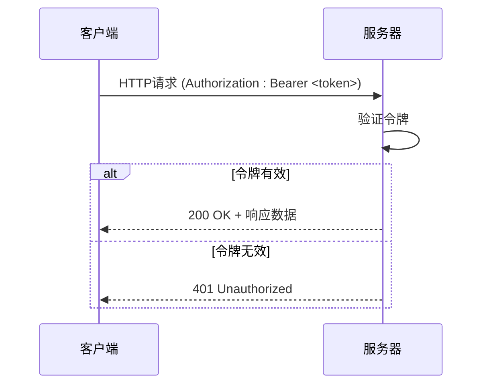
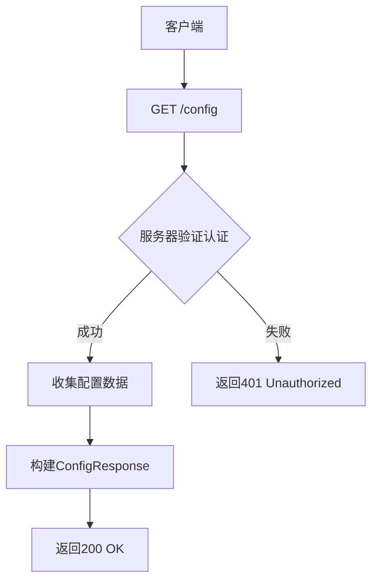
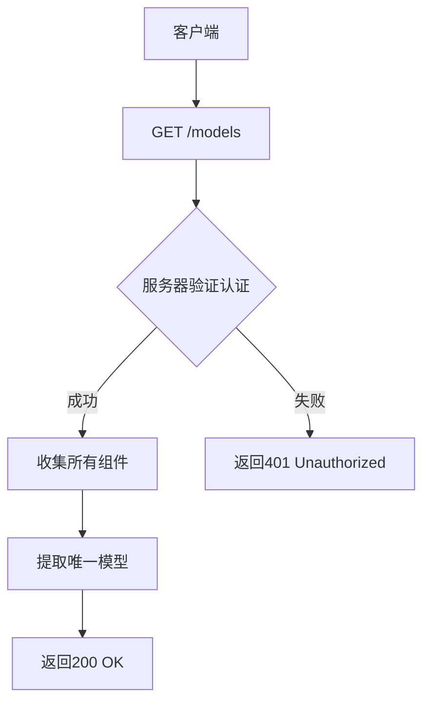
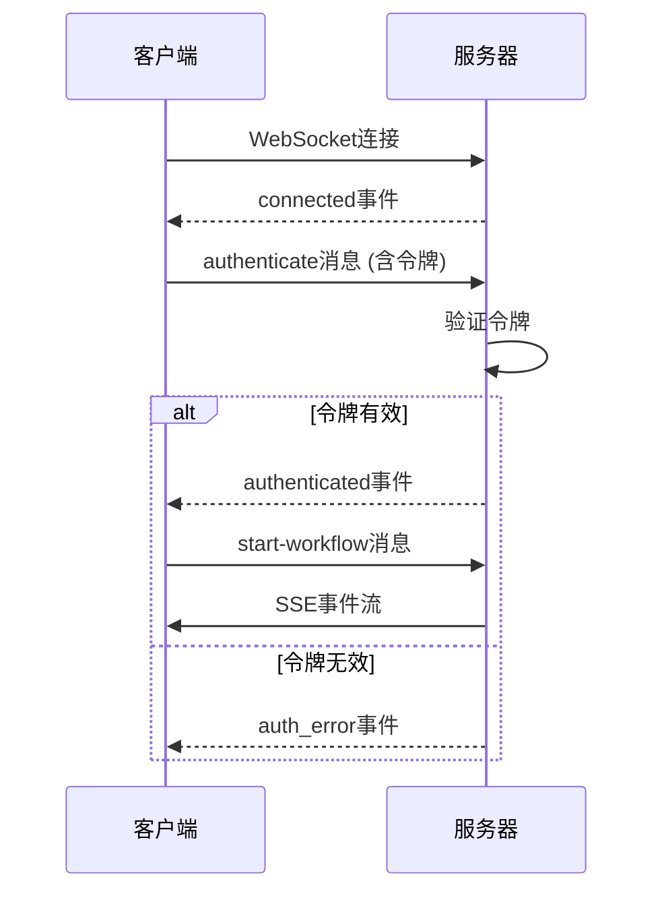

# API参考

<cite>
**本文档中引用的文件**  
- [api.py](file://libs/agno/agno/api/api.py)
- [settings.py](file://libs/agno/agno/api/settings.py)
- [routes.py](file://libs/agno/agno/api/routes.py)
- [agent.py](file://libs/agno/agno/api/schemas/agent.py)
- [team.py](file://libs/agno/agno/api/schemas/team.py)
- [workflows.py](file://libs/agno/agno/api/schemas/workflows.py)
- [evals.py](file://libs/agno/agno/api/schemas/evals.py)
- [os.py](file://libs/agno/agno/api/schemas/os.py)
- [router.py](file://libs/agno/agno/os/router.py)
- [auth.py](file://libs/agno/agno/os/auth.py)
- [schema.py](file://libs/agno/agno/os/schema.py)
</cite>

## 目录
1. [简介](#简介)
2. [认证与授权机制](#认证与授权机制)
3. [核心API端点](#核心api端点)
4. [智能体API](#智能体api)
5. [团队API](#团队api)
6. [工作流API](#工作流api)
7. [代码示例](#代码示例)
8. [错误处理](#错误处理)

## 简介
Agno的AgentOS提供了一套完整的RESTful API，用于管理和执行智能体、团队和工作流。本API参考文档详细描述了所有公共端点，包括HTTP方法、URL路径、请求头、请求体和响应格式。API支持创建、运行、取消和查询智能体、团队和工作流的执行状态。

**Section sources**
- [api.py](file://libs/agno/agno/api/api.py)
- [settings.py](file://libs/agno/agno/api/settings.py)

## 认证与授权机制
Agno API使用基于令牌的认证机制来保护端点。系统支持两种认证方式：HTTP Bearer令牌和WebSocket消息认证。

对于HTTP请求，API使用`Authorization`头进行认证。如果在系统设置中配置了`os_security_key`，则所有请求都必须包含有效的Bearer令牌。认证依赖于FastAPI的`HTTPBearer`安全方案，通过`get_authentication_dependency`函数实现。

对于WebSocket连接，认证通过消息传递完成。客户端首先建立WebSocket连接，然后发送包含令牌的`authenticate`消息。服务器使用`validate_websocket_token`函数验证令牌。如果未配置安全密钥，则跳过认证。



**Diagram sources**
- [auth.py](file://libs/agno/agno/os/auth.py)
- [router.py](file://libs/agno/agno/os/router.py)

**Section sources**
- [auth.py](file://libs/agno/agno/os/auth.py)
- [router.py](file://libs/agno/agno/os/router.py)

## 核心API端点
AgentOS提供了多个核心API端点，用于获取系统配置和可用模型。这些端点是所有操作的基础，帮助开发者了解系统状态和能力。

### 获取OS配置
此端点返回AgentOS实例的完整配置，包括可用模型、数据库、注册的智能体、团队和工作流，以及各种配置（聊天、会话、内存、知识和评估）。



**Diagram sources**
- [router.py](file://libs/agno/agno/os/router.py)
- [schema.py](file://libs/agno/agno/os/schema.py)

### 获取可用模型
此端点返回当前OS实例中所有智能体和团队使用的唯一模型列表。响应包含每个模型的ID和提供商信息。



**Diagram sources**
- [router.py](file://libs/agno/agno/os/router.py)
- [schema.py](file://libs/agno/agno/os/schema.py)

## 智能体API
智能体API允许开发者创建、运行和管理智能体实例。这些端点支持文本输入、多媒体文件和文档处理，以及流式和非流式响应。

### 创建智能体运行
此端点执行指定ID的智能体，支持文本消息和可选的媒体文件。API支持流式和非流式响应，通过`stream`参数控制。

**HTTP方法**: POST  
**URL路径**: `/agents/{agent_id}/runs`  
**请求头**:  
- `Authorization: Bearer <token>` (如果启用了认证)
- `Content-Type: multipart/form-data`

**请求参数**:
- `agent_id` (路径参数): 智能体的唯一标识符
- `message` (表单数据): 要发送给智能体的文本消息
- `stream` (表单数据, 可选): 是否启用流式响应 (默认: false)
- `session_id` (表单数据, 可选): 会话ID，用于上下文管理
- `user_id` (表单数据, 可选): 用户ID，用于用户特定的上下文
- `files` (文件上传, 可选): 要处理的媒体或文档文件

**支持的文件类型**:
- 图像: PNG, JPEG, JPG, WebP
- 音频: WAV, MP3, MPEG
- 视频: FLV, QuickTime, MPEG, MP4, WebM, WMV, 3GPP
- 文档: PDF, CSV, DOCX, TXT, JSON

**响应状态码**:
- `200 OK`: 智能体运行成功执行
- `400 Bad Request`: 请求无效或文件类型不受支持
- `404 Not Found`: 智能体未找到

**流式响应格式**:
当`stream=true`时，API返回Server-Sent Events (SSE) 格式的流式响应：
```
event: RunStarted
data: {"content": "Hello!", "run_id": "123..."}

event: RunCompleted
data: {"content": "Response!", "run_id": "123..."}
```

```mermaid
flowchart TD
A[客户端] --> B[POST /agents/{agent_id}/runs]
B --> C{验证认证和智能体}
C --> |失败| D[返回404 Not Found]
C --> |成功| E[处理上传的文件]
E --> F{流式响应?}
F --> |是| G[启动agent_response_streamer]
F --> |否| H[执行非流式运行]
G --> I[通过SSE流式传输事件]
H --> J[返回完整响应]
```

**Diagram sources**
- [router.py](file://libs/agno/agno/os/router.py)
- [schema.py](file://libs/agno/agno/os/schema.py)

### 取消智能体运行
此端点尝试取消当前正在执行的智能体运行。取消操作会尝试优雅地停止智能体的执行，但某些操作可能无法立即停止。

**HTTP方法**: POST  
**URL路径**: `/agents/{agent_id}/runs/{run_id}/cancel`  
**请求头**:  
- `Authorization: Bearer <token>` (如果启用了认证)

**请求参数**:
- `agent_id` (路径参数): 智能体的唯一标识符
- `run_id` (路径参数): 要取消的运行的唯一标识符

**响应状态码**:
- `200 OK`: 成功请求取消
- `404 Not Found`: 智能体未找到
- `500 Internal Server Error`: 取消运行失败

```mermaid
flowchart TD
A[客户端] --> B[POST /agents/{agent_id}/runs/{run_id}/cancel]
B --> C{验证认证和智能体}
C --> |失败| D[返回404 Not Found]
C --> |成功| E[调用cancel_run]
E --> F{取消成功?}
F --> |是| G[返回200 OK]
F --> |否| H[返回500 Internal Server Error]
```

**Diagram sources**
- [router.py](file://libs/agno/agno/os/router.py)
- [schema.py](file://libs/agno/agno/os/schema.py)

**Section sources**
- [router.py](file://libs/agno/agno/os/router.py)
- [schema.py](file://libs/agno/agno/os/schema.py)

## 团队API
团队API提供了与团队协作相关的端点，允许开发者执行团队实例并管理团队交互。

### 创建团队运行
此端点执行指定ID的团队，类似于智能体运行，但针对团队协作场景。支持文本输入、多媒体文件和流式响应。

**HTTP方法**: POST  
**URL路径**: `/teams/{team_id}/runs`  
**请求头**:  
- `Authorization: Bearer <token>` (如果启用了认证)
- `Content-Type: multipart/form-data`

**请求参数**:
- `team_id` (路径参数): 团队的唯一标识符
- `message` (表单数据): 要发送给团队的文本消息
- `stream` (表单数据, 可选): 是否启用流式响应 (默认: false)
- `session_id` (表单数据, 可选): 会话ID，用于上下文管理
- `user_id` (表单数据, 可选): 用户ID，用于用户特定的上下文
- `files` (文件上传, 可选): 要处理的媒体或文档文件

**响应状态码**:
- `200 OK`: 团队运行成功执行
- `400 Bad Request`: 请求无效或文件类型不受支持
- `404 Not Found`: 团队未找到

```mermaid
flowchart TD
A[客户端] --> B[POST /teams/{team_id}/runs]
B --> C{验证认证和团队}
C --> |失败| D[返回404 Not Found]
C --> |成功| E[处理上传的文件]
E --> F{流式响应?}
F --> |是| G[启动team_response_streamer]
F --> |否| H[执行非流式运行]
G --> I[通过SSE流式传输事件]
H --> J[返回完整响应]
```

**Diagram sources**
- [router.py](file://libs/agno/agno/os/router.py)
- [schema.py](file://libs/agno/agno/os/schema.py)

### 取消团队运行
此端点尝试取消当前正在执行的团队运行。功能与取消智能体运行类似，但针对团队协作场景。

**HTTP方法**: POST  
**URL路径**: `/teams/{team_id}/runs/{run_id}/cancel`  
**请求头**:  
- `Authorization: Bearer <token>` (如果启用了认证)

**请求参数**:
- `team_id` (路径参数): 团队的唯一标识符
- `run_id` (路径参数): 要取消的运行的唯一标识符

**响应状态码**:
- `200 OK`: 成功请求取消
- `404 Not Found`: 团队未找到
- `500 Internal Server Error`: 取消运行失败

**Section sources**
- [router.py](file://libs/agno/agno/os/router.py)
- [schema.py](file://libs/agno/agno/os/schema.py)

## 工作流API
工作流API提供了对工作流自动化和编排的支持，包括执行工作流和通过WebSocket接收实时事件。

### 创建工作流运行
此端点执行指定ID的工作流，支持输入数据、用户ID和会话ID。API支持流式和非流式响应。

**HTTP方法**: POST  
**URL路径**: `/workflows/{workflow_id}/runs`  
**请求头**:  
- `Authorization: Bearer <token>` (如果启用了认证)
- `Content-Type: application/json`

**请求体 (JSON Schema)**:
```json
{
  "input": {},
  "user_id": "string",
  "session_id": "string"
}
```

**请求参数**:
- `workflow_id` (路径参数): 工作流的唯一标识符

**响应状态码**:
- `200 OK`: 工作流运行成功执行
- `400 Bad Request`: 请求无效
- `404 Not Found`: 工作流未找到

### 工作流WebSocket端点
此WebSocket端点允许客户端通过WebSocket连接接收工作流的实时事件。客户端需要先连接，然后发送`authenticate`消息进行认证。

**WebSocket路径**: `/workflows/ws`  
**消息格式**:
```json
{
  "action": "authenticate",
  "token": "your-token"
}
```

**支持的操作**:
- `authenticate`: 使用令牌进行认证
- `ping`: 心跳检查
- `start-workflow`: 启动工作流执行



**Diagram sources**
- [router.py](file://libs/agno/agno/os/router.py)
- [schema.py](file://libs/agno/agno/os/schema.py)

**Section sources**
- [router.py](file://libs/agno/agno/os/router.py)
- [schema.py](file://libs/agno/agno/os/schema.py)

## 代码示例
以下示例展示了如何使用不同编程语言调用Agno API。

### Python示例
```python
import requests
import json

# 设置API端点和认证
base_url = "https://os-api.agno.com"
headers = {
    "Authorization": "Bearer your-api-token",
    "Content-Type": "application/json"
}

# 创建智能体运行
agent_id = "your-agent-id"
data = {
    "message": "Hello, how are you?",
    "stream": True,
    "session_id": "session-123"
}

response = requests.post(
    f"{base_url}/agents/{agent_id}/runs",
    headers=headers,
    data=json.dumps(data),
    stream=True
)

# 处理流式响应
for line in response.iter_lines():
    if line:
        print(line.decode('utf-8'))
```

### cURL示例
```bash
# 创建智能体运行 (流式)
curl -X POST \
  https://os-api.agno.com/agents/your-agent-id/runs \
  -H "Authorization: Bearer your-api-token" \
  -H "Content-Type: application/json" \
  -d '{
    "message": "Hello, how are you?",
    "stream": true,
    "session_id": "session-123"
  }' \
  --no-buffer

# 获取OS配置
curl -X GET \
  https://os-api.agno.com/config \
  -H "Authorization: Bearer your-api-token"

# 取消智能体运行
curl -X POST \
  https://os-api.agno.com/agents/your-agent-id/runs/run-123/cancel \
  -H "Authorization: Bearer your-api-token"
```

**Section sources**
- [api.py](file://libs/agno/agno/api/api.py)
- [router.py](file://libs/agno/agno/os/router.py)

## 错误处理
Agno API使用标准的HTTP状态码来表示请求结果，并提供详细的错误响应体。

### 常见状态码
- `200 OK`: 请求成功
- `400 Bad Request`: 请求无效或包含错误数据
- `401 Unauthorized`: 认证失败或缺少认证
- `404 Not Found`: 请求的资源不存在
- `422 Unprocessable Entity`: 请求格式正确但语义错误
- `500 Internal Server Error`: 服务器内部错误

### 错误响应格式
所有错误响应都遵循统一的格式：
```json
{
  "detail": "错误描述",
  "error_code": "错误代码"
}
```

例如，当智能体未找到时：
```json
{
  "detail": "Agent not found",
  "error_code": "NOT_FOUND"
}
```

**Section sources**
- [schema.py](file://libs/agno/agno/os/schema.py)
- [router.py](file://libs/agno/agno/os/router.py)