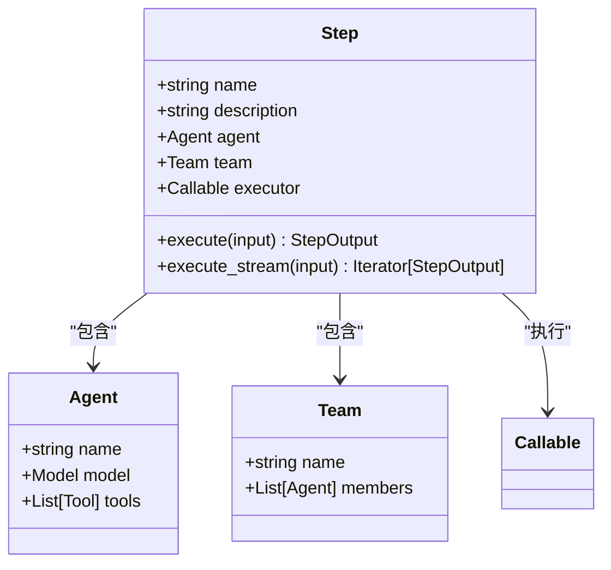
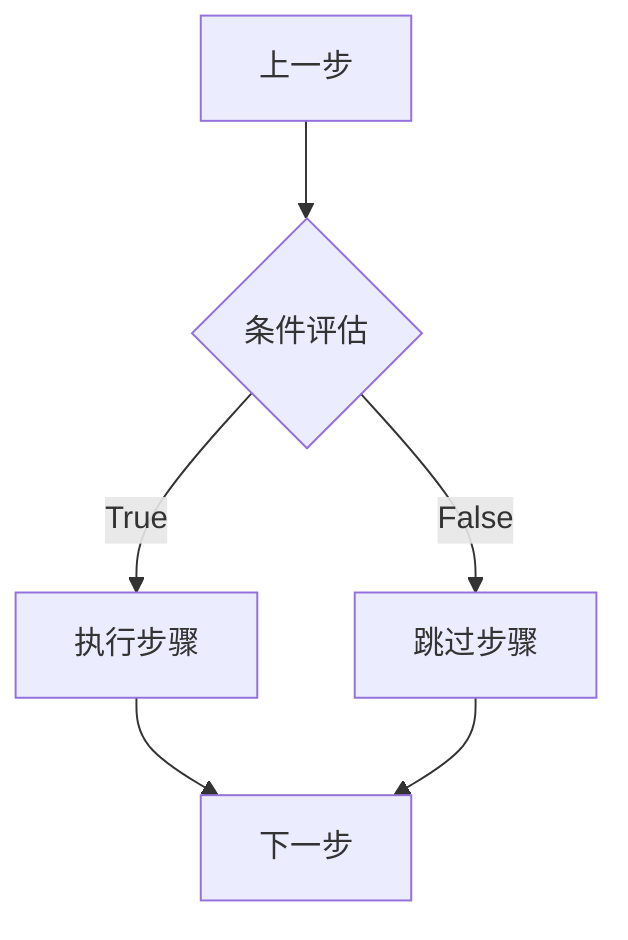
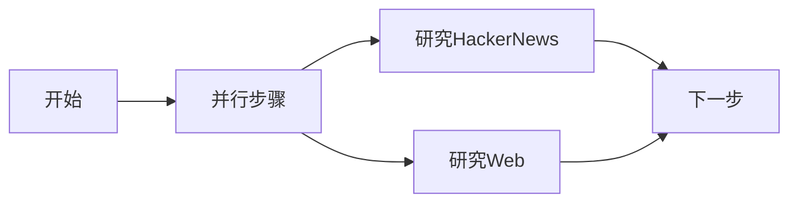

# 工作流API

<cite>
**本文档引用的文件**   
- [router.py](file://libs/agno/agno/os/router.py)
- [schema.py](file://libs/agno/agno/os/schema.py)
- [workflow.py](file://libs/agno/agno/workflow/workflow.py)
- [types.py](file://libs/agno/agno/workflow/types.py)
- [basic_workflow.py](file://cookbook/agent_os/workflow/basic_workflow.py)
- [workflow_with_conditional.py](file://cookbook/agent_os/workflow/workflow_with_conditional.py)
- [workflow_with_parallel.py](file://cookbook/agent_os/workflow/workflow_with_parallel.py)
</cite>

## 目录
1. [简介](#简介)
2. [工作流管理端点](#工作流管理端点)
3. [执行工作流端点](#执行工作流端点)
4. [核心概念](#核心概念)
5. [工作流定义示例](#工作流定义示例)
6. [错误处理](#错误处理)
7. [结论](#结论)

## 简介
工作流API提供了一套全面的端点，用于管理和执行复杂的工作流。这些工作流由一系列按顺序、条件或并行执行的步骤组成，每个步骤可以调用智能代理、团队或其他功能。API支持创建、检索、更新和删除工作流，并提供了执行工作流的机制，包括实时事件流和会话管理。

**Section sources**
- [router.py](file://libs/agno/agno/os/router.py#L1329-L1511)

## 工作流管理端点

### 获取工作流列表 (GET /workflows)
检索系统中配置的所有工作流的综合列表。

**HTTP方法**: `GET`  
**URL路径**: `/workflows`

**请求头**:
- `Content-Type: application/json`
- `Authorization: Bearer <token>`

**响应Schema**:
```json
[
  {
    "id": "string",
    "name": "string",
    "description": "string",
    "db_id": "string"
  }
]
```

**成功响应 (200)**:
```json
[
  {
    "id": "content-creation-workflow",
    "name": "内容创建工作流",
    "description": "从博客文章到社交媒体的自动化内容创建",
    "db_id": "123"
  }
]
```

**Section sources**
- [router.py](file://libs/agno/agno/os/router.py#L1329-L1368)
- [schema.py](file://libs/agno/agno/os/schema.py#L99-L139)

### 获取单个工作流详情 (GET /workflows/{workflow_id})
检索特定工作流的详细配置和步骤信息。

**HTTP方法**: `GET`  
**URL路径**: `/workflows/{workflow_id}`

**路径参数**:
- `workflow_id` (string): 要检索的工作流的唯一标识符

**请求头**:
- `Content-Type: application/json`
- `Authorization: Bearer <token>`

**响应Schema**:
```json
{
  "id": "string",
  "name": "string",
  "description": "string",
  "db_id": "string"
}
```

**成功响应 (200)**:
```json
{
  "id": "content-creation-workflow",
  "name": "内容创建工作流",
  "description": "从博客文章到社交媒体的自动化内容创建",
  "db_id": "123"
}
```

**错误响应**:
- `404 Not Found`: 工作流未找到

**Section sources**
- [router.py](file://libs/agno/agno/os/router.py#L1370-L1402)
- [schema.py](file://libs/agno/agno/os/schema.py#L99-L139)

### 创建工作流 (POST /workflows)
创建工作流的功能在API中未直接暴露，而是通过代码定义。工作流是通过编程方式创建的，然后在系统启动时注册。

**实现方式**:
工作流是通过`Workflow`类在代码中定义的，包含名称、描述、步骤和数据库配置。

```python
content_creation_workflow = Workflow(
    name="content-creation-workflow",
    description="从博客文章到社交媒体的自动化内容创建",
    db=SqliteDb(
        session_table="workflow_session",
        db_file="tmp/workflow.db",
    ),
    steps=[research_step, content_planning_step],
)
```

**Section sources**
- [basic_workflow.py](file://cookbook/agent_os/workflow/basic_workflow.py#L45-L58)

### 更新工作流 (PUT /workflows/{workflow_id})
更新工作流的功能在API中未直接暴露。工作流的配置是静态的，通过代码定义，而不是通过API动态更新。

### 删除工作流 (DELETE /workflows/{workflow_id})
删除工作流的功能在API中未直接暴露。工作流的生命周期由系统管理，不支持通过API删除。

## 执行工作流端点

### 执行工作流 (POST /workflows/{workflow_id}/runs)
使用提供的输入数据执行工作流。工作流可以以流模式或批处理模式运行。

**HTTP方法**: `POST`  
**URL路径**: `/workflows/{workflow_id}/runs`

**路径参数**:
- `workflow_id` (string): 要执行的工作流的唯一标识符

**请求参数 (表单数据)**:
- `message` (string, 必需): 传递给工作流的输入消息
- `stream` (boolean, 可选): 是否以流模式执行工作流。默认为`true`
- `session_id` (string, 可选): 用于会话连续性的会话ID。如果未提供，则创建新会话
- `user_id` (string, 可选): 与执行关联的用户ID

**请求头**:
- `Content-Type: multipart/form-data`
- `Authorization: Bearer <token>`

**响应Schema**:
根据`stream`参数，响应可以是JSON对象或SSE流。

**非流模式成功响应 (200)**:
```json
{
  "run_id": "string",
  "input": "string",
  "session_id": "string",
  "workflow_id": "string",
  "workflow_name": "string",
  "created_at": 0,
  "content": "string",
  "status": "string",
  "step_results": [
    {
      "step_name": "string",
      "content": "string",
      "metrics": {},
      "success": true
    }
  ],
  "images": [],
  "videos": [],
  "audio": [],
  "metrics": {}
}
```

**流模式成功响应 (200)**:
```text
event: RunStarted
data: {"run_id": "123...", "workflow_name": "content-creation-workflow", "session_id": "456..."}
event: StepCompleted
data: {"step_name": "research", "content": "研究结果..."}
event: WorkflowCompleted
data: {"content": "最终输出...", "status": "completed"}
```

**错误响应**:
- `400 Bad Request`: 输入数据或工作流配置无效
- `404 Not Found`: 工作流未找到
- `500 Internal Server Error`: 工作流执行错误

**执行模式**:
- **流模式 (`stream=true`)**: 通过SSE进行实时逐步骤执行更新
- **非流模式 (`stream=false`)**: 完整的工作流执行，返回最终结果

**工作流执行过程**:
1. 根据工作流模式验证输入
2. 基于工作流设计进行顺序或并行步骤执行
3. 步骤之间的数据流和转换
4. 配置的自动重试错误处理
5. 最终结果编译和响应

**会话管理**:
工作流支持跨多次运行的状态执行会话连续性。

**Section sources**
- [router.py](file://libs/agno/agno/os/router.py#L1404-L1483)
- [workflow.py](file://libs/agno/agno/workflow/workflow.py#L2050-L2184)

### 取消工作流运行 (POST /workflows/{workflow_id}/runs/{run_id}/cancel)
取消当前正在执行的工作流运行，停止所有活动步骤并进行清理。

**HTTP方法**: `POST`  
**URL路径**: `/workflows/{workflow_id}/runs/{run_id}/cancel`

**路径参数**:
- `workflow_id` (string): 工作流的唯一标识符
- `run_id` (string): 要取消的运行的唯一标识符

**请求头**:
- `Content-Type: application/json`
- `Authorization: Bearer <token>`

**成功响应 (200)**:
空响应体

**错误响应**:
- `404 Not Found`: 工作流或运行未找到
- `500 Internal Server Error`: 无法取消运行

**注意事项**:
具有多个并行步骤的复杂工作流可能需要时间才能完全取消。

**Section sources**
- [router.py](file://libs/agno/agno/os/router.py#L1485-L1511)
- [workflow.py](file://libs/agno/agno/workflow/workflow.py#L1873-L1882)

## 核心概念

### 步骤 (Steps)
步骤是工作流的基本构建块，代表一个可执行的单元。每个步骤可以包装一个代理、团队或自定义函数。



**Diagram sources**
- [workflow.py](file://libs/agno/agno/workflow/workflow.py#L193-L193)
- [types.py](file://libs/agno/agno/workflow/types.py#L200-L249)

### 条件 (Conditions)
条件允许基于评估函数的结果有条件地执行步骤。如果评估函数返回`true`，则执行关联的步骤。

```python
def needs_fact_checking(step_input: StepInput) -> bool:
    """确定研究是否包含需要事实核查的声明"""
    summary = step_input.previous_step_content or ""
    fact_indicators = [
        "研究显示",
        "数据表明",
        "根据",
        "百万",
        "百分比",
        "%"
    ]
    return any(indicator in summary.lower() for indicator in fact_indicators)

# 在工作流中使用条件
Condition(
    name="fact_check_condition",
    description="检查是否需要事实核查",
    evaluator=needs_fact_checking,
    steps=[fact_check_step],
)
```



**Diagram sources**
- [workflow_with_conditional.py](file://cookbook/agent_os/workflow/workflow_with_conditional.py#L75-L117)
- [workflow.py](file://libs/agno/agno/workflow/workflow.py#L193-L193)

### 循环 (Loops)
循环允许重复执行步骤，直到满足特定条件。虽然代码中没有直接示例，但循环是工作流控制流的一部分。

### 并行执行 (Parallel Execution)
并行执行允许同时运行多个步骤，提高效率和性能。

```python
# 创建并行执行
Parallel(
    research_hn_step,
    research_web_step,
    name="研究阶段"
)
```



**Diagram sources**
- [workflow_with_parallel.py](file://cookbook/agent_os/workflow/workflow_with_parallel.py#L35-L45)
- [workflow.py](file://libs/agno/agno/workflow/workflow.py#L193-L193)

## 工作流定义示例

### 基本工作流
一个简单的线性工作流，依次执行研究和内容规划步骤。

```python
# 定义步骤
research_step = Step(
    name="研究步骤",
    agent=hackernews_agent,
)

content_planning_step = Step(
    name="内容规划步骤",
    agent=content_planner,
)

# 创建工作流
content_creation_workflow = Workflow(
    name="content-creation-workflow",
    description="从博客文章到社交媒体的自动化内容创建",
    db=SqliteDb(
        session_table="workflow_session",
        db_file="tmp/workflow.db",
    ),
    steps=[research_step, content_planning_step],
)
```

### 条件工作流
一个包含条件执行的工作流，根据研究结果决定是否需要事实核查。

```python
# 条件评估函数
def needs_fact_checking(step_input: StepInput) -> bool:
    summary = step_input.previous_step_content or ""
    fact_indicators = ["研究显示", "数据表明", "根据", "百万", "百分比"]
    return any(indicator in summary.lower() for indicator in fact_indicators)

# 工作流定义
basic_workflow = Workflow(
    name="basic-linear-workflow",
    description="研究 -> 摘要 -> 条件(事实核查) -> 撰写文章",
    steps=[
        research_step,
        summarize_step,
        Condition(
            name="fact_check_condition",
            description="检查是否需要事实核查",
            evaluator=needs_fact_checking,
            steps=[fact_check_step],
        ),
        write_article,
    ],
    db=SqliteDb(
        session_table="workflow_session",
        db_file="tmp/workflow.db",
    ),
)
```

### 并行工作流
一个包含并行执行阶段的工作流，同时进行HackerNews和Web研究。

```python
# 创建并行执行
workflow = Workflow(
    name="content-creation-workflow",
    steps=[
        Parallel(research_hn_step, research_web_step, name="研究阶段"),
        write_step,
        review_step,
    ],
    db=SqliteDb(
        session_table="workflow_session",
        db_file="tmp/workflow.db",
    ),
)
```

**Section sources**
- [basic_workflow.py](file://cookbook/agent_os/workflow/basic_workflow.py#L45-L58)
- [workflow_with_conditional.py](file://cookbook/agent_os/workflow/workflow_with_conditional.py#L90-L117)
- [workflow_with_parallel.py](file://cookbook/agent_os/workflow/workflow_with_parallel.py#L35-L45)

## 错误处理
工作流API提供了全面的错误处理机制：

- **400 Bad Request**: 当输入数据无效或缺少必需参数时返回
- **404 Not Found**: 当请求的工作流或运行ID不存在时返回
- **500 Internal Server Error**: 当工作流执行过程中发生意外错误时返回

工作流执行还支持取消操作，允许在运行时停止长时间运行的工作流。

**Section sources**
- [router.py](file://libs/agno/agno/os/router.py#L1404-L1483)
- [workflow.py](file://libs/agno/agno/workflow/workflow.py#L1287-L1437)

## 结论
工作流API提供了一套强大的端点，用于管理和执行复杂的工作流。通过GET和POST端点，用户可以检索工作流列表、获取特定工作流的详细信息以及执行工作流。执行端点支持流模式和批处理模式，允许实时监控和完整的最终结果。工作流由步骤、条件和并行执行等核心概念构建，提供了灵活性和强大的功能来自动化复杂的任务序列。