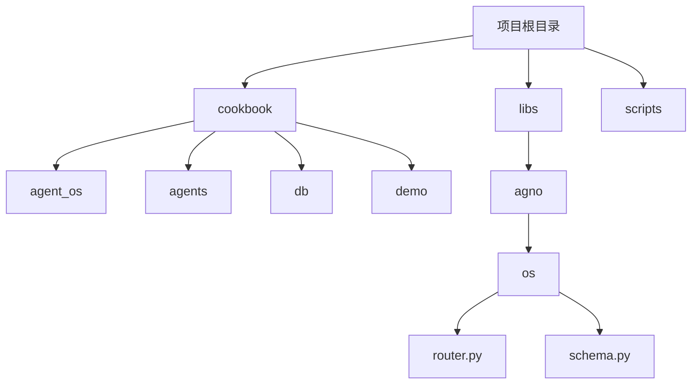
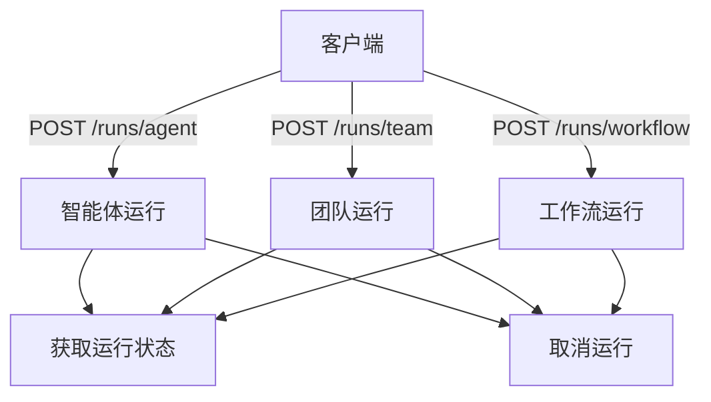
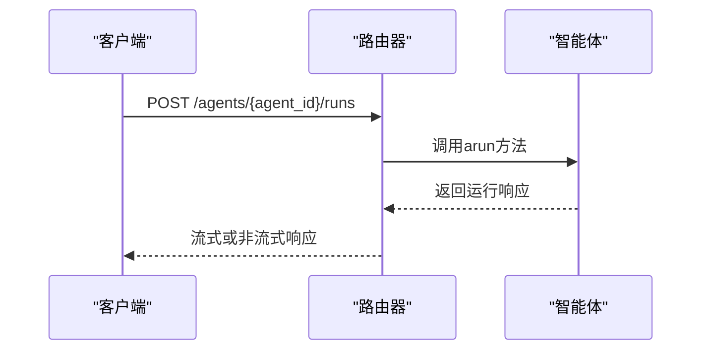
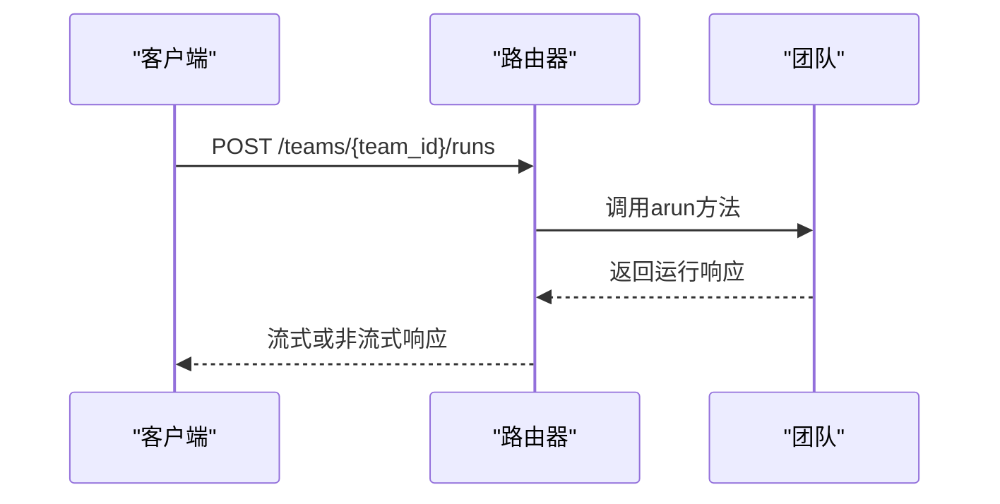
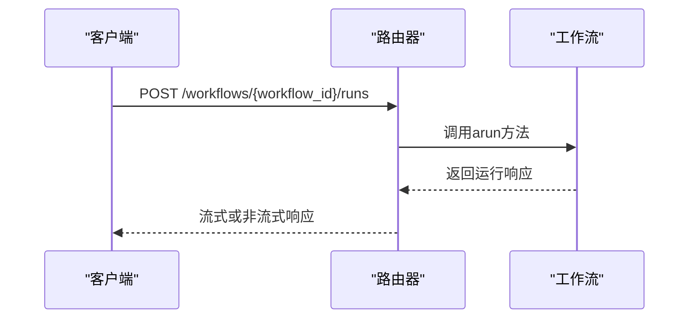
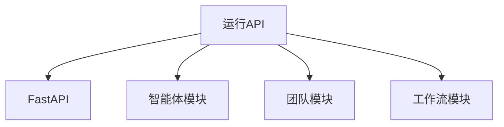

# 运行API

<cite>
**本文档中引用的文件**  
- [router.py](file://libs/agno/agno/os/router.py)
- [schema.py](file://libs/agno/agno/os/schema.py)
</cite>

## 目录
1. [简介](#简介)
2. [项目结构](#项目结构)
3. [核心组件](#核心组件)
4. [架构概述](#架构概述)
5. [详细组件分析](#详细组件分析)
6. [依赖分析](#依赖分析)
7. [性能考虑](#性能考虑)
8. [故障排除指南](#故障排除指南)
9. [结论](#结论)
10. [附录](#附录)（如有必要）

## 简介
运行API提供了一种直接与智能体、团队或工作流的单次执行实例进行交互的方法，而无需先创建持久化实体。该API支持启动一次性的智能体运行、团队运行和工作流运行，并提供了获取运行状态和取消运行的通用端点。通过内联定义智能体/团队/工作流的配置以及输入数据，用户可以快速测试一个智能体配置，而无需将其持久化。

## 项目结构
项目结构包含多个目录，如cookbook、libs、scripts等。其中，libs目录下的agno子目录包含了核心的API实现代码，特别是os/router.py文件定义了所有与运行相关的端点。

**Diagram sources**
- [router.py](file://libs/agno/agno/os/router.py)
- [schema.py](file://libs/agno/agno/os/schema.py)

**Section sources**
- [router.py](file://libs/agno/agno/os/router.py)
- [schema.py](file://libs/agno/agno/os/schema.py)

## 核心组件
运行API的核心组件包括智能体运行、团队运行和工作流运行。这些组件通过POST请求启动，并支持流式和非流式响应模式。每个运行实例都可以通过唯一的run_id进行跟踪和管理。

**Section sources**
- [router.py](file://libs/agno/agno/os/router.py)

## 架构概述
运行API的架构基于FastAPI框架，使用异步处理来支持高并发请求。API端点分为智能体、团队和工作流三类，每类都有创建运行、获取状态和取消运行的端点。请求体结构需要内联定义智能体/团队/工作流的配置以及输入数据。

**Diagram sources**
- [router.py](file://libs/agno/agno/os/router.py)

## 详细组件分析
### 智能体运行分析
智能体运行端点允许用户执行单个智能体的任务。请求体包括消息内容、会话ID、用户ID和是否流式传输的标志。响应可以是流式的SSE事件或非流式的JSON对象。

#### 对于API/服务组件：

**Diagram sources**
- [router.py](file://libs/agno/agno/os/router.py)

**Section sources**
- [router.py](file://libs/agno/agno/os/router.py)

### 团队运行分析
团队运行端点允许用户执行由多个智能体组成的团队任务。请求体结构与智能体运行类似，但支持更复杂的协作逻辑。

#### 对于API/服务组件：

**Diagram sources**
- [router.py](file://libs/agno/agno/os/router.py)

**Section sources**
- [router.py](file://libs/agno/agno/os/router.py)

### 工作流运行分析
工作流运行端点允许用户执行预定义的工作流任务。工作流可以包含多个步骤，每个步骤可以是一个智能体、团队或其他可执行组件。

#### 对于API/服务组件：

**Diagram sources**
- [router.py](file://libs/agno/agno/os/router.py)

**Section sources**
- [router.py](file://libs/agno/agno/os/router.py)

## 依赖分析
运行API依赖于FastAPI框架和一些内部模块，如agent、team和workflow。这些模块共同构成了智能体系统的运行时环境。

**Diagram sources**
- [router.py](file://libs/agno/agno/os/router.py)

**Section sources**
- [router.py](file://libs/agno/agno/os/router.py)

## 性能考虑
运行API设计为异步处理，以支持高并发请求。流式响应模式特别适合长时间运行的任务，因为它可以在任务执行过程中逐步返回结果。

## 故障排除指南
如果遇到问题，请检查以下几点：
- 确保请求体格式正确
- 检查智能体/团队/工作流ID是否存在
- 验证会话ID和用户ID的有效性
- 查看服务器日志以获取更多详细信息

**Section sources**
- [router.py](file://libs/agno/agno/os/router.py)

## 结论
运行API提供了一种灵活且强大的方式来与智能体、团队和工作流进行交互。通过内联定义配置和输入数据，用户可以快速测试和验证不同的智能体配置，而无需复杂的持久化设置。

## 附录
### API端点列表
| 端点 | 方法 | 描述 |
| --- | --- | --- |
| /agents/{agent_id}/runs | POST | 启动智能体运行 |
| /teams/{team_id}/runs | POST | 启动团队运行 |
| /workflows/{workflow_id}/runs | POST | 启动工作流运行 |
| /runs/{run_id} | GET | 获取运行状态 |
| /runs/{run_id}/cancel | POST | 取消运行 |

**Section sources**
- [router.py](file://libs/agno/agno/os/router.py)