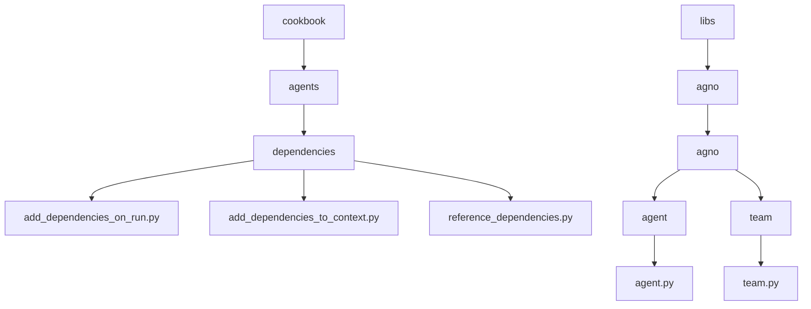
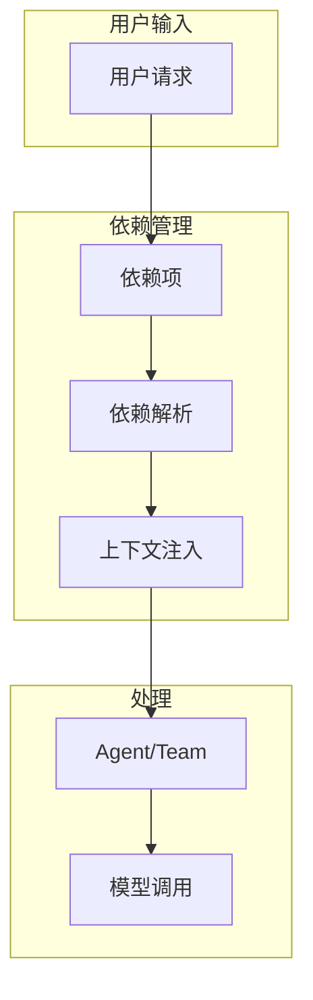
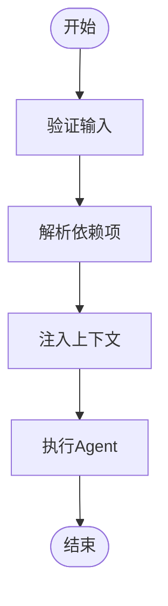
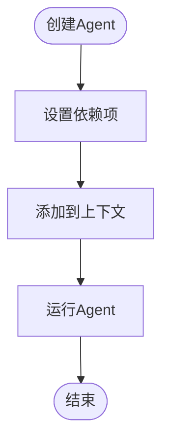
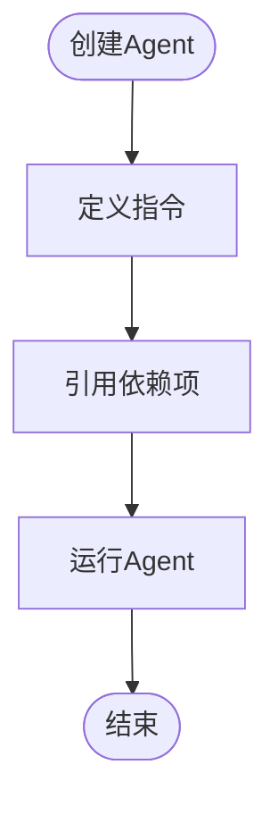
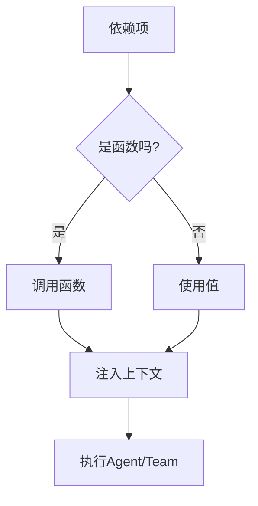

# 共享依赖项

<cite>
**本文档中引用的文件**  
- [add_dependencies_on_run.py](file://cookbook/agents/dependencies/add_dependencies_on_run.py)
- [add_dependencies_to_context.py](file://cookbook/agents/dependencies/add_dependencies_to_context.py)
- [reference_dependencies.py](file://cookbook/agents/dependencies/reference_dependencies.py)
- [README.md](file://cookbook/agents/dependencies/README.md)
- [agent.py](file://libs/agno/agno/agent/agent.py)
- [team.py](file://libs/agno/agno/team/team.py)
</cite>

## 目录
1. [简介](#简介)
2. [项目结构](#项目结构)
3. [核心组件](#核心组件)
4. [架构概述](#架构概述)
5. [详细组件分析](#详细组件分析)
6. [依赖分析](#依赖分析)
7. [性能考虑](#性能考虑)
8. [故障排除指南](#故障排除指南)
9. [结论](#结论)

## 简介
本文档详细介绍了团队共享依赖项的机制，重点说明如何在运行时动态地为团队成员添加工具、函数或其他依赖项，以及如何在团队上下文中引用和管理这些依赖。通过分析 `add_dependencies_on_run.py`、`add_dependencies_to_context.py` 和 `reference_dependencies.py` 示例，阐述了在运行时注入依赖、在上下文中预设依赖以及在成员间引用已定义依赖的不同策略。这些机制显著增强了团队的灵活性和可扩展性。

## 项目结构
项目结构中，依赖项管理功能主要位于 `cookbook/agents/dependencies/` 目录下，包含多个示例文件，用于演示不同的依赖注入策略。核心实现位于 `libs/agno/agno/agent/agent.py` 和 `libs/agno/agno/team/team.py` 文件中，提供了依赖解析和管理的底层支持。

**图示来源**
- [add_dependencies_on_run.py](file://cookbook/agents/dependencies/add_dependencies_on_run.py)
- [add_dependencies_to_context.py](file://cookbook/agents/dependencies/add_dependencies_to_context.py)
- [reference_dependencies.py](file://cookbook/agents/dependencies/reference_dependencies.py)
- [agent.py](file://libs/agno/agno/agent/agent.py)
- [team.py](file://libs/agno/agno/team/team.py)

**本节来源**
- [cookbook/agents/dependencies/README.md](file://cookbook/agents/dependencies/README.md)

## 核心组件
核心组件包括 `Agent` 和 `Team` 类，它们通过 `dependencies` 参数接收依赖项，并在运行时解析这些依赖项。依赖项可以是静态值或可调用函数，系统会自动处理函数调用并将其结果注入上下文。

**本节来源**
- [agent.py](file://libs/agno/agno/agent/agent.py#L4167-L4197)
- [team.py](file://libs/agno/agno/team/team.py#L1000-L1200)

## 架构概述
系统架构采用依赖注入模式，允许在运行时动态添加依赖项。`Agent` 和 `Team` 类在运行时解析依赖项，并根据配置决定是否将依赖项添加到上下文中。这种设计使得系统能够灵活地适应不同的运行环境和需求。

**图示来源**
- [agent.py](file://libs/agno/agno/agent/agent.py#L4167-L4197)
- [team.py](file://libs/agno/agno/team/team.py#L1000-L1200)

## 详细组件分析
### 运行时依赖注入分析
`add_dependencies_on_run.py` 示例展示了如何在运行时动态注入依赖项。通过 `run` 方法的 `dependencies` 参数，可以传递一个包含函数的字典，这些函数在运行时被调用，其结果被注入到上下文中。

#### 依赖注入流程

**图示来源**
- [add_dependencies_on_run.py](file://cookbook/agents/dependencies/add_dependencies_on_run.py#L0-L90)
- [agent.py](file://libs/agno/agno/agent/agent.py#L4167-L4197)

**本节来源**
- [add_dependencies_on_run.py](file://cookbook/agents/dependencies/add_dependencies_on_run.py#L0-L90)
- [agent.py](file://libs/agno/agno/agent/agent.py#L4167-L4197)

### 上下文预设依赖分析
`add_dependencies_to_context.py` 示例展示了如何在创建 `Agent` 时预设依赖项。通过在 `Agent` 构造函数中设置 `dependencies` 和 `add_dependencies_to_context` 参数，可以确保依赖项在每次运行时自动注入到上下文中。

#### 上下文预设流程

**图示来源**
- [add_dependencies_to_context.py](file://cookbook/agents/dependencies/add_dependencies_to_context.py#L0-L49)
- [agent.py](file://libs/agno/agno/agent/agent.py#L4167-L4197)

**本节来源**
- [add_dependencies_to_context.py](file://cookbook/agents/dependencies/add_dependencies_to_context.py#L0-L49)
- [agent.py](file://libs/agno/agno/agent/agent.py#L4167-L4197)

### 引用已定义依赖分析
`reference_dependencies.py` 示例展示了如何在指令中引用已定义的依赖项。通过在 `instructions` 参数中使用 `{key}` 语法，可以引用依赖项中的值，从而在生成响应时动态地包含这些值。

#### 依赖引用流程

**图示来源**
- [reference_dependencies.py](file://cookbook/agents/dependencies/reference_dependencies.py#L0-L51)
- [agent.py](file://libs/agno/agno/agent/agent.py#L4167-L4197)

**本节来源**
- [reference_dependencies.py](file://cookbook/agents/dependencies/reference_dependencies.py#L0-L51)
- [agent.py](file://libs/agno/agno/agent/agent.py#L4167-L4197)

## 依赖分析
系统通过 `dependencies` 参数接收依赖项，并在运行时解析这些依赖项。依赖项可以是静态值或可调用函数，系统会自动处理函数调用并将其结果注入上下文。这种设计使得系统能够灵活地适应不同的运行环境和需求。

**图示来源**
- [agent.py](file://libs/agno/agno/agent/agent.py#L4167-L4197)
- [team.py](file://libs/agno/agno/team/team.py#L1000-L1200)

**本节来源**
- [agent.py](file://libs/agno/agno/agent/agent.py#L4167-L4197)
- [team.py](file://libs/agno/agno/team/team.py#L1000-L1200)

## 性能考虑
依赖项的解析和注入在运行时进行，可能会对性能产生一定影响。建议将频繁使用的依赖项缓存起来，以减少重复计算。此外，应避免在依赖项中执行耗时的操作，以免影响整体响应速度。

## 故障排除指南
如果依赖项未正确注入，首先检查 `dependencies` 参数是否正确设置。其次，确保依赖项中的函数能够正常执行并返回预期结果。最后，检查 `add_dependencies_to_context` 参数是否设置为 `True`，以确保依赖项被注入到上下文中。

**本节来源**
- [agent.py](file://libs/agno/agno/agent/agent.py#L4167-L4197)
- [team.py](file://libs/agno/agno/team/team.py#L1000-L1200)

## 结论
通过 `add_dependencies_on_run.py`、`add_dependencies_to_context.py` 和 `reference_dependencies.py` 示例，我们展示了如何在团队运行时动态地为成员添加工具、函数或其他依赖项，以及如何在团队上下文中引用和管理这些依赖。这些机制显著增强了团队的灵活性和可扩展性，使得系统能够更好地适应不同的运行环境和需求。