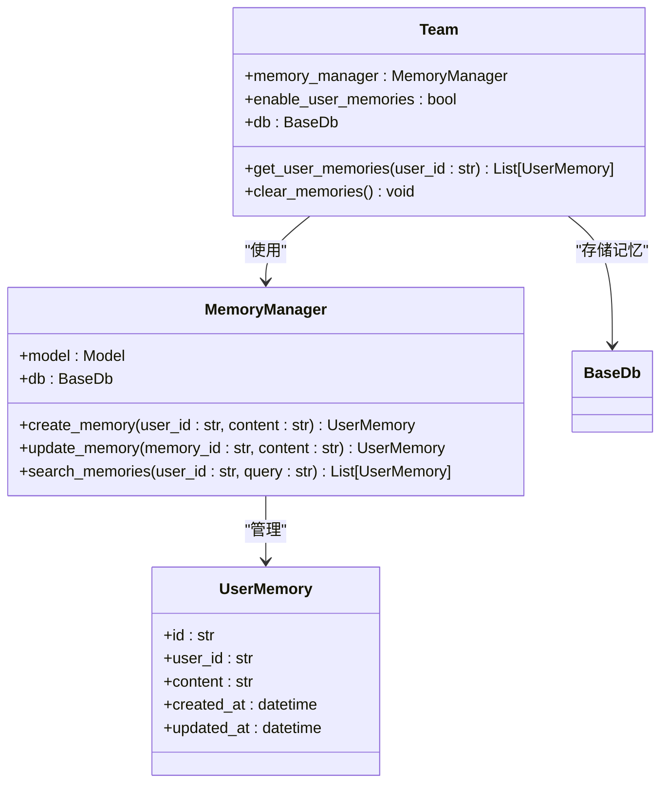
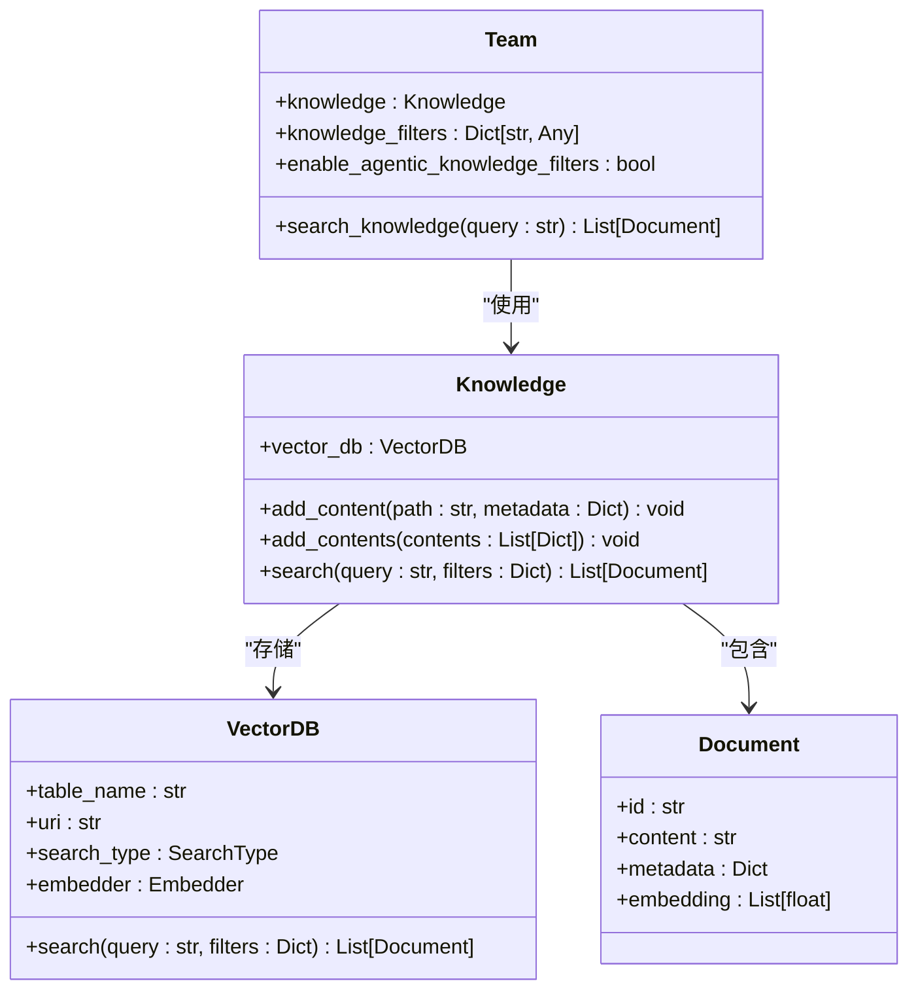
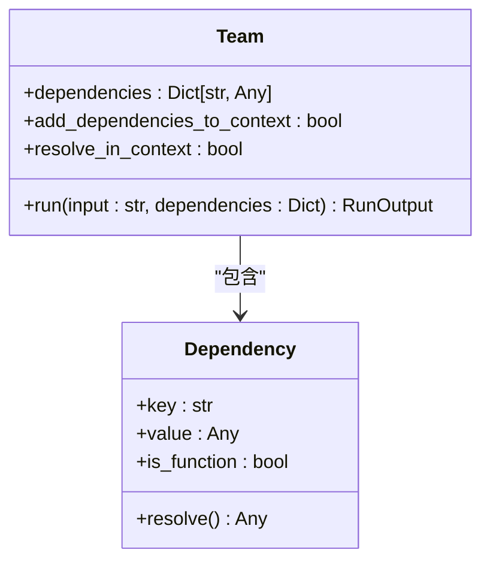

# 共享资源

<cite>
**本文档中引用的文件**  
- [team.py](file://libs/agno/agno/team/team.py)
- [01_team_with_memory_manager.py](file://cookbook/teams/memory/01_team_with_memory_manager.py)
- [02_team_with_agentic_memory.py](file://cookbook/teams/memory/02_team_with_agentic_memory.py)
- [01_team_with_knowledge.py](file://cookbook/teams/knowledge/01_team_with_knowledge.py)
- [02_team_with_knowledge_filters.py](file://cookbook/teams/knowledge/02_team_with_knowledge_filters.py)
- [03_team_with_agentic_knowledge_filters.py](file://cookbook/teams/knowledge/03_team_with_agentic_knowledge_filters.py)
- [reference_dependencies.py](file://cookbook/teams/dependencies/reference_dependencies.py)
- [add_dependencies_to_context.py](file://cookbook/teams/dependencies/add_dependencies_to_context.py)
- [add_dependencies_on_run.py](file://cookbook/teams/dependencies/add_dependencies_on_run.py)
- [test_dependencies.py](file://libs/agno/tests/integration/teams/test_dependencies.py)
</cite>

## 目录
1. [简介](#简介)
2. [团队共享内存管理](#团队共享内存管理)
3. [团队知识库配置](#团队知识库配置)
4. [团队依赖项管理](#团队依赖项管理)
5. [综合示例与使用场景](#综合示例与使用场景)
6. [最佳实践与性能建议](#最佳实践与性能建议)

## 简介
本文档详细介绍了如何在团队层面配置和管理共享资源，包括内存、知识库和依赖项。通过这些功能，团队成员可以实现上下文共享和高效协同工作。文档将深入探讨共享内存管理器的设置、团队知识库的加载与检索，以及运行时动态添加或引用依赖项的方法。通过具体示例展示这些功能的配置和使用场景，强调其在提升团队协作效率和一致性方面的重要性。

## 团队共享内存管理

团队共享内存管理允许团队成员在会话之间持久化和共享用户记忆。通过配置内存管理器，团队可以自动创建、更新和检索用户记忆，从而提供更加个性化和连贯的交互体验。

### 内存管理器配置
团队可以通过设置 `memory_manager` 和 `enable_user_memories` 参数来启用共享内存功能。内存管理器负责处理记忆的存储和检索，而数据库（`db`）则用于持久化这些记忆。



**图示来源**
- [team.py](file://libs/agno/agno/team/team.py#L5102-L5136)
- [01_team_with_memory_manager.py](file://cookbook/teams/memory/01_team_with_memory_manager.py#L1-L53)

### 内存共享示例
以下示例展示了如何配置一个具有共享内存功能的团队：

```python
from agno.agent import Agent
from agno.db.postgres import PostgresDb
from agno.memory import MemoryManager
from agno.models.openai import OpenAIChat
from agno.team import Team

db_url = "postgresql+psycopg://ai:ai@localhost:5532/ai"
db = PostgresDb(db_url=db_url)

memory_manager = MemoryManager(model=OpenAIChat(id="o3-mini"))

team = Team(
    model=OpenAIChat(id="o3-mini"),
    memory_manager=memory_manager,
    members=[agent],
    db=db,
    enable_user_memories=True,
)

team.print_response(
    "我的名字是John Doe，我喜欢在周末去山里徒步。",
    stream=True,
    user_id="john_doe@example.com",
    session_id="session_123",
)
team.print_response(
    "我的爱好是什么？", stream=True, user_id="john_doe@example.com", session_id="session_123"
)
```

在此示例中，团队首先接收关于用户爱好的信息，并将其存储为用户记忆。随后，当被问及用户的爱好时，团队能够检索并返回之前存储的记忆。

**节来源**
- [01_team_with_memory_manager.py](file://cookbook/teams/memory/01_team_with_memory_manager.py#L1-L53)
- [02_team_with_agentic_memory.py](file://cookbook/teams/memory/02_team_with_agentic_memory.py#L1-L53)

## 团队知识库配置

团队知识库允许团队成员访问和检索预加载的知识内容，从而提供基于知识的响应。通过配置知识库，团队可以结合内部文档、网页内容等信息源，为用户提供准确和丰富的回答。

### 知识库设置
团队可以通过 `knowledge` 参数配置知识库。知识库通常包含一个向量数据库（`vector_db`），用于存储和检索嵌入向量。此外，还可以通过 `knowledge_filters` 和 `enable_agentic_knowledge_filters` 参数来控制知识检索的范围和方式。



**图示来源**
- [01_team_with_knowledge.py](file://cookbook/teams/knowledge/01_team_with_knowledge.py#L1-L57)
- [team.py](file://libs/agno/agno/team/team.py#L494-L523)

### 知识库示例
以下示例展示了如何配置一个具有知识库的团队：

```python
from agno.knowledge.knowledge import Knowledge
from agno.vectordb.lancedb import LanceDb
from agno.knowledge.embedder.openai import OpenAIEmbedder

agno_docs_knowledge = Knowledge(
    vector_db=LanceDb(
        uri="tmp/lancedb",
        table_name="agno_docs",
        search_type=SearchType.hybrid,
        embedder=OpenAIEmbedder(id="text-embedding-3-small"),
    ),
)

agno_docs_knowledge.add_content(url="https://docs.agno.com/llms-full.txt")

team_with_knowledge = Team(
    name="Team with Knowledge",
    members=[web_agent],
    model=OpenAIChat(id="o3-mini"),
    knowledge=agno_docs_knowledge,
    show_members_responses=True,
    markdown=True,
)

team_with_knowledge.print_response("告诉我关于Agno框架的信息", stream=True)
```

在此示例中，团队的知识库被配置为从指定URL加载Agno文档，并使用LanceDB作为向量数据库进行存储和检索。

**节来源**
- [01_team_with_knowledge.py](file://cookbook/teams/knowledge/01_team_with_knowledge.py#L1-L57)
- [02_team_with_knowledge_filters.py](file://cookbook/teams/knowledge/02_team_with_knowledge_filters.py#L1-L110)

### 知识过滤器
知识过滤器允许团队根据特定条件限制知识搜索的范围。例如，可以按用户ID、文档类型或年份进行过滤。

```python
team_with_knowledge = Team(
    name="Team with Knowledge",
    members=[web_agent],
    model=OpenAIChat(id="o3-mini"),
    knowledge=knowledge_base,
    show_members_responses=True,
    markdown=True,
    knowledge_filters={"user_id": "jordan_mitchell"},
)

team_with_knowledge.print_response("告诉我关于Jordan Mitchell的工作和经验")
```

**节来源**
- [02_team_with_knowledge_filters.py](file://cookbook/teams/knowledge/02_team_with_knowledge_filters.py#L1-L110)

### 智能知识过滤器
智能知识过滤器允许AI动态确定搜索条件，而不是使用预定义的过滤器。

```python
team_with_knowledge = Team(
    name="Team with Knowledge",
    members=[web_agent],
    model=OpenAIChat(id="o3-mini"),
    knowledge=knowledge,
    show_members_responses=True,
    markdown=True,
    enable_agentic_knowledge_filters=True,
)

team_with_knowledge.print_response("告诉我关于Jordan Mitchell的工作和经验")
```

**节来源**
- [03_team_with_agentic_knowledge_filters.py](file://cookbook/teams/knowledge/03_team_with_agentic_knowledge_filters.py#L1-L107)

## 团队依赖项管理

团队依赖项管理允许在团队级别注入上下文和运行时依赖项。这些依赖项可以是静态值、函数或动态生成的数据，它们可以在团队的指令和响应中被引用。

### 依赖项配置
团队通过 `dependencies` 参数配置依赖项。这些依赖项可以在指令中通过 `{key}` 语法引用，并在运行时解析。



**图示来源**
- [reference_dependencies.py](file://cookbook/teams/dependencies/reference_dependencies.py#L1-L69)
- [test_dependencies.py](file://libs/agno/tests/integration/teams/test_dependencies.py#L1-L216)

### 依赖项示例
以下示例展示了如何配置和使用团队依赖项：

```python
def get_user_profile(user_id: str = "john_doe") -> dict:
    profiles = {
        "john_doe": {
            "name": "John Doe",
            "preferences": {
                "communication_style": "professional",
                "topics_of_interest": ["AI/ML", "Software Engineering", "Finance"],
                "experience_level": "senior",
            },
            "location": "San Francisco, CA",
            "role": "Senior Software Engineer",
        }
    }
    return profiles.get(user_id, {"name": "Unknown User"})

def get_current_context() -> dict:
    from datetime import datetime
    return {
        "current_time": datetime.now().strftime("%Y-%m-%d %H:%M:%S"),
        "timezone": "PST",
        "day_of_week": datetime.now().strftime("%A"),
    }

team = Team(
    name="PersonalizationTeam",
    model=OpenAIChat(id="gpt-4o-mini"),
    members=[profile_agent, context_agent],
    dependencies={
        "user_profile": get_user_profile,
        "current_context": get_current_context,
    },
    instructions=[
        "您是一个个性化团队，根据用户的个人资料和上下文提供个性化推荐。",
        "这是用户资料：{user_profile}",
        "这是当前上下文：{current_context}",
    ],
    debug_mode=True,
    markdown=True,
)

response = team.run(
    "请根据我的个人资料和兴趣，为我提供今天的优先事项个性化摘要。",
)
```

在此示例中，团队的依赖项包括获取用户资料和当前上下文的函数。这些依赖项在指令中被引用，并在运行时解析。

**节来源**
- [reference_dependencies.py](file://cookbook/teams/dependencies/reference_dependencies.py#L1-L69)
- [add_dependencies_to_context.py](file://cookbook/teams/dependencies/add_dependencies_to_context.py#L1-L80)

### 运行时依赖项注入
依赖项也可以在运行时动态注入：

```python
response = team.run(
    "请根据我的个人资料和兴趣，为我提供今天的优先事项个性化摘要。",
    dependencies={
        "user_profile": get_user_profile,
        "current_context": get_current_context,
    },
    add_dependencies_to_context=True,
)
```

**节来源**
- [add_dependencies_on_run.py](file://cookbook/teams/dependencies/add_dependencies_on_run.py#L1-L54)

## 综合示例与使用场景

### 个性化推荐系统
结合共享内存、知识库和依赖项，可以构建一个强大的个性化推荐系统：

```python
# 配置团队
team = Team(
    name="PersonalizationTeam",
    model=OpenAIChat(id="gpt-4o-mini"),
    members=[profile_agent, context_agent],
    memory_manager=memory_manager,
    db=db,
    enable_user_memories=True,
    knowledge=agno_docs_knowledge,
    dependencies={
        "user_profile": get_user_profile,
        "current_context": get_current_context,
    },
    instructions=[
        "您是一个个性化团队，根据用户的个人资料、上下文和历史记忆提供个性化推荐。",
        "这是用户资料：{user_profile}",
        "这是当前上下文：{current_context}",
        "参考知识库中的最新信息。",
    ],
    add_dependencies_to_context=True,
    add_knowledge_to_context=True,
    add_memories_to_context=True,
    markdown=True,
)

# 交互示例
team.print_response(
    "我的名字是John Doe，我喜欢在周末去山里徒步。",
    user_id="john_doe@example.com",
    session_id="session_123",
)
team.print_response(
    "根据我的个人资料和兴趣，为我提供今天的优先事项个性化摘要。",
    user_id="john_doe@example.com",
    session_id="session_123",
)
```

此系统能够：
- 存储和检索用户记忆
- 访问和利用知识库中的信息
- 结合用户个人资料和当前上下文
- 提供连贯和个性化的响应

**节来源**
- [01_team_with_memory_manager.py](file://cookbook/teams/memory/01_team_with_memory_manager.py#L1-L53)
- [01_team_with_knowledge.py](file://cookbook/teams/knowledge/01_team_with_knowledge.py#L1-L57)
- [reference_dependencies.py](file://cookbook/teams/dependencies/reference_dependencies.py#L1-L69)

## 最佳实践与性能建议

### 内存管理最佳实践
- **合理设置记忆存储**：根据应用需求选择合适的数据库（如PostgreSQL、Redis等）。
- **定期清理过期记忆**：避免记忆库无限增长，影响性能。
- **优化记忆检索**：使用适当的索引和查询优化技术。

### 知识库最佳实践
- **定期更新知识内容**：确保知识库中的信息是最新的。
- **合理分块文档**：避免过长或过短的文本块，以提高检索准确性。
- **使用混合搜索**：结合关键词搜索和向量搜索，提高检索效果。

### 依赖项管理最佳实践
- **最小化依赖项数量**：只注入必要的依赖项，避免上下文过载。
- **使用函数依赖项**：对于动态数据，使用函数而不是静态值。
- **合理设置解析时机**：根据需要选择在上下文解析依赖项的时机。

通过遵循这些最佳实践，可以确保团队共享资源的高效和可靠运行，从而提升整体协作效率和用户体验。

**节来源**
- [01_team_with_memory_manager.py](file://cookbook/teams/memory/01_team_with_memory_manager.py#L1-L53)
- [01_team_with_knowledge.py](file://cookbook/teams/knowledge/01_team_with_knowledge.py#L1-L57)
- [reference_dependencies.py](file://cookbook/teams/dependencies/reference_dependencies.py#L1-L69)