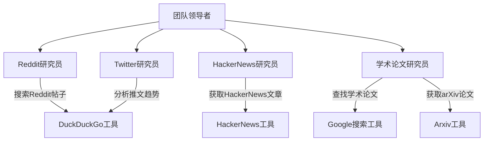
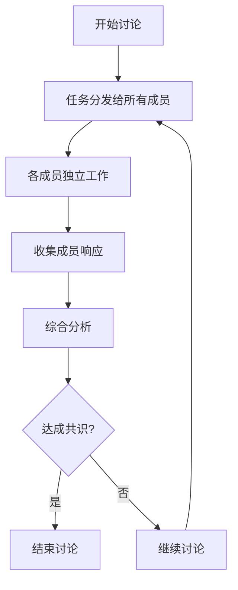
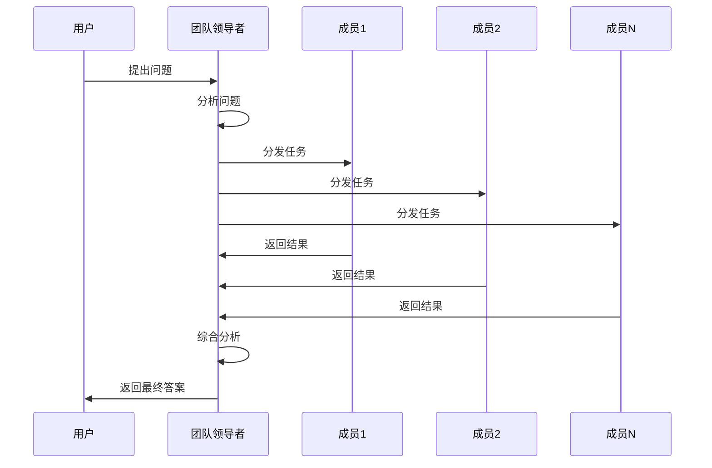

# 协作模式

<cite>
**本文档中引用的文件**  
- [collaboration_team.py](file://cookbook/examples/teams/collaborate_mode/collaboration_team.py)
- [team.py](file://libs/agno/agno/team/team.py)
- [02_async_delegate_to_all_members.py](file://cookbook/teams/async/02_async_delegate_to_all_members.py)
- [03_async_respond_directly.py](file://cookbook/teams/async/03_async_respond_directly.py)
- [test_team_delegation.py](file://libs/agno/tests/integration/teams/test_team_delegation.py)
</cite>

## 目录
1. [引言](#引言)
2. [协作模式机制](#协作模式机制)
3. [协作团队示例](#协作团队示例)
4. [适用场景分析](#适用场景分析)
5. [通信开销与收敛性考虑](#通信开销与收敛性考虑)
6. [核心实现原理](#核心实现原理)
7. [结论](#结论)

## 引言
协作模式是一种允许多个智能体在同一个会话中直接相互对话和协作的架构模式。该模式通过智能体之间的互相调用、上下文共享以及多轮对话来达成共识或完成复杂任务。本文档将深入探讨协作模式的工作机制，使用“协作团队”示例进行说明，并分析其在模拟真实团队讨论、头脑风暴和解决需要集体智慧问题时的适用性。

**Section sources**
- [collaboration_team.py](file://cookbook/examples/teams/collaborate_mode/collaboration_team.py)

## 协作模式机制
协作模式的核心在于智能体之间的协同工作。在这种模式下，团队领导者（Team Leader）负责协调各个成员智能体的活动。当启用`delegate_task_to_all_members`选项时，所有成员智能体都会收到相同的任务，并独立进行处理。每个成员智能体可以利用其特定的工具和专业知识来完成任务。

团队领导者通过`delegate_task_to_members`工具将任务分发给所有成员。这个过程只需要调用一次，系统会自动将任务广播给所有成员。成员智能体的响应会被收集并由团队领导者进行综合分析。如果团队领导者认为任务已经完成，就可以停止讨论并向用户返回最终结果。

这种机制允许智能体之间共享上下文信息，通过多轮对话逐步逼近最优解。每个成员的输出都成为后续讨论的基础，从而形成一个动态的知识积累过程。

**Section sources**
- [team.py](file://libs/agno/agno/team/team.py#L4400-L4450)
- [test_team_delegation.py](file://libs/agno/tests/integration/teams/test_team_delegation.py#L130-L135)

## 协作团队示例
以“讨论团队”为例，该团队由四个专门的研究人员组成：Reddit研究员、HackerNews研究员、学术论文研究员和Twitter研究员。每个研究员都有特定的工具和专长领域。

**Diagram sources**
- [collaboration_team.py](file://cookbook/examples/teams/collaborate_mode/collaboration_team.py#L50-L90)

**Section sources**
- [collaboration_team.py](file://cookbook/examples/teams/collaborate_mode/collaboration_team.py)

当用户提出“学习编程的最佳方式是什么？”这一问题时，团队领导者会启动讨论。所有研究员同时开始工作，分别从各自的专业平台收集相关信息。Reddit研究员查找社区讨论，HackerNews研究员获取技术文章，学术论文研究员搜索相关研究，而Twitter研究员则关注实时趋势。最终，团队领导者整合这些信息，形成全面的回答。

## 适用场景分析
协作模式特别适用于以下几种场景：

### 模拟真实团队讨论
通过为每个智能体分配不同的角色和专长，可以有效地模拟真实世界中的团队协作。例如，在产品开发团队中，可以有市场分析师、技术专家、用户体验设计师等不同角色的智能体共同参与讨论。

### 头脑风暴
协作模式非常适合进行创意生成和头脑风暴。多个智能体可以从不同角度提出想法，通过交叉启发产生更多创新方案。每个智能体的独特视角都有助于打破思维定势。

### 集体智慧问题解决
对于需要综合多方面知识才能解决的复杂问题，协作模式能够充分发挥集体智慧的优势。例如，在医疗诊断场景中，可以有专门负责症状分析、影像解读、病史研究等不同方面的智能体协同工作。

**Diagram sources**
- [02_async_delegate_to_all_members.py](file://cookbook/teams/async/02_async_delegate_to_all_members.py#L70-L80)

**Section sources**
- [02_async_delegate_to_all_members.py](file://cookbook/teams/async/02_async_delegate_to_all_members.py)

## 通信开销与收敛性考虑
尽管协作模式具有诸多优势，但也存在一些需要考虑的问题。

### 通信开销
由于所有成员都需要接收任务并返回结果，这会导致较高的通信开销。特别是在成员数量较多时，数据传输量会显著增加。此外，每个成员的处理延迟也会累积，影响整体响应速度。

### 收敛性挑战
确保讨论能够有效收敛是一个重要挑战。可能存在以下情况：
- 成员之间意见分歧较大，难以达成共识
- 某些成员持续提供低质量输出，影响整体决策
- 讨论陷入无限循环，无法自然终止

为应对这些问题，系统设置了最大步骤限制（`reasoning_max_steps`），并要求团队领导者在适当时候主动终止讨论。同时，通过评估每个成员的贡献质量，可以优化后续的任务分配策略。

**Section sources**
- [team.py](file://libs/agno/agno/team/team.py#L5888-L5900)

## 核心实现原理
协作模式的核心实现在于`Team`类中的`delegate_task_to_members`方法。该方法有两种实现：同步版本和异步版本，分别用于处理不同的执行模式。

当`delegate_task_to_all_members`设置为`True`时，系统会创建一个名为`delegate_task_to_members`的特殊工具。这个工具的调用会触发对所有成员智能体的并行或串行调用，具体取决于是否启用流式处理。

在异步模式下，系统使用`asyncio.Queue`来管理成员智能体的响应流，确保事件能够有序地传递给团队领导者。每个成员的会话状态都是独立复制的，避免了状态污染问题。

**Diagram sources**
- [team.py](file://libs/agno/agno/team/team.py#L5612-L5894)

**Section sources**
- [team.py](file://libs/agno/agno/team/team.py#L5600-L5900)

## 结论
协作模式为多智能体系统提供了一种强大的协作框架。通过允许智能体之间直接对话和共享上下文，该模式能够有效模拟真实团队的工作方式，在解决复杂问题时展现出显著优势。虽然存在通信开销和收敛性方面的挑战，但通过合理的架构设计和参数配置，这些问题都可以得到有效管理。未来的发展方向包括优化成员选择算法、改进共识达成机制以及增强对低质量输出的识别能力。