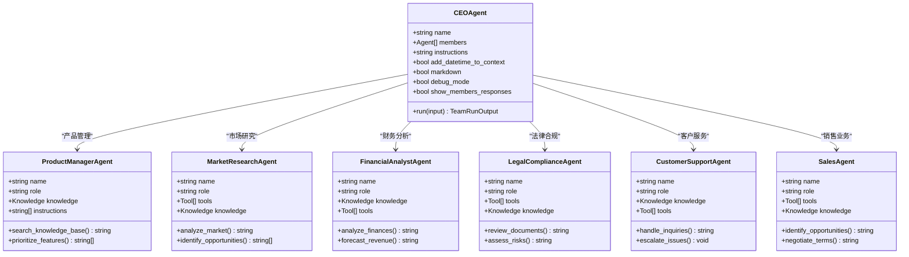

# 协调模式

<cite>
**本文档中引用的文件**
- [news_agency_team.py](file://cookbook/examples/teams/coordinate_mode/news_agency_team.py)
- [autonomous_startup_team.py](file://cookbook/examples/teams/coordinate_mode/autonomous_startup_team.py)
- [team.py](file://libs/agno/agno/team/team.py)
- [test_team_delegation.py](file://libs/agno/tests/integration/teams/test_team_delegation.py)
- [shared_session_state_with_team.py](file://cookbook/workflows/_06_advanced_concepts/_04_shared_session_state/shared_session_state_with_team.py)
</cite>

## 目录
1. [简介](#简介)
2. [项目结构](#项目结构)
3. [核心组件](#核心组件)
4. [架构概览](#架构概览)
5. [详细组件分析](#详细组件分析)
6. [依赖关系分析](#依赖关系分析)
7. [性能考虑](#性能考虑)
8. [故障排除指南](#故障排除指南)
9. [结论](#结论)

## 简介

协调模式是一种高级的团队协作机制，它让一个主控智能体（如新闻机构团队中的主编）负责规划、分解任务并协调其他成员智能体（如记者）来完成复杂任务。这种模式特别适用于需要多步骤、多智能体协作的复杂项目，能够有效提升团队的整体效率和质量。

在协调模式下，主控智能体会：
- 分析用户需求并制定详细的执行计划
- 将复杂任务分解为可管理的子任务
- 根据每个成员的能力和专长分配合适的任务
- 监控任务进度并确保高质量输出
- 整合各成员的成果并生成最终响应

## 项目结构

协调模式的实现主要分布在以下关键目录中：

**图表来源**
- [news_agency_team.py](file://cookbook/examples/teams/coordinate_mode/news_agency_team.py#L1-L70)
- [autonomous_startup_team.py](file://cookbook/examples/teams/coordinate_mode/autonomous_startup_team.py#L1-L246)
- [team.py](file://libs/agno/agno/team/team.py#L1-L200)

**章节来源**
- [news_agency_team.py](file://cookbook/examples/teams/coordinate_mode/news_agency_team.py#L1-L70)
- [autonomous_startup_team.py](file://cookbook/examples/teams/coordinate_mode/autonomous_startup_team.py#L1-L246)

## 核心组件

### 主控智能体（Coordinator Agent）

主控智能体是协调模式的核心，负责整体任务管理和成员协调。它具有以下关键特性：

- **任务规划能力**：能够理解复杂需求并制定详细的执行策略
- **成员管理**：负责分配任务、监控进度和评估质量
- **决策制定**：在多个选项中选择最优方案
- **质量控制**：确保最终输出符合预期标准

### 成员智能体（Member Agents）

成员智能体是专门化的智能体，各自负责特定领域的任务：

- **搜索专家**：负责信息检索和资料收集
- **写作专家**：专注于内容创作和编辑
- **产品经理**：负责产品规划和功能设计
- **市场分析师**：进行市场研究和竞争分析
- **财务分析师**：提供财务预测和风险评估
- **法律顾问**：确保合规性和法律风险控制

**章节来源**
- [news_agency_team.py](file://cookbook/examples/teams/coordinate_mode/news_agency_team.py#L15-L60)
- [autonomous_startup_team.py](file://cookbook/examples/teams/coordinate_mode/autonomous_startup_team.py#L40-L170)

## 架构概览

协调模式采用分层架构设计，确保高效的任务分解和执行：

**图表来源**
- [team.py](file://libs/agno/agno/team/team.py#L100-L200)
- [news_agency_team.py](file://cookbook/examples/teams/coordinate_mode/news_agency_team.py#L40-L60)

## 详细组件分析

### 新闻机构团队示例

新闻机构团队是一个典型的协调模式应用案例，展示了如何通过主控智能体协调多个专业成员完成复杂的新闻报道任务。

**图表来源**
- [news_agency_team.py](file://cookbook/examples/teams/coordinate_mode/news_agency_team.py#L15-L60)

#### 工作流程分析

新闻机构团队的工作流程遵循严格的协调模式：

1. **任务接收**：主控智能体接收用户输入的新闻主题
2. **任务分解**：将复杂报道任务分解为搜索和写作两个阶段
3. **成员委派**：主控智能体将搜索任务委派给搜索专家
4. **结果整合**：收集搜索结果后，委派写作任务给写作专家
5. **质量检查**：主控智能体进行最终的质量审查
6. **响应生成**：生成完整的新闻报道文章

**图表来源**
- [news_agency_team.py](file://cookbook/examples/teams/coordinate_mode/news_agency_team.py#L50-L60)

**章节来源**
- [news_agency_team.py](file://cookbook/examples/teams/coordinate_mode/news_agency_team.py#L1-L70)

### 自主创业团队示例

自主创业团队展示了更复杂的协调模式应用场景，涉及多个专业领域的智能体协同工作。

**图表来源**
- [autonomous_startup_team.py](file://cookbook/examples/teams/coordinate_mode/autonomous_startup_team.py#L40-L170)

#### 复杂任务协调机制

自主创业团队展示了协调模式在复杂商业场景中的应用：

1. **战略规划**：CEO智能体负责整体战略制定和优先级排序
2. **跨领域协作**：不同专业领域的智能体协同工作
3. **风险管理**：法律合规和财务分析确保业务稳健发展
4. **客户导向**：客户服务和销售智能体确保客户需求得到及时响应
5. **知识共享**：所有智能体都可以访问统一的知识库

**图表来源**
- [autonomous_startup_team.py](file://cookbook/examples/teams/coordinate_mode/autonomous_startup_team.py#L169-L200)

**章节来源**
- [autonomous_startup_team.py](file://cookbook/examples/teams/coordinate_mode/autonomous_startup_team.py#L1-L246)

### 核心协调机制

协调模式的核心在于主控智能体的任务委派和结果整合机制：

**图表来源**
- [team.py](file://libs/agno/agno/team/team.py#L5365-L5500)

**章节来源**
- [team.py](file://libs/agno/agno/team/team.py#L5365-L5500)

## 依赖关系分析

协调模式的实现依赖于多个关键组件的协同工作：

**图表来源**
- [team.py](file://libs/agno/agno/team/team.py#L1-L100)

**章节来源**
- [team.py](file://libs/agno/agno/team/team.py#L1-L200)

## 性能考虑

协调模式在处理复杂任务时需要考虑以下性能因素：

### 并发执行优化

- **并行任务处理**：支持多个成员智能体同时执行任务
- **资源池管理**：合理分配计算资源避免过载
- **异步处理**：使用异步模式提高响应速度

### 内存管理

- **会话状态优化**：合理管理团队和成员的状态数据
- **缓存策略**：对频繁访问的数据实施缓存机制
- **垃圾回收**：及时清理不再使用的中间结果

### 可扩展性设计

- **水平扩展**：支持动态添加新的成员智能体
- **负载均衡**：根据成员能力和当前负载分配任务
- **容错机制**：具备单点故障恢复能力

## 故障排除指南

### 常见问题及解决方案

1. **任务委派失败**
   - 检查成员ID是否正确
   - 验证成员智能体是否正常运行
   - 确认权限设置是否正确

2. **结果整合异常**
   - 检查成员输出格式是否一致
   - 验证数据传输完整性
   - 确认编码和字符集设置

3. **性能瓶颈**
   - 监控资源使用情况
   - 优化任务分解粒度
   - 调整并发参数

**章节来源**
- [test_team_delegation.py](file://libs/agno/tests/integration/teams/test_team_delegation.py#L1-L79)

## 结论

协调模式是一种强大的团队协作机制，它通过主控智能体的统一管理和成员智能体的专业分工，实现了高效的任务分解和执行。这种模式特别适用于需要多步骤、多专业知识的复杂项目，能够显著提升团队的整体效率和输出质量。

### 主要优势

1. **专业化分工**：每个成员专注于自己的专业领域
2. **高效协作**：主控智能体确保任务有序执行
3. **质量保证**：多层次的质量控制确保最终输出
4. **灵活扩展**：易于添加新的成员智能体和功能模块

### 应用前景

协调模式在以下场景中具有广阔的应用前景：
- 新闻媒体和内容创作
- 商业咨询和战略规划
- 科研项目和数据分析
- 产品开发和创新管理
- 客户服务和支持

通过持续的技术改进和实践积累，协调模式将成为人工智能团队协作的重要范式，推动智能化办公和决策的进一步发展。