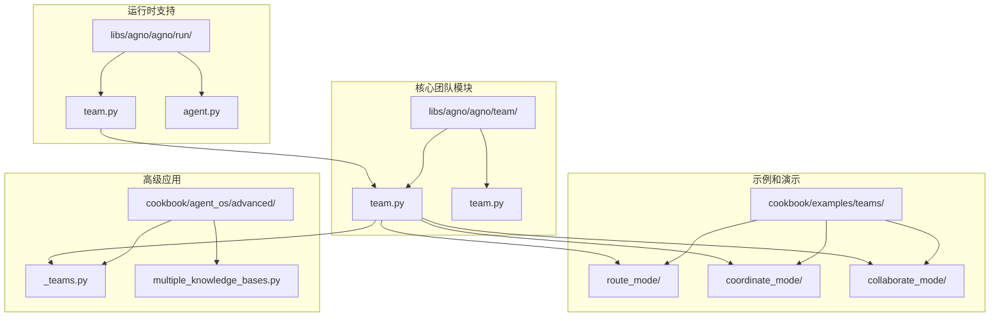
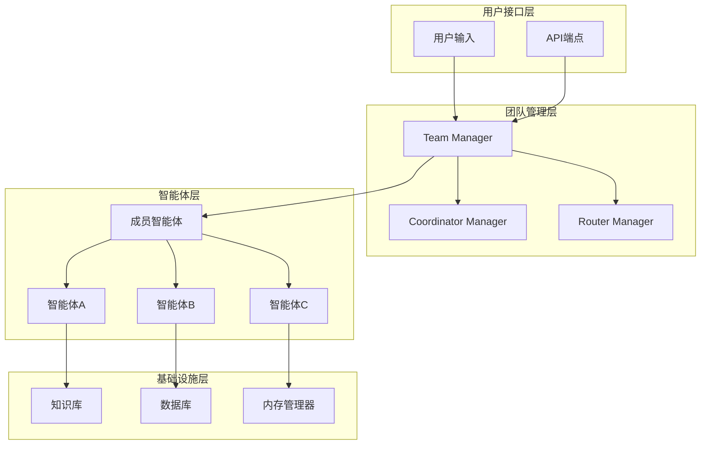
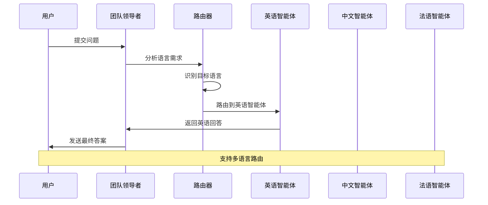
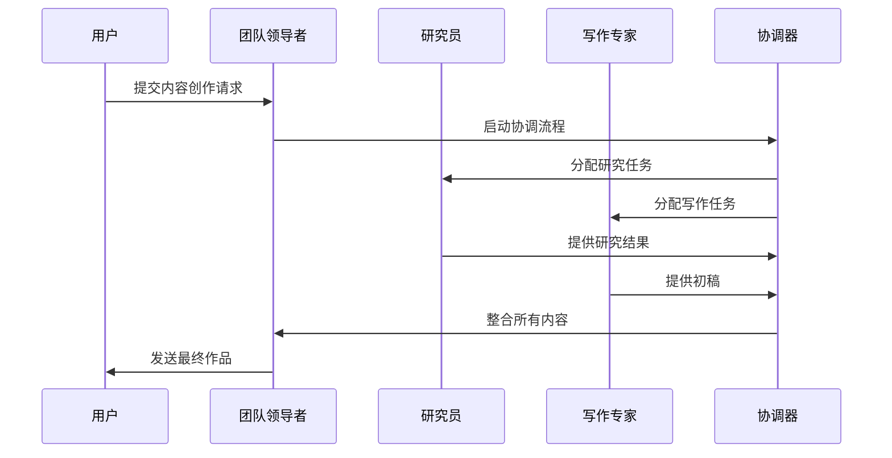
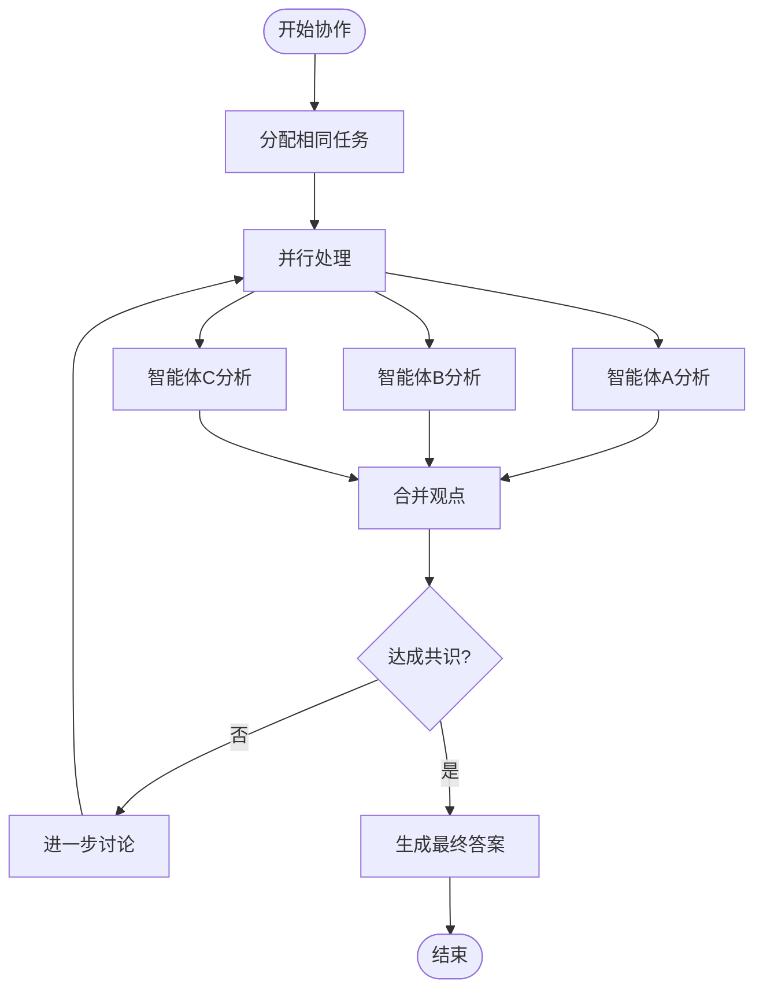
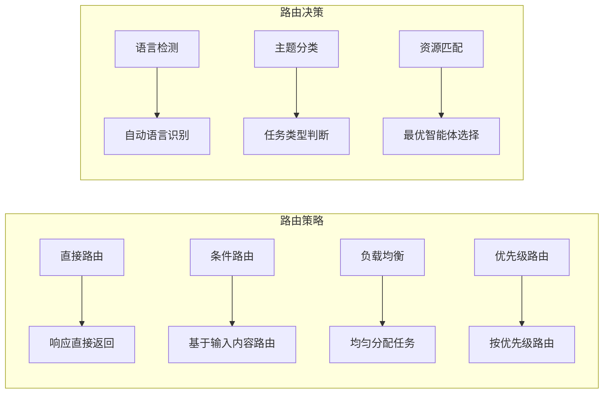
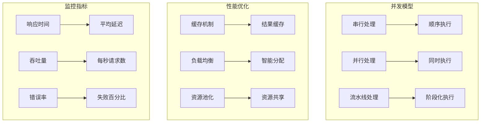

# 团队

<cite>
**本文档中引用的文件**
- [team.py](file://libs/agno/agno/team/team.py)
- [team.py](file://cookbook/teams/team_with_local_agentic_rag.py)
- [simple.py](file://cookbook/examples/teams/route_mode/simple.py)
- [content_team.py](file://cookbook/examples/teams/coordinate_mode/content_team.py)
- [collaboration_team.py](file://cookbook/examples/teams/collaborate_mode/collaboration_team.py)
- [_teams.py](file://cookbook/agent_os/advanced/_teams.py)
- [basic_workflow_team.py](file://cookbook/agent_os/workflow/basic_workflow_team.py)
- [accuracy_team.py](file://cookbook/evals/accuracy/accuracy_team.py)
- [team.py](file://libs/agno/agno/run/team.py)
- [reasoning.py](file://libs/agno/agno/tools/reasoning.py)
</cite>

## 目录
1. [简介](#简介)
2. [项目结构](#项目结构)
3. [核心组件](#核心组件)
4. [架构概览](#架构概览)
5. [详细组件分析](#详细组件分析)
6. [团队模式详解](#团队模式详解)
7. [协调机制](#协调机制)
8. [性能考虑](#性能考虑)
9. [故障排除指南](#故障排除指南)
10. [结论](#结论)

## 简介

Agno团队系统是一个强大的多智能体协作框架，允许将多个智能体组织成一个团队来解决更复杂的任务。该系统支持三种主要的团队模式：路由模式（Route Mode）、协调模式（Coordinate Mode）和协作模式（Collaborate Mode），每种模式都有其独特的工作原理和适用场景。

团队系统提供了先进的协调机制、消息路由策略和任务分配逻辑，支持共享内存、知识库和依赖项配置。通过示例展示了如何构建能够进行分布式RAG（检索增强生成）或异步协调的多智能体团队，并讨论了团队的性能、容错性和监控能力。

## 项目结构

团队功能在Agno项目中分布在多个关键目录中：



**图表来源**
- [team.py](file://libs/agno/agno/team/team.py#L1-L50)
- [team.py](file://cookbook/examples/teams/route_mode/simple.py#L1-L30)

**章节来源**
- [team.py](file://libs/agno/agno/team/team.py#L1-L100)
- [team.py](file://cookbook/teams/team_with_local_agentic_rag.py#L1-L64)

## 核心组件

### Team类

Team类是整个团队系统的核心，它管理着多个智能体成员的生命周期和交互：

```python
@dataclass(init=False)
class Team:
    """
    表示一组智能体的类。
    """
    members: List[Union[Agent, "Team"]]
    
    # 模型设置
    model: Optional[Model] = None
    
    # 团队设置
    name: Optional[str] = None
    id: Optional[str] = None
    parent_team_id: Optional[str] = None
    role: Optional[str] = None
    
    # 协调控制
    respond_directly: bool = False
    delegate_task_to_all_members: bool = False
    determine_input_for_members: bool = True
```

### 运行输出类

TeamRunOutput类封装了团队执行的结果：

```python
@dataclass
class TeamRunOutput:
    """Team.run()函数返回的响应"""
    content: Optional[Any] = None
    content_type: str = "str"
    messages: Optional[List[Message]] = None
    metrics: Optional[Metrics] = None
    model: Optional[str] = None
    member_responses: List[Union["TeamRunOutput", RunOutput]] = field(default_factory=list)
```

**章节来源**
- [team.py](file://libs/agno/agno/team/team.py#L50-L200)
- [team.py](file://libs/agno/agno/run/team.py#L400-L500)

## 架构概览

团队系统采用分层架构设计，支持灵活的扩展和组合：



**图表来源**
- [team.py](file://libs/agno/agno/team/team.py#L100-L200)
- [team.py](file://libs/agno/agno/run/team.py#L1-L50)

## 详细组件分析

### 路由模式（Route Mode）

路由模式是最简单的团队模式，团队领导者根据预定义规则将任务路由到合适的成员：



**图表来源**
- [simple.py](file://cookbook/examples/teams/route_mode/simple.py#L1-L52)

路由模式的关键特性：
- **respond_directly=True**: 领导者直接返回成员结果
- **determine_input_for_members=False**: 不重新确定成员输入
- **语言路由**: 基于用户输入自动选择合适语言的智能体

### 协调模式（Coordinate Mode）

协调模式允许智能体之间进行协作，但保持一定程度的独立性：



**图表来源**
- [content_team.py](file://cookbook/examples/teams/coordinate_mode/content_team.py#L1-L32)

协调模式的特点：
- **独立任务处理**: 每个智能体独立完成自己的任务
- **结果整合**: 领导者负责整合各个智能体的结果
- **工具共享**: 智能体可以使用相同的工具集

### 协作模式（Collaborate Mode）

协作模式是最复杂的模式，所有智能体同时处理相同任务：



**图表来源**
- [collaboration_team.py](file://cookbook/examples/teams/collaborate_mode/collaboration_team.py#L1-L106)

协作模式的特征：
- **delegate_task_to_all_members=True**: 将任务委托给所有成员
- **同步讨论**: 智能体可以相互交流和辩论
- **共识达成**: 最终需要达成一致意见

**章节来源**
- [simple.py](file://cookbook/examples/teams/route_mode/simple.py#L1-L52)
- [content_team.py](file://cookbook/examples/teams/coordinate_mode/content_team.py#L1-L32)
- [collaboration_team.py](file://cookbook/examples/teams/collaborate_mode/collaboration_team.py#L1-L106)

## 团队模式详解

### 路由模式详细分析

路由模式适用于需要根据特定条件选择不同智能体的情况：

```python
# 多语言路由示例
multi_language_team = Team(
    name="Multi Language Team",
    model=OpenAIChat("gpt-4o"),
    members=[english_agent, chinese_agent, french_agent],
    markdown=True,
    description="你是一个语言路由器，将问题导向适当的语言智能体。",
    instructions=[
        "识别用户问题的语言并导向适当的语言智能体。",
        "让语言智能体用用户问题的语言回答。",
        "如果用户用不支持的语言提问，用英文回复：",
        "'我只能用以下语言回答：英语、中文、法语。请用这些语言之一提问。'",
    ],
    respond_directly=True,
    determine_input_for_members=False,
    show_members_responses=True,
)
```

路由模式的优势：
- **高效路由**: 减少不必要的通信开销
- **专业化处理**: 每个智能体专注于特定领域
- **简单实现**: 相对简单的协调逻辑

### 协调模式详细分析

协调模式适合需要多个智能体协同工作的复杂任务：

```python
# 内容创作团队示例
content_team = Team(
    name="Content Team",
    model=Gemini("gemini-2.5-flash"),
    members=[researcher, writer],
    instructions="你是一个研究人员和作家组成的团队，共同创作高质量的内容。",
    show_members_responses=True,
)
```

协调模式的特点：
- **明确分工**: 每个智能体有明确的角色和职责
- **结果导向**: 最终输出是各个智能体工作的综合
- **灵活性高**: 可以适应多种类型的协作任务

### 协作模式详细分析

协作模式最适合需要集体智慧和讨论的任务：

```python
# 学术研究团队示例
agent_team = Team(
    name="Discussion Team",
    model=OpenAIChat("gpt-4o"),
    members=[
        reddit_researcher,
        hackernews_researcher,
        academic_paper_researcher,
        twitter_researcher,
    ],
    delegate_task_to_all_members=True,
    instructions=[
        "你是一个讨论大师。",
        "当团队认为已经达成共识时，停止讨论。",
    ],
    markdown=True,
    show_members_responses=True,
)
```

协作模式的优势：
- **集体智慧**: 利用多个智能体的知识和观点
- **深度讨论**: 支持复杂的辩论和讨论过程
- **共识驱动**: 最终决策基于团队共识

**章节来源**
- [simple.py](file://cookbook/examples/teams/route_mode/simple.py#L20-L52)
- [content_team.py](file://cookbook/examples/teams/coordinate_mode/content_team.py#L20-L32)
- [collaboration_team.py](file://cookbook/examples/teams/collaborate_mode/collaboration_team.py#L70-L106)

## 协调机制

### 消息路由策略

团队系统实现了多种消息路由策略：



### 任务分配逻辑

任务分配遵循以下原则：

1. **路由模式**: 基于预定义规则分配
2. **协调模式**: 基于角色和能力分配
3. **协作模式**: 所有成员同时接收相同任务

### 共享资源管理

团队支持多种共享资源：

```python
# 共享知识库配置
science_master = Team(
    name="Team with Knowledge",
    members=[physics_agent, chemistry_agent],
    model=Ollama(id="qwen2.5:7b"),
    knowledge=knowledge_base,
    search_knowledge=True,
    show_members_responses=True,
    markdown=True,
)
```

**章节来源**
- [team.py](file://libs/agno/agno/team/team.py#L300-L400)
- [team_with_local_agentic_rag.py](file://cookbook/teams/team_with_local_agentic_rag.py#L40-L64)

## 性能考虑

### 并发处理

团队系统支持多种并发处理模式：



### 容错机制

系统实现了多层次的容错机制：

1. **重试机制**: 自动重试失败的操作
2. **降级策略**: 在部分服务不可用时提供基本功能
3. **超时控制**: 防止长时间等待
4. **健康检查**: 实时监控系统状态

### 资源管理

团队系统提供了完善的资源管理功能：

- **内存管理**: 自动清理不再需要的数据
- **连接池**: 复用网络连接减少开销
- **缓存策略**: 智能缓存常用数据
- **垃圾回收**: 及时释放未使用的资源

## 故障排除指南

### 常见问题及解决方案

1. **团队初始化失败**
   - 检查成员列表是否为空
   - 验证模型配置是否正确
   - 确认必要的依赖项已安装

2. **消息路由错误**
   - 检查路由规则配置
   - 验证智能体状态
   - 确认网络连接正常

3. **性能问题**
   - 监控资源使用情况
   - 优化并发设置
   - 调整缓存策略

### 调试工具

团队系统提供了丰富的调试工具：

```python
# 启用调试模式
team = Team(
    name="Debug Team",
    members=[agent1, agent2],
    debug_mode=True,
    debug_level=2,
    show_members_responses=True,
)
```

### 监控和日志

系统提供了全面的监控和日志功能：

- **事件跟踪**: 记录所有团队活动
- **性能指标**: 监控关键性能指标
- **错误报告**: 自动收集和报告错误信息
- **实时监控**: 可视化的系统状态监控

**章节来源**
- [team.py](file://libs/agno/agno/team/team.py#L600-L700)
- [accuracy_team.py](file://cookbook/evals/accuracy/accuracy_team.py#L1-L47)

## 结论

Agno团队系统提供了一个强大而灵活的多智能体协作平台。通过三种不同的团队模式（路由模式、协调模式和协作模式），系统能够适应各种复杂的协作场景。

系统的主要优势包括：

1. **灵活的架构**: 支持多种团队模式和配置选项
2. **强大的协调机制**: 提供智能的消息路由和任务分配
3. **丰富的功能**: 支持知识库、内存管理、工具集成等
4. **优秀的性能**: 优化的并发处理和资源管理
5. **完善的监控**: 全面的调试和监控工具

通过合理的配置和使用，团队系统能够显著提升复杂任务的处理能力和效率，为构建智能的多智能体应用提供了坚实的基础。