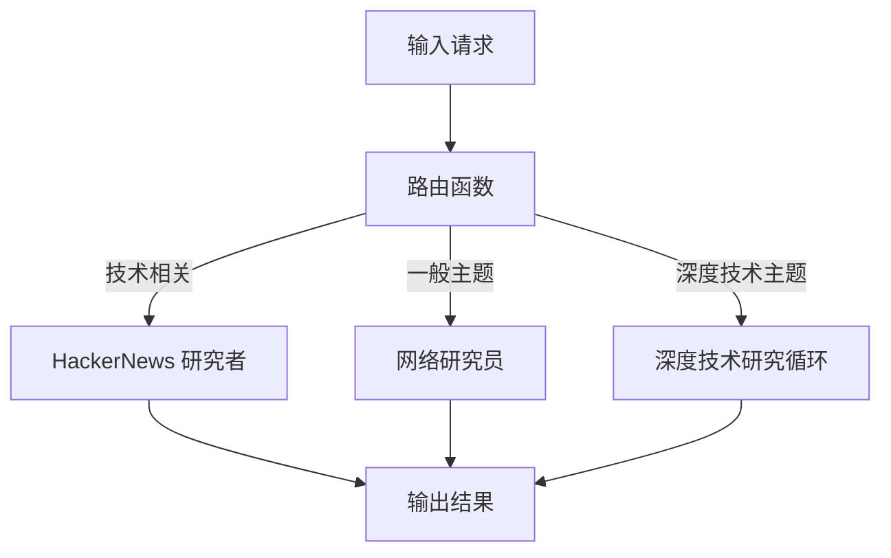
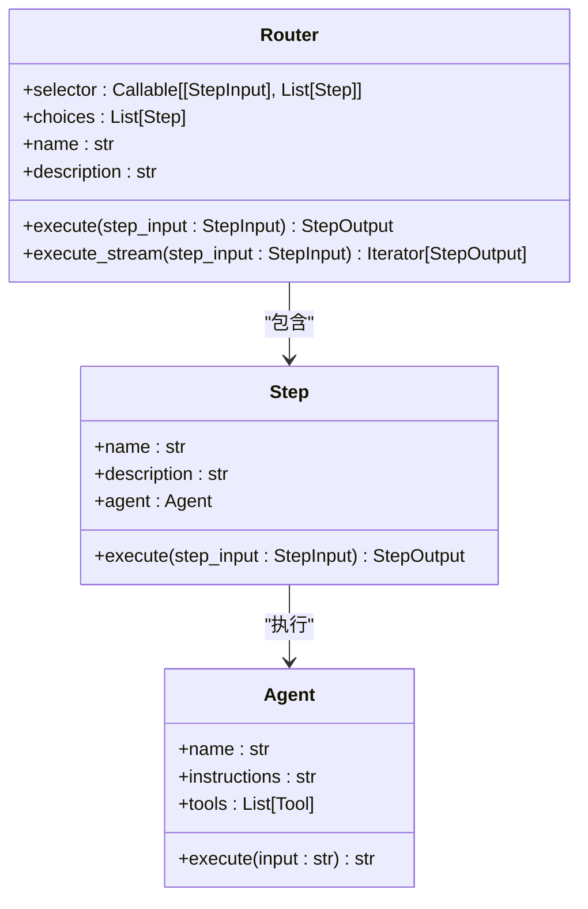
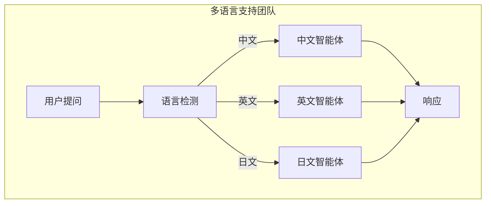

# 路由模式

<cite>
**本文档中引用的文件**  
- [router.py](file://libs/agno/agno/workflow/router.py)
- [workflow_with_router.py](file://cookbook/agent_os/workflow/workflow_with_router.py)
- [router_steps_workflow.py](file://cookbook/workflows/_05_workflows_conditional_branching/sync/router_steps_workflow.py)
- [router_with_loop_steps.py](file://cookbook/workflows/_05_workflows_conditional_branching/sync/router_with_loop_steps.py)
- [multilingual_team.py](file://cookbook/demo/teams/multilingual_team.py)
- [03_async_respond_directly.py](file://cookbook/teams/async/03_async_respond_directly.py)
- [test_router_steps.py](file://libs/agno/tests/integration/workflows/test_router_steps.py)
</cite>

## 目录
1. [简介](#简介)
2. [路由模式概述](#路由模式概述)
3. [核心工作原理](#核心工作原理)
4. [代码实现示例](#代码实现示例)
5. [应用场景](#应用场景)
6. [优势与挑战](#优势与挑战)
7. [结论](#结论)

## 简介
路由模式是一种智能任务分配机制，通过决策逻辑动态地将请求分配给团队中不同的成员智能体。该模式利用路由函数根据输入内容或条件选择最合适的处理者，实现高效的任务分发和资源利用。本文档详细解释了路由模式的工作原理、实现方式、适用场景以及其优缺点。

## 路由模式概述
路由模式是一种基于条件的任务分发机制，它允许系统根据输入的特征或上下文信息，将任务动态分配给最适合处理该任务的成员智能体。这种模式在多语言支持团队、多功能客户服务团队等场景中尤为有用。通过定义明确的路由逻辑，系统能够自动识别最佳处理者，从而提高响应效率和准确性。

**Section sources**
- [workflow_with_router.py](file://cookbook/agent_os/workflow/workflow_with_router.py#L1-L115)
- [multilingual_team.py](file://cookbook/demo/teams/multilingual_team.py#L1-L70)

## 核心工作原理
路由模式的核心在于一个路由函数或决策逻辑，该函数接收输入并决定将任务分配给哪个成员智能体。路由函数通常基于输入内容的关键字、语言或其他特征进行判断。一旦确定了目标成员，系统就会将任务转发给相应的智能体进行处理。这一过程可以是同步的，也可以是异步的，支持流式传输和事件驱动的架构。

**Diagram sources**
- [router.py](file://libs/agno/agno/workflow/router.py#L133-L171)
- [workflow_with_router.py](file://cookbook/agent_os/workflow/workflow_with_router.py#L50-L80)

**Section sources**
- [router.py](file://libs/agno/agno/workflow/router.py#L133-L171)
- [workflow_with_router.py](file://cookbook/agent_os/workflow/workflow_with_router.py#L50-L80)

## 代码实现示例
以下是路由模式的具体代码实现示例。首先，定义了多个专业智能体，如HackerNews研究员、网络研究员和内容发布者。然后，创建了一个路由函数`research_router`，该函数根据输入主题选择合适的研究方法。最后，通过`Router`类将路由逻辑与可用步骤关联起来，形成一个完整的工作流。

**Diagram sources**
- [router.py](file://libs/agno/agno/workflow/router.py#L594-L621)
- [workflow_with_router.py](file://cookbook/agent_os/workflow/workflow_with_router.py#L1-L115)

**Section sources**
- [router.py](file://libs/agno/agno/workflow/router.py#L594-L621)
- [workflow_with_router.py](file://cookbook/agent_os/workflow/workflow_with_router.py#L1-L115)

## 应用场景
路由模式适用于多种复杂的应用场景，例如构建一个多语言支持团队或一个多功能的客户服务团队。在多语言支持团队中，路由函数可以根据用户提问的语言选择相应的语言专家进行回答。在客户服务团队中，可以根据问题的类型（如技术问题、账单问题）将请求分配给不同的客服代表。此外，路由模式还可以用于智能研究工作流，根据研究主题的性质选择最合适的研究方法。

**Diagram sources**
- [multilingual_team.py](file://cookbook/demo/teams/multilingual_team.py#L1-L70)
- [03_async_respond_directly.py](file://cookbook/teams/async/03_async_respond_directly.py#L1-L106)

**Section sources**
- [multilingual_team.py](file://cookbook/demo/teams/multilingual_team.py#L1-L70)
- [03_async_respond_directly.py](file://cookbook/teams/async/03_async_respond_directly.py#L1-L106)

## 优势与挑战
路由模式的主要优势在于其灵活性和可扩展性。通过动态分配任务，系统能够更高效地利用资源，提高响应速度和准确性。此外，路由模式易于扩展，可以轻松添加新的成员智能体和路由规则。然而，路由逻辑的复杂性是一个潜在的挑战。随着成员数量和路由规则的增加，维护和优化路由函数可能会变得困难。此外，错误的路由决策可能导致任务处理失败或延迟。

**Section sources**
- [test_router_steps.py](file://libs/agno/tests/integration/workflows/test_router_steps.py#L1-L387)
- [router_with_loop_steps.py](file://cookbook/workflows/_05_workflows_conditional_branching/sync/router_with_loop_steps.py#L1-L141)

## 结论
路由模式是一种强大的任务分配机制，能够根据输入或条件动态地将任务分配给最合适的成员智能体。通过定义清晰的路由逻辑，系统可以实现高效的任务分发和资源利用。尽管存在路由逻辑复杂性的挑战，但其灵活性和可扩展性使其成为构建智能团队和工作流的理想选择。