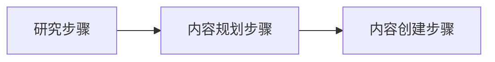
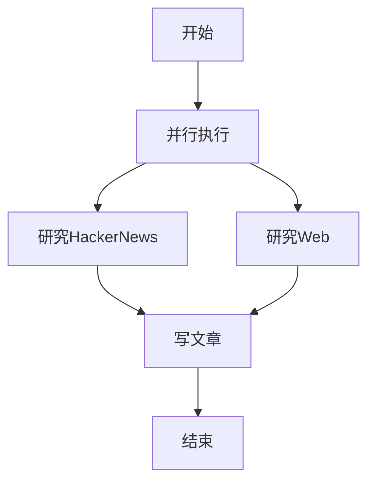
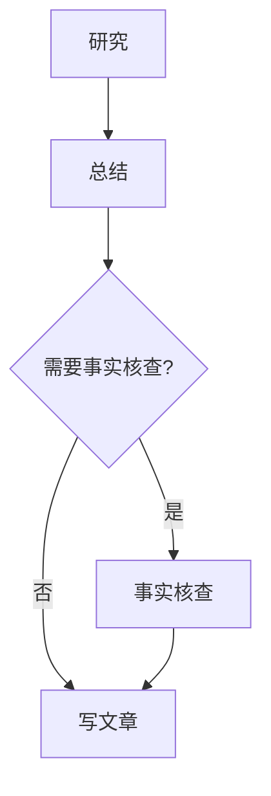
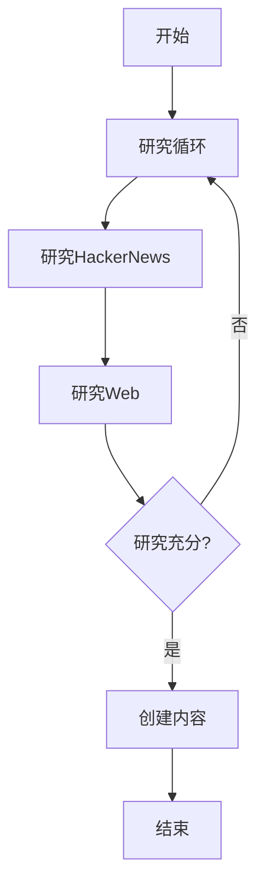
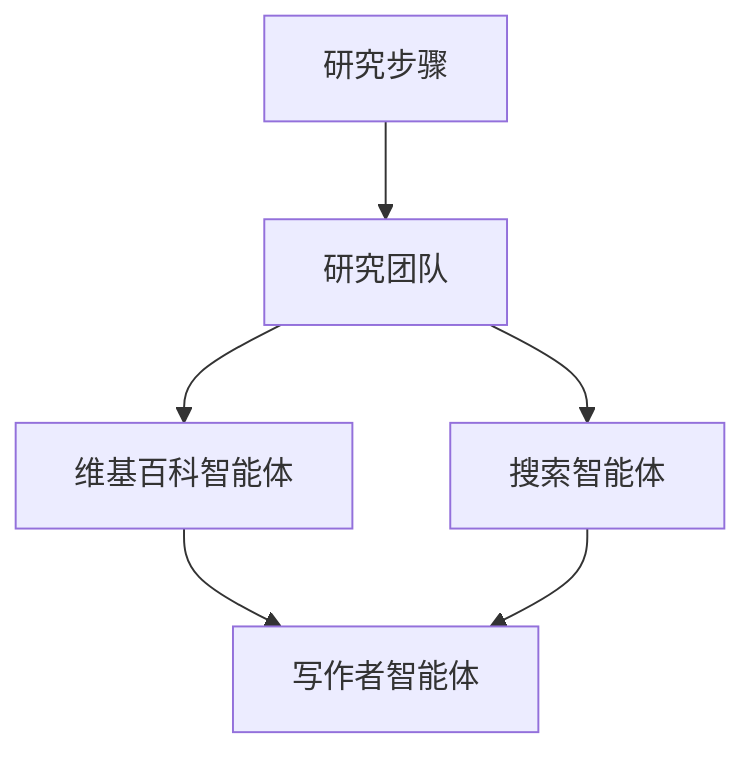
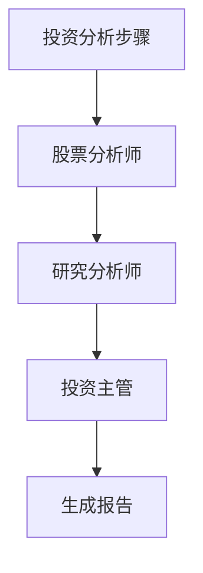

# 工作流

<cite>
**本文档中引用的文件**  
- [basic_workflow.py](file://cookbook/agent_os/workflow/basic_workflow.py)
- [workflow_with_conditional.py](file://cookbook/agent_os/workflow/workflow_with_conditional.py)
- [workflow_with_parallel.py](file://cookbook/agent_os/workflow/workflow_with_parallel.py)
- [workflow_with_loop.py](file://cookbook/agent_os/workflow/workflow_with_loop.py)
- [workflow_with_router.py](file://cookbook/agent_os/workflow/workflow_with_router.py)
- [workflow_with_nested_steps.py](file://cookbook/agent_os/workflow/workflow_with_nested_steps.py)
- [investment_workflow.py](file://cookbook/demo/workflows/investment_workflow.py)
- [research_workflow.py](file://cookbook/demo/workflows/research_workflow.py)
</cite>

## 目录
1. [简介](#简介)
2. [工作流基础](#工作流基础)
3. [执行模式](#执行模式)
4. [流程控制组件](#流程控制组件)
5. [数据传递与状态共享](#数据传递与状态共享)
6. [智能体与团队集成](#智能体与团队集成)
7. [高级工作流模式](#高级工作流模式)
8. [工作流实现示例](#工作流实现示例)

## 简介
工作流是一种通过定义一系列步骤来自动化复杂业务流程的机制。它允许开发者将复杂的任务分解为可管理的单元，并通过不同的执行模式（如顺序、并行、条件和循环）来控制这些步骤的执行。工作流系统支持条件判断、路由选择和循环执行等高级功能，能够根据运行时数据动态调整执行路径。此外，工作流还支持在步骤之间传递数据和共享会话状态，使得各个步骤可以协同工作。通过集成智能体和团队作为执行步骤，工作流能够实现更加智能化和协作化的任务处理。

## 工作流基础
工作流的核心概念是将复杂的业务流程分解为一系列有序的步骤。每个步骤可以由一个智能体或团队执行，完成特定的任务。工作流通过定义这些步骤的执行顺序和依赖关系，实现了对整个业务流程的自动化控制。在系统中，工作流通过`Workflow`类来定义，该类包含名称、描述、数据库配置和步骤列表等属性。步骤通过`Step`类来表示，每个步骤关联一个智能体或团队，负责执行具体任务。工作流可以配置输入模式，以验证和结构化输入数据，确保流程的可靠性和一致性。

**Section sources**
- [basic_workflow.py](file://cookbook/agent_os/workflow/basic_workflow.py#L1-L59)
- [workflow_with_steps.py](file://cookbook/agent_os/workflow/workflow_with_steps.py#L1-L30)

## 执行模式
工作流支持多种执行模式，以适应不同的业务需求。最基本的执行模式是顺序执行，其中步骤按照定义的顺序依次执行。并行执行模式允许同时执行多个步骤，提高处理效率。条件执行模式根据特定条件决定是否执行某些步骤。循环执行模式则在满足特定条件之前重复执行一组步骤。这些执行模式可以通过组合使用，构建出复杂而灵活的工作流。

### 顺序执行
顺序执行是最简单的执行模式，步骤按照在工作流中定义的顺序依次执行。前一个步骤的输出会自动传递给下一个步骤，形成数据流。这种模式适用于线性处理流程，如内容创建工作流中的研究、总结和写作步骤。

**Diagram sources**
- [basic_workflow.py](file://cookbook/agent_os/workflow/basic_workflow.py#L1-L59)

### 并行执行
并行执行模式允许同时执行多个步骤，特别适合可以独立处理的任务。通过`Parallel`组件，可以将多个步骤组合在一起并同时执行。这在需要从多个数据源收集信息的场景中非常有用，如同时从HackerNews和Web进行研究。

**Diagram sources**
- [workflow_with_parallel.py](file://cookbook/agent_os/workflow/workflow_with_parallel.py#L1-L46)

### 条件执行
条件执行模式根据运行时条件决定是否执行某些步骤。通过`Condition`组件，可以定义一个评估函数，该函数根据前序步骤的输出或其他上下文信息返回布尔值，从而决定是否执行关联的步骤。这在需要根据研究内容决定是否进行事实核查的场景中非常有用。

**Diagram sources**
- [workflow_with_conditional.py](file://cookbook/agent_os/workflow/workflow_with_conditional.py#L1-L118)

### 循环执行
循环执行模式在满足特定条件之前重复执行一组步骤。通过`Loop`组件，可以定义一组步骤和一个结束条件函数。循环会持续执行直到结束条件返回`True`或达到最大迭代次数。这在需要持续研究直到获得足够信息的场景中非常有用。

**Diagram sources**
- [workflow_with_loop.py](file://cookbook/agent_os/workflow/workflow_with_loop.py#L1-L104)

## 流程控制组件
工作流系统提供了多种流程控制组件，用于实现复杂的执行逻辑。这些组件包括条件（Condition）、路由器（Router）和循环（Loop），它们可以嵌套使用，构建出高度灵活的工作流。

### 条件（Condition）
条件组件根据评估函数的结果决定是否执行一组步骤。评估函数接收前序步骤的内容作为输入，返回布尔值。如果返回`True`，则执行关联的步骤；否则跳过。条件组件在投资分析工作流中用于决定是否需要进行深入的事实核查。

**Section sources**
- [workflow_with_conditional.py](file://cookbook/agent_os/workflow/workflow_with_conditional.py#L1-L118)

### 路由器（Router）
路由器组件根据选择函数的结果动态选择要执行的步骤或步骤组。选择函数可以基于输入内容、前序步骤的输出或其他上下文信息，返回一个或多个要执行的步骤。路由器在研究工作流中用于根据主题类型选择最适合的研究方法（如HackerNews研究或Web研究）。

**Section sources**
- [workflow_with_router.py](file://cookbook/agent_os/workflow/workflow_with_router.py#L1-L116)

### 循环（Loop）
循环组件重复执行一组步骤，直到满足结束条件或达到最大迭代次数。结束条件函数接收所有循环迭代的输出作为输入，决定是否终止循环。循环组件在需要持续收集信息直到满足质量标准的场景中非常有用，如持续研究直到获得足够详细的内容。

**Section sources**
- [workflow_with_loop.py](file://cookbook/agent_os/workflow/workflow_with_loop.py#L1-L104)

## 数据传递与状态共享
工作流系统支持在步骤之间传递数据和共享会话状态。每个步骤的输出会自动传递给后续步骤，形成数据流。工作流可以配置数据库来持久化会话状态，确保在长时间运行的流程中不会丢失上下文信息。通过输入模式，工作流可以验证和结构化输入数据，确保流程的可靠性和一致性。

### 数据流
工作流中的数据流是自动管理的，前一个步骤的输出会作为输入传递给下一个步骤。对于并行执行，所有并行步骤的输出会合并后传递给后续步骤。在条件和循环中，相关步骤的输出也会被正确传递和管理。

**Section sources**
- [workflow_with_conditional.py](file://cookbook/agent_os/workflow/workflow_with_conditional.py#L1-L118)
- [workflow_with_parallel.py](file://cookbook/agent_os/workflow/workflow_with_parallel.py#L1-L46)

### 状态管理
工作流使用数据库来管理会话状态，支持SQLite、PostgreSQL等多种数据库。会话状态包括工作流的执行历史、步骤输出和共享数据。通过持久化状态，工作流可以在中断后恢复执行，支持长时间运行的复杂流程。

**Section sources**
- [basic_workflow.py](file://cookbook/agent_os/workflow/basic_workflow.py#L1-L59)
- [investment_workflow.py](file://cookbook/demo/workflows/investment_workflow.py#L1-L312)

## 智能体与团队集成
工作流可以集成智能体和团队作为执行步骤。智能体是执行特定任务的AI实体，而团队是由多个智能体组成的协作单元。通过将智能体或团队关联到步骤，工作流可以利用它们的专业能力来完成复杂任务。

### 智能体集成
智能体通过`Agent`类定义，包含名称、模型、工具和指令等属性。在工作流中，智能体被关联到`Step`，负责执行具体任务。例如，在内容创建工作流中，研究智能体负责收集信息，内容规划智能体负责制定内容计划。

**Section sources**
- [basic_workflow.py](file://cookbook/agent_os/workflow/basic_workflow.py#L1-L59)

### 团队集成
团队通过`Team`类定义，包含成员智能体和协作指令。在工作流中，团队可以作为一个整体执行步骤，利用成员之间的协作来完成更复杂的任务。例如，在研究工作流中，研究团队包含维基百科智能体和搜索智能体，共同完成全面的研究任务。

**Diagram sources**
- [research_workflow.py](file://cookbook/demo/workflows/research_workflow.py#L1-L85)

## 高级工作流模式
通过组合基本的执行模式和流程控制组件，可以构建出高级的工作流模式，如包含早期停止、后台执行和复杂决策逻辑的工作流。

### 嵌套控制结构
工作流支持嵌套的控制结构，如在路由器中使用循环，或在循环中使用条件。这使得可以构建出高度复杂的执行逻辑。例如，一个自适应研究工作流可以根据主题复杂性选择简单的Web研究或深入的技术研究循环。

**Section sources**
- [workflow_with_nested_steps.py](file://cookbook/agent_os/workflow/workflow_with_nested_steps.py#L1-L122)

### 早期停止
通过条件组件和循环的结束条件，可以实现早期停止逻辑。当满足特定条件时，工作流可以跳过后续步骤或提前终止循环，提高执行效率。

**Section sources**
- [workflow_with_conditional.py](file://cookbook/agent_os/workflow/workflow_with_conditional.py#L1-L118)
- [workflow_with_loop.py](file://cookbook/agent_os/workflow/workflow_with_loop.py#L1-L104)

## 工作流实现示例
以下是一些实际的工作流实现示例，展示了如何使用上述概念构建复杂的工作流。

### 投资分析工作流
投资分析工作流是一个复杂的三阶段工作流，包括股票分析、投资排名和投资组合分配。该工作流使用自定义执行函数来协调多个智能体的协作，生成详细的投资报告。

**Diagram sources**
- [investment_workflow.py](file://cookbook/demo/workflows/investment_workflow.py#L1-L312)

### 研究工作流
研究工作流结合了团队和步骤的概念，使用研究团队（包含维基百科智能体和搜索智能体）进行信息收集，然后由写作者智能体生成报告。该工作流还使用输入模式来验证研究主题的结构化输入。

**Section sources**
- [research_workflow.py](file://cookbook/demo/workflows/research_workflow.py#L1-L85)