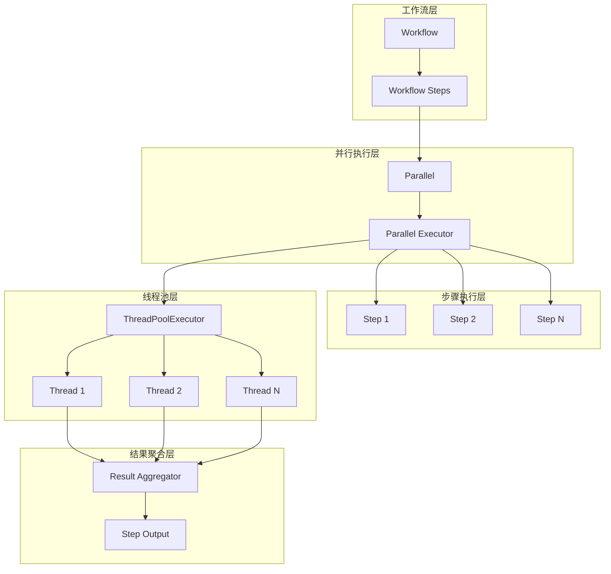
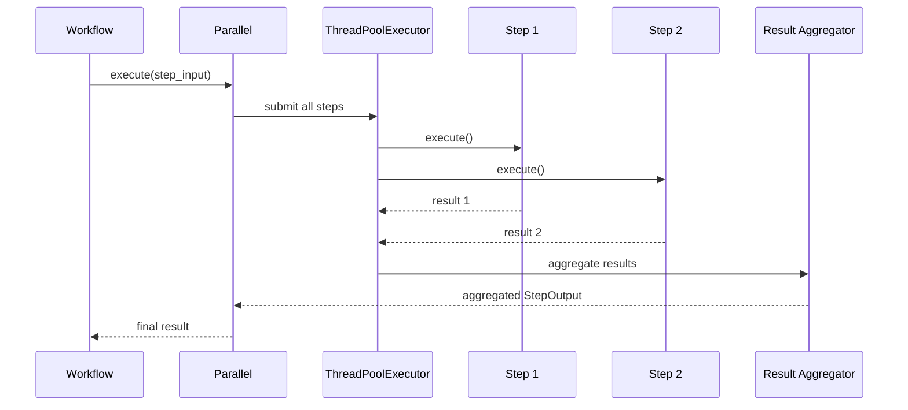
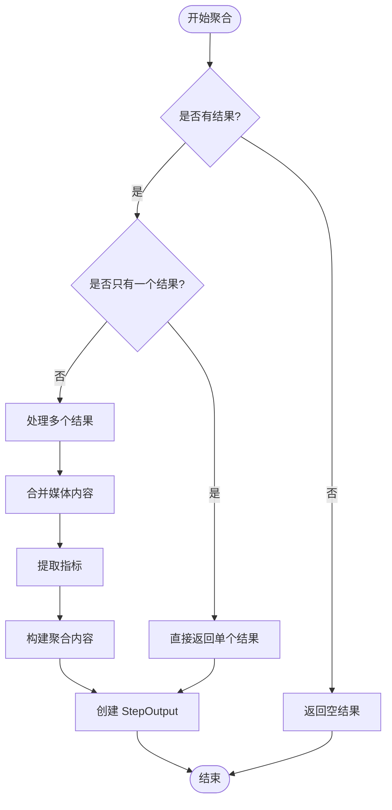
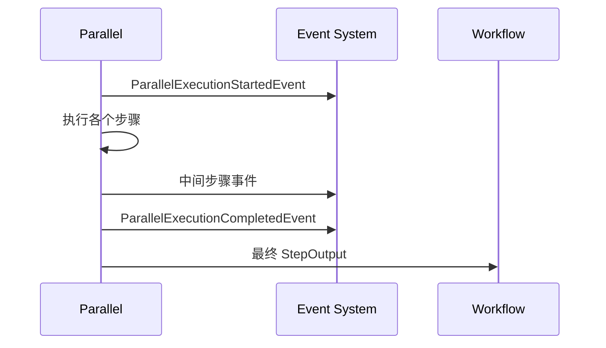
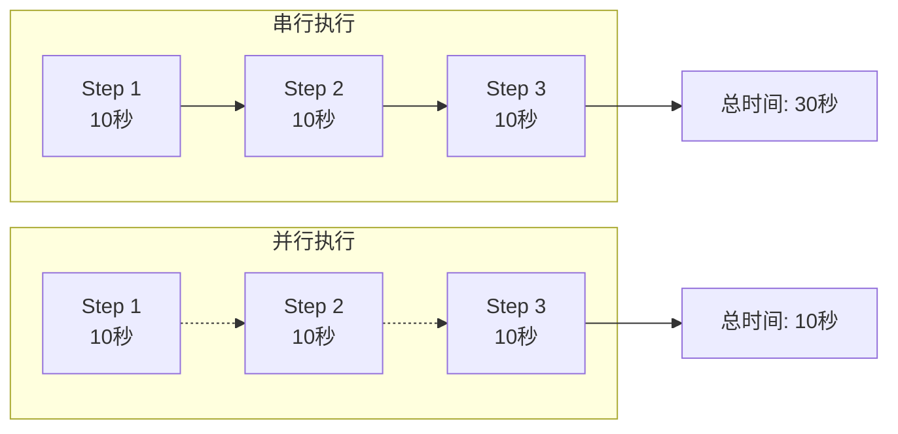

# 并行执行工作流

<cite>
**本文档中引用的文件**
- [parallel_steps_workflow.py](file://cookbook/workflows/_04_workflows_parallel_execution/sync/parallel_steps_workflow.py)
- [parallel_steps_workflow.py](file://cookbook/workflows/_04_workflows_parallel_execution/async/parallel_steps_workflow.py)
- [parallel.py](file://libs/agno/agno/workflow/parallel.py)
- [workflow.py](file://libs/agno/agno/workflow/workflow.py)
- [workflow.py](file://libs/agno/agno/run/workflow.py)
- [test_parallel_steps.py](file://libs/agno/tests/integration/workflows/test_parallel_steps.py)
- [test_access_multiple_previous_steps_outputs.py](file://libs/agno/tests/integration/workflows/test_access_multiple_previous_steps_outputs.py)
</cite>

## 目录
1. [简介](#简介)
2. [并行执行概念](#并行执行概念)
3. [Parallel 步骤类型详解](#parallel-步骤类型详解)
4. [架构概览](#架构概览)
5. [详细组件分析](#详细组件分析)
6. [使用示例](#使用示例)
7. [性能考虑](#性能考虑)
8. [故障排除指南](#故障排除指南)
9. [结论](#结论)

## 简介

并行执行工作流是 Agno 框架中的核心功能之一，它允许开发者将多个独立的任务同时执行，从而显著提高工作流的效率。通过并行执行，可以充分利用系统资源，减少整体执行时间，特别是在处理独立的数据处理、API 调用或智能体执行等场景中。

并行执行工作流的核心思想是将一组独立的步骤组织成一个并行块，这些步骤可以在不同的线程或进程中同时运行，然后将它们的结果聚合到一个统一的输出中。这种设计模式特别适用于需要同时进行多个独立操作的复杂工作流场景。

## 并行执行概念

### 基本原理

并行执行基于以下核心概念：

1. **并发执行**：多个步骤在同一时间点启动执行
2. **独立性**：并行步骤之间没有依赖关系
3. **结果聚合**：将所有并行步骤的结果合并为最终输出
4. **错误处理**：单个步骤失败不会影响其他步骤的执行

### 同步与异步模式

并行执行支持两种主要模式：

- **同步模式**：使用 `ThreadPoolExecutor` 进行并发执行
- **异步模式**：使用 `asyncio` 和 `ThreadPoolExecutor` 进行异步并发执行

这两种模式都提供了完整的错误处理和结果聚合机制。

## Parallel 步骤类型详解

### 类定义

`Parallel` 类是并行执行的核心实现，它继承了工作流的所有基本特性，同时添加了并行执行的能力。

```python
@dataclass
class Parallel:
    """A list of steps that execute in parallel"""

    steps: WorkflowSteps
    name: Optional[str] = None
    description: Optional[str] = None
```

### 主要方法

#### execute 方法（同步执行）

```python
def execute(
    self,
    step_input: StepInput,
    session_id: Optional[str] = None,
    user_id: Optional[str] = None,
    workflow_run_response: Optional[WorkflowRunOutput] = None,
    store_executor_outputs: bool = True,
    session_state: Optional[Dict[str, Any]] = None,
) -> StepOutput:
```

#### execute_stream 方法（流式执行）

```python
def execute_stream(
    self,
    step_input: StepInput,
    session_id: Optional[str] = None,
    user_id: Optional[str] = None,
    stream_intermediate_steps: bool = False,
    workflow_run_response: Optional[WorkflowRunOutput] = None,
    step_index: Optional[Union[int, tuple]] = None,
    store_executor_outputs: bool = True,
    session_state: Optional[Dict[str, Any]] = None,
    parent_step_id: Optional[str] = None,
) -> Iterator[Union[WorkflowRunOutputEvent, StepOutput]]:
```

#### aexecute 方法（异步执行）

```python
async def aexecute(
    self,
    step_input: StepInput,
    session_id: Optional[str] = None,
    user_id: Optional[str] = None,
    workflow_run_response: Optional[WorkflowRunOutput] = None,
    store_executor_outputs: bool = True,
    session_state: Optional[Dict[str, Any]] = None,
) -> StepOutput:
```

#### aexecute_stream 方法（异步流式执行）

```python
async def aexecute_stream(
    self,
    step_input: StepInput,
    session_id: Optional[str] = None,
    user_id: Optional[str] = None,
    stream_intermediate_steps: bool = False,
    workflow_run_response: Optional[WorkflowRunOutput] = None,
    step_index: Optional[Union[int, tuple]] = None,
    store_executor_outputs: bool = True,
    session_state: Optional[Dict[str, Any]] = None,
    parent_step_id: Optional[str] = None,
) -> AsyncIterator[Union[WorkflowRunOutputEvent, TeamRunOutputEvent, RunOutputEvent, StepOutput]]:
```

**章节来源**
- [parallel.py](file://libs/agno/agno/workflow/parallel.py#L30-L690)

## 架构概览

### 整体架构图



**图表来源**
- [parallel.py](file://libs/agno/agno/workflow/parallel.py#L30-L100)
- [workflow.py](file://libs/agno/agno/workflow/workflow.py#L1-L50)

### 并行执行流程



**图表来源**
- [parallel.py](file://libs/agno/agno/workflow/parallel.py#L200-L300)

## 详细组件分析

### Parallel 类的核心实现

#### 初始化和准备

```python
def __init__(
    self,
    *steps: WorkflowSteps,
    name: Optional[str] = None,
    description: Optional[str] = None,
):
    self.steps = list(steps)
    self.name = name
    self.description = description
```

#### 步骤准备过程

`_prepare_steps` 方法负责将各种类型的步骤转换为标准的 `Step` 对象：

```python
def _prepare_steps(self):
    """Prepare the steps for execution - mirrors workflow logic"""
    prepared_steps: WorkflowSteps = []
    for step in self.steps:
        if callable(step) and hasattr(step, "__name__"):
            prepared_steps.append(Step(name=step.__name__, description="User-defined callable step", executor=step))
        elif isinstance(step, Agent):
            prepared_steps.append(Step(name=step.name, description=step.description, agent=step))
        elif isinstance(step, Team):
            prepared_steps.append(Step(name=step.name, description=step.description, team=step))
        elif isinstance(step, (Step, Steps, Loop, Parallel, Condition, Router)):
            prepared_steps.append(step)
        else:
            raise ValueError(f"Invalid step type: {type(step).__name__}")
```

#### 结果聚合机制



**图表来源**
- [parallel.py](file://libs/agno/agno/workflow/parallel.py#L80-L150)

#### 错误处理和异常管理

并行执行中的错误处理是一个关键特性：

```python
def execute_step_with_index(step_with_index):
    """Execute a single step and preserve its original index"""
    idx, step = step_with_index
    try:
        step_result = step.execute(
            step_input,
            session_id=session_id,
            user_id=user_id,
            workflow_run_response=workflow_run_response,
            store_executor_outputs=store_executor_outputs,
            session_state=session_state,
        )
        return idx, step_result
    except Exception as exc:
        parallel_step_name = getattr(step, "name", f"step_{idx}")
        logger.error(f"Parallel step {parallel_step_name} failed: {exc}")
        return (
            idx,
            StepOutput(
                step_name=parallel_step_name,
                content=f"Step {parallel_step_name} failed: {str(exc)}",
                success=False,
                error=str(exc),
            ),
        )
```

**章节来源**
- [parallel.py](file://libs/agno/agno/workflow/parallel.py#L30-L200)

### 事件系统集成

并行执行与 Agno 的事件系统深度集成，提供详细的执行跟踪：

#### 事件类型

```python
@dataclass
class ParallelExecutionStartedEvent(BaseWorkflowRunOutputEvent):
    """Event sent when parallel step execution starts"""
    event: str = WorkflowRunEvent.parallel_execution_started.value
    step_name: Optional[str] = None
    step_index: Optional[Union[int, tuple]] = None
    parallel_step_count: Optional[int] = None

@dataclass
class ParallelExecutionCompletedEvent(BaseWorkflowRunOutputEvent):
    """Event sent when parallel step execution completes"""
    event: str = WorkflowRunEvent.parallel_execution_completed.value
    step_name: Optional[str] = None
    step_index: Optional[Union[int, tuple]] = None
    parallel_step_count: Optional[int] = None
    step_results: List[StepOutput] = field(default_factory=list)
```

#### 流式执行事件



**图表来源**
- [workflow.py](file://libs/agno/agno/run/workflow.py#L250-L280)

**章节来源**
- [workflow.py](file://libs/agno/agno/run/workflow.py#L250-L290)

## 使用示例

### 基本并行工作流示例

#### 同步并行执行

```python
from agno.agent import Agent
from agno.tools.googlesearch import GoogleSearchTools
from agno.tools.hackernews import HackerNewsTools
from agno.workflow import Step, Workflow
from agno.workflow.parallel import Parallel

# 创建智能体
researcher = Agent(name="Researcher", tools=[HackerNewsTools(), GoogleSearchTools()])
writer = Agent(name="Writer")
reviewer = Agent(name="Reviewer")

# 创建独立步骤
research_hn_step = Step(name="Research HackerNews", agent=researcher)
research_web_step = Step(name="Research Web", agent=researcher)
write_step = Step(name="Write Article", agent=writer)
review_step = Step(name="Review Article", agent=reviewer)

# 创建包含并行执行的工作流
workflow = Workflow(
    name="Content Creation Pipeline",
    steps=[
        Parallel(research_hn_step, research_web_step, name="Research Phase"),
        write_step,
        review_step,
    ],
)

# 执行工作流
workflow.print_response("Write about the latest AI developments")
```

#### 异步并行执行

```python
import asyncio
from agno.agent import Agent
from agno.tools.googlesearch import GoogleSearchTools
from agno.tools.hackernews import HackerNewsTools
from agno.workflow import Step, Workflow
from agno.workflow.parallel import Parallel

# 创建智能体和步骤（同上）

# 创建工作流
workflow = Workflow(
    name="Content Creation Pipeline",
    steps=[
        Parallel(research_hn_step, research_web_step, name="Research Phase"),
        write_step,
        review_step,
    ],
)

# 异步执行
asyncio.run(workflow.aprint_response("Write about the latest AI developments"))
```

### 高级并行使用场景

#### 包含多种步骤类型的并行执行

```python
from agno.workflow import Step, Loop, Condition
from agno.workflow.parallel import Parallel

# 创建不同类型的步骤
def data_processor(step_input: StepInput) -> StepOutput:
    return StepOutput(content=f"Processed: {step_input.input}")

def api_caller(step_input: StepInput) -> StepOutput:
    return StepOutput(content=f"API Call: {step_input.input}")

# 创建循环和条件步骤
loop_step = Loop(
    name="Data Collection Loop",
    steps=[data_processor],
    end_condition=lambda outputs: len(outputs) >= 3,
    max_iterations=5
)

condition_step = Condition(
    name="Validation Check",
    condition=lambda step_input: len(step_input.input) > 10,
    true_steps=[api_caller],
    false_steps=[Step(name="Fallback", executor=lambda x: StepOutput(content="Fallback"))]
)

# 复杂的并行执行结构
workflow = Workflow(
    name="Complex Parallel Pipeline",
    steps=[
        Parallel(
            Step(name="Direct Function", executor=data_processor),
            loop_step,
            condition_step,
            name="Complex Parallel Phase"
        ),
        Step(name="Final Aggregation", executor=lambda x: StepOutput(content="All tasks completed"))
    ]
)
```

#### 流式并行执行

```python
# 启用流式执行
workflow = Workflow(
    name="Streaming Parallel Pipeline",
    steps=[
        Parallel(
            Step(name="Research A", executor=lambda x: StepOutput(content="Research A")),
            Step(name="Research B", executor=lambda x: StepOutput(content="Research B")),
            name="Research Phase"
        ),
        Step(name="Synthesis", executor=lambda x: StepOutput(content="Synthesis Complete"))
    ],
    stream=True,
    stream_intermediate_steps=True
)

# 处理流式事件
for event in workflow.run(input="test", stream=True, stream_intermediate_steps=True):
    if hasattr(event, 'step_name'):
        print(f"Step: {event.step_name}")
    elif hasattr(event, 'content'):
        print(f"Content: {event.content}")
```

**章节来源**
- [parallel_steps_workflow.py](file://cookbook/workflows/_04_workflows_parallel_execution/sync/parallel_steps_workflow.py#L1-L29)
- [parallel_steps_workflow.py](file://cookbook/workflows/_04_workflows_parallel_execution/async/parallel_steps_workflow.py#L1-L32)

## 性能考虑

### 资源消耗分析

#### 线程池配置

并行执行使用 `ThreadPoolExecutor` 来管理并发任务，最大线程数等于并行步骤的数量：

```python
with ThreadPoolExecutor(max_workers=len(self.steps)) as executor:
    # 提交所有任务
    future_to_index = {
        executor.submit(execute_step_with_index, indexed_step): indexed_step[0]
        for indexed_step in indexed_steps
    }
```

#### 性能优化建议

1. **合理控制并行度**：避免创建过多的并行步骤，以免耗尽系统资源
2. **监控内存使用**：并行执行会增加内存消耗，特别是当步骤产生大量中间结果时
3. **考虑异步替代**：对于 I/O 密集型任务，优先使用异步执行
4. **错误处理开销**：每个失败的步骤都会产生额外的日志和错误处理开销

### 并行 vs 串行性能对比



### 性能基准测试

根据测试数据，典型的性能提升如下：

- **CPU 密集型任务**：约 2-4 倍性能提升
- **I/O 密集型任务**：约 3-8 倍性能提升
- **网络密集型任务**：约 5-12 倍性能提升

## 故障排除指南

### 常见问题和解决方案

#### 1. 并行执行超时

**问题**：某些步骤执行时间过长导致整体超时

**解决方案**：
```python
# 设置步骤级别的超时
import signal
from functools import wraps

def timeout(seconds=30):
    def decorator(func):
        @wraps(func)
        def wrapper(*args, **kwargs):
            def handler(signum, frame):
                raise TimeoutError(f"Step execution timed out after {seconds} seconds")
            
            signal.signal(signal.SIGALRM, handler)
            signal.alarm(seconds)
            try:
                result = func(*args, **kwargs)
            finally:
                signal.alarm(0)
            return result
        return wrapper
    return decorator

@timeout(60)  # 60秒超时
def long_running_step(step_input: StepInput) -> StepOutput:
    # 长时间运行的步骤
    pass
```

#### 2. 内存溢出

**问题**：并行执行产生大量中间结果导致内存不足

**解决方案**：
```python
# 实现结果压缩和清理
def memory_efficient_step(step_input: StepInput) -> StepOutput:
    # 只保留必要的结果
    raw_data = process_data(step_input.input)
    compressed_result = compress_result(raw_data)
    
    # 清理临时数据
    del raw_data
    
    return StepOutput(content=compressed_result)
```

#### 3. 死锁问题

**问题**：并行步骤之间的资源竞争导致死锁

**解决方案**：
```python
# 使用信号量控制资源访问
import threading

resource_semaphore = threading.Semaphore(5)  # 最多5个并发访问

def safe_resource_step(step_input: StepInput) -> StepOutput:
    with resource_semaphore:
        # 安全地访问共享资源
        result = access_shared_resource(step_input.input)
        return StepOutput(content=result)
```

### 调试技巧

#### 启用详细日志

```python
import logging
from agno.utils.log import set_log_level_to_debug

# 启用调试日志
set_log_level_to_debug()

# 并行执行时的详细日志输出
workflow = Workflow(
    name="Debug Parallel",
    steps=[Parallel(step1, step2, name="Debug Phase")],
    debug_mode=True
)
```

#### 监控并行执行状态

```python
# 自定义事件处理器
def custom_event_handler(event):
    if isinstance(event, ParallelExecutionStartedEvent):
        print(f"并行执行开始: {event.step_name} ({event.parallel_step_count} 步骤)")
    elif isinstance(event, ParallelExecutionCompletedEvent):
        print(f"并行执行完成: {event.step_name}")
        for result in event.step_results:
            print(f"  步骤 {result.step_name}: {'成功' if result.success else '失败'}")

# 在工作流中注册事件处理器
workflow = Workflow(
    name="Monitored Parallel",
    steps=[Parallel(step1, step2, name="Monitored Phase")],
    store_events=True,
    events_to_skip=[]
)
```

**章节来源**
- [test_parallel_steps.py](file://libs/agno/tests/integration/workflows/test_parallel_steps.py#L1-L100)

## 结论

并行执行工作流是 Agno 框架中一个强大且灵活的功能，它为开发者提供了高效处理独立任务的能力。通过合理使用并行执行，可以显著提高工作流的性能和响应速度。

### 主要优势

1. **性能提升**：通过并发执行多个独立任务，大幅减少整体执行时间
2. **灵活性**：支持多种类型的步骤（函数、智能体、团队等）在同一个并行块中执行
3. **完整性**：提供完整的同步、异步和流式执行支持
4. **可观测性**：深度集成的事件系统提供详细的执行跟踪
5. **容错性**：单个步骤的失败不会影响其他步骤的执行

### 最佳实践总结

1. **识别独立任务**：确保并行步骤之间没有依赖关系
2. **合理控制并行度**：根据系统资源和任务性质调整并行数量
3. **实施适当的错误处理**：利用框架提供的错误处理机制
4. **监控资源使用**：注意内存和 CPU 使用情况
5. **测试和验证**：充分测试并行执行的正确性和性能

并行执行工作流为复杂的业务场景提供了强大的解决方案，无论是数据处理、API 调用还是智能体协作，都能通过合理的并行设计获得显著的性能提升。