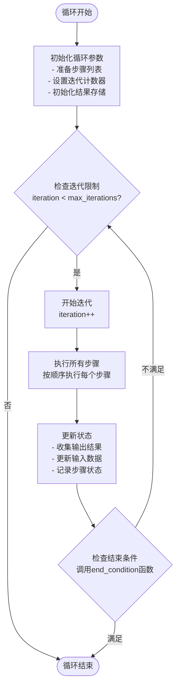
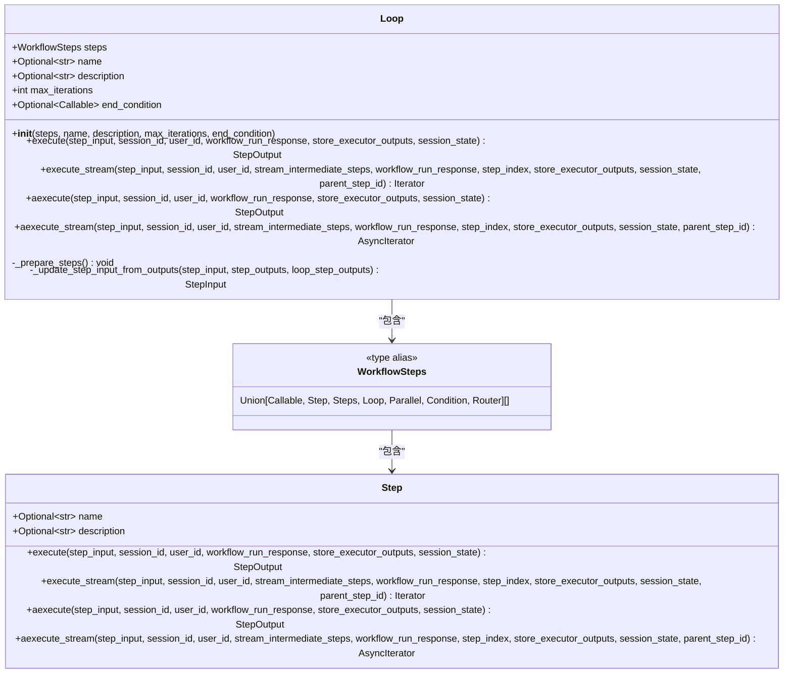
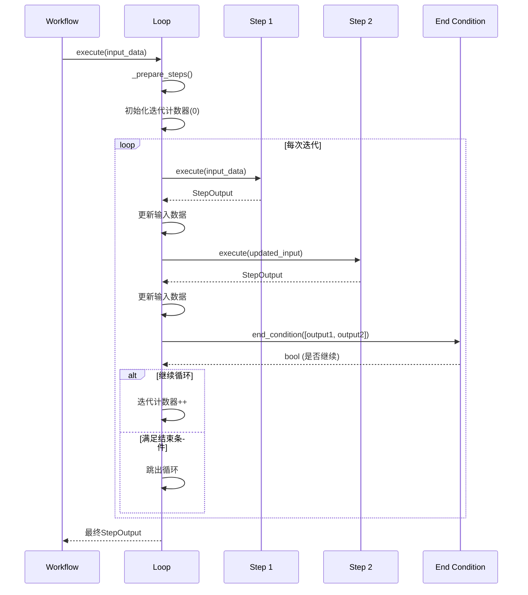
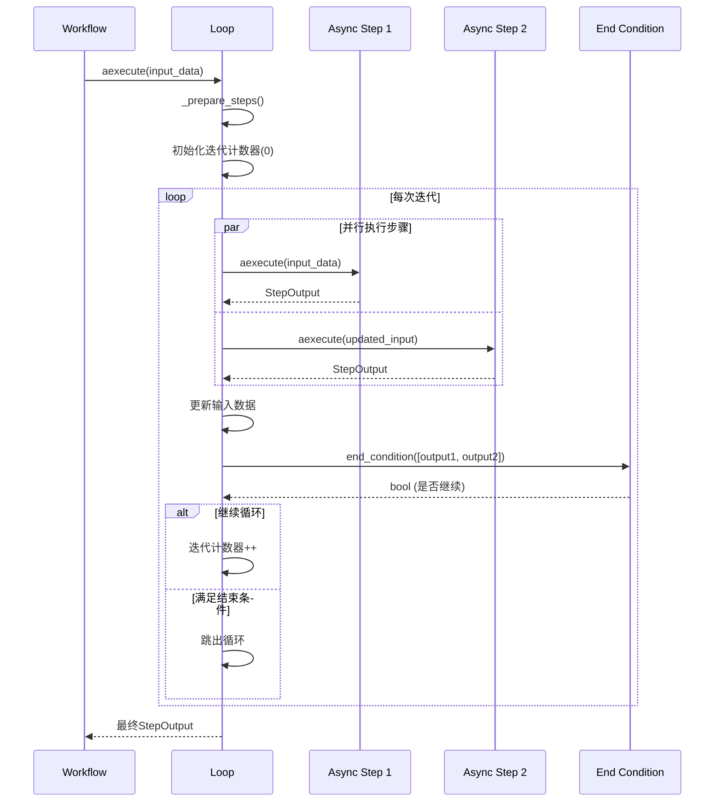
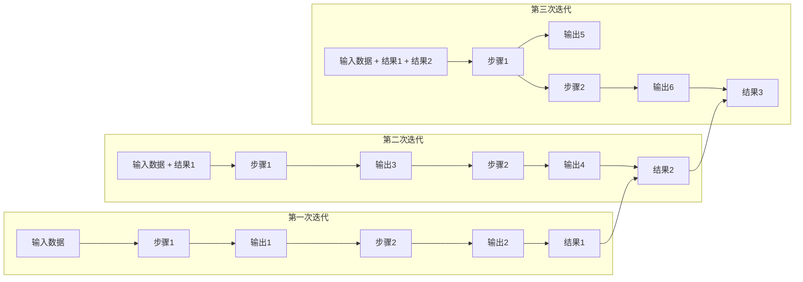
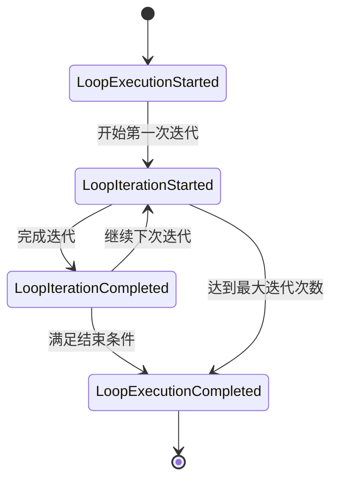

# 循环执行工作流

<cite>
**本文档引用的文件**
- [workflow_with_loop.py](file://cookbook/agent_os/workflow/workflow_with_loop.py)
- [loop.py](file://libs/agno/agno/workflow/loop.py)
- [types.py](file://libs/agno/agno/workflow/types.py)
- [workflow.py](file://libs/agno/agno/workflow/workflow.py)
- [test_mixed_steps.py](file://libs/agno/tests/integration/workflows/test_mixed_steps.py)
- [README.md](file://cookbook/workflows/README.md)
</cite>

## 目录
1. [简介](#简介)
2. [循环工作流核心概念](#循环工作流核心概念)
3. [循环类型定义](#循环类型定义)
4. [循环执行架构](#循环执行架构)
5. [详细组件分析](#详细组件分析)
6. [配置与使用示例](#配置与使用示例)
7. [状态管理与数据累积](#状态管理与数据累积)
8. [事件系统与监控](#事件系统与监控)
9. [性能考虑](#性能考虑)
10. [故障排除指南](#故障排除指南)
11. [最佳实践](#最佳实践)
12. [总结](#总结)

## 简介

循环执行工作流是Agno框架中的一个强大功能，允许开发者创建能够重复执行特定步骤直到满足终止条件的工作流程。这种机制特别适用于需要多次尝试、迭代优化或批量处理的场景，如数据重试、研究任务、内容生成等。

循环工作流的核心优势在于：
- **自动重复执行**：无需手动控制循环逻辑
- **灵活的终止条件**：支持基于结果的智能终止
- **状态保持**：在每次迭代中保持和传递状态信息
- **异步支持**：提供同步和异步执行选项
- **事件驱动**：完整的执行过程监控和事件通知

## 循环工作流核心概念

### 基本组成要素

循环工作流由以下几个核心要素构成：

1. **循环实例（Loop）**：负责管理整个循环执行过程
2. **步骤集合（Steps）**：在每次迭代中执行的一组步骤
3. **最大迭代次数（Max Iterations）**：防止无限循环的安全限制
4. **结束条件函数（End Condition）**：决定何时停止循环的逻辑函数

### 执行流程



**图表来源**
- [loop.py](file://libs/agno/agno/workflow/loop.py#L126-L159)

## 循环类型定义

### StepType枚举

在Agno框架中，循环被定义为一种特殊的步骤类型：

```python
class StepType(str, Enum):
    FUNCTION = "Function"
    STEP = "Step"
    STEPS = "Steps"
    LOOP = "Loop"  # 循环类型
    PARALLEL = "Parallel"
    CONDITION = "Condition"
    ROUTER = "Router"
```

### 循环类结构



**图表来源**
- [loop.py](file://libs/agno/agno/workflow/loop.py#L35-L50)
- [types.py](file://libs/agno/agno/workflow/types.py#L475-L482)

**章节来源**
- [types.py](file://libs/agno/agno/workflow/types.py#L475-L482)
- [loop.py](file://libs/agno/agno/workflow/loop.py#L35-L50)

## 循环执行架构

### 同步执行流程



**图表来源**
- [loop.py](file://libs/agno/agno/workflow/loop.py#L126-L159)

### 异步执行流程



**图表来源**
- [loop.py](file://libs/agno/agno/workflow/loop.py#L404-L439)

**章节来源**
- [loop.py](file://libs/agno/agno/workflow/loop.py#L126-L159)
- [loop.py](file://libs/agno/agno/workflow/loop.py#L404-L439)

## 详细组件分析

### 循环初始化与准备

循环对象的初始化过程包括验证和准备所有包含的步骤：

```python
def _prepare_steps(self):
    """Prepare the steps for execution - mirrors workflow logic"""
    from agno.agent.agent import Agent
    from agno.team.team import Team
    from agno.workflow.condition import Condition
    from agno.workflow.parallel import Parallel
    from agno.workflow.router import Router
    from agno.workflow.step import Step
    from agno.workflow.steps import Steps

    prepared_steps: WorkflowSteps = []
    for step in self.steps:
        if callable(step) and hasattr(step, "__name__"):
            prepared_steps.append(Step(name=step.__name__, description="User-defined callable step", executor=step))
        elif isinstance(step, Agent):
            prepared_steps.append(Step(name=step.name, description=step.description, agent=step))
        elif isinstance(step, Team):
            prepared_steps.append(Step(name=step.name, description=step.description, team=step))
        elif isinstance(step, (Step, Steps, Loop, Parallel, Condition, Router)):
            prepared_steps.append(step)
        else:
            raise ValueError(f"Invalid step type: {type(step).__name__}")

    self.steps = prepared_steps
```

### 输入数据更新机制

循环中的关键特性是能够从前面步骤的输出中更新输入数据：

```python
def _update_step_input_from_outputs(
    self,
    step_input: StepInput,
    step_outputs: Union[StepOutput, List[StepOutput]],
    loop_step_outputs: Optional[Dict[str, StepOutput]] = None,
) -> StepInput:
    """Helper to update step input from step outputs (handles both single and multiple outputs)"""
    current_images = step_input.images or []
    current_videos = step_input.videos or []
    current_audio = step_input.audio or []

    if isinstance(step_outputs, list):
        all_images = sum([out.images or [] for out in step_outputs], [])
        all_videos = sum([out.videos or [] for out in step_outputs], [])
        all_audio = sum([out.audio or [] for out in step_outputs], [])

        # Use the last output's content for chaining
        previous_step_content = step_outputs[-1].content if step_outputs else None
    else:
        # Single output
        all_images = step_outputs.images or []
        all_videos = step_outputs.videos or []
        all_audio = step_outputs.audio or []
        previous_step_content = step_outputs.content

    updated_previous_step_outputs = {}
    if step_input.previous_step_outputs:
        updated_previous_step_outputs.update(step_input.previous_step_outputs)
    if loop_step_outputs:
        updated_previous_step_outputs.update(loop_step_outputs)

    return StepInput(
        input=step_input.input,
        previous_step_content=previous_step_content,
        previous_step_outputs=updated_previous_step_outputs,
        additional_data=step_input.additional_data,
        images=current_images + all_images,
        videos=current_videos + all_videos,
        audio=current_audio + all_audio,
    )
```

### 结束条件评估

结束条件是一个可选的回调函数，用于决定是否应该提前终止循环：

```python
# 示例结束条件函数
def research_evaluator(outputs: List[StepOutput]) -> bool:
    """
    Evaluate if research results are sufficient
    Returns True to break the loop, False to continue
    """
    # Check if we have good research results
    if not outputs:
        return False

    # Simple check - if any output contains substantial content, we're good
    for output in outputs:
        if output.content and len(output.content) > 200:
            print(
                f"✅ Research evaluation passed - found substantial content ({len(output.content)} chars)"
            )
            return True

    print("❌ Research evaluation failed - need more substantial research")
    return False
```

**章节来源**
- [loop.py](file://libs/agno/agno/workflow/loop.py#L52-L85)
- [loop.py](file://libs/agno/agno/workflow/loop.py#L87-L125)
- [workflow_with_loop.py](file://cookbook/agent_os/workflow/workflow_with_loop.py#L50-L65)

## 配置与使用示例

### 基础循环配置

以下是一个完整的循环工作流配置示例：

```python
from agno.workflow.loop import Loop
from agno.workflow.step import Step
from agno.workflow.workflow import Workflow
from agno.db.sqlite import SqliteDb

# 定义结束条件函数
def research_evaluator(outputs: List[StepOutput]) -> bool:
    if not outputs:
        return False
    
    for output in outputs:
        if output.content and len(output.content) > 200:
            return True
    return False

# 创建循环步骤
research_loop = Loop(
    name="Research Loop",
    steps=[research_hackernews_step, research_web_step],
    end_condition=research_evaluator,
    max_iterations=3,  # 最大3次迭代
)

# 创建完整工作流
workflow = Workflow(
    name="research-and-content-workflow",
    description="Research topics in a loop until conditions are met, then create content",
    steps=[
        research_loop,
        content_step,
    ],
    db=SqliteDb(
        session_table="workflow_session",
        db_file="tmp/workflow.db",
    ),
)
```

### 复杂嵌套循环示例

```python
# 嵌套循环示例
nested_workflow = Workflow(
    name="nested-research-workflow",
    steps=[
        Condition(
            name="outer_condition",
            evaluator=needs_more_research,
            steps=[
                Loop(
                    name="research_loop",
                    steps=[
                        research_step,
                        Condition(name="inner_condition", evaluator=has_data, steps=[analysis_step]),
                    ],
                    end_condition=lambda outputs: len(outputs) >= 2,
                    max_iterations=3,
                )
            ],
        )
    ],
)
```

### 异步循环执行

```python
# 异步执行循环
async def run_async_loop():
    loop_result = await loop.aexecute(
        step_input=input_data,
        session_id=session_id,
        user_id=user_id,
        workflow_run_response=response,
        store_executor_outputs=True,
        session_state=session_state,
    )
    return loop_result
```

**章节来源**
- [workflow_with_loop.py](file://cookbook/agent_os/workflow/workflow_with_loop.py#L67-L103)
- [test_mixed_steps.py](file://libs/agno/tests/integration/workflows/test_mixed_steps.py#L172-L201)

## 状态管理与数据累积

### 状态传递机制

循环工作流中的状态管理是一个复杂但重要的方面。每次迭代都会累积前一次的结果，并将其作为下一次迭代的输入：



### 数据累积策略

循环工作流采用多种策略来累积和管理数据：

1. **内容累积**：将每次迭代的输出内容合并
2. **媒体文件累积**：收集所有图像、视频、音频文件
3. **元数据累积**：记录每个步骤的执行指标和错误信息
4. **状态映射**：维护每个步骤的最新输出映射

```python
# 数据累积示例
def accumulate_iteration_results(all_results, iteration_results):
    """累积每次迭代的结果"""
    flattened_results = []
    for iteration_results in all_results:
        flattened_results.extend(iteration_results)
    
    return StepOutput(
        step_name=self.name,
        step_id=str(uuid4()),
        step_type=StepType.LOOP,
        content=f"Loop {self.name} completed {iteration} iterations with {len(flattened_results)} total steps",
        success=all(result.success for result in flattened_results) if flattened_results else True,
        steps=flattened_results,
    )
```

**章节来源**
- [loop.py](file://libs/agno/agno/workflow/loop.py#L200-L210)

## 事件系统与监控

### 循环执行事件

Agno框架提供了完整的事件系统来监控循环执行过程：



### 事件类型定义

```python
# 循环执行事件
@dataclass
class LoopExecutionStartedEvent(BaseWorkflowRunOutputEvent):
    """Event sent when loop execution starts"""
    event: str = WorkflowRunEvent.loop_execution_started.value
    step_name: Optional[str] = None
    step_index: Optional[Union[int, tuple]] = None
    max_iterations: Optional[int] = None

@dataclass
class LoopIterationStartedEvent(BaseWorkflowRunOutputEvent):
    """Event sent when loop iteration starts"""
    event: str = WorkflowRunEvent.loop_iteration_started.value
    step_name: Optional[str] = None
    step_index: Optional[Union[int, tuple]] = None
    iteration: int = 0
    max_iterations: Optional[int] = None

@dataclass
class LoopIterationCompletedEvent(BaseWorkflowRunOutputEvent):
    """Event sent when loop iteration completes"""
    event: str = WorkflowRunEvent.loop_iteration_completed.value
    step_name: Optional[str] = None
    step_index: Optional[Union[int, tuple]] = None
    iteration: int = 0
    max_iterations: Optional[int] = None
    iteration_results: List[StepOutput] = field(default_factory=list)
    should_continue: bool = True

@dataclass
class LoopExecutionCompletedEvent(BaseWorkflowRunOutputEvent):
    """Event sent when loop execution completes"""
    event: str = WorkflowRunEvent.loop_execution_completed.value
```

### 实时监控示例

```python
# 实现事件监听器
class LoopEventListener:
    def __init__(self):
        self.iteration_count = 0
    
    async def listen(self, events):
        async for event in events:
            if isinstance(event, LoopExecutionStartedEvent):
                print(f"循环开始: {event.step_name}")
            
            elif isinstance(event, LoopIterationStartedEvent):
                self.iteration_count += 1
                print(f"迭代 {self.iteration_count} 开始")
            
            elif isinstance(event, LoopIterationCompletedEvent):
                print(f"迭代 {event.iteration} 完成")
                if not event.should_continue:
                    print("满足结束条件，停止循环")
            
            elif isinstance(event, LoopExecutionCompletedEvent):
                print(f"循环完成，共执行 {event.total_iterations} 次迭代")
```

**章节来源**
- [workflow.py](file://libs/agno/agno/run/workflow.py#L210-L246)

## 性能考虑

### 内存管理

循环工作流可能会随着迭代次数增加而消耗更多内存，特别是在每次迭代都产生大量输出的情况下。建议：

1. **定期清理临时数据**：在不需要时释放中间结果
2. **限制最大迭代次数**：设置合理的上限防止过度消耗资源
3. **使用流式处理**：对于大数据量场景，考虑使用流式执行

### 并发执行

虽然当前实现主要是串行执行，但在未来版本中可以考虑支持并行步骤执行：

```python
# 伪代码：并行步骤执行
async def execute_parallel_steps(self, steps, current_step_input):
    """并行执行多个步骤"""
    tasks = []
    for step in steps:
        task = step.aexecute(current_step_input)
        tasks.append(task)
    
    results = await asyncio.gather(*tasks)
    return results
```

### 优化建议

1. **缓存频繁访问的数据**：避免重复计算相同的值
2. **使用生成器模式**：对于大量数据处理，使用生成器减少内存占用
3. **实施超时机制**：为长时间运行的步骤设置超时限制

## 故障排除指南

### 常见问题与解决方案

#### 1. 无限循环问题

**症状**：循环没有按照预期终止，持续执行

**原因**：
- 结束条件函数返回始终为False
- 结束条件函数抛出异常
- 步骤输出不足以触发结束条件

**解决方案**：
```python
# 添加调试日志
def safe_end_condition(outputs: List[StepOutput]) -> bool:
    try:
        # 检查输出是否为空
        if not outputs:
            logger.debug("End condition: No outputs received")
            return False
        
        # 检查输出质量
        for i, output in enumerate(outputs):
            logger.debug(f"End condition: Output {i} length: {len(output.content or '')}")
        
        # 实施安全检查
        return len(outputs) > 0 and any(len(o.content or '') > 100 for o in outputs)
    except Exception as e:
        logger.error(f"End condition evaluation failed: {e}")
        return True  # 安全起见，遇到错误时终止循环
```

#### 2. 内存泄漏

**症状**：长时间运行后内存使用持续增长

**原因**：
- 结果数据未正确清理
- 循环次数过多
- 大型媒体文件未及时释放

**解决方案**：
```python
# 实施结果清理
def cleanup_iteration_results(results):
    """清理迭代结果中的大型对象"""
    cleaned_results = []
    for result in results:
        # 清理大型媒体文件
        if result.images and len(result.images) > 5:
            result.images = result.images[:5]  # 只保留前5个
        
        # 清理大型音频文件
        if result.audio and len(result.audio) > 3:
            result.audio = result.audio[:3]
        
        cleaned_results.append(result)
    return cleaned_results
```

#### 3. 异步执行问题

**症状**：异步循环执行出现死锁或异常

**原因**：
- 步骤中的异步操作未正确处理
- 事件循环管理不当
- 资源竞争

**解决方案**：
```python
# 使用上下文管理器确保资源正确释放
async def robust_async_loop(loop_instance, input_data):
    try:
        async with asyncio.timeout(300):  # 5分钟超时
            result = await loop_instance.aexecute(input_data)
            return result
    except asyncio.TimeoutError:
        logger.error("Loop execution timed out")
        raise
    except Exception as e:
        logger.error(f"Loop execution failed: {e}")
        raise
```

### 调试技巧

1. **启用详细日志**：设置适当的日志级别查看执行细节
2. **使用事件监听**：监控循环执行过程中的各个阶段
3. **分步测试**：单独测试每个步骤和结束条件函数
4. **内存监控**：跟踪内存使用情况，识别潜在泄漏点

## 最佳实践

### 设计原则

1. **明确的结束条件**：确保结束条件函数有清晰的逻辑和边界
2. **合理的迭代限制**：根据业务需求设置合适的最大迭代次数
3. **状态最小化**：只在必要时传递和累积状态信息
4. **错误处理**：为结束条件函数和步骤执行添加适当的错误处理

### 代码组织

```python
# 推荐的循环工作流组织结构
class ResearchWorkflow:
    def __init__(self):
        self.research_agent = self._create_research_agent()
        self.content_agent = self._create_content_agent()
        self.workflow = self._create_workflow()
    
    def _create_research_agent(self):
        return Agent(
            name="Research Agent",
            role="Research specialist",
            model=OpenAIChat(id="gpt-4o-mini"),
            tools=[HackerNewsTools(), DuckDuckGoTools()],
            instructions="You are a research specialist. Research the given topic thoroughly.",
            markdown=True,
        )
    
    def _create_content_agent(self):
        return Agent(
            name="Content Agent",
            model=OpenAIChat(id="gpt-4o-mini"),
            role="Content creator",
            instructions="You are a content creator. Create engaging content based on research.",
            markdown=True,
        )
    
    def _create_workflow(self):
        return Workflow(
            name="research-workflow",
            steps=[
                Loop(
                    name="Research Loop",
                    steps=[self._create_research_steps()],
                    end_condition=self._research_evaluation,
                    max_iterations=5,
                ),
                self._create_content_step(),
            ],
        )
    
    def _research_evaluation(self, outputs: List[StepOutput]) -> bool:
        """评估研究结果是否足够"""
        if not outputs:
            return False
        
        # 检查是否有足够的内容
        for output in outputs:
            if output.content and len(output.content) > 300:
                return True
        return False
```

### 性能优化

```python
# 性能优化示例
class OptimizedLoop:
    def __init__(self, max_iterations=3):
        self.max_iterations = max_iterations
        self.cache = {}
    
    def execute_with_cache(self, step_input, cache_key=None):
        """带缓存的循环执行"""
        if cache_key and cache_key in self.cache:
            return self.cache[cache_key]
        
        result = self.loop.execute(step_input)
        
        if cache_key:
            self.cache[cache_key] = result
        
        # 清理过期缓存
        if len(self.cache) > 100:
            self.cache.clear()
        
        return result
```

### 测试策略

```python
# 循环工作流测试示例
import pytest
from unittest.mock import Mock, patch

@pytest.mark.asyncio
async def test_loop_execution():
    """测试循环执行的基本功能"""
    # 准备测试数据
    mock_step = Mock()
    mock_step.execute.return_value = StepOutput(success=True, content="test")
    
    loop = Loop(
        steps=[mock_step],
        max_iterations=3,
        end_condition=lambda outputs: False,  # 永远不停止
    )
    
    # 执行循环
    result = await loop.aexecute(StepInput(input="test"))
    
    # 验证结果
    assert result.success is True
    assert len(result.steps) == 3  # 3次迭代
    assert mock_step.execute.call_count == 3

@pytest.mark.parametrize("iterations", [1, 3, 5])
def test_max_iterations(iterations):
    """测试最大迭代次数限制"""
    loop = Loop(
        steps=[Mock()],
        max_iterations=iterations,
        end_condition=lambda outputs: False,
    )
    
    with patch.object(loop, '_execute_iteration') as mock_iter:
        mock_iter.return_value = StepOutput(success=True, content="test")
        
        result = loop.execute(StepInput(input="test"))
        
        assert len(result.steps) <= iterations
```

## 总结

循环执行工作流是Agno框架中的一个重要功能，它提供了强大的自动化重复执行能力。通过合理配置和使用，可以构建出高效、可靠的循环工作流程。

### 关键要点

1. **灵活的配置**：支持自定义最大迭代次数和结束条件
2. **完整的生命周期管理**：从初始化到执行再到结果汇总
3. **强大的状态管理**：支持多维度的状态传递和累积
4. **实时监控能力**：通过事件系统提供完整的执行过程监控
5. **异步支持**：同时支持同步和异步执行模式

### 应用场景

- **数据重试机制**：对失败的操作进行多次重试
- **迭代优化**：逐步改进输出质量的过程
- **批量处理**：对大量数据进行分批处理
- **研究和分析**：多轮次的信息收集和分析
- **内容生成**：基于反馈不断优化的内容创作流程

通过遵循最佳实践和注意潜在问题，开发者可以充分利用循环执行工作流的强大功能，构建出满足各种业务需求的自动化工作流程。