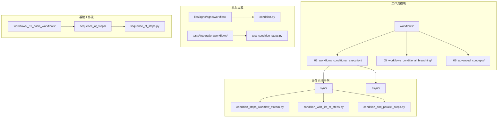
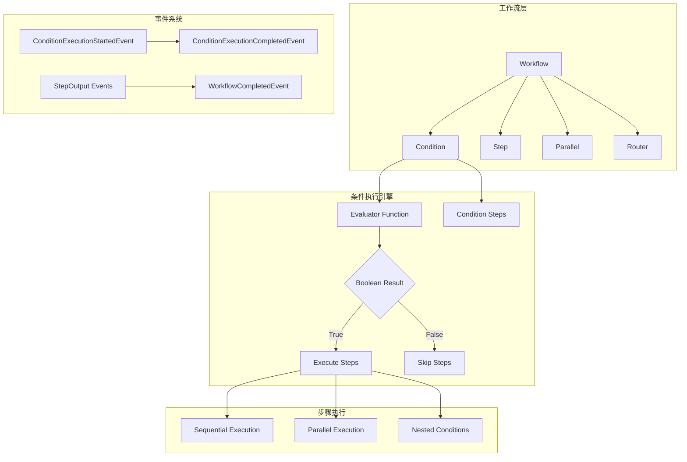
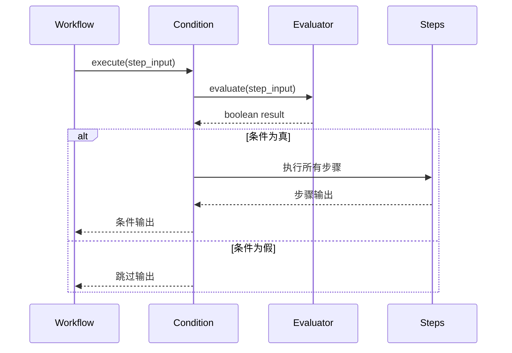
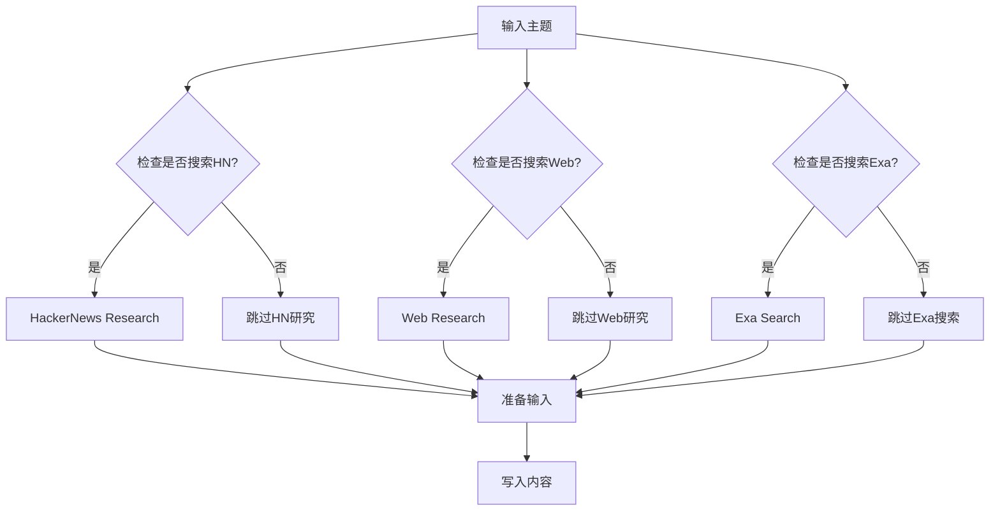
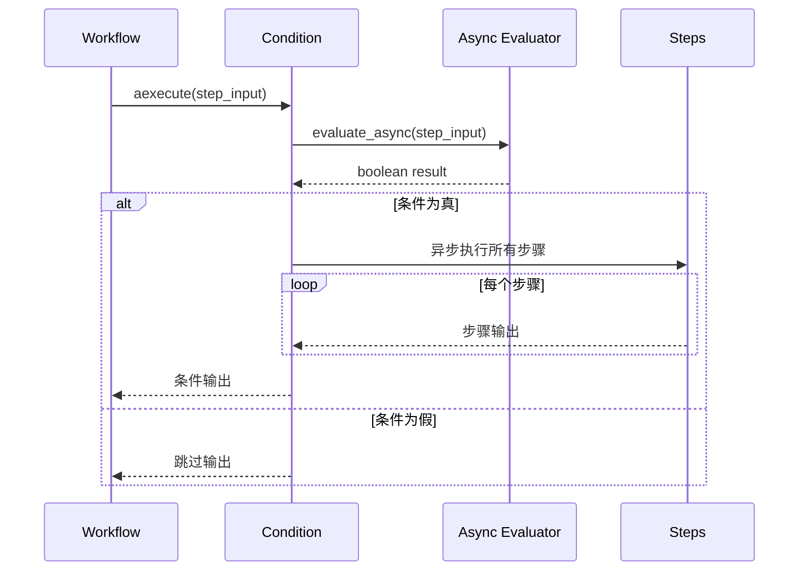
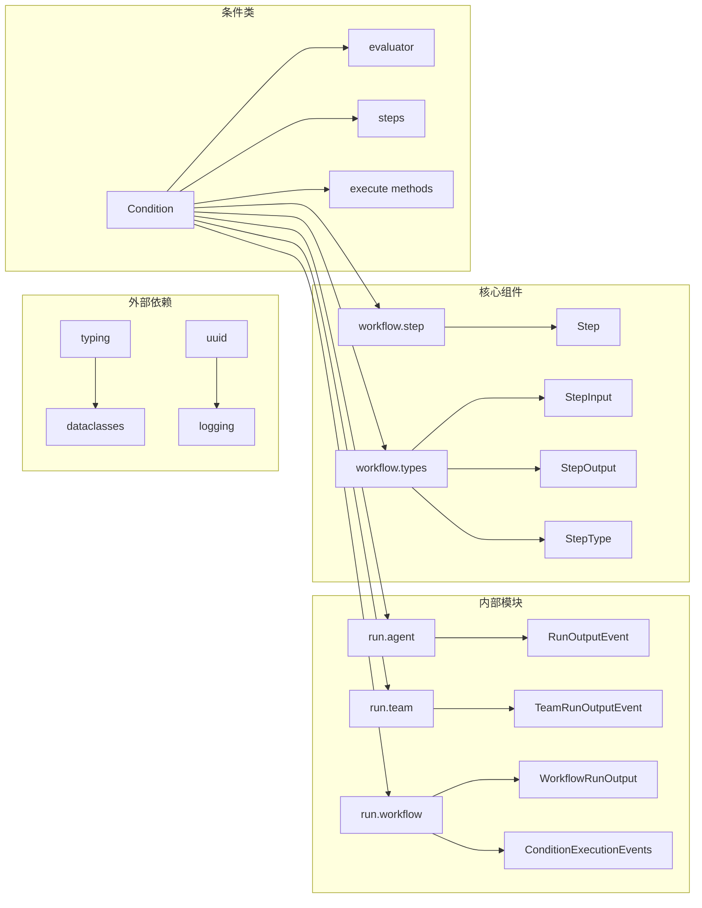

# 条件执行工作流

<cite>
**本文档中引用的文件**
- [condition_steps_workflow_stream.py](file://cookbook/workflows/_02_workflows_conditional_execution/sync/condition_steps_workflow_stream.py)
- [condition_with_list_of_steps.py](file://cookbook/workflows/_02_workflows_conditional_execution/sync/condition_with_list_of_steps.py)
- [condition_and_parallel_steps.py](file://cookbook/workflows/_02_workflows_conditional_execution/sync/condition_and_parallel_steps.py)
- [router_steps_workflow.py](file://cookbook/workflows/_05_workflows_conditional_branching/sync/router_steps_workflow.py)
- [condition.py](file://libs/agno/agno/workflow/condition.py)
- [test_condition_steps.py](file://libs/agno/tests/integration/workflows/test_condition_steps.py)
- [sequence_of_steps.py](file://cookbook/workflows/_01_basic_workflows/_01_sequence_of_steps/sync/sequence_of_steps.py)
- [workflow_with_input_schema.py](file://cookbook/workflows/_06_advanced_concepts/_01_structured_io_at_each_level/workflow_with_input_schema.py)
</cite>

## 目录
1. [简介](#简介)
2. [项目结构](#项目结构)
3. [核心组件](#核心组件)
4. [架构概览](#架构概览)
5. [详细组件分析](#详细组件分析)
6. [依赖关系分析](#依赖关系分析)
7. [性能考虑](#性能考虑)
8. [故障排除指南](#故障排除指南)
9. [结论](#结论)

## 简介

条件执行工作流是Agno框架中的一个重要特性，它允许开发者根据特定条件动态控制工作流的执行路径。通过条件判断，可以实现更智能、更灵活的自动化流程，使工作流能够根据输入数据、状态变化或外部API响应来决定下一步的操作。

条件执行工作流的核心思想是在传统线性工作流的基础上引入决策点，使得工作流可以根据预定义的条件函数来选择不同的执行路径。这种设计模式特别适用于需要根据不同情况采取不同策略的应用场景。

## 项目结构

条件执行工作流功能主要分布在以下目录结构中：



**图表来源**
- [condition_steps_workflow_stream.py](file://cookbook/workflows/_02_workflows_conditional_execution/sync/condition_steps_workflow_stream.py#L1-L20)
- [condition.py](file://libs/agno/agno/workflow/condition.py#L1-L30)

**章节来源**
- [condition_steps_workflow_stream.py](file://cookbook/workflows/_02_workflows_conditional_execution/sync/condition_steps_workflow_stream.py#L1-L116)
- [condition.py](file://libs/agno/agno/workflow/condition.py#L1-L658)

## 核心组件

### Condition类

`Condition`类是条件执行工作流的核心组件，它负责评估条件并根据评估结果决定是否执行其包含的步骤。

```python
@dataclass
class Condition:
    """A condition that executes a step (or list of steps) if the condition is met"""

    # Evaluator should only return boolean
    evaluator: Union[
        Callable[[StepInput], bool],
        Callable[[StepInput], Awaitable[bool]],
        bool,
    ]
    steps: WorkflowSteps

    name: Optional[str] = None
    description: Optional[str] = None
```

### 条件评估器

条件评估器是一个函数，接收`StepInput`参数并返回布尔值。这个函数决定了条件是否满足，从而影响工作流的执行路径。

```python
def needs_fact_checking(step_input: StepInput) -> bool:
    """Determine if the research contains claims that need fact-checking"""
    summary = step_input.previous_step_content or ""

    # Look for keywords that suggest factual claims
    fact_indicators = [
        "study shows",
        "research indicates",
        "according to",
        "statistics",
        "data shows",
        "survey",
        "report",
        "million",
        "billion",
        "percent",
        "%",
        "increase",
        "decrease",
    ]

    return any(indicator in summary.lower() for indicator in fact_indicators)
```

**章节来源**
- [condition.py](file://libs/agno/agno/workflow/condition.py#L25-L40)
- [condition_steps_workflow_stream.py](file://cookbook/workflows/_02_workflows_conditional_execution/sync/condition_steps_workflow_stream.py#L35-L50)

## 架构概览

条件执行工作流的整体架构采用分层设计，支持同步和异步执行模式：



**图表来源**
- [condition.py](file://libs/agno/agno/workflow/condition.py#L139-L175)
- [condition.py](file://libs/agno/agno/workflow/condition.py#L233-L267)

## 详细组件分析

### 基本条件执行

最基本的条件执行模式是单个条件评估器决定是否执行一系列步骤：



**图表来源**
- [condition.py](file://libs/agno/agno/workflow/condition.py#L139-L175)
- [condition_steps_workflow_stream.py](file://cookbook/workflows/_02_workflows_conditional_execution/sync/condition_steps_workflow_stream.py#L70-L85)

### 多步骤条件执行

当条件满足时，可以执行多个步骤，这些步骤会按顺序依次执行：

```python
# 条件评估器
def check_if_comprehensive_research_needed(step_input: StepInput) -> bool:
    """Check if comprehensive multi-step research is needed"""
    topic = step_input.input or step_input.previous_step_content or ""
    comprehensive_keywords = [
        "comprehensive",
        "detailed",
        "thorough",
        "in-depth",
        "complete analysis",
        "full report",
        "extensive research",
    ]
    return any(keyword in topic.lower() for keyword in comprehensive_keywords)

# 多步骤条件
Condition(
    name="ComprehensiveResearchCondition",
    description="Check if comprehensive multi-step research is needed",
    evaluator=check_if_comprehensive_research_needed,
    steps=[
        deep_exa_analysis_step,
        trend_analysis_step,
        fact_verification_step,
    ],
)
```

### 并行条件执行

条件可以与其他工作流组件（如Parallel）结合使用，实现更复杂的执行逻辑：



**图表来源**
- [condition_and_parallel_steps.py](file://cookbook/workflows/_02_workflows_conditional_execution/sync/condition_and_parallel_steps.py#L80-L120)

### 路由器条件执行

路由器是一种特殊的条件执行方式，它根据输入动态选择要执行的步骤：

```python
def research_router(step_input: StepInput) -> List[Step]:
    """
    Decide which research method to use based on the input topic.
    Returns a list containing the step(s) to execute.
    """
    topic = step_input.previous_step_content or step_input.input or ""
    topic = topic.lower()

    # 检查是否为技术/创业相关话题
    tech_keywords = [
        "startup", "programming", "ai", "machine learning", "software",
        "developer", "coding", "tech", "silicon valley", "venture capital",
        "cryptocurrency", "blockchain", "open source", "github",
    ]

    if any(keyword in topic for keyword in tech_keywords):
        print(f"🔍 Tech topic detected: Using HackerNews research for '{topic}'")
        return [research_hackernews]
    else:
        print(f"🌐 General topic detected: Using web research for '{topic}'")
        return [research_web]
```

**章节来源**
- [condition_with_list_of_steps.py](file://cookbook/workflows/_02_workflows_conditional_execution/sync/condition_with_list_of_steps.py#L80-L100)
- [condition_and_parallel_steps.py](file://cookbook/workflows/_05_workflows_conditional_branching/sync/router_steps_workflow.py#L45-L75)

### 异步条件执行

条件执行支持异步模式，适用于需要等待外部服务响应的场景：



**图表来源**
- [condition.py](file://libs/agno/agno/workflow/condition.py#L470-L520)
- [test_condition_steps.py](file://libs/agno/tests/integration/workflows/test_condition_steps.py#L317-L337)

**章节来源**
- [condition.py](file://libs/agno/agno/workflow/condition.py#L470-L520)
- [test_condition_steps.py](file://libs/agno/tests/integration/workflows/test_condition_steps.py#L317-L337)

### 条件事件系统

条件执行过程中会产生丰富的事件，支持实时监控和调试：

```python
# 条件开始事件
yield ConditionExecutionStartedEvent(
    run_id=workflow_run_response.run_id or "",
    workflow_name=workflow_run_response.workflow_name or "",
    workflow_id=workflow_run_response.workflow_id or "",
    session_id=workflow_run_response.session_id or "",
    step_name=self.name,
    step_index=step_index,
    condition_result=condition_result,
    step_id=conditional_step_id,
    parent_step_id=parent_step_id,
)

# 条件完成事件
yield ConditionExecutionCompletedEvent(
    run_id=workflow_run_response.run_id or "",
    workflow_name=workflow_run_response.workflow_name or "",
    workflow_id=workflow_run_response.workflow_id or "",
    session_id=workflow_run_response.session_id or "",
    step_name=self.name,
    step_index=step_index,
    condition_result=True,
    executed_steps=len(self.steps),
    step_results=all_results,
    step_id=conditional_step_id,
    parent_step_id=parent_step_id,
)
```

**章节来源**
- [condition.py](file://libs/agno/agno/workflow/condition.py#L280-L310)
- [condition.py](file://libs/agno/agno/workflow/condition.py#L340-L370)

## 依赖关系分析

条件执行工作流的依赖关系体现了清晰的分层架构：



**图表来源**
- [condition.py](file://libs/agno/agno/workflow/condition.py#L1-L20)
- [condition.py](file://libs/agno/agno/workflow/condition.py#L25-L40)

**章节来源**
- [condition.py](file://libs/agno/agno/workflow/condition.py#L1-L658)

## 性能考虑

### 条件评估优化

1. **缓存机制**：对于重复的条件评估，可以考虑添加缓存机制
2. **早期终止**：如果条件评估失败，立即停止后续步骤的执行
3. **异步处理**：对于耗时的条件评估，使用异步模式避免阻塞

### 内存管理

1. **流式处理**：使用生成器模式处理大量数据
2. **事件驱动**：通过事件系统减少内存占用
3. **资源清理**：及时释放不再需要的资源

### 并发执行

1. **并行条件**：多个条件可以并行评估
2. **流水线处理**：条件步骤之间可以流水线化处理
3. **负载均衡**：在分布式环境中平衡条件评估负载

## 故障排除指南

### 常见问题及解决方案

#### 1. 条件评估器返回非布尔值

```python
# 错误示例
def bad_evaluator(step_input: StepInput) -> str:
    return "true"  # 应该返回布尔值

# 正确示例
def good_evaluator(step_input: StepInput) -> bool:
    return True  # 返回布尔值
```

#### 2. 条件步骤执行失败

```python
# 添加错误处理
def robust_evaluator(step_input: StepInput) -> bool:
    try:
        # 条件评估逻辑
        return evaluate_condition(step_input)
    except Exception as e:
        logger.error(f"Condition evaluation failed: {e}")
        return False  # 默认返回False
```

#### 3. 条件事件丢失

确保在工作流配置中启用中间步骤流式传输：

```python
workflow.print_response(
    input="AI trends",
    stream=True,
    stream_intermediate_steps=True,  # 必须启用
)
```

**章节来源**
- [condition.py](file://libs/agno/agno/workflow/condition.py#L139-L175)
- [test_condition_steps.py](file://libs/agno/tests/integration/workflows/test_condition_steps.py#L280-L300)

## 结论

条件执行工作流是Agno框架中一个强大而灵活的功能，它通过条件判断实现了智能的自动化流程控制。通过合理使用条件执行，可以构建出能够根据实际情况动态调整执行路径的智能工作流系统。

关键要点总结：

1. **灵活性**：条件执行支持单步骤和多步骤执行，适应不同的业务需求
2. **可扩展性**：可以与其他工作流组件（如Parallel、Router）组合使用
3. **可观测性**：完整的事件系统提供了良好的监控和调试能力
4. **性能**：支持同步和异步执行模式，适应不同的性能要求
5. **可靠性**：完善的错误处理和资源管理机制

通过深入理解和正确使用条件执行工作流，开发者可以构建出更加智能、高效和可靠的自动化系统。