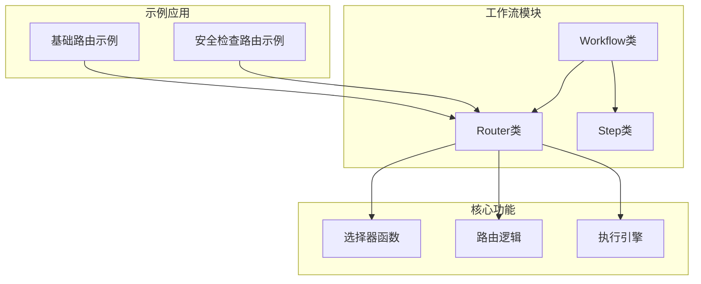
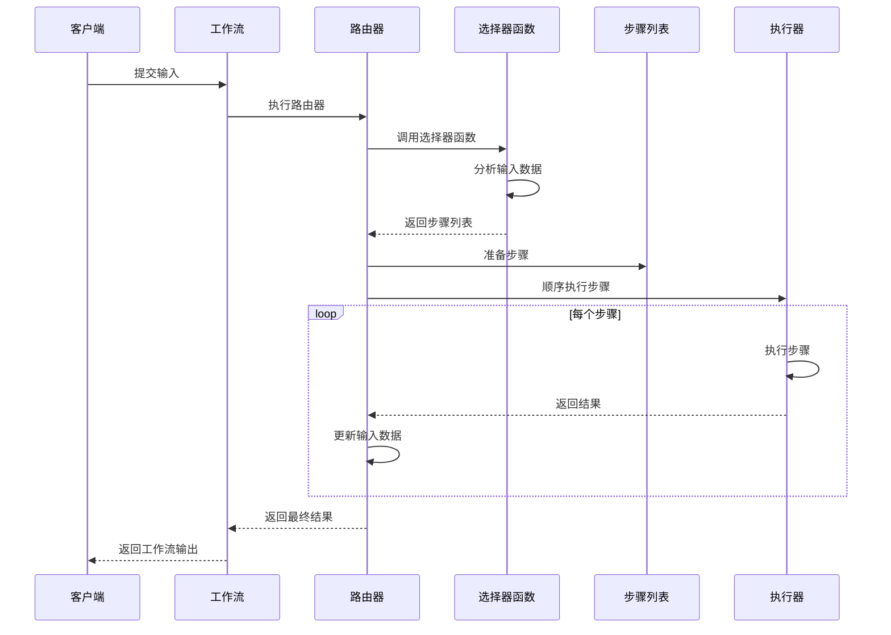
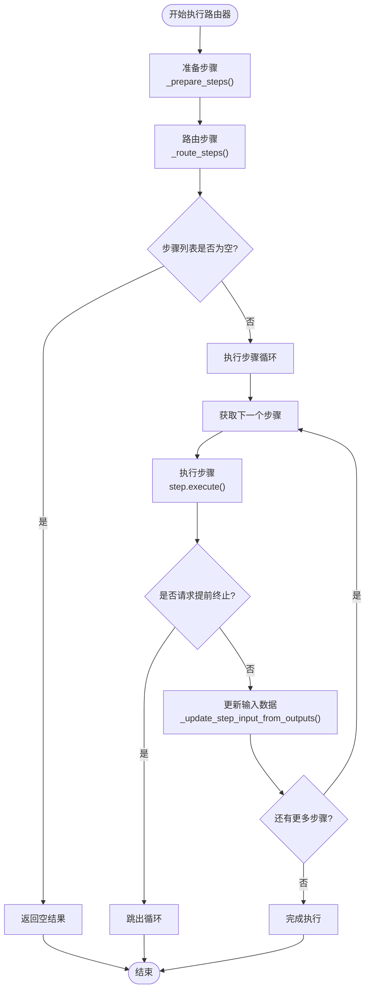
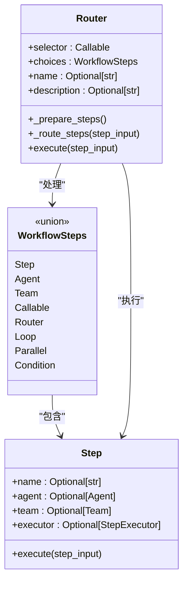
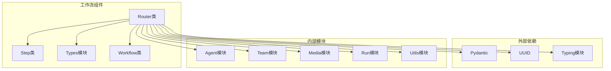

# 路由分支工作流

<cite>
**本文档引用的文件**
- [workflow_with_router.py](file://cookbook/agent_os/workflow/workflow_with_router.py)
- [early_stop_workflow_with_router.py](file://cookbook/workflows/_06_advanced_concepts/_02_early_stopping/early_stop_workflow_with_router.py)
- [router.py](file://libs/agno/agno/workflow/router.py)
- [step.py](file://libs/agno/agno/workflow/step.py)
- [types.py](file://libs/agno/agno/workflow/types.py)
- [workflow.py](file://libs/agno/agno/workflow/workflow.py)
</cite>

## 目录
1. [简介](#简介)
2. [项目结构](#项目结构)
3. [核心组件](#核心组件)
4. [架构概览](#架构概览)
5. [详细组件分析](#详细组件分析)
6. [依赖关系分析](#依赖关系分析)
7. [性能考虑](#性能考虑)
8. [故障排除指南](#故障排除指南)
9. [结论](#结论)

## 简介

路由分支工作流是Agno框架中的一个高级功能，它允许开发者根据输入数据或上下文动态选择不同的执行路径。与简单的条件判断不同，路由器可以支持多于两个分支的选择，为复杂的决策流程提供了强大的解决方案。

路由器的核心思想是通过一个选择器函数（selector function）来决定应该执行哪些步骤。这个选择器函数接收当前的StepInput作为输入，并返回一个步骤列表。路由器会按照这个列表顺序执行这些步骤，实现了灵活的分支控制。

## 项目结构

路由分支工作流在Agno框架中的组织结构如下：



**图表来源**
- [router.py](file://libs/agno/agno/workflow/router.py#L1-L50)
- [workflow_with_router.py](file://cookbook/agent_os/workflow/workflow_with_router.py#L1-L30)

**章节来源**
- [workflow_with_router.py](file://cookbook/agent_os/workflow/workflow_with_router.py#L1-L116)
- [early_stop_workflow_with_router.py](file://cookbook/workflows/_06_advanced_concepts/_02_early_stopping/early_stop_workflow_with_router.py#L1-L148)

## 核心组件

### Router类

Router类是路由分支工作流的核心组件，它负责根据输入数据动态选择和执行步骤序列。

```python
@dataclass
class Router:
    """基于输入动态选择要执行的步骤的路由器"""
    
    # 返回要执行的步骤的路由器函数
    selector: Union[
        Callable[[StepInput], Union[WorkflowSteps, List[WorkflowSteps]]],
        Callable[[StepInput], Awaitable[Union[WorkflowSteps, List[WorkflowSteps]]]],
    ]
    choices: WorkflowSteps  # 可供选择的步骤
    
    name: Optional[str] = None
    description: Optional[str] = None
```

### 选择器函数

选择器函数是路由器的核心逻辑，它决定了应该执行哪些步骤：

```python
def research_router(step_input: StepInput) -> List[Step]:
    """根据输入主题决定使用哪种研究方法"""
    topic = step_input.previous_step_content or step_input.input or ""
    topic = topic.lower()
    
    tech_keywords = [
        "startup", "programming", "ai", "machine learning", "software",
        "developer", "coding", "tech", "silicon valley", "venture capital"
    ]
    
    if any(keyword in topic for keyword in tech_keywords):
        print(f"🔍 技术主题检测: 使用HackerNews研究 '{topic}'")
        return [research_hackernews]
    else:
        print(f"🌐 通用主题检测: 使用网络研究 '{topic}'")
        return [research_web]
```

**章节来源**
- [router.py](file://libs/agno/agno/workflow/router.py#L25-L45)
- [workflow_with_router.py](file://cookbook/agent_os/workflow/workflow_with_router.py#L50-L75)

## 架构概览

路由分支工作流的整体架构展示了各个组件之间的交互关系：



**图表来源**
- [router.py](file://libs/agno/agno/workflow/router.py#L133-L200)
- [workflow.py](file://libs/agno/agno/workflow/workflow.py#L2186-L2209)

## 详细组件分析

### 路由器执行流程

路由器的执行过程包括以下几个关键步骤：



**图表来源**
- [router.py](file://libs/agno/agno/workflow/router.py#L133-L200)
- [router.py](file://libs/agno/agno/workflow/router.py#L234-L300)

### 选择器函数的实现模式

选择器函数可以根据不同的业务需求采用多种实现模式：

#### 1. 基础关键词匹配模式

```python
def basic_keyword_router(step_input: StepInput) -> List[Step]:
    """基于关键词的简单路由"""
    content = step_input.input.lower()
    
    if "技术" in content:
        return [tech_step]
    elif "市场" in content:
        return [market_step]
    elif "财务" in content:
        return [finance_step]
    else:
        return [default_step]
```

#### 2. 多层决策模式

```python
def hierarchical_router(step_input: StepInput) -> List[Step]:
    """多层决策路由"""
    level1_result = level1_selector(step_input)
    
    if level1_result == "complex":
        return [complex_analysis, safety_check, detailed_research]
    elif level1_result == "simple":
        return [quick_research, summary]
    else:
        return [escalation_process]
```

#### 3. 动态配置模式

```python
def config_based_router(step_input: StepInput) -> List[Step]:
    """基于配置的路由"""
    config = load_routing_config()
    topic = extract_topic(step_input.input)
    
    if topic in config:
        return config[topic]["steps"]
    else:
        return config["default"]["steps"]
```

**章节来源**
- [workflow_with_router.py](file://cookbook/agent_os/workflow/workflow_with_router.py#L50-L75)
- [early_stop_workflow_with_router.py](file://cookbook/workflows/_06_advanced_concepts/_02_early_stopping/early_stop_workflow_with_router.py#L70-L100)

### 步骤准备和验证

路由器在执行前会进行步骤准备和验证：



**图表来源**
- [router.py](file://libs/agno/agno/workflow/router.py#L47-L70)
- [step.py](file://libs/agno/agno/workflow/step.py#L25-L50)

**章节来源**
- [router.py](file://libs/agno/agno/workflow/router.py#L47-L70)

### 流式执行支持

路由器支持流式执行，这对于长时间运行的任务特别有用：

```python
def execute_stream(
    self,
    step_input: StepInput,
    session_id: Optional[str] = None,
    user_id: Optional[str] = None,
    session_state: Optional[Dict[str, Any]] = None,
    stream_intermediate_steps: bool = False,
    workflow_run_response: Optional[WorkflowRunOutput] = None,
    step_index: Optional[Union[int, tuple]] = None,
    store_executor_outputs: bool = True,
    parent_step_id: Optional[str] = None,
) -> Iterator[Union[WorkflowRunOutputEvent, StepOutput]]:
    """带有流式支持的路由器执行"""
```

**章节来源**
- [router.py](file://libs/agno/agno/workflow/router.py#L234-L300)

## 依赖关系分析

路由分支工作流的依赖关系展现了其在Agno框架中的位置：



**图表来源**
- [router.py](file://libs/agno/agno/workflow/router.py#L1-L20)
- [workflow.py](file://libs/agno/agno/workflow/workflow.py#L69-L85)

**章节来源**
- [router.py](file://libs/agno/agno/workflow/router.py#L1-L20)
- [workflow.py](file://libs/agno/agno/workflow/workflow.py#L69-L85)

## 性能考虑

### 异步执行优化

路由器支持异步执行，可以显著提高性能：

```python
async def aexecute(
    self,
    step_input: StepInput,
    session_id: Optional[str] = None,
    user_id: Optional[str] = None,
    workflow_run_response: Optional[WorkflowRunOutput] = None,
    session_state: Optional[Dict[str, Any]] = None,
    store_executor_outputs: bool = True,
) -> StepOutput:
    """异步执行路由器及其选定的步骤"""
```

### 内存管理

路由器在处理大量步骤时需要注意内存管理：

- 步骤结果会被累积存储
- 输入数据会在每一步更新
- 需要注意避免内存泄漏

### 并发控制

虽然路由器本身不直接支持并发，但可以通过以下方式实现：

```python
# 使用并行步骤包装路由器
parallel_router = Parallel(
    Router(name="router_1", selector=selector1, choices=choices1),
    Router(name="router_2", selector=selector2, choices=choices2),
    name="parallel_routers"
)
```

## 故障排除指南

### 常见错误和解决方案

#### 1. 选择器函数返回无效类型

**错误信息**: `Router function returned unexpected type`

**解决方案**: 确保选择器函数返回Step对象或Step对象列表

```python
# 错误的做法
def bad_selector(step_input: StepInput):
    return "some_string"  # 应该返回List[Step]

# 正确的做法
def good_selector(step_input: StepInput) -> List[Step]:
    return [Step(name="correct_step")]
```

#### 2. 步骤执行失败

**错误信息**: `Step failed but skipped`

**解决方案**: 检查步骤配置和输入数据

```python
# 添加错误处理
def robust_selector(step_input: StepInput) -> List[Step]:
    try:
        # 路由逻辑
        return [Step(name="safe_step")]
    except Exception as e:
        logger.error(f"Router selector failed: {e}")
        return [fallback_step]
```

#### 3. 内存溢出

**症状**: 程序运行缓慢或崩溃

**解决方案**: 
- 限制步骤数量
- 及时清理中间结果
- 使用流式执行

**章节来源**
- [router.py](file://libs/agno/agno/workflow/router.py#L115-L130)
- [router.py](file://libs/agno/agno/workflow/router.py#L133-L200)

## 结论

路由分支工作流是Agno框架中一个强大而灵活的功能，它通过选择器函数实现了复杂的决策逻辑。与传统的条件判断相比，路由器具有以下优势：

1. **灵活性**: 支持多分支选择，适应复杂的业务逻辑
2. **可扩展性**: 易于添加新的路由规则和步骤
3. **可维护性**: 将路由逻辑与业务逻辑分离
4. **可测试性**: 选择器函数易于单元测试
5. **可观察性**: 支持流式执行和事件监控

通过合理设计选择器函数和步骤组合，开发者可以构建出高效、可靠的智能工作流系统，满足各种复杂的业务需求。