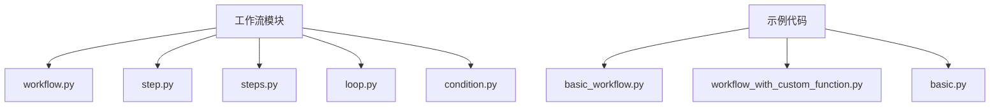
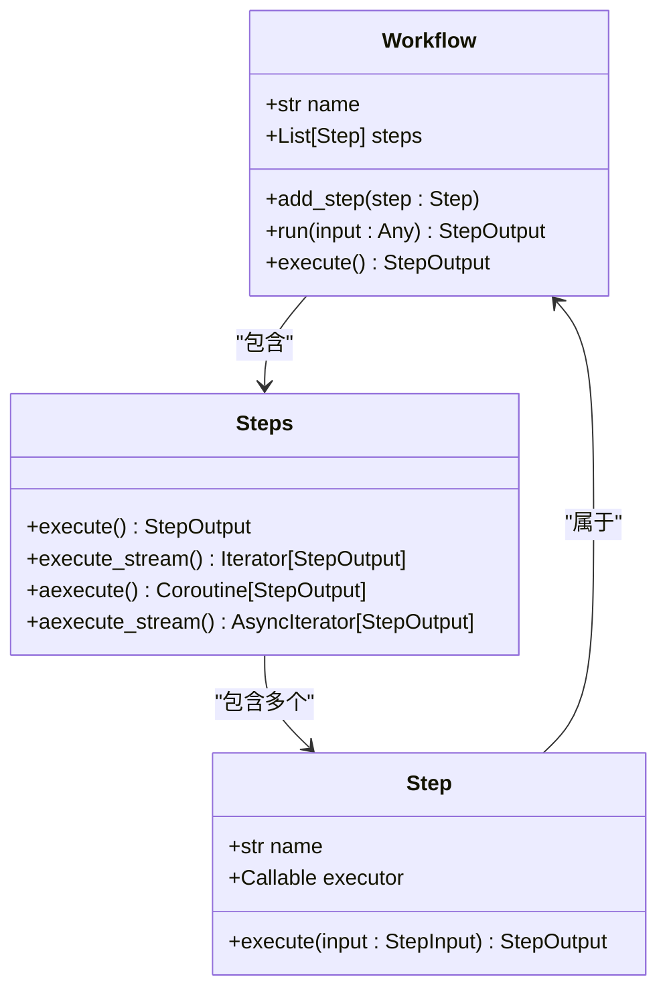
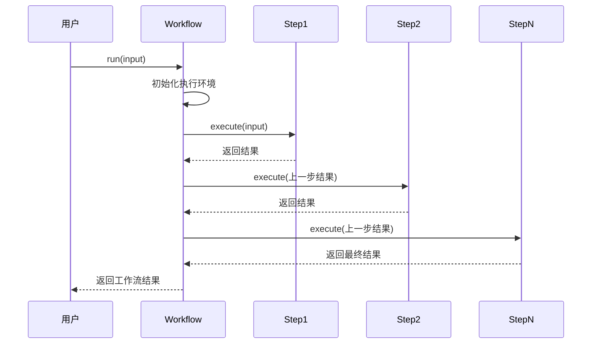
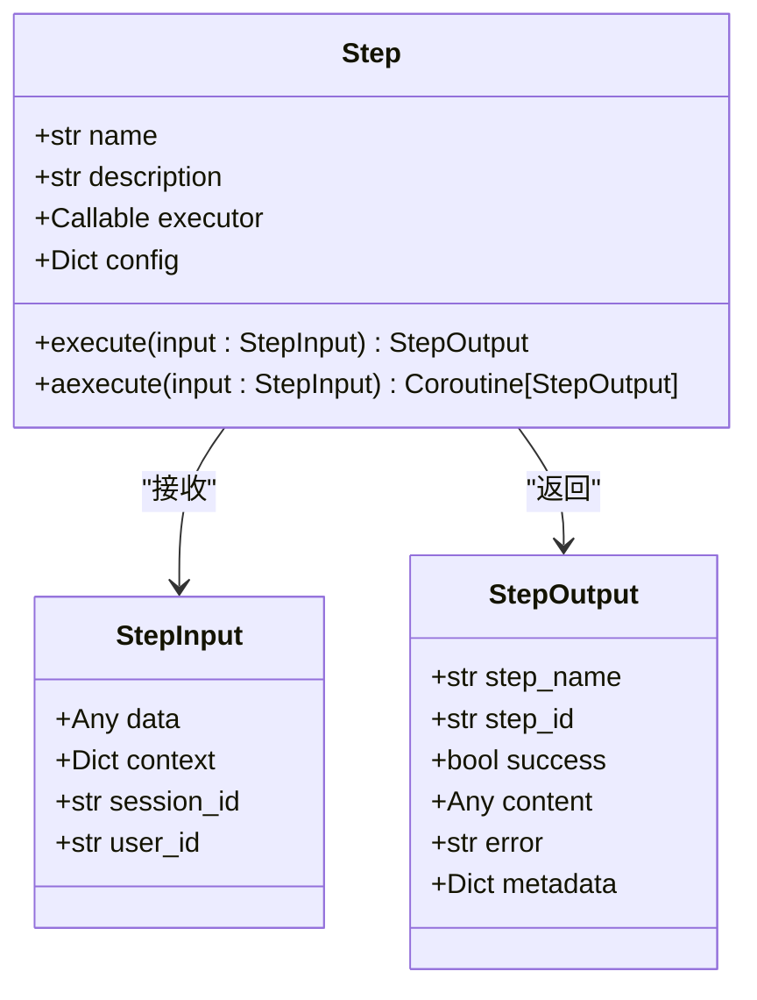
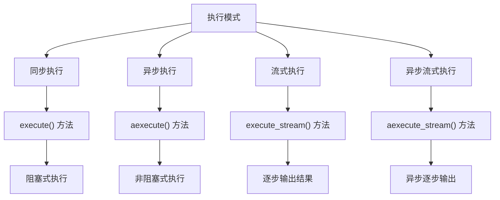
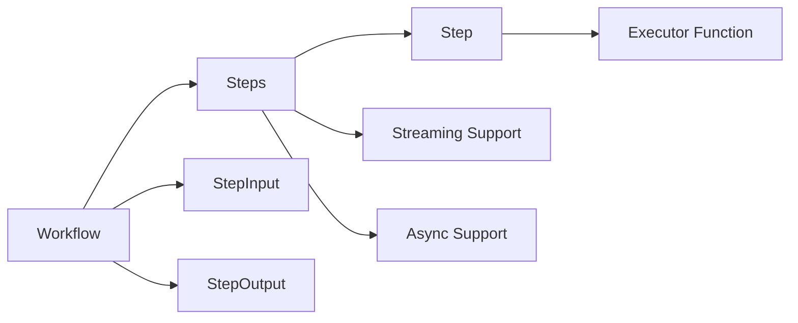

# 顺序执行工作流

<cite>
**本文档中引用的文件**  
- [workflow.py](file://libs/agno/agno/workflow/workflow.py)
- [step.py](file://libs/agno/agno/workflow/step.py)
- [steps.py](file://libs/agno/agno/workflow/steps.py)
- [basic_workflow.py](file://cookbook/agent_os/workflow/basic_workflow.py)
- [workflow_with_custom_function.py](file://cookbook/agent_os/workflow/workflow_with_custom_function.py)
- [basic.py](file://cookbook/agent_os/basic.py)
</cite>

## 目录
1. [简介](#简介)
2. [项目结构](#项目结构)
3. [核心组件](#核心组件)
4. [架构概述](#架构概述)
5. [详细组件分析](#详细组件分析)
6. [依赖分析](#依赖分析)
7. [性能考虑](#性能考虑)
8. [故障排除指南](#故障排除指南)
9. [结论](#结论)

## 简介
顺序执行工作流是一种将复杂任务分解为一系列按特定顺序执行步骤的编程模式。这种模式通过`Workflow`类和`Step`类实现，允许开发者将函数或智能体作为步骤添加到工作流中。工作流支持同步和异步执行模式，能够处理包含函数调用、智能体运行和团队协作的线性流程。通过合理设计步骤命名、错误处理和结果传递机制，可以构建高效可靠的工作流系统。

## 项目结构
项目结构显示了工作流相关模块的组织方式，主要包含核心工作流实现和示例代码。

**Diagram sources**
- [workflow.py](file://libs/agno/agno/workflow/workflow.py)
- [basic_workflow.py](file://cookbook/agent_os/workflow/basic_workflow.py)

**Section sources**
- [workflow.py](file://libs/agno/agno/workflow/workflow.py)
- [basic_workflow.py](file://cookbook/agent_os/workflow/basic_workflow.py)

## 核心组件
顺序执行工作流的核心组件包括`Workflow`类和`Step`类，它们共同构成了工作流系统的基础。`Workflow`类负责管理整个工作流的执行过程，而`Step`类则代表工作流中的单个步骤。通过`add_step`方法，可以将各种函数或智能体作为步骤添加到工作流中，形成线性执行序列。

**Section sources**
- [workflow.py](file://libs/agno/agno/workflow/workflow.py)
- [step.py](file://libs/agno/agno/workflow/step.py)

## 架构概述
顺序执行工作流的架构基于模块化设计，各组件协同工作以实现复杂的任务处理。

**Diagram sources**
- [workflow.py](file://libs/agno/agno/workflow/workflow.py)
- [step.py](file://libs/agno/agno/workflow/step.py)
- [steps.py](file://libs/agno/agno/workflow/steps.py)

## 详细组件分析

### Workflow类分析
`Workflow`类是顺序执行工作流的核心管理器，负责协调各个步骤的执行顺序和数据传递。

**Diagram sources**
- [workflow.py](file://libs/agno/agno/workflow/workflow.py)

**Section sources**
- [workflow.py](file://libs/agno/agno/workflow/workflow.py)
- [basic_workflow.py](file://cookbook/agent_os/workflow/basic_workflow.py)

### Step类分析
`Step`类代表工作流中的基本执行单元，封装了具体的执行逻辑。

**Diagram sources**
- [step.py](file://libs/agno/agno/workflow/step.py)

**Section sources**
- [step.py](file://libs/agno/agno/workflow/step.py)
- [workflow_with_custom_function.py](file://cookbook/agent_os/workflow/workflow_with_custom_function.py)

### 执行模式分析
顺序执行工作流支持多种执行模式，满足不同的应用场景需求。

**Diagram sources**
- [steps.py](file://libs/agno/agno/workflow/steps.py)

**Section sources**
- [steps.py](file://libs/agno/agno/workflow/steps.py)
- [basic.py](file://cookbook/agent_os/basic.py)

## 依赖分析
工作流系统各组件之间的依赖关系清晰明确，确保了系统的可维护性和扩展性。

**Diagram sources**
- [workflow.py](file://libs/agno/agno/workflow/workflow.py)
- [steps.py](file://libs/agno/agno/workflow/steps.py)
- [step.py](file://libs/agno/agno/workflow/step.py)

**Section sources**
- [workflow.py](file://libs/agno/agno/workflow/workflow.py)
- [steps.py](file://libs/agno/agno/workflow/steps.py)

## 性能考虑
在设计顺序执行工作流时，需要考虑执行效率、资源利用和错误处理等性能因素。异步执行模式可以提高并发处理能力，而流式执行则有助于减少内存占用。合理的步骤划分和结果传递机制能够优化整体性能。对于长时间运行的任务，建议使用异步流式执行模式，以避免阻塞和内存溢出问题。

## 故障排除指南
在使用顺序执行工作流时，可能会遇到各种问题，需要系统性的排查方法。

**Section sources**
- [workflow.py](file://libs/agno/agno/workflow/workflow.py)
- [steps.py](file://libs/agno/agno/workflow/steps.py)

## 结论
顺序执行工作流提供了一种结构化的方法来组织和执行复杂的任务序列。通过`Workflow`类和`Step`类的组合，开发者可以轻松构建线性工作流，支持同步、异步和流式等多种执行模式。合理的步骤命名、错误处理和结果传递机制是构建可靠工作流系统的关键。随着应用场景的复杂化，这种模块化的工作流设计模式展现出强大的适应性和扩展性。