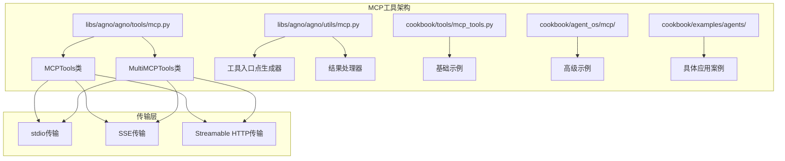
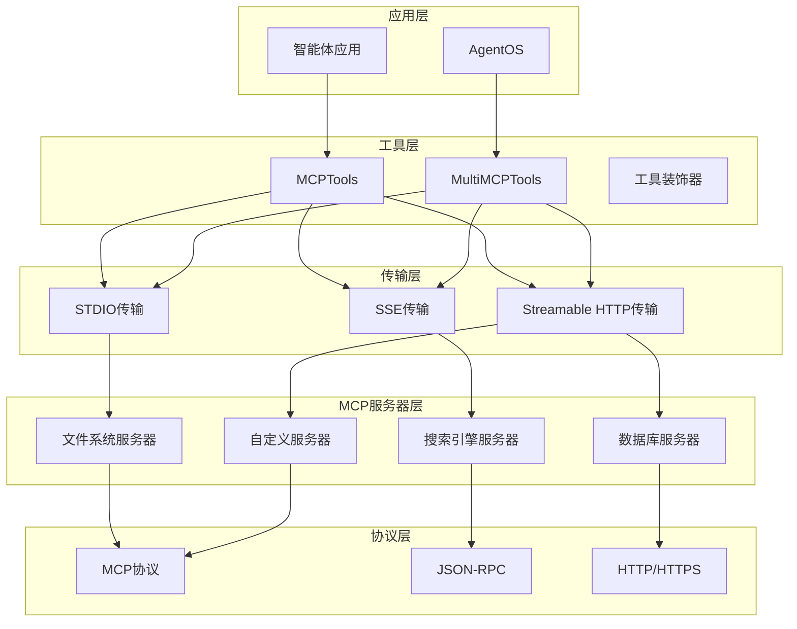
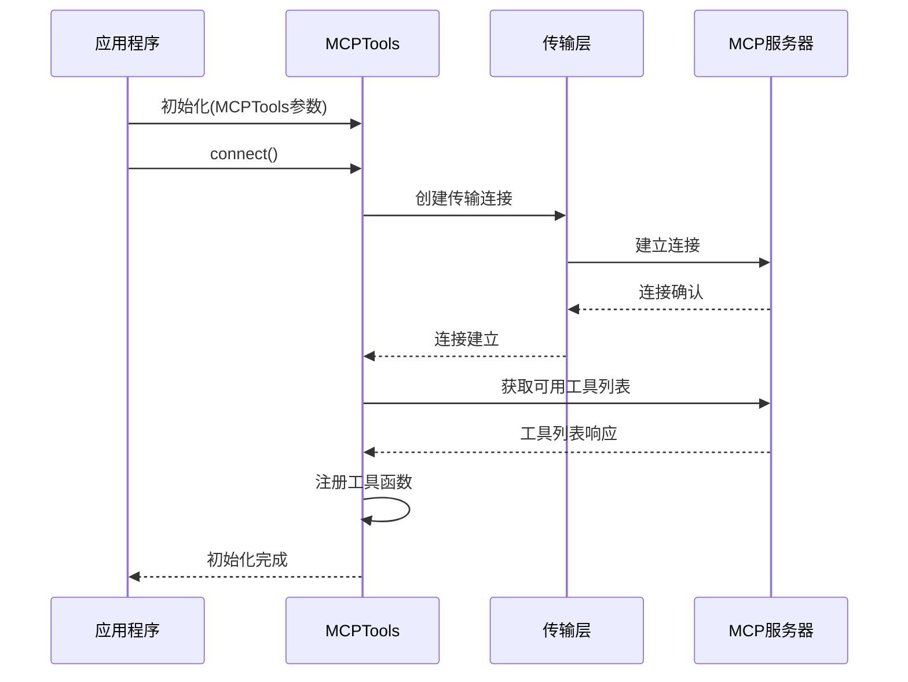
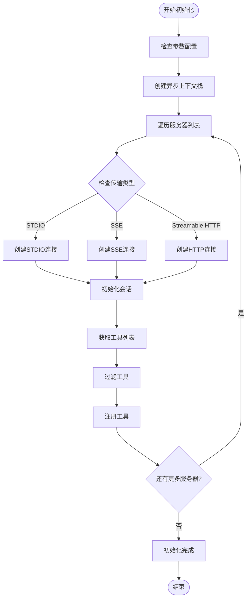
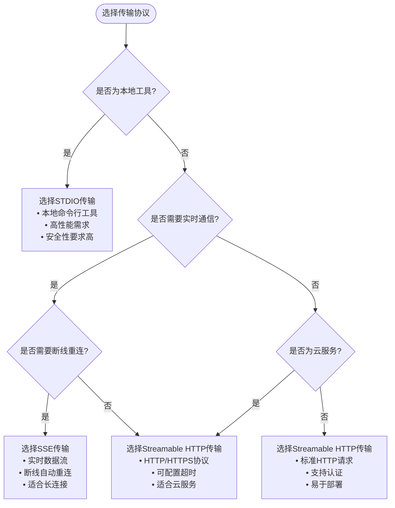
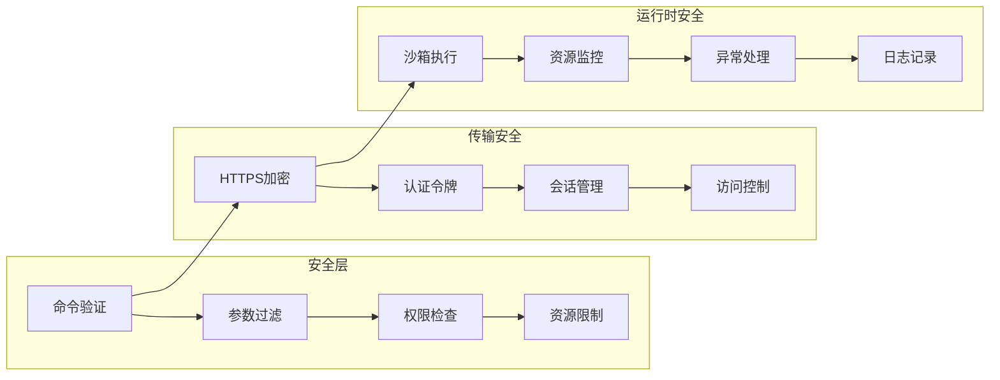
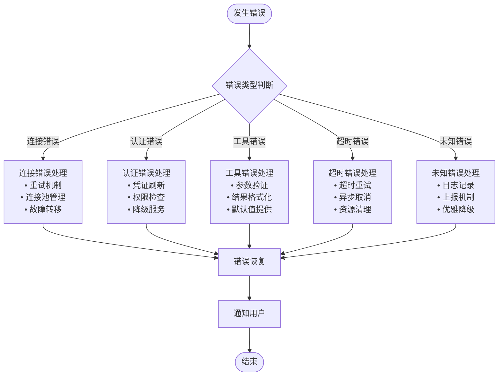

# MCP工具

<cite>
**本文档中引用的文件**
- [mcp.py](file://libs/agno/agno/tools/mcp.py)
- [mcp_utils.py](file://libs/agno/agno/utils/mcp.py)
- [test_mcp.py](file://libs/agno/tests/unit/tools/test_mcp.py)
- [mcp_tools.py](file://cookbook/tools/mcp_tools.py)
- [mcp_tools_example.py](file://cookbook/agent_os/mcp/mcp_tools_example.py)
- [mcp_tools_advanced_example.py](file://cookbook/agent_os/mcp/mcp_tools_advanced_example.py)
- [enable_mcp_example.py](file://cookbook/agent_os/mcp/enable_mcp_example.py)
- [airbnb_mcp.py](file://cookbook/examples/agents/airbnb_mcp.py)
- [mcp_connector.py](file://cookbook/models/anthropic/mcp_connector.py)
</cite>

## 目录
1. [简介](#简介)
2. [MCP概念概述](#mcp概念概述)
3. [项目结构](#项目结构)
4. [核心组件](#核心组件)
5. [架构概览](#架构概览)
6. [详细组件分析](#详细组件分析)
7. [通信协议](#通信协议)
8. [配置与认证](#配置与认证)
9. [错误处理机制](#错误处理机制)
10. [最佳实践](#最佳实践)
11. [故障排除指南](#故障排除指南)
12. [总结](#总结)

## 简介

MCP（Model Context Protocol）是一个用于连接智能体与外部服务的协议，它为AI智能体提供了一种标准化的方式来访问和使用各种外部工具和服务。在Agno框架中，MCP工具提供了强大的功能，使智能体能够无缝集成各种外部资源，包括文件系统访问、网络搜索、数据库查询等。

MCP工具的设计理念是模块化和可互操作性，允许开发者轻松地将不同的MCP服务器集成到他们的智能体应用中，从而构建功能丰富且灵活的AI解决方案。

## MCP概念概述

### 什么是MCP？

Model Context Protocol（MCP）是一种开放标准协议，旨在为AI智能体提供与外部服务交互的标准接口。MCP协议定义了智能体与外部工具、资源和提示之间的通信规范，使得智能体能够：

- 访问本地和远程文件系统
- 执行网络搜索和信息检索
- 调用外部API和服务
- 操作数据库和存储系统
- 使用各种专用工具和插件

### MCP的核心价值

1. **标准化接口**：提供统一的工具访问方式
2. **模块化设计**：支持多种类型的MCP服务器
3. **可扩展性**：易于添加新的工具和服务
4. **互操作性**：不同MCP服务器之间的兼容性
5. **安全性**：内置的安全机制和权限控制

## 项目结构

MCP工具在Agno项目中的组织结构体现了其模块化设计理念：



**图表来源**
- [mcp.py](file://libs/agno/agno/tools/mcp.py#L1-L612)
- [mcp_utils.py](file://libs/agno/agno/utils/mcp.py#L1-L125)

**章节来源**
- [mcp.py](file://libs/agno/agno/tools/mcp.py#L1-L50)
- [mcp_utils.py](file://libs/agno/agno/utils/mcp.py#L1-L30)

## 核心组件

### MCPTools类

MCPTools是单个MCP服务器的主要接口类，提供了以下核心功能：

```python
class MCPTools(Toolkit):
    """
    集成Model Context Protocol服务器的工具包。
    允许智能体访问MCP服务器暴露的工具、资源和提示。
    """
```

主要特性：
- 支持三种传输协议：stdio、SSE和Streamable HTTP
- 自动工具发现和注册
- 工具过滤功能（包含/排除特定工具）
- 异步上下文管理
- 连接生命周期管理

### MultiMCPTools类

MultiMCPTools扩展了MCPTools的功能，支持同时连接多个MCP服务器：

```python
class MultiMCPTools(Toolkit):
    """
    集成多个Model Context Protocol服务器的工具包。
    允许智能体访问多个MCP服务器暴露的工具、资源和提示。
    """
```

关键功能：
- 同时管理多个MCP服务器连接
- 统一的工具注册和管理
- 错误隔离和恢复机制
- 资源清理和生命周期管理

**章节来源**
- [mcp.py](file://libs/agno/agno/tools/mcp.py#L75-L200)
- [mcp.py](file://libs/agno/agno/tools/mcp.py#L320-L450)

## 架构概览

MCP工具的整体架构采用分层设计，确保了良好的可维护性和扩展性：



**图表来源**
- [mcp.py](file://libs/agno/agno/tools/mcp.py#L75-L150)
- [mcp.py](file://libs/agno/agno/tools/mcp.py#L320-L400)

## 详细组件分析

### MCPTools初始化和连接

MCPTools提供了灵活的初始化选项，支持多种连接方式：



**图表来源**
- [mcp.py](file://libs/agno/agno/tools/mcp.py#L150-L250)

### 多MCP服务器管理

MultiMCPTools展示了如何同时管理多个MCP服务器：



**图表来源**
- [mcp.py](file://libs/agno/agno/tools/mcp.py#L450-L550)

**章节来源**
- [mcp.py](file://libs/agno/agno/tools/mcp.py#L150-L300)
- [mcp.py](file://libs/agno/agno/tools/mcp.py#L450-L600)

## 通信协议

### 传输协议详解

MCP工具支持三种主要的传输协议，每种都有其特定的使用场景：

#### 1. STDIO传输

STDIO传输是最常用的本地进程间通信方式：

```python
# 示例：启动本地MCP服务器
server_params = StdioServerParameters(
    command="npx",
    args=[
        "-y",
        "@modelcontextprotocol/server-filesystem",
        str(Path(__file__).parent.parent),
    ],
)
```

特点：
- 适用于本地命令行工具
- 高性能，低延迟
- 安全性高（仅限本地进程）

#### 2. SSE传输

Server-Sent Events传输用于实时数据流：

```python
# 示例：SSE客户端参数
sse_params = SSEClientParams(
    url="https://example.com/mcp",
    headers={"Authorization": "Bearer token"},
    timeout=30,
    sse_read_timeout=300,
)
```

特点：
- 实时双向通信
- 支持断线重连
- 适合长时间连接

#### 3. Streamable HTTP传输

Streamable HTTP传输结合了HTTP的灵活性和流式传输的优势：

```python
# 示例：Streamable HTTP客户端参数
http_params = StreamableHTTPClientParams(
    url="https://docs.agno.com/mcp",
    headers={"X-API-Key": "your-key"},
    timeout=timedelta(seconds=30),
    sse_read_timeout=timedelta(seconds=300),
    terminate_on_close=False,
)
```

特点：
- 支持HTTP/HTTPS协议
- 可配置超时和重试机制
- 适合云服务集成

### 协议选择指南



**章节来源**
- [mcp.py](file://libs/agno/agno/tools/mcp.py#L40-L70)
- [mcp.py](file://libs/agno/agno/tools/mcp.py#L150-L250)

## 配置与认证

### 环境变量配置

MCP工具支持灵活的环境变量配置，确保安全性和可移植性：

```python
# 示例：环境变量配置
env_config = {
    "BRAVE_API_KEY": getenv("BRAVE_API_KEY"),
    "OPENAI_API_KEY": getenv("OPENAI_API_KEY"),
    "DATABASE_URL": getenv("DATABASE_URL", "sqlite:///default.db"),
}

mcp_tools = MCPTools(
    command="npx -y @modelcontextprotocol/server-brave-search",
    env=env_config,
    timeout_seconds=60,
)
```

### 工具过滤机制

MCP工具提供了精细的工具过滤功能：

```python
# 包含特定工具
mcp_tools = MCPTools(
    command="npx -y @modelcontextprotocol/server-all",
    include_tools=["search", "read_file", "write_file"],
)

# 排除特定工具
mcp_tools = MCPTools(
    command="npx -y @modelcontextprotocol/server-all",
    exclude_tools=["dangerous_operation", "destructive_write"],
)
```

### 安全性考虑



**章节来源**
- [mcp.py](file://libs/agno/agno/tools/mcp.py#L25-L70)
- [mcp.py](file://libs/agno/agno/tools/mcp.py#L100-L150)

## 错误处理机制

### 异常处理策略

MCP工具实现了全面的错误处理机制：

```python
async def call_tool(agent: Agent, tool_name: str, **kwargs) -> ToolResult:
    try:
        log_debug(f"Calling MCP Tool '{tool_name}' with args: {kwargs}")
        result: CallToolResult = await session.call_tool(tool_name, kwargs)
        
        if result.isError:
            return ToolResult(content=f"Error from MCP tool '{tool_name}': {result.content}")
        
        # 处理成功的结果...
        
    except Exception as e:
        log_exception(f"Failed to call MCP tool '{tool_name}': {e}")
        return ToolResult(content=f"Error: {e}")
```

### 错误分类和处理



**图表来源**
- [mcp_utils.py](file://libs/agno/agno/utils/mcp.py#L25-L125)

### 资源清理机制

MCP工具实现了完善的资源清理机制：

```python
def cleanup():
    """取消活跃连接"""
    if self._connection_task and not self._connection_task.done():
        self._connection_task.cancel()

# 设置清理逻辑，在实例被垃圾回收前执行
self._cleanup_finalizer = weakref.finalize(self, cleanup)
```

**章节来源**
- [mcp_utils.py](file://libs/agno/agno/utils/mcp.py#L25-L125)
- [mcp.py](file://libs/agno/agno/tools/mcp.py#L200-L250)

## 最佳实践

### 1. 连接管理最佳实践

```python
# 推荐：使用异步上下文管理器
async with MCPTools(command="npx -y @modelcontextprotocol/server-filesystem") as mcp_tools:
    agent = Agent(tools=[mcp_tools])
    await agent.aprint_response("Read the LICENSE file")

# 或者手动管理连接
mcp_tools = MCPTools(command="npx -y @modelcontextprotocol/server-filesystem")
await mcp_tools.connect()
try:
    agent = Agent(tools=[mcp_tools])
    await agent.aprint_response("Read the LICENSE file")
finally:
    await mcp_tools.close()
```

### 2. 多MCP服务器配置

```python
# 推荐：使用MultiMCPTools管理多个服务器
mcp_tools = MultiMCPTools(
    commands=[
        "npx -y @modelcontextprotocol/server-filesystem",
        "npx -y @modelcontextprotocol/server-brave-search",
    ],
    env={
        "BRAVE_API_KEY": getenv("BRAVE_API_KEY"),
    },
    timeout_seconds=30,
)
```

### 3. 错误处理和重试

```python
# 推荐：实现指数退避重试
import asyncio
from typing import Optional

async def retry_with_backoff(func, max_retries=3, base_delay=1):
    for attempt in range(max_retries):
        try:
            return await func()
        except Exception as e:
            if attempt == max_retries - 1:
                raise
            delay = base_delay * (2 ** attempt)
            await asyncio.sleep(delay)
```

### 4. 性能优化建议

```python
# 推荐：合理设置超时时间
mcp_tools = MCPTools(
    command="npx -y @modelcontextprotocol/server-filesystem",
    timeout_seconds=10,  # 根据实际需求调整
)

# 推荐：使用工具过滤减少不必要的开销
mcp_tools = MCPTools(
    command="npx -y @modelcontextprotocol/server-all",
    include_tools=["read_file", "write_file"],  # 只包含需要的工具
)
```

## 故障排除指南

### 常见问题及解决方案

#### 1. 连接失败问题

**问题症状**：无法连接到MCP服务器

**可能原因**：
- 服务器未启动或不可达
- 网络连接问题
- 认证凭据错误
- 防火墙阻止连接

**解决方案**：
```python
# 添加调试日志
import logging
logging.basicConfig(level=logging.DEBUG)

# 检查服务器状态
try:
    async with MCPTools(command="npx -y @modelcontextprotocol/server-filesystem") as mcp:
        print("Connection successful!")
except Exception as e:
    print(f"Connection failed: {e}")
```

#### 2. 工具调用失败

**问题症状**：工具返回错误或无响应

**可能原因**：
- 工具参数不正确
- 服务器内部错误
- 超时设置过短

**解决方案**：
```python
# 增加超时时间
mcp_tools = MCPTools(
    command="npx -y @modelcontextprotocol/server-tool",
    timeout_seconds=60,  # 增加到60秒
)

# 添加错误处理
try:
    result = await agent.arun("Use the tool")
    print(result)
except Exception as e:
    print(f"Tool call failed: {e}")
```

#### 3. 内存泄漏问题

**问题症状**：长时间运行后内存占用持续增长

**可能原因**：
- 连接未正确关闭
- 事件循环未清理
- 缓存数据过多

**解决方案**：
```python
# 确保正确关闭连接
async def safe_mcp_usage():
    mcp_tools = None
    try:
        mcp_tools = MCPTools(command="npx -y @modelcontextprotocol/server-filesystem")
        await mcp_tools.connect()
        # 使用MCP工具...
    finally:
        if mcp_tools:
            await mcp_tools.close()

# 或使用上下文管理器
async with MCPTools(command="npx -y @modelcontextprotocol/server-filesystem") as mcp_tools:
    # 使用MCP工具...
    # 自动清理资源
```

### 调试技巧

#### 1. 启用详细日志

```python
import logging
from agno.utils.log import logger

# 设置日志级别
logger.setLevel(logging.DEBUG)

# 观察MCP通信过程
logging.getLogger('mcp').setLevel(logging.DEBUG)
```

#### 2. 连接状态检查

```python
# 检查MCP工具状态
async def check_mcp_status(mcp_tools: MCPTools):
    if mcp_tools.session:
        print("Session established")
        tools = await mcp_tools.session.list_tools()
        print(f"Available tools: {[t.name for t in tools.tools]}")
    else:
        print("No active session")
```

#### 3. 性能监控

```python
import time
from functools import wraps

def monitor_performance(func):
    @wraps(func)
    async def wrapper(*args, **kwargs):
        start_time = time.time()
        try:
            result = await func(*args, **kwargs)
            duration = time.time() - start_time
            print(f"{func.__name__} took {duration:.2f} seconds")
            return result
        except Exception as e:
            duration = time.time() - start_time
            print(f"{func.__name__} failed after {duration:.2f} seconds: {e}")
            raise
    return wrapper
```

**章节来源**
- [test_mcp.py](file://libs/agno/tests/unit/tools/test_mcp.py#L1-L78)

## 总结

MCP工具为Agno框架提供了强大而灵活的外部服务集成能力。通过标准化的协议和模块化的架构设计，MCP工具实现了以下核心价值：

### 主要优势

1. **标准化接口**：统一的MCP协议确保了不同工具和服务的一致性访问方式
2. **多协议支持**：支持STDIO、SSE和Streamable HTTP等多种传输协议
3. **灵活配置**：丰富的配置选项满足不同场景的需求
4. **安全可靠**：内置的安全机制和错误处理确保系统稳定性
5. **易于扩展**：模块化设计便于添加新的MCP服务器和工具

### 应用场景

- **文件系统操作**：本地和远程文件读写
- **网络搜索**：集成搜索引擎和信息检索服务
- **数据库访问**：SQL查询和数据操作
- **API集成**：第三方服务调用和数据同步
- **专用工具**：领域特定的工具和服务

### 发展方向

随着AI技术的不断发展，MCP工具将继续演进，为智能体提供更加强大和灵活的外部服务集成能力。未来的改进方向包括：

- 更好的性能优化和资源管理
- 增强的安全性和权限控制
- 更丰富的工具生态系统
- 更智能的错误恢复和重试机制

通过深入理解和正确使用MCP工具，开发者可以构建出功能丰富、性能优异的AI智能体应用，充分发挥AI技术在实际业务场景中的价值。