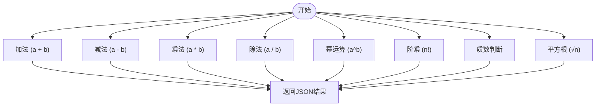
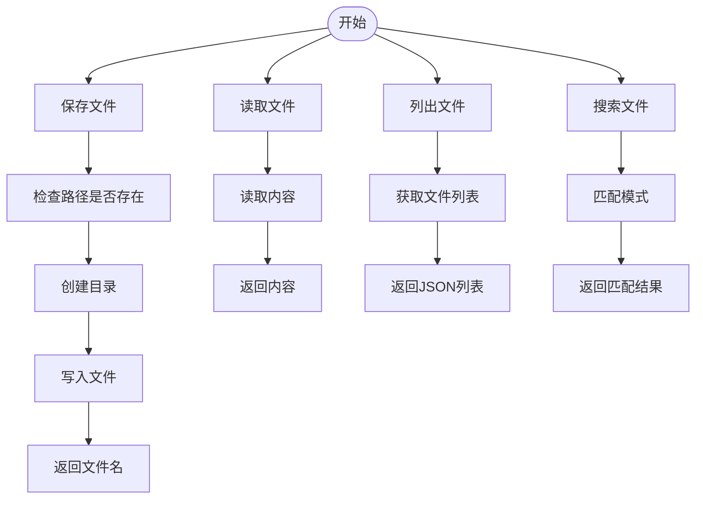
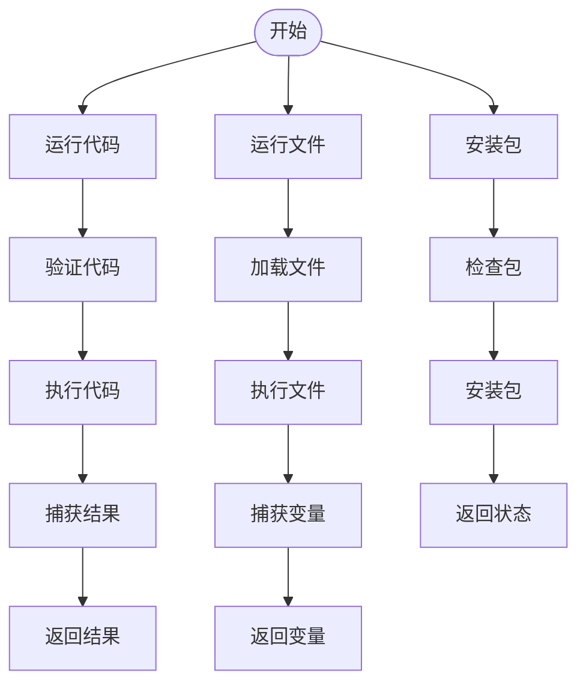
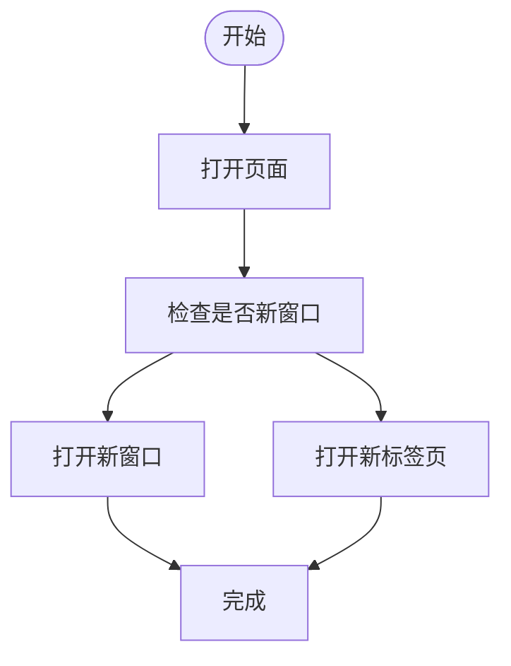
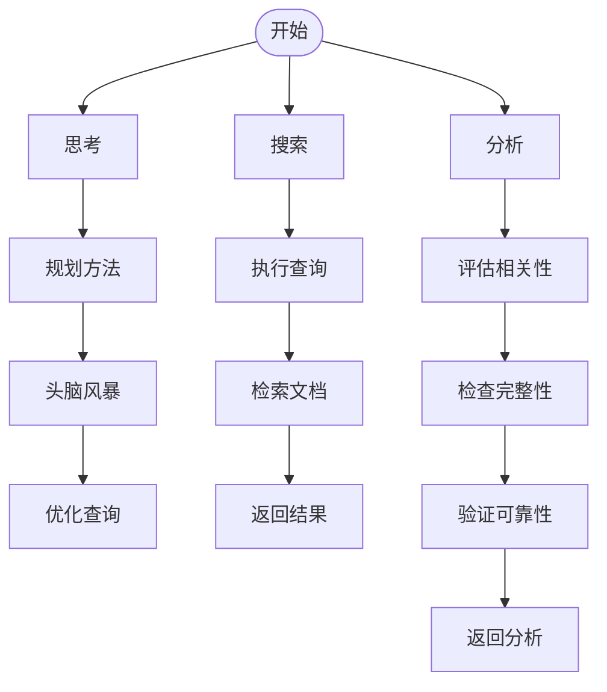
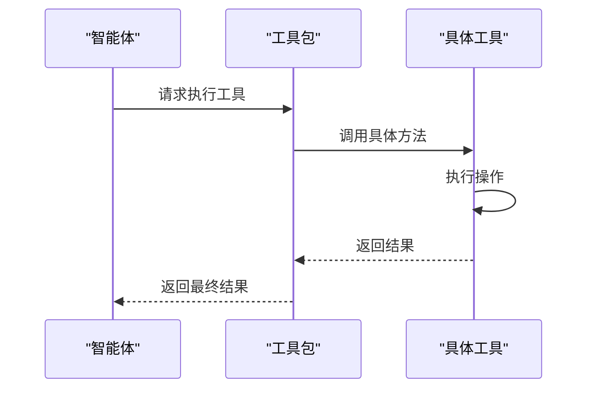

# 内置工具

<cite>
**本文档中引用的文件**  
- [calculator.py](file://libs/agno/agno/tools/calculator.py)
- [file.py](file://libs/agno/agno/tools/file.py)
- [python.py](file://libs/agno/agno/tools/python.py)
- [webbrowser.py](file://libs/agno/agno/tools/webbrowser.py)
- [knowledge.py](file://libs/agno/agno/tools/knowledge.py)
- [toolkit.py](file://libs/agno/agno/tools/toolkit.py)
- [function.py](file://libs/agno/agno/tools/function.py)
- [decorator.py](file://libs/agno/agno/tools/decorator.py)
- [agent_with_tools.py](file://cookbook/examples/agents/agent_with_tools.py)
</cite>

## 目录
1. [简介](#简介)
2. [核心功能与作用](#核心功能与作用)
3. [主要内置工具详解](#主要内置工具详解)
4. [工具注册与调用](#工具注册与调用)
5. [错误处理与返回值格式](#错误处理与返回值格式)
6. [与智能体执行流程的集成](#与智能体执行流程的集成)
7. [性能与安全考量](#性能与安全考量)
8. [总结](#总结)

## 简介
Agno 内置工具为智能体提供了开箱即用的常见功能，极大地增强了智能体的能力。这些工具通过标准化的接口和一致的错误处理机制，使智能体能够执行数学计算、文件操作、网络搜索和 Python 代码执行等复杂任务。本文档将详细介绍这些内置工具的设计、功能、使用方法以及它们如何与智能体的执行流程无缝集成。

## 核心功能与作用
Agno 内置工具的核心功能是为智能体提供一系列预定义、可复用的功能模块，使其无需从零开始实现常见操作。这些工具的主要作用包括：
- **功能扩展**：通过提供数学计算、文件操作、网络搜索等功能，扩展智能体的能力边界。
- **简化开发**：开发者无需手动实现这些常见功能，可以直接注册和使用内置工具。
- **标准化接口**：所有工具都遵循统一的接口规范，确保智能体可以一致地调用不同类型的工具。
- **增强交互性**：通过支持用户确认、外部执行等机制，提升智能体与用户的交互体验。

**Section sources**
- [toolkit.py](file://libs/agno/agno/tools/toolkit.py#L0-L146)

## 主要内置工具详解
### 计算器工具
计算器工具（CalculatorTools）提供了一系列基本的数学运算功能，包括加法、减法、乘法、除法、幂运算、阶乘、质数判断和平方根计算。每个操作都以 JSON 格式返回结果，便于智能体解析和使用。

**参数说明**：
- `a`, `b`: 用于二元运算的两个浮点数。
- `n`: 用于阶乘和质数判断的整数。

**使用场景**：
- 执行简单的数学计算。
- 验证数值结果的正确性。
- 处理需要精确计算的业务逻辑。



**Diagram sources**
- [calculator.py](file://libs/agno/agno/tools/calculator.py#L0-L151)

### 文件工具
文件工具（FileTools）允许智能体在指定的基础目录中进行文件操作，包括保存文件、读取文件、列出文件和搜索文件。该工具支持灵活的配置选项，如是否启用特定功能或设置基础目录。

**参数说明**：
- `contents`: 要保存的文件内容。
- `file_name`: 文件名。
- `overwrite`: 是否覆盖已存在的文件。
- `pattern`: 用于搜索文件的模式（如 "*.txt"）。

**使用场景**：
- 保存智能体生成的内容到文件。
- 读取配置文件或数据文件。
- 管理项目中的文件资源。



**Diagram sources**
- [file.py](file://libs/agno/agno/tools/file.py#L0-L110)

### Python 工具
Python 工具（PythonTools）允许智能体在安全的环境中执行 Python 代码，包括运行代码片段、安装包、读取文件等。该工具通过限制全局和局部作用域来提高安全性，并提供缓存机制以优化性能。

**参数说明**：
- `code`: 要执行的 Python 代码。
- `file_name`: 要运行的 Python 文件名。
- `variable_to_return`: 要返回的变量名。
- `package_name`: 要安装的包名。

**使用场景**：
- 执行动态生成的 Python 代码。
- 安装第三方库以扩展功能。
- 调试和测试代码片段。



**Diagram sources**
- [python.py](file://libs/agno/agno/tools/python.py#L0-L205)

### Web 浏览器工具
Web 浏览器工具（WebBrowserTools）允许智能体打开指定的 URL，支持在新窗口或新标签页中打开。该工具主要用于引导用户访问特定网页。

**参数说明**：
- `url`: 要打开的 URL。
- `new_window`: 是否在新窗口中打开。

**使用场景**：
- 引导用户访问帮助文档或外部资源。
- 提供可视化结果的链接。



**Diagram sources**
- [webbrowser.py](file://libs/agno/agno/tools/webbrowser.py#L0-L28)

### 知识工具
知识工具（KnowledgeTools）为智能体提供了访问和搜索知识库的能力，支持思考、搜索和分析三个核心操作。该工具通过指令和示例引导智能体高效利用知识资源。

**参数说明**：
- `thought`: 内部思考过程。
- `query`: 搜索查询。
- `analysis`: 对搜索结果的分析。

**使用场景**：
- 在复杂问题上进行多轮搜索和分析。
- 利用知识库中的信息回答用户问题。
- 进行决策支持和信息验证。



**Diagram sources**
- [knowledge.py](file://libs/agno/agno/tools/knowledge.py#L0-L218)

## 工具注册与调用
内置工具通过 `Toolkit` 类进行注册和管理。开发者可以通过创建工具实例并将其添加到智能体中来启用这些功能。以下是一个注册和调用工具的代码示例：

```python
from agno.agent import Agent
from agno.models.anthropic import Claude
from agno.tools.yfinance import YFinanceTools

agent = Agent(
    model=Claude(id="claude-3-7-sonnet-latest"),
    tools=[YFinanceTools(stock_price=True)],
    markdown=True,
)
agent.print_response("What is the stock price of Apple?", stream=True)
```

**关键步骤**：
1. **导入工具类**：从 `agno.tools` 模块导入所需的工具类。
2. **创建工具实例**：根据需要配置工具的参数。
3. **注册到智能体**：将工具实例传递给智能体的构造函数。
4. **调用工具**：通过智能体的接口触发工具执行。

**Section sources**
- [agent_with_tools.py](file://cookbook/examples/agents/agent_with_tools.py#L0-L10)
- [toolkit.py](file://libs/agno/agno/tools/toolkit.py#L0-L146)

## 错误处理与返回值格式
内置工具采用统一的错误处理机制，确保智能体能够可靠地处理异常情况。每个工具的返回值都遵循 JSON 格式，包含操作结果和可能的错误信息。

**错误处理机制**：
- **异常捕获**：在工具执行过程中捕获所有异常，并记录详细的错误日志。
- **错误返回**：将错误信息以 JSON 格式返回给智能体，便于解析和处理。
- **日志记录**：使用 `log_error` 和 `log_warning` 记录关键错误和警告信息。

**返回值格式**：
- **成功**：返回包含操作结果的 JSON 对象。
- **失败**：返回包含错误信息的 JSON 对象。

```json
{
  "operation": "addition",
  "result": 5
}
```

```json
{
  "operation": "division",
  "error": "Division by zero is undefined"
}
```

**Section sources**
- [function.py](file://libs/agno/agno/tools/function.py#L0-L1009)
- [calculator.py](file://libs/agno/agno/tools/calculator.py#L0-L151)

## 与智能体执行流程的集成
内置工具通过 `FunctionCall` 类与智能体的执行流程紧密集成。当智能体决定调用某个工具时，会创建一个 `FunctionCall` 实例，执行相应的操作，并将结果返回给智能体。

**集成流程**：
1. **工具选择**：智能体根据上下文选择合适的工具。
2. **参数解析**：解析工具所需的参数。
3. **执行调用**：创建 `FunctionCall` 实例并执行。
4. **结果处理**：接收并处理工具返回的结果。



**Diagram sources**
- [function.py](file://libs/agno/agno/tools/function.py#L0-L1009)
- [toolkit.py](file://libs/agno/agno/tools/toolkit.py#L0-L146)

## 性能与安全考量
### 性能优化
- **缓存机制**：通过 `cache_results` 参数启用结果缓存，减少重复计算的开销。
- **异步执行**：支持异步函数调用，提高并发处理能力。
- **参数验证**：使用 `validate_call` 装饰器确保输入参数的有效性。

### 安全措施
- **作用域限制**：在 `PythonTools` 中限制全局和局部作用域，防止恶意代码执行。
- **用户确认**：对于敏感操作，要求用户确认后再执行。
- **外部执行**：支持将某些工具的执行移出智能体的主循环，降低风险。

**Section sources**
- [python.py](file://libs/agno/agno/tools/python.py#L0-L205)
- [function.py](file://libs/agno/agno/tools/function.py#L0-L1009)

## 总结
Agno 内置工具为智能体提供了强大的功能扩展能力，涵盖了数学计算、文件操作、网络搜索和 Python 代码执行等多个方面。通过标准化的接口和一致的错误处理机制，这些工具不仅简化了开发过程，还提高了智能体的可靠性和安全性。开发者可以轻松地注册和调用这些工具，构建出功能丰富、交互性强的智能应用。