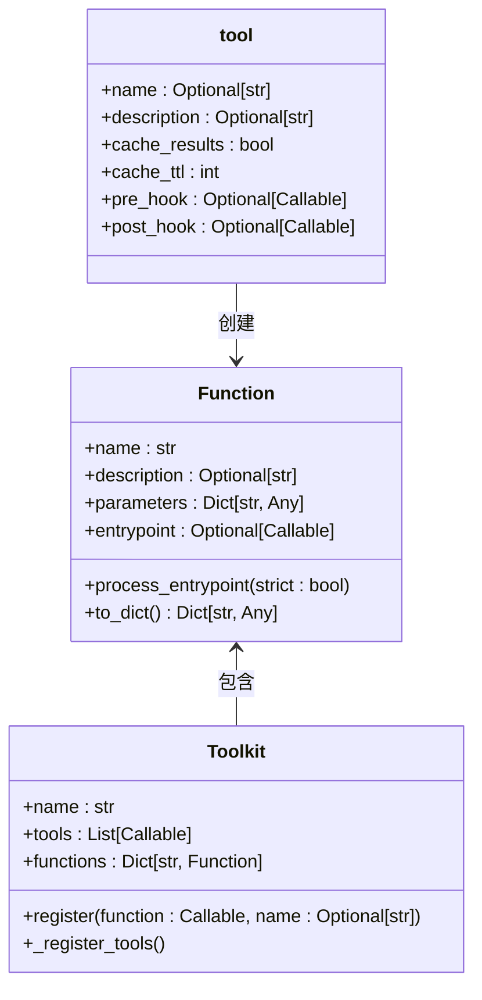
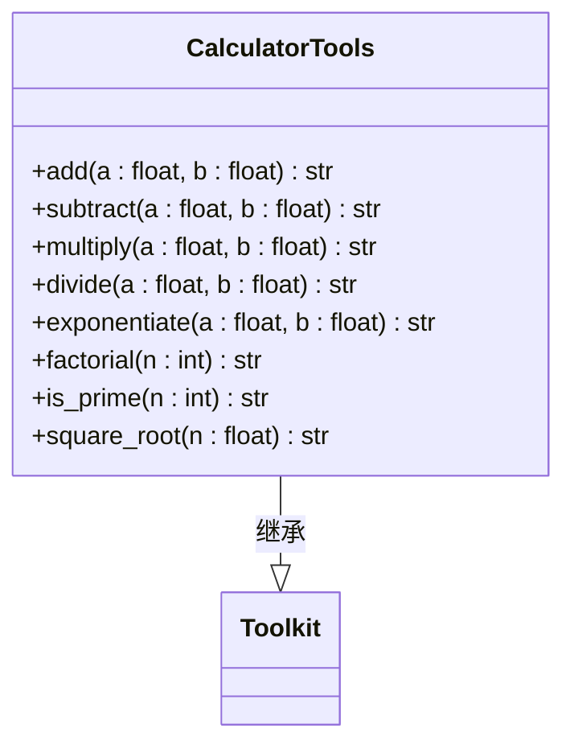
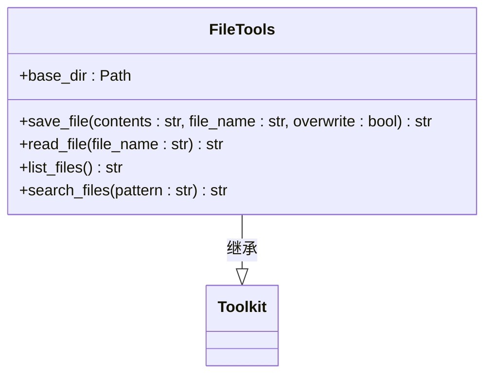
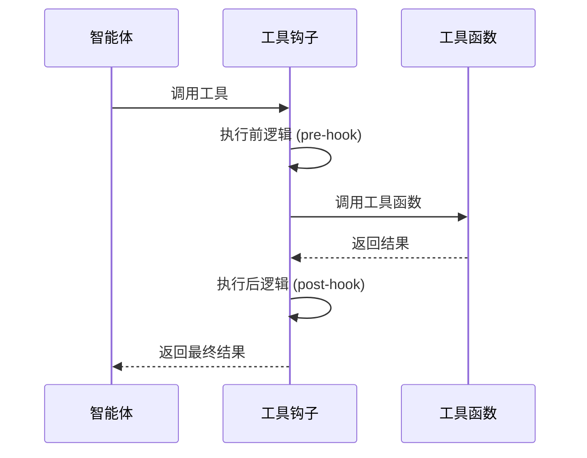
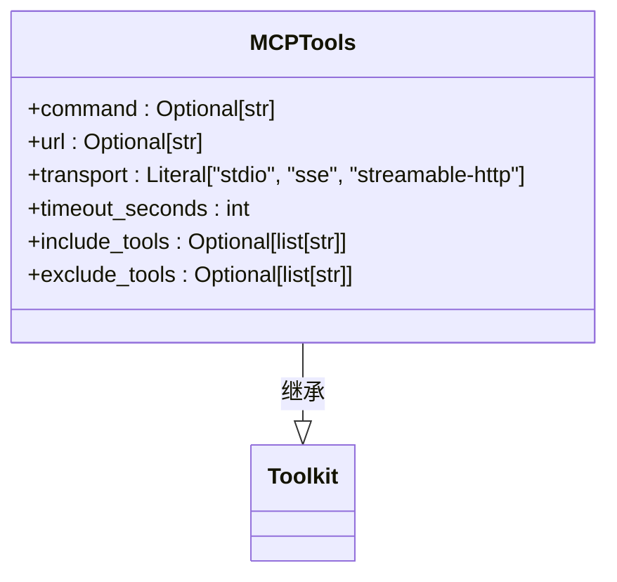

# 工具

<cite>
**本文档中引用的文件**  
- [calculator.py](file://libs/agno/agno/tools/calculator.py)
- [file.py](file://libs/agno/agno/tools/file.py)
- [mcp.py](file://libs/agno/agno/tools/mcp.py)
- [decorator.py](file://libs/agno/agno/tools/decorator.py)
- [function.py](file://libs/agno/agno/tools/function.py)
- [toolkit.py](file://libs/agno/agno/tools/toolkit.py)
- [tool_hook.py](file://cookbook/tools/tool_hooks/tool_hook.py)
- [tool_hook_async.py](file://cookbook/tools/tool_hooks/tool_hook_async.py)
- [python.py](file://libs/agno/agno/tools/python.py)
</cite>

## 目录
1. [简介](#简介)
2. [核心组件](#核心组件)
3. [工具注册与调用机制](#工具注册与调用机制)
4. [内置工具介绍](#内置工具介绍)
5. [自定义工具开发](#自定义工具开发)
6. [异步工具实现](#异步工具实现)
7. [工具钩子（Tool Hooks）](#工具钩子tool-hooks)
8. [MCP（Model Context Protocol）工具集成](#mcpmodel-context-protocol工具集成)
9. [缓存、重试与人机协作](#缓存重试与人机协作)
10. [错误处理机制](#错误处理机制)

## 简介
在 Agno 框架中，工具是扩展智能体能力的核心机制，允许智能体执行外部操作。工具系统提供了丰富的功能，包括内置工具、自定义工具开发、工具钩子、MCP 集成等。本文档详细介绍了工具系统的架构、使用方法和最佳实践。

## 核心组件

Agno 的工具系统由多个核心组件构成，包括装饰器、函数模型、工具包和注册机制。这些组件协同工作，为智能体提供强大的外部操作能力。

**Section sources**
- [decorator.py](file://libs/agno/agno/tools/decorator.py#L0-L262)
- [function.py](file://libs/agno/agno/tools/function.py#L0-L199)
- [toolkit.py](file://libs/agno/agno/tools/toolkit.py#L0-L146)

## 工具注册与调用机制

Agno 的工具注册机制基于装饰器模式和工具包（Toolkit）系统。通过 `@tool` 装饰器，可以将普通函数转换为智能体可调用的工具。工具包则用于组织和管理一组相关工具。



**Diagram sources**
- [function.py](file://libs/agno/agno/tools/function.py#L0-L199)
- [toolkit.py](file://libs/agno/agno/tools/toolkit.py#L0-L146)
- [decorator.py](file://libs/agno/agno/tools/decorator.py#L0-L262)

**Section sources**
- [function.py](file://libs/agno/agno/tools/function.py#L0-L400)
- [toolkit.py](file://libs/agno/agno/tools/toolkit.py#L0-L146)

## 内置工具介绍

Agno 提供了多种内置工具，涵盖计算、文件操作、网络搜索等常见场景。这些工具通过工具包的形式组织，可以方便地集成到智能体中。

### 计算器工具
计算器工具包提供了基本的数学运算功能，包括加减乘除、幂运算、阶乘、质数判断和平方根计算。



**Diagram sources**
- [calculator.py](file://libs/agno/agno/tools/calculator.py#L0-L151)

**Section sources**
- [calculator.py](file://libs/agno/agno/tools/calculator.py#L0-L151)

### 文件操作工具
文件操作工具包提供了文件的读写、列表和搜索功能，支持指定基础目录进行安全的文件操作。



**Diagram sources**
- [file.py](file://libs/agno/agno/tools/file.py#L0-L110)

**Section sources**
- [file.py](file://libs/agno/agno/tools/file.py#L0-L110)

## 自定义工具开发

开发自定义工具是扩展智能体能力的关键。通过 `@tool` 装饰器，可以轻松将任何函数转换为智能体可用的工具。

### 简单工具示例
```python
from agno.tools import tool

@tool
def get_current_weather(location: str, unit: str = "celsius") -> str:
    """
    获取指定位置的当前天气信息
    
    Args:
        location: 城市名称
        unit: 温度单位，可选值为 "celsius" 或 "fahrenheit"
    
    Returns:
        JSON格式的天气信息
    """
    # 实现天气查询逻辑
    return json.dumps({"location": location, "temperature": 25, "unit": unit})
```

### 工具配置选项
`@tool` 装饰器支持多种配置选项，用于控制工具的行为：

- **name**: 工具名称
- **description**: 工具描述
- **cache_results**: 是否启用结果缓存
- **cache_ttl**: 缓存有效期（秒）
- **requires_confirmation**: 是否需要用户确认
- **pre_hook**: 执行前钩子
- **post_hook**: 执行后钩子

**Section sources**
- [decorator.py](file://libs/agno/agno/tools/decorator.py#L0-L262)
- [function.py](file://libs/agno/agno/tools/function.py#L0-L199)

## 异步工具实现

Agno 支持异步工具，允许执行耗时的 I/O 操作而不阻塞智能体的响应。异步工具使用 `async def` 定义，并自动处理异常。

```python
@tool
async def fetch_webpage(url: str) -> str:
    """
    异步获取网页内容
    
    Args:
        url: 网页URL
    
    Returns:
        网页内容或错误信息
    """
    async with aiohttp.ClientSession() as session:
        async with session.get(url) as response:
            return await response.text()
```

**Section sources**
- [decorator.py](file://libs/agno/agno/tools/decorator.py#L0-L262)
- [python.py](file://libs/agno/agno/tools/python.py#L0-L200)

## 工具钩子（Tool Hooks）

工具钩子允许在工具执行前后注入自定义逻辑，如日志记录、性能监控、输入验证等。

### 钩子函数示例
```python
def logger_hook(function_name: str, function_call: Callable, arguments: Dict[str, Any]):
    # 执行前逻辑
    logger.info(f"正在执行 {function_name}，参数: {arguments}")
    
    # 调用工具
    result = function_call(**arguments)
    
    # 执行后逻辑
    logger.info(f"{function_name} 执行结果: {result}")
    return result
```

### 钩子注册
工具钩子可以通过多种方式注册：

1. **全局钩子**：在智能体级别注册，应用于所有工具
2. **工具级钩子**：在单个工具上注册
3. **工具包级钩子**：在工具包级别注册



**Diagram sources**
- [tool_hook.py](file://cookbook/tools/tool_hooks/tool_hook.py#L0-L27)
- [tool_hook_async.py](file://cookbook/tools/tool_hooks/tool_hook_async.py#L0-L30)

**Section sources**
- [tool_hook.py](file://cookbook/tools/tool_hooks/tool_hook.py#L0-L27)
- [decorator.py](file://libs/agno/agno/tools/decorator.py#L0-L262)

## MCP（Model Context Protocol）工具集成

MCP 工具包允许智能体集成外部 MCP 服务器提供的工具，扩展智能体的能力范围。

### MCP 工具初始化
MCP 工具支持多种初始化方式：

1. **Stdio 传输**：通过命令行启动 MCP 服务器
2. **SSE 传输**：通过服务器发送事件连接
3. **Streamable HTTP 传输**：通过 HTTP 流连接

```python
mcp_tools = MCPTools(
    command="python -m my_mcp_server",
    transport="stdio",
    timeout_seconds=10
)
```

### MCP 工具配置
MCP 工具支持以下配置选项：

- **command**: 启动 MCP 服务器的命令
- **url**: SSE 或 Streamable HTTP 的连接 URL
- **env**: 环境变量
- **transport**: 传输协议
- **include_tools**: 包含的工具列表
- **exclude_tools**: 排除的工具列表



**Diagram sources**
- [mcp.py](file://libs/agno/agno/tools/mcp.py#L0-L199)

**Section sources**
- [mcp.py](file://libs/agno/agno/tools/mcp.py#L0-L199)

## 缓存、重试与人机协作

Agno 的工具系统提供了缓存、重试和人机协作等高级功能，提升工具的性能和用户体验。

### 缓存机制
工具结果缓存可以显著提高性能，避免重复计算或网络请求。

```python
@tool(cache_results=True, cache_ttl=3600, cache_dir="/tmp/tool_cache")
def expensive_computation(data: str) -> str:
    # 耗时计算
    return result
```

### 人机协作
工具系统支持多种人机协作模式：

- **requires_confirmation**: 需要用户确认
- **requires_user_input**: 需要用户输入
- **external_execution**: 外部执行

### 重试机制
虽然文档中未直接展示重试机制，但通过工具钩子可以实现自定义的重试逻辑。

**Section sources**
- [decorator.py](file://libs/agno/agno/tools/decorator.py#L0-L262)
- [toolkit.py](file://libs/agno/agno/tools/toolkit.py#L0-L146)

## 错误处理机制

Agno 的工具系统内置了完善的错误处理机制，确保工具执行的稳定性和可靠性。

### 异常捕获
工具装饰器自动捕获并记录工具执行过程中的异常：

```python
@wraps(func)
def sync_wrapper(*args: Any, **kwargs: Any) -> Any:
    try:
        return func(*args, **kwargs)
    except Exception as e:
        logger.error(f"工具 {func.__name__!r} 执行出错: {e!r}", exc_info=True)
        raise
```

### 错误传播
工具执行失败时，异常会被正确传播，智能体可以根据错误信息做出相应决策。

### 错误恢复
通过工具钩子，可以实现自定义的错误恢复逻辑，如重试、降级或通知。

**Section sources**
- [decorator.py](file://libs/agno/agno/tools/decorator.py#L0-L262)
- [function.py](file://libs/agno/agno/tools/function.py#L0-L199)