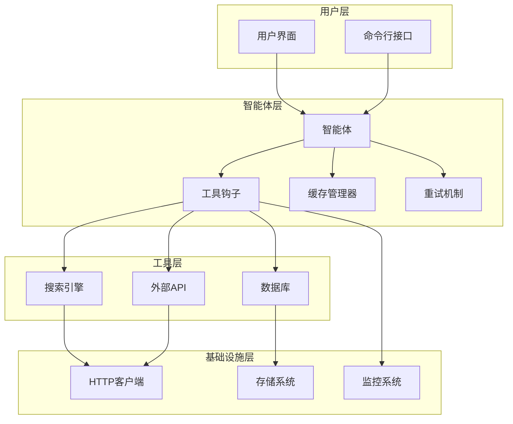

# 工具高级特性

<cite>
**本文档中引用的文件**
- [tool_hooks_in_toolkit_nested.py](file://cookbook/tools/tool_hooks/tool_hooks_in_toolkit_nested.py)
- [tool_hooks_in_toolkit_nested_async.py](file://cookbook/tools/tool_hooks/tool_hooks_in_toolkit_nested_async.py)
- [02_team_with_tool_hooks.py](file://cookbook/teams/tools/02_team_with_tool_hooks.py)
- [12_human_in_the_loop.py](file://cookbook/getting_started/12_human_in_the_loop.py)
- [location_instructions.py](file://cookbook/agents/context_management/location_instructions.py)
- [blog_post_generator.py](file://cookbook/examples/workflows/blog_post_generator.py)
- [custom_tools.py](file://cookbook/tools/custom_tools.py)
- [http.py](file://libs/agno/agno/utils/http.py)
- [exceptions.py](file://libs/agno/agno/exceptions.py)
- [agent.py](file://libs/agno/agno/agent/agent.py)
</cite>

## 目录
1. [简介](#简介)
2. [工具钩子机制](#工具钩子机制)
3. [工具缓存功能](#工具缓存功能)
4. [人机协作模式](#人机协作模式)
5. [重试机制和错误处理](#重试机制和错误处理)
6. [高级特性组合使用](#高级特性组合使用)
7. [最佳实践](#最佳实践)
8. [总结](#总结)

## 简介

Agno 框架提供了强大的工具高级特性，包括工具钩子（Tool Hooks）、缓存功能、人机协作模式以及完善的重试机制。这些特性共同构成了一个健壮的智能体系统，能够处理复杂的业务场景和高可靠性要求的应用。

本文档将深入探讨这些高级特性的实现原理、使用方法和最佳实践，帮助开发者构建更加可靠和高效的智能体系统。

## 工具钩子机制

### 基本概念

工具钩子是一种在工具执行前后注入自定义逻辑的机制。它允许开发者在工具调用过程中插入日志记录、监控、验证等操作，而无需修改工具本身的实现。

### 同步工具钩子

同步工具钩子是最基础的形式，适用于普通的同步函数：

```python
def validation_hook(name: str, func: Callable, arguments: Dict[str, Any]):
    if name == "retrieve_customer_profile":
        cust_id = arguments.get("customer_id")
        if cust_id == "123":
            raise ValueError("Cannot retrieve customer profile for ID 123")
    
    logger.info("Before Validation Hook")
    result = func(**arguments)
    logger.info("After Validation Hook")
    return result
```

### 异步工具钩子

异步工具钩子支持异步操作，适用于需要等待外部服务响应的场景：

```python
async def validation_hook(name: str, func: Callable, arguments: Dict[str, Any]):
    if name == "retrieve_customer_profile":
        cust_id = arguments.get("customer_id")
        if cust_id == "123":
            raise ValueError("Cannot retrieve customer profile for ID 123")
    
    logger.info("Before Validation Hook")
    if iscoroutinefunction(func):
        result = await func(**arguments)
    else:
        result = func(**arguments)
    logger.info("After Validation Hook")
    return result
```

### 钩子执行顺序

多个钩子会按照注册的顺序依次执行，形成链式调用：

```python
agent = Agent(
    tools=[CustomerDBTools()],
    tool_hooks=[validation_hook, logger_hook],  # 执行顺序：validation_hook -> logger_hook
)
```

### 团队级别的钩子

团队级别的钩子可以应用于整个团队的所有成员：

```python
company_info_team = Team(
    name="Company Info Team",
    model=Claude(id="claude-3-7-sonnet-latest"),
    members=[reddit_agent, website_agent],
    tool_hooks=[logger_hook],  # 应用于所有成员
)
```

**章节来源**
- [tool_hooks_in_toolkit_nested.py](file://cookbook/tools/tool_hooks/tool_hooks_in_toolkit_nested.py#L1-L83)
- [tool_hooks_in_toolkit_nested_async.py](file://cookbook/tools/tool_hooks/tool_hooks_in_toolkit_nested_async.py#L1-L102)
- [02_team_with_tool_hooks.py](file://cookbook/teams/tools/02_team_with_tool_hooks.py#L1-L98)

## 工具缓存功能

### 缓存配置

工具可以通过设置 `cache_results=True` 来启用缓存功能：

```python
agent = Agent(
    model=OpenAIChat(id="gpt-4o"),
    tools=[DuckDuckGoTools(cache_results=True)],
)
```

### 自定义缓存参数

工具包可以配置更详细的缓存参数：

```python
class CustomerDBTools(Toolkit):
    def __init__(self, *args, **kwargs):
        super().__init__(
            *args, 
            **kwargs,
            cache_results=True,
            cache_ttl=3600,  # 缓存过期时间（秒）
            cache_dir="/tmp/cache"  # 缓存目录
        )
```

### 工作流级别的缓存

在工作流中实现自定义缓存机制：

```python
def get_cached_search_results(session_state, topic: str) -> Optional[SearchResults]:
    """从工作流会话状态获取缓存的搜索结果"""
    logger.info("检查是否存在缓存的搜索结果")
    search_results = session_state.get("search_results", {}).get(topic)
    if search_results and isinstance(search_results, dict):
        try:
            return SearchResults.model_validate(search_results)
        except Exception as e:
            logger.warning(f"无法验证缓存的搜索结果: {e}")
    return search_results if isinstance(search_results, SearchResults) else None

def cache_search_results(session_state, topic: str, search_results: SearchResults):
    """将搜索结果缓存到工作流会话状态"""
    logger.info(f"保存搜索结果的主题: {topic}")
    if "search_results" not in session_state:
        session_state["search_results"] = {}
    session_state["search_results"][topic] = search_results.model_dump()
```

### 多层缓存策略

实现多层缓存以提高性能：

```python
async def get_search_results(
    session_state, topic: str, use_cache: bool = True, num_attempts: int = 3
) -> Optional[SearchResults]:
    """带缓存支持的搜索结果获取"""
    
    # 先检查缓存
    if use_cache:
        cached_results = get_cached_search_results(session_state, topic)
        if cached_results:
            logger.info(f"在缓存中找到 {len(cached_results.articles)} 篇文章。")
            return cached_results
    
    # 搜索新结果
    for attempt in range(num_attempts):
        try:
            response = await research_agent.arun(topic)
            
            if response and response.content and isinstance(response.content, SearchResults):
                article_count = len(response.content.articles)
                logger.info(f"尝试 {attempt + 1}/{num_attempts} 成功: 找到 {article_count} 篇文章")
                
                # 缓存结果
                cache_search_results(session_state, topic, response.content)
                return response.content
            
        except Exception as e:
            logger.warning(f"尝试 {attempt + 1}/{num_attempts} 失败: {str(e)}")
    
    return None
```

**章节来源**
- [location_instructions.py](file://cookbook/agents/context_management/location_instructions.py#L1-L12)
- [blog_post_generator.py](file://cookbook/examples/workflows/blog_post_generator.py#L200-L300)

## 人机协作模式

### 基本确认机制

通过 `requires_confirmation=True` 装饰器启用用户确认：

```python
@tool(requires_confirmation=True)
def get_top_hackernews_stories(num_stories: int) -> str:
    """从 Hacker News 获取热门故事"""
    # 实现细节...
    return json.dumps(all_stories)
```

### 用户交互流程

完整的用户确认流程：

```python
response = agent.run("What are the top 2 hackernews stories?")
if response.is_paused:
    for tool in response.tools:  # type: ignore
        # 请求确认
        console.print(
            f"工具名称 [bold blue]{tool.tool_name}({tool.tool_args})[/] 需要确认。"
        )
        message = (
            Prompt.ask("是否继续?", choices=["y", "n"], default="y")
            .strip()
            .lower()
        )

        if message == "n":
            break
        else:
            # 更新工具状态
            tool.confirmed = True

    run_response = agent.continue_run(run_response=response)
    pprint.pprint_run_response(run_response)
```

### 敏感操作保护

为特定工具启用确认机制：

```python
class CustomerDBTools(Toolkit):
    def __init__(self, *args, **kwargs):
        super().__init__(*args, **kwargs)
        
        self.register(self.retrieve_customer_profile)
        self.register(self.delete_customer_profile)
        
        # 为删除操作添加确认
        self.requires_confirmation_tools = ["delete_customer_profile"]
```

### 流式输出中的确认

支持流式输出的人机协作：

```python
agent.print_response(
    "I am customer 456, please retrieve my profile.", 
    stream=True
)
```

**章节来源**
- [12_human_in_the_loop.py](file://cookbook/getting_started/12_human_in_the_loop.py#L1-L102)

## 重试机制和错误处理

### HTTP 请求重试

内置的 HTTP 请求重试机制：

```python
def fetch_with_retry(
    url: str,
    max_retries: int = DEFAULT_MAX_RETRIES,
    backoff_factor: int = DEFAULT_BACKOFF_FACTOR,
    proxy: Optional[str] = None,
) -> httpx.Response:
    """带重试逻辑的同步 HTTP GET 请求"""
    
    for attempt in range(max_retries):
        try:
            response = httpx.get(url, proxy=proxy) if proxy else httpx.get(url)
            response.raise_for_status()
            return response
        except httpx.RequestError as e:
            if attempt == max_retries - 1:
                logger.error(f"在 {max_retries} 次尝试后获取 {url} 失败: {e}")
                raise
            wait_time = backoff_factor**attempt
            logger.warning(f"请求失败 (尝试 {attempt + 1})，{wait_time} 秒后重试...")
            sleep(wait_time)
        except httpx.HTTPStatusError as e:
            logger.error(f"{url} 的 HTTP 错误: {e.response.status_code} - {e.response.text}")
            raise
    
    raise httpx.RequestError(f"在 {max_retries} 次尝试后获取 {url} 失败")
```

### 异步重试机制

支持异步操作的重试机制：

```python
async def async_fetch_with_retry(
    url: str,
    client: Optional[httpx.AsyncClient] = None,
    max_retries: int = DEFAULT_MAX_RETRIES,
    backoff_factor: int = DEFAULT_BACKOFF_FACTOR,
    proxy: Optional[str] = None,
) -> httpx.Response:
    """带重试逻辑的异步 HTTP GET 请求"""
    
    for attempt in range(max_retries):
        try:
            response = await _fetch()
            response.raise_for_status()
            return response
        except httpx.RequestError as e:
            if attempt == max_retries - 1:
                logger.error(f"在 {max_retries} 次尝试后获取 {url} 失败: {e}")
                raise
            wait_time = backoff_factor**attempt
            logger.warning(f"请求失败 (尝试 {attempt + 1})，{wait_time} 秒后重试...")
            await asyncio.sleep(wait_time)
        except httpx.HTTPStatusError as e:
            logger.error(f"{url} 的 HTTP 错误: {e.response.status_code} - {e.response.text}")
            raise
    
    raise httpx.RequestError(f"在 {max_retries} 次尝试后获取 {url} 失败")
```

### 工具调用重试

工具调用层面的重试机制：

```python
class RetryAgentRun(AgentRunException):
    """当工具调用应该重试时抛出的异常"""
    
    def __init__(
        self,
        exc,
        user_message: Optional[Union[str, Message]] = None,
        agent_message: Optional[Union[str, Message]] = None,
        messages: Optional[List[Union[dict, Message]]] = None,
    ):
        super().__init__(
            exc, user_message=user_message, agent_message=agent_message, 
            messages=messages, stop_execution=False
        )
```

### 指数退避策略

实现指数退避的重试策略：

```python
def exponential_backoff_retry(func, max_retries=3, base_delay=1):
    """带指数退避的重试装饰器"""
    def wrapper(*args, **kwargs):
        for attempt in range(max_retries):
            try:
                return func(*args, **kwargs)
            except Exception as e:
                if attempt == max_retries - 1:
                    raise
                
                delay = base_delay * (2 ** attempt)
                logger.warning(f"尝试 {attempt + 1} 失败，{delay} 秒后重试...")
                time.sleep(delay)
    
    return wrapper
```

**章节来源**
- [http.py](file://libs/agno/agno/utils/http.py#L1-L73)
- [exceptions.py](file://libs/agno/agno/exceptions.py#L1-L93)
- [agent.py](file://libs/agno/agno/agent/agent.py#L1881-L1918)

## 高级特性组合使用

### 综合示例：带钩子和缓存的智能体

```python
class IntelligentAgent(Agent):
    def __init__(self):
        super().__init__(
            tools=[SearchTools(), DatabaseTools(), ExternalAPITools()],
            tool_hooks=[logger_hook, validation_hook, monitoring_hook],
            session_state={},
            cache_results=True,
            cache_ttl=3600,
        )
    
    def process_request(self, query: str) -> str:
        """处理查询请求，结合所有高级特性"""
        try:
            # 使用缓存的结果
            cached_result = self._get_cached_result(query)
            if cached_result:
                return cached_result
            
            # 执行工具调用
            response = self.run(query)
            
            # 缓存新的结果
            if response.content:
                self._cache_result(query, response.content)
            
            return response.content
            
        except Exception as e:
            logger.error(f"处理查询 '{query}' 时发生错误: {e}")
            return "抱歉，处理您的请求时遇到问题，请稍后再试。"
```

### 多层架构设计



**图表来源**
- [tool_hooks_in_toolkit_nested.py](file://cookbook/tools/tool_hooks/tool_hooks_in_toolkit_nested.py#L1-L83)
- [blog_post_generator.py](file://cookbook/examples/workflows/blog_post_generator.py#L200-L300)

### 性能优化策略

```python
class OptimizedAgent(Agent):
    def __init__(self):
        super().__init__(
            tools=self._initialize_optimized_tools(),
            tool_hooks=[self._setup_performance_hooks()],
            cache_results=True,
            cache_ttl=7200,  # 更长的缓存时间
            session_state={},
        )
    
    def _initialize_optimized_tools(self):
        """初始化优化的工具集"""
        return [
            DuckDuckGoTools(cache_results=True),
            WikipediaTools(cache_results=True),
            AsyncDatabaseTools(cache_results=True),
        ]
    
    def _setup_performance_hooks(self):
        """设置性能监控钩子"""
        def performance_hook(name: str, func: Callable, arguments: Dict[str, Any]):
            start_time = time.time()
            try:
                result = func(**arguments)
                duration = time.time() - start_time
                logger.info(f"工具 {name} 执行耗时: {duration:.2f} 秒")
                return result
            except Exception as e:
                duration = time.time() - start_time
                logger.error(f"工具 {name} 执行失败，耗时: {duration:.2f} 秒，错误: {e}")
                raise
        
        return performance_hook
```

## 最佳实践

### 1. 钩子设计原则

- **单一职责**: 每个钩子只负责一个特定的功能
- **无副作用**: 钩子不应修改原始函数的行为
- **快速返回**: 钩子应该尽快完成其任务
- **错误处理**: 完善的错误处理和日志记录

### 2. 缓存策略

- **合理设置 TTL**: 根据数据更新频率设置合适的缓存时间
- **缓存键设计**: 使用有意义的键值结构
- **缓存失效**: 实现适当的缓存失效机制
- **内存管理**: 控制缓存大小，避免内存泄漏

### 3. 人机协作

- **明确提示**: 清楚地告知用户哪些操作需要确认
- **默认行为**: 提供合理的默认选项
- **取消机制**: 支持安全的取消操作
- **用户体验**: 保持简洁直观的交互界面

### 4. 错误处理

- **分级处理**: 区分可重试和不可重试的错误
- **指数退避**: 使用指数退避策略减少服务器压力
- **超时控制**: 设置合理的超时时间
- **降级策略**: 实现优雅的降级方案

### 5. 监控和调试

```python
def comprehensive_monitoring_hook(name: str, func: Callable, arguments: Dict[str, Any]):
    """综合监控钩子"""
    start_time = time.time()
    logger.info(f"开始执行工具: {name}, 参数: {arguments}")
    
    try:
        result = func(**arguments)
        duration = time.time() - start_time
        logger.info(f"工具 {name} 执行成功，耗时: {duration:.2f} 秒，结果长度: {len(str(result))}")
        return result
    except Exception as e:
        duration = time.time() - start_time
        logger.error(f"工具 {name} 执行失败，耗时: {duration:.2f} 秒，错误: {e}")
        raise
```

## 总结

Agno 框架的工具高级特性为构建健壮的智能体系统提供了强大的支持。通过合理使用工具钩子、缓存功能、人机协作模式和重试机制，开发者可以：

1. **增强可观测性**: 通过钩子实现全面的日志记录和监控
2. **提升性能**: 利用缓存减少重复计算和网络请求
3. **确保安全性**: 通过人机协作防止危险操作
4. **提高可靠性**: 通过重试机制应对临时故障
5. **简化开发**: 组合使用各种特性减少重复工作

这些高级特性相互配合，形成了一个完整的解决方案，能够满足企业级应用的各种需求。在实际项目中，建议根据具体场景选择合适的特性组合，并遵循最佳实践来确保系统的稳定性和可维护性。