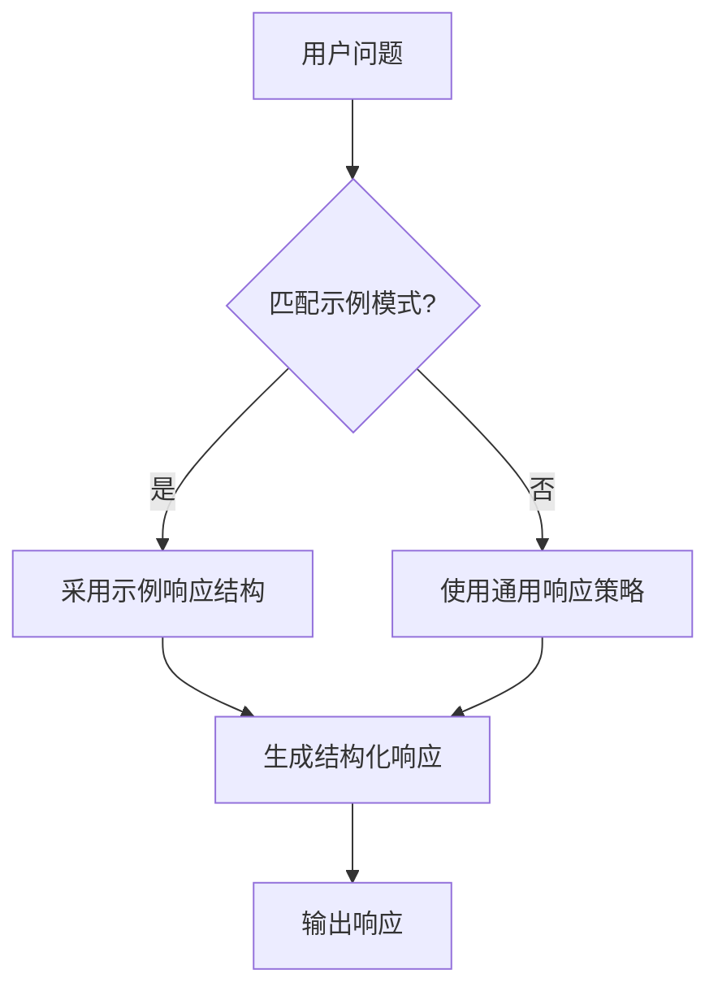
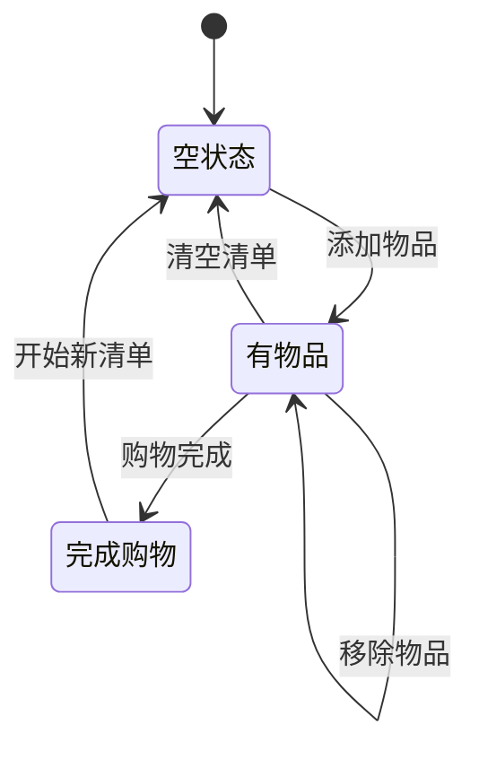

# 上下文与指令管理

<cite>
**本文档中引用的文件**   
- [dynamic_instructions.py](file://cookbook/agents/context_management/dynamic_instructions.py)
- [few_shot_learning.py](file://cookbook/agents/context_management/few_shot_learning.py)
- [instructions.py](file://cookbook/agents/context_management/instructions.py)
- [instructions_via_function.py](file://cookbook/agents/context_management/instructions_via_function.py)
- [datetime_instructions.py](file://cookbook/agents/context_management/datetime_instructions.py)
- [location_instructions.py](file://cookbook/agents/context_management/location_instructions.py)
- [add_dependencies_to_context.py](file://cookbook/agents/dependencies/add_dependencies_to_context.py)
- [reference_dependencies.py](file://cookbook/agents/dependencies/reference_dependencies.py)
- [session_state_basic.py](file://cookbook/agents/state/session_state_basic.py)
- [session_state_advanced.py](file://cookbook/agents/state/session_state_advanced.py)
- [session_state_in_context.py](file://cookbook/agents/state/session_state_in_context.py)
</cite>

## 目录
1. [引言](#引言)
2. [静态与动态指令设置](#静态与动态指令设置)
3. [通过函数注入指令](#通过函数注入指令)
4. [少样本学习应用](#少样本学习应用)
5. [上下文管理机制](#上下文管理机制)
6. [动态指令调整示例](#动态指令调整示例)
7. [综合应用案例](#综合应用案例)
8. [最佳实践与建议](#最佳实践与建议)

## 引言
本文档深入探讨智能体上下文与指令管理的核心机制。通过分析代码库中的实际示例，我们将详细阐述如何为智能体设置静态和动态指令以指导其行为和响应风格，如何通过函数动态注入指令，以及如何利用少样本学习提升智能体性能。同时，文档将阐明上下文管理在维持对话连贯性和任务导向性中的关键作用，并提供代码示例展示如何根据用户输入或外部条件动态调整智能体的指令集，从而实现更灵活、更智能的交互。

## 静态与动态指令设置
智能体的指令设置是其行为模式的基础。系统支持两种主要的指令设置方式：静态指令和动态指令。

静态指令在智能体初始化时直接定义，为智能体提供固定的行为准则。这种方式适用于那些不需要根据上下文变化而调整行为模式的场景。

动态指令则允许根据运行时状态或用户特征动态生成指令内容。这种灵活性使得智能体能够根据当前会话状态、用户身份或其他上下文信息调整其行为方式，从而提供更加个性化和情境化的响应。

**Section sources**
- [instructions.py](file://cookbook/agents/context_management/instructions.py#L1-L5)
- [dynamic_instructions.py](file://cookbook/agents/context_management/dynamic_instructions.py#L1-L12)

## 通过函数注入指令
系统支持通过函数注入指令的高级功能，允许开发者创建更加复杂和动态的指令生成逻辑。这种方法不仅能够基于智能体自身属性（如名称）生成指令，还可以结合外部数据源和实时信息来构建上下文感知的指令集。

指令生成函数可以返回字符串或字符串列表，系统会自动将其整合到智能体的上下文中。这种方式特别适用于需要根据智能体配置、用户偏好或环境状态动态调整行为模式的场景。

**Section sources**
- [instructions_via_function.py](file://cookbook/agents/context_management/instructions_via_function.py#L1-L20)
- [reference_dependencies.py](file://cookbook/agents/dependencies/reference_dependencies.py#L1-L52)

## 少样本学习应用
少样本学习是一种有效的技术，通过向智能体提供少量高质量的示例对话，可以显著提升其响应质量和一致性。系统通过`additional_input`参数支持这一功能，允许开发者注入示范性的用户-助手交互模式。

这些示例对话作为"思维模板"，指导智能体在类似情境下采用相同的响应结构和风格。这种方法特别适用于客户服务、技术支持等需要保持专业性和一致性的场景，能够确保智能体遵循既定的沟通规范和解决问题的流程。

**Diagram sources**
- [few_shot_learning.py](file://cookbook/agents/context_management/few_shot_learning.py#L1-L95)

**Section sources**
- [few_shot_learning.py](file://cookbook/agents/context_management/few_shot_learning.py#L1-L95)

## 上下文管理机制
上下文管理是维持对话连贯性和任务导向性的关键。系统提供了多种上下文注入机制，包括时间、位置、历史记录和会话状态等，确保智能体能够基于丰富的上下文信息做出响应。

时间上下文注入使智能体能够感知当前日期和时间，这对于处理时间敏感的查询至关重要。位置上下文注入则让智能体了解用户的地理位置，从而提供基于位置的服务和信息。历史记录管理确保智能体能够参考之前的对话内容，维持对话的连贯性。会话状态管理则允许智能体在跨多个交互中保持特定的状态信息。

**Section sources**
- [datetime_instructions.py](file://cookbook/agents/context_management/datetime_instructions.py#L1-L12)
- [location_instructions.py](file://cookbook/agents/context_management/location_instructions.py#L1-L12)
- [session_state_basic.py](file://cookbook/agents/state/session_state_basic.py#L1-L27)

## 动态指令调整示例
动态指令调整是智能体适应不同用户和情境的核心能力。通过会话状态和依赖注入机制，智能体能够根据当前上下文动态调整其行为模式。

例如，在购物清单管理场景中，智能体可以维护一个会话状态，记录用户当前的购物清单。指令中可以引用这个状态变量，使智能体始终了解当前的购物清单内容，并据此提供相关建议或执行操作。这种机制使得智能体能够在多次交互中保持对任务状态的跟踪，实现真正的任务导向型对话。

**Diagram sources**
- [session_state_advanced.py](file://cookbook/agents/state/session_state_advanced.py#L1-L77)

**Section sources**
- [session_state_advanced.py](file://cookbook/agents/state/session_state_advanced.py#L1-L77)
- [session_state_in_context.py](file://cookbook/agents/state/session_state_in_context.py#L1-L37)

## 综合应用案例
在实际应用中，多种上下文管理技术往往结合使用，以创建功能强大且智能的交互体验。例如，一个高级的客户支持智能体可能同时利用少样本学习、动态指令生成和上下文注入等多种技术。

这样的智能体不仅能够遵循预设的客户服务流程，还能根据用户的地理位置、当前时间和历史交互记录提供个性化的支持。通过依赖注入，智能体可以实时获取产品信息、库存状态等外部数据，并将其整合到响应中，提供准确和及时的帮助。

**Section sources**
- [add_dependencies_to_context.py](file://cookbook/agents/dependencies/add_dependencies_to_context.py#L1-L50)
- [few_shot_learning.py](file://cookbook/agents/context_management/few_shot_learning.py#L1-L95)

## 最佳实践与建议
在设计和实现智能体的上下文与指令管理时，应遵循以下最佳实践：

1. **明确指令目标**：确保指令清晰地定义了智能体的角色、责任和期望行为模式。
2. **合理使用动态指令**：在需要个性化响应的场景中使用动态指令，但避免过度复杂化指令生成逻辑。
3. **精心设计少样本示例**：选择高质量、代表性的对话示例，确保它们能够有效指导智能体的行为。
4. **有效管理上下文**：根据应用场景选择合适的上下文注入方式，避免信息过载。
5. **测试和迭代**：持续测试智能体在不同情境下的表现，并根据反馈优化指令和上下文管理策略。

通过遵循这些实践，可以创建出既灵活又可靠的智能体，为用户提供卓越的交互体验。