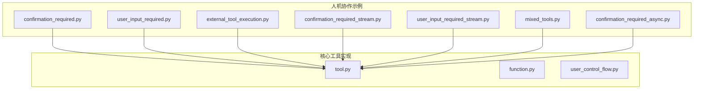
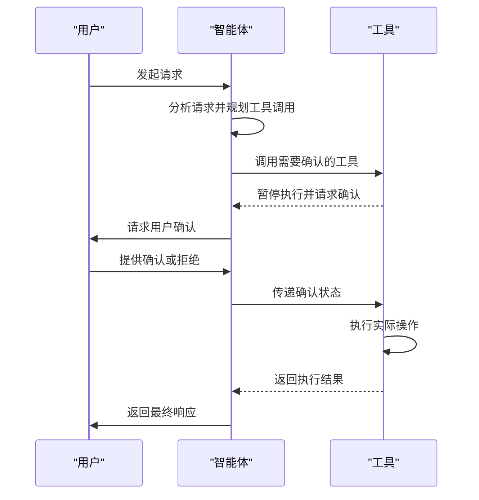
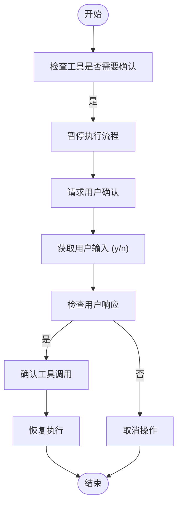
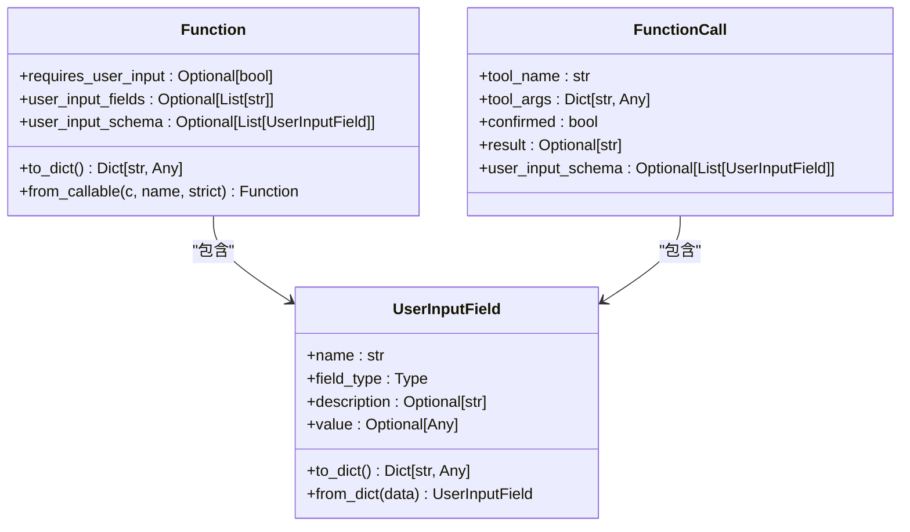
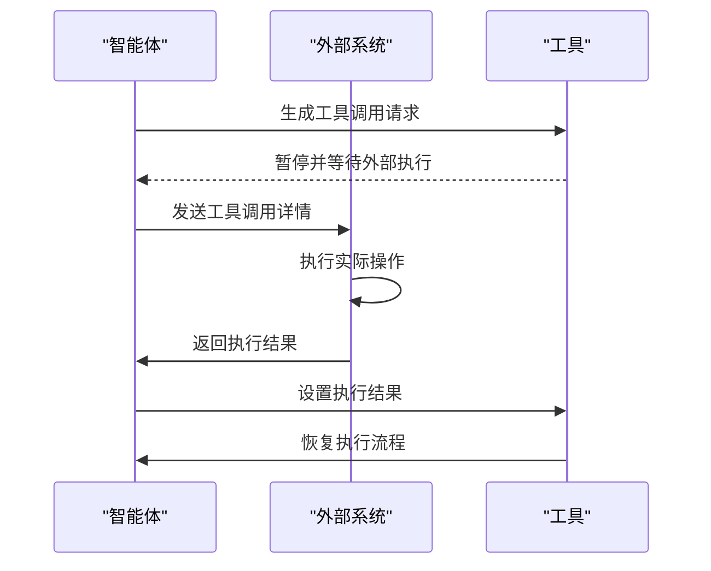
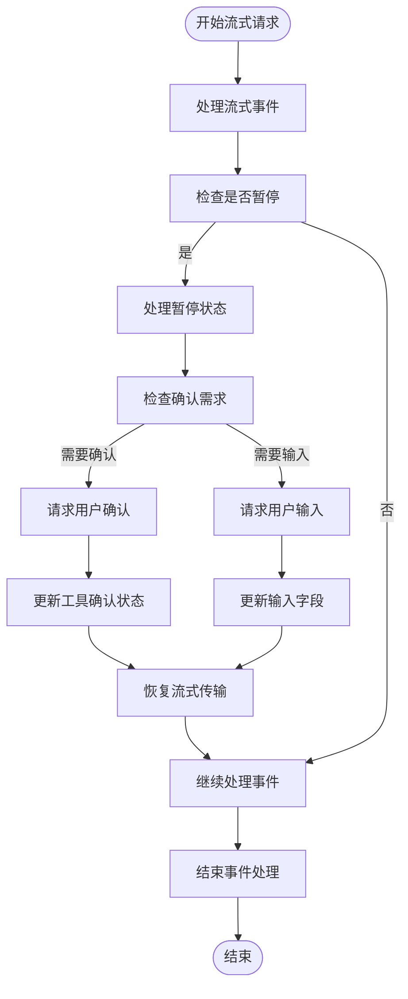
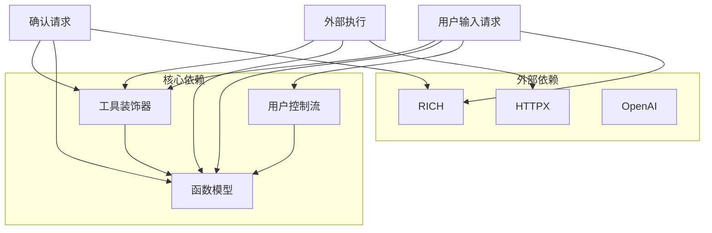

# 人机协作

<cite>
**本文档中引用的文件**  
- [confirmation_required.py](file://cookbook/agents/human_in_the_loop/confirmation_required.py)
- [user_input_required.py](file://cookbook/agents/human_in_the_loop/user_input_required.py)
- [external_tool_execution.py](file://cookbook/agents/human_in_the_loop/external_tool_execution.py)
- [confirmation_required_stream.py](file://cookbook/agents/human_in_the_loop/confirmation_required_stream.py)
- [user_input_required_stream.py](file://cookbook/agents/human_in_the_loop/user_input_required_stream.py)
- [tool.py](file://libs/agno/agno/tools/decorator.py)
- [function.py](file://libs/agno/agno/tools/function.py)
- [user_control_flow.py](file://libs/agno/agno/tools/user_control_flow.py)
</cite>

## 目录
1. [简介](#简介)
2. [项目结构](#项目结构)
3. [核心组件](#核心组件)
4. [架构概述](#架构概述)
5. [详细组件分析](#详细组件分析)
6. [依赖分析](#依赖分析)
7. [性能考虑](#性能考虑)
8. [故障排除指南](#故障排除指南)
9. [结论](#结论)

## 简介
本文档全面介绍了在智能体流程中集成人工干预的方法，以确保操作的安全性和准确性。文档详细说明了如何配置工具调用需要人工确认（Confirmation Required），以及如何在流程中请求用户输入（User Input Required）。同时，文档解释了外部工具执行（External Tool Execution）模式，其中智能体生成工具调用请求，由外部系统执行并返回结果。此外，文档还提供了处理流式响应中人机协作的代码示例，并探讨了如何设计有效的用户交互流程。

## 项目结构
智能体人机协作功能主要分布在`cookbook/agents/human_in_the_loop`目录下，包含多种人机协作模式的实现示例。这些示例涵盖了确认请求、用户输入请求和外部工具执行等场景。

**图示来源**
- [confirmation_required.py](file://cookbook/agents/human_in_the_loop/confirmation_required.py)
- [user_input_required.py](file://cookbook/agents/human_in_the_loop/user_input_required.py)
- [external_tool_execution.py](file://cookbook/agents/human_in_the_loop/external_tool_execution.py)
- [tool.py](file://libs/agno/agno/tools/decorator.py)

**章节来源**
- [cookbook/agents/human_in_the_loop](file://cookbook/agents/human_in_the_loop)

## 核心组件
人机协作的核心组件包括需要确认的工具调用、需要用户输入的工具调用和外部工具执行。这些组件通过装饰器模式实现，允许智能体在执行关键操作前暂停并等待人工干预。

**章节来源**
- [tool.py](file://libs/agno/agno/tools/decorator.py#L66-L199)
- [function.py](file://libs/agno/agno/tools/function.py#L0-L199)

## 架构概述
人机协作架构基于智能体-工具-用户交互模型。智能体在执行特定工具时，可以根据配置暂停执行流程，等待用户确认或输入。系统支持同步和异步两种模式，并能处理流式响应场景。

**图示来源**
- [confirmation_required.py](file://cookbook/agents/human_in_the_loop/confirmation_required.py#L0-L92)
- [user_input_required.py](file://cookbook/agents/human_in_the_loop/user_input_required.py#L0-L68)

## 详细组件分析

### 需要确认的工具调用分析
需要确认的工具调用允许在执行敏感操作前获得用户批准。通过`requires_confirmation=True`参数配置工具，智能体在调用此类工具时会暂停执行流程。

**图示来源**
- [confirmation_required.py](file://cookbook/agents/human_in_the_loop/confirmation_required.py#L0-L92)
- [tool.py](file://libs/agno/agno/tools/decorator.py#L66-L199)

**章节来源**
- [confirmation_required.py](file://cookbook/agents/human_in_the_loop/confirmation_required.py#L0-L92)

### 需要用户输入的工具调用分析
需要用户输入的工具调用允许智能体在执行前收集必要的用户信息。通过`requires_user_input=True`参数配置工具，并可指定需要用户提供的字段。

**图示来源**
- [user_input_required.py](file://cookbook/agents/human_in_the_loop/user_input_required.py#L0-L68)
- [function.py](file://libs/agno/agno/tools/function.py#L0-L199)

**章节来源**
- [user_input_required.py](file://cookbook/agents/human_in_the_loop/user_input_required.py#L0-L68)

### 外部工具执行分析
外部工具执行模式允许智能体生成工具调用请求，但由外部系统实际执行。这种模式适用于需要特殊权限或环境的操作。

**图示来源**
- [external_tool_execution.py](file://cookbook/agents/human_in_the_loop/external_tool_execution.py#L0-L56)
- [tool.py](file://libs/agno/agno/tools/decorator.py#L66-L199)

**章节来源**
- [external_tool_execution.py](file://cookbook/agents/human_in_the_loop/external_tool_execution.py#L0-L56)

### 流式响应中的人机协作分析
流式响应中的人机协作处理需要特殊的事件驱动架构，以在流式传输过程中处理用户交互。

**图示来源**
- [confirmation_required_stream.py](file://cookbook/agents/human_in_the_loop/confirmation_required_stream.py#L0-L91)
- [user_input_required_stream.py](file://cookbook/agents/human_in_the_loop/user_input_required_stream.py#L0-L70)

**章节来源**
- [confirmation_required_stream.py](file://cookbook/agents/human_in_the_loop/confirmation_required_stream.py#L0-L91)

## 依赖分析
人机协作功能依赖于多个核心模块，包括工具装饰器、函数模型和用户控制流工具包。这些模块共同实现了灵活的人机交互机制。

**图示来源**
- [tool.py](file://libs/agno/agno/tools/decorator.py#L66-L199)
- [function.py](file://libs/agno/agno/tools/function.py#L0-L199)
- [user_control_flow.py](file://libs/agno/agno/tools/user_control_flow.py#L0-L78)

**章节来源**
- [tool.py](file://libs/agno/agno/tools/decorator.py#L66-L199)
- [function.py](file://libs/agno/agno/tools/function.py#L0-L199)

## 性能考虑
人机协作模式会引入额外的延迟，因为需要等待用户响应。在设计系统时，应考虑以下性能因素：
- 用户响应时间的不确定性
- 状态保持的开销
- 流式传输中断的影响
- 并发用户处理能力

## 故障排除指南
常见问题包括确认流程未触发、用户输入丢失和外部执行超时。确保正确配置工具参数，并验证用户交互流程的完整性。

**章节来源**
- [confirmation_required.py](file://cookbook/agents/human_in_the_loop/confirmation_required.py#L0-L92)
- [user_input_required.py](file://cookbook/agents/human_in_the_loop/user_input_required.py#L0-L68)
- [external_tool_execution.py](file://cookbook/agents/human_in_the_loop/external_tool_execution.py#L0-L56)

## 结论
人机协作功能为智能体系统提供了重要的安全控制机制。通过合理配置确认请求、用户输入和外部执行模式，可以有效平衡自动化效率和操作安全性。建议根据具体应用场景选择合适的协作模式，并设计直观的用户交互流程。