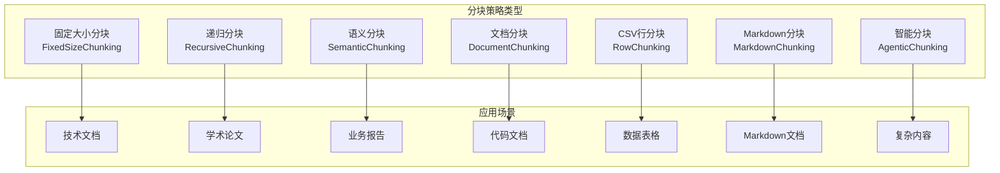
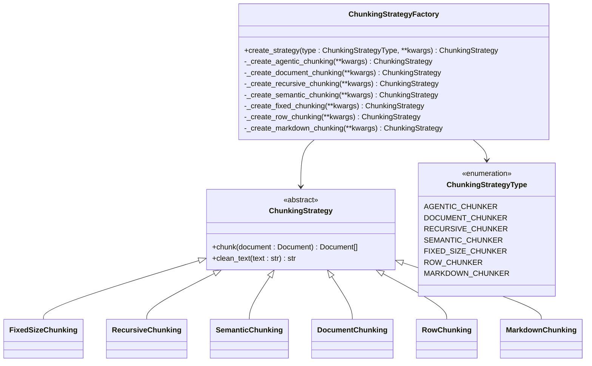
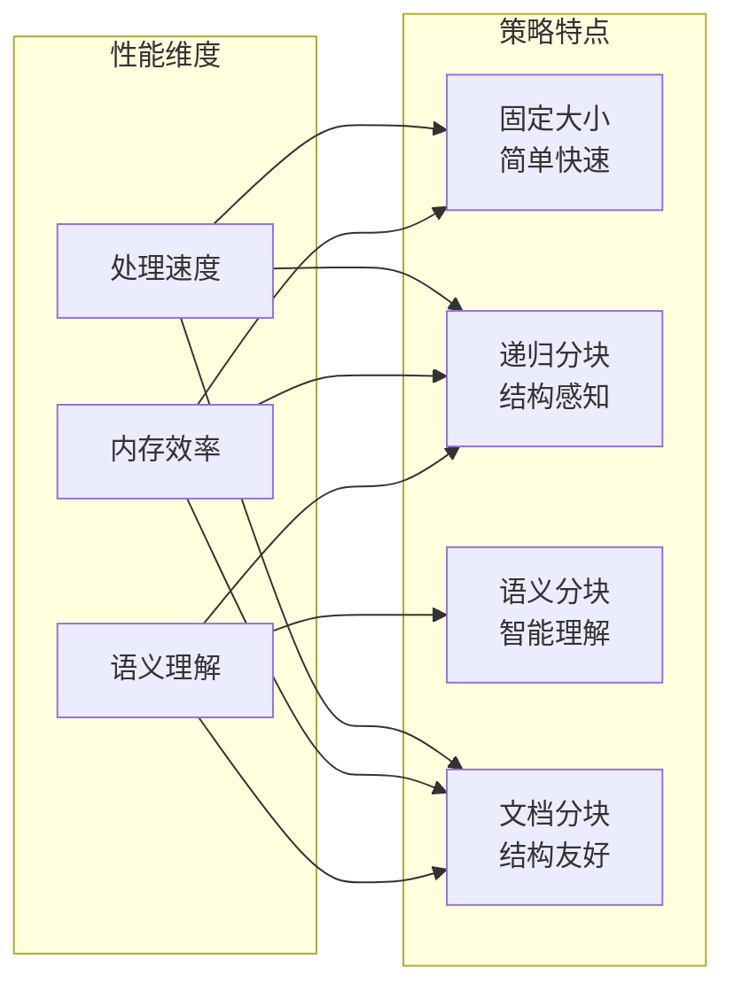
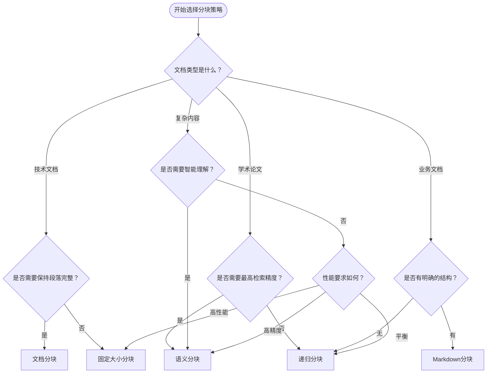
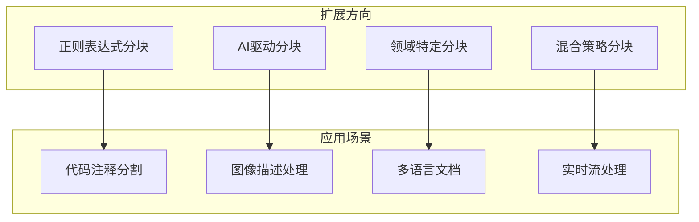

# 内容分块策略

<cite>
**本文档中引用的文件**
- [strategy.py](file://libs/agno/agno/knowledge/chunking/strategy.py)
- [recursive.py](file://libs/agno/agno/knowledge/chunking/recursive.py)
- [semantic.py](file://libs/agno/agno/knowledge/chunking/semantic.py)
- [fixed.py](file://libs/agno/agno/knowledge/chunking/fixed.py)
- [document.py](file://libs/agno/agno/knowledge/chunking/document.py)
- [row.py](file://libs/agno/agno/knowledge/chunking/row.py)
- [markdown.py](file://libs/agno/agno/knowledge/chunking/markdown.py)
- [README.md](file://cookbook/knowledge/chunking/README.md)
- [recursive_chunking.py](file://cookbook/knowledge/chunking/recursive_chunking.py)
- [semantic_chunking.py](file://cookbook/knowledge/chunking/semantic_chunking.py)
- [fixed_size_chunking.py](file://cookbook/knowledge/chunking/fixed_size_chunking.py)
- [custom_strategy_example.py](file://cookbook/knowledge/chunking/custom_strategy_example.py)
</cite>

## 目录
1. [简介](#简介)
2. [分块策略概述](#分块策略概述)
3. [核心分块策略详解](#核心分块策略详解)
4. [分块策略架构设计](#分块策略架构设计)
5. [分块策略对比分析](#分块策略对比分析)
6. [实际应用示例](#实际应用示例)
7. [自定义分块策略开发](#自定义分块策略开发)
8. [性能优化建议](#性能优化建议)
9. [故障排除指南](#故障排除指南)
10. [总结](#总结)

## 简介

内容分块（Chunking）是知识管理系统中的关键环节，它负责将大型文档分割成适合向量模型处理的小片段。分块策略的选择直接影响检索精度、系统性能和最终的应用效果。本文档深入探讨了AGNO框架中支持的各种分块策略，包括固定大小分块、递归分块、语义分块等，并提供了详细的实现原理、配置参数和最佳实践。

## 分块策略概述

### 分块的核心目的

分块的主要目标是在保留语义完整性的同时，将大文档分割成适合向量模型处理的小片段。合理的分块策略能够：

- **提高检索精度**：确保相关语义信息保持完整
- **优化存储效率**：避免过小或过大的分块
- **提升查询性能**：减少不必要的计算开销
- **保证语义连贯性**：维持上下文关系的完整性

### 支持的分块策略类型

AGNO框架支持七种主要的分块策略：



**图表来源**
- [strategy.py](file://libs/agno/agno/knowledge/chunking/strategy.py#L31-L59)

**章节来源**
- [strategy.py](file://libs/agno/agno/knowledge/chunking/strategy.py#L31-L59)
- [README.md](file://cookbook/knowledge/chunking/README.md#L46-L55)

## 核心分块策略详解

### 固定大小分块（FixedSizeChunking）

固定大小分块是最简单直接的分块策略，按照预设的字符数或标记数将文本分割成固定大小的片段。

#### 实现原理

```python
class FixedSizeChunking(ChunkingStrategy):
    def __init__(self, chunk_size: int = 5000, overlap: int = 0):
        self.chunk_size = chunk_size
        self.overlap = overlap
        
    def chunk(self, document: Document) -> List[Document]:
        # 按单词边界安全分割
        # 避免在单词中间截断
```

#### 关键特性

- **简单高效**：算法复杂度低，处理速度快
- **可预测性**：每个分块大小基本一致
- **重叠支持**：可配置前后文重叠以保持上下文连续性
- **边界安全**：自动避免在单词中间截断

#### 使用场景

- 技术文档处理
- API文档分割
- 标准化内容管理
- 对性能要求较高的场景

**章节来源**
- [fixed.py](file://libs/agno/agno/knowledge/chunking/fixed.py#L0-L57)

### 递归分块（RecursiveChunking）

递归分块通过识别自然的文本边界（如换行符、句号等）来分割文本，优先保持语义完整性。

#### 实现原理

```python
def chunk(self, document: Document) -> List[Document]:
    # 优先查找自然分隔符
    for sep in ["\n", "."]:
        last_sep = content[start:end].rfind(sep)
        if last_sep != -1:
            end = start + last_sep + 1
            break
```

#### 关键特性

- **自然边界识别**：优先使用换行符、句号等自然分隔符
- **层次化分割**：支持多级文本结构识别
- **动态调整**：根据文本结构自动调整分块大小
- **上下文保持**：通过重叠机制保持上下文连续性

#### 使用场景

- 学术论文处理
- 新闻文章分割
- 报告文档处理
- 需要保持段落完整性的场景

**章节来源**
- [recursive.py](file://libs/agno/agno/knowledge/chunking/recursive.py#L0-L63)

### 语义分块（SemanticChunking）

语义分块利用嵌入模型和相似度计算来识别语义边界，确保每个分块包含完整的语义单元。

#### 实现原理

```python
class SemanticChunking(ChunkingStrategy):
    def __init__(self, embedder: Optional[Embedder] = None, 
                 chunk_size: int = 5000, 
                 similarity_threshold: float = 0.5):
        self.embedder = embedder or OpenAIEmbedder()
        self.chunk_size = chunk_size
        self.similarity_threshold = similarity_threshold
```

#### 关键特性

- **语义感知**：基于嵌入模型的语义相似度判断
- **动态边界检测**：自动识别语义变化点
- **高精度检索**：显著提升检索相关性
- **依赖外部库**：需要chonkie库支持

#### 使用场景

- 复杂业务文档
- 法律合同处理
- 医疗文档分割
- 对检索精度要求极高的场景

**章节来源**
- [semantic.py](file://libs/agno/agno/knowledge/chunking/semantic.py#L0-L86)

### 文档分块（DocumentChunking）

文档分块基于文档结构特征（如段落、章节）进行分割，特别适用于结构化文档。

#### 实现原理

```python
def chunk(self, document: Document) -> List[Document]:
    # 按双换行符分割段落
    paragraphs = self.clean_text(document.content).split("\n\n")
    
    # 基于段落构建分块
    for para in paragraphs:
        if current_size + para_size <= self.chunk_size:
            current_chunk.append(para)
        else:
            # 创建新分块
```

#### 关键特性

- **结构感知**：识别段落、章节等文档结构
- **语义连贯**：保持段落内部的语义完整性
- **灵活配置**：支持自定义分块大小和重叠
- **通用性强**：适用于多种文档格式

#### 使用场景

- 技术规范文档
- 用户手册处理
- 结构化报告分割
- 需要保持段落完整性的场景

**章节来源**
- [document.py](file://libs/agno/agno/knowledge/chunking/document.py#L0-L91)

## 分块策略架构设计

### 分块策略工厂模式

AGNO采用工厂模式来统一管理不同类型的分块策略：



**图表来源**
- [strategy.py](file://libs/agno/agno/knowledge/chunking/strategy.py#L58-L120)

### 清理文本标准化

所有分块策略都继承自基础的文本清理功能：

```python
def clean_text(self, text: str) -> str:
    # 替换多个换行为单个换行
    cleaned_text = re.sub(r"\n+", "\n", text)
    # 替换多个空格为单个空格
    cleaned_text = re.sub(r"\s+", " ", cleaned_text)
    # 替换多个制表符为单个制表符
    cleaned_text = re.sub(r"\t+", "\t", cleaned_text)
```

这种标准化处理确保了：
- **一致性**：所有分块策略使用相同的文本预处理规则
- **性能优化**：减少重复的文本清理操作
- **质量保证**：消除不规则的空白字符影响

**章节来源**
- [strategy.py](file://libs/agno/agno/knowledge/chunking/strategy.py#L10-L28)

## 分块策略对比分析

### 性能对比

| 策略类型 | 处理速度 | 内存占用 | 检索精度 | 适用场景 |
|---------|---------|---------|---------|---------|
| 固定大小分块 | 极快 | 最低 | 中等 | 技术文档 |
| 递归分块 | 快 | 低 | 良好 | 学术论文 |
| 语义分块 | 慢 | 高 | 优秀 | 复杂文档 |
| 文档分块 | 快 | 低 | 良好 | 结构化文档 |

### 功能特性对比



### 选择决策树



## 实际应用示例

### 固定大小分块示例

```python
from agno.knowledge.chunking.fixed import FixedSizeChunking
from agno.knowledge.reader.pdf_reader import PDFReader
from agno.knowledge.knowledge import Knowledge
from agno.vectordb.pgvector import PgVector

# 配置固定大小分块
knowledge = Knowledge(
    vector_db=PgVector(table_name="recipes_fixed_size_chunking", db_url=db_url),
)

knowledge.add_content(
    url="https://example.com/document.pdf",
    reader=PDFReader(
        name="Fixed Size Chunking Reader",
        chunking_strategy=FixedSizeChunking(chunk_size=5000, overlap=500),
    ),
)
```

### 递归分块示例

```python
from agno.knowledge.chunking.recursive import RecursiveChunking
from agno.knowledge.reader.pdf_reader import PDFReader

# 配置递归分块
knowledge.add_content(
    url="https://example.com/article.pdf",
    reader=PDFReader(
        name="Recursive Chunking Reader",
        chunking_strategy=RecursiveChunking(chunk_size=4000, overlap=300),
    ),
)
```

### 语义分块示例

```python
from agno.knowledge.chunking.semantic import SemanticChunking
from agno.knowledge.reader.pdf_reader import PDFReader

# 配置语义分块
knowledge.add_content(
    url="https://example.com/contract.pdf",
    reader=PDFReader(
        name="Semantic Chunking Reader",
        chunking_strategy=SemanticChunking(
            similarity_threshold=0.6,
            chunk_size=3000,
        ),
    ),
)
```

**章节来源**
- [fixed_size_chunking.py](file://cookbook/knowledge/chunking/fixed_size_chunking.py#L0-L25)
- [recursive_chunking.py](file://cookbook/knowledge/chunking/recursive_chunking.py#L0-L26)
- [semantic_chunking.py](file://cookbook/knowledge/chunking/semantic_chunking.py#L0-L25)

## 自定义分块策略开发

### 开发框架

AGNO提供了完整的自定义分块策略开发框架：

```python
class CustomSeparatorChunking(ChunkingStrategy):
    def __init__(self, separator: str = "---", **kwargs):
        self.separator = separator
    
    def chunk(self, document: Document) -> List[Document]:
        # 使用自定义分隔符分割
        chunks = document.content.split(self.separator)
        
        result = []
        for i, chunk_content in enumerate(chunks):
            # 使用继承的清理方法
            chunk_content = self.clean_text(chunk_content)
            
            if chunk_content:
                meta_data = document.meta_data.copy()
                meta_data["chunk"] = i + 1
                meta_data["separator_used"] = self.separator
                
                result.append(
                    Document(
                        id=f"{document.id}_{i + 1}",
                        name=document.name,
                        meta_data=meta_data,
                        content=chunk_content,
                    )
                )
        return result
```

### 开发最佳实践

1. **继承基类**：必须继承`ChunkingStrategy`抽象基类
2. **实现核心方法**：必须实现`chunk()`方法
3. **使用清理功能**：利用继承的`clean_text()`方法
4. **添加元数据**：合理添加分块特定的元数据
5. **错误处理**：妥善处理异常情况

### 扩展策略类型



**章节来源**
- [custom_strategy_example.py](file://cookbook/knowledge/chunking/custom_strategy_example.py#L0-L98)

## 性能优化建议

### 内存优化

1. **批量处理**：对大量文档采用批量分块策略
2. **流式处理**：对于超大文档使用流式分块
3. **缓存机制**：缓存常用的分块结果
4. **垃圾回收**：及时释放不再使用的分块对象

### 计算优化

1. **并行处理**：利用多核CPU并行分块
2. **异步操作**：使用异步I/O提高吞吐量
3. **预编译正则**：对频繁使用的正则表达式进行预编译
4. **算法优化**：针对特定文档类型优化算法

### 存储优化

1. **压缩存储**：对分块结果进行压缩存储
2. **索引优化**：建立高效的分块索引
3. **分片策略**：按时间或主题分片存储
4. **增量更新**：支持增量分块更新

## 故障排除指南

### 常见问题及解决方案

#### 语义分块导入错误

**问题**：`ImportError: chonkie is required for semantic chunking`

**解决方案**：
```bash
pip install chonkie
```

#### 分块大小配置错误

**问题**：`ValueError: Invalid parameters: overlap must be less than chunk size`

**解决方案**：
```python
# 正确配置
chunking_strategy = FixedSizeChunking(chunk_size=5000, overlap=500)

# 错误配置
# chunking_strategy = FixedSizeChunking(chunk_size=5000, overlap=6000)  # 错误
```

#### 文档为空处理

**问题**：分块后出现空文档

**解决方案**：
```python
def chunk(self, document: Document) -> List[Document]:
    if not document.content or len(document.content.strip()) == 0:
        return []  # 返回空列表而不是单个空文档
```

### 调试技巧

1. **日志记录**：启用详细的分块过程日志
2. **性能监控**：监控分块过程的性能指标
3. **内存分析**：定期检查内存使用情况
4. **结果验证**：验证分块结果的正确性和完整性

**章节来源**
- [semantic.py](file://libs/agno/agno/knowledge/chunking/semantic.py#L20-L30)

## 总结

内容分块策略是知识管理系统的核心组件，不同的策略适用于不同的应用场景。通过本文档的详细介绍，我们可以得出以下结论：

### 策略选择指南

- **固定大小分块**：适用于技术文档和对性能要求较高的场景
- **递归分块**：适用于学术论文和需要保持段落完整性的文档
- **语义分块**：适用于法律合同和对检索精度要求极高的复杂文档
- **文档分块**：适用于结构化文档和技术规范
- **自定义策略**：可根据特定需求开发专门的分块策略

### 最佳实践建议

1. **评估需求**：根据具体应用场景选择合适的分块策略
2. **测试验证**：在实际数据上测试不同策略的效果
3. **性能监控**：持续监控分块过程的性能表现
4. **迭代优化**：根据使用反馈不断优化分块策略

### 未来发展方向

随着AI技术的发展，分块策略也在不断演进：

- **智能化程度提升**：更多AI驱动的智能分块策略
- **多模态支持**：支持图像、音频等多种媒体类型的分块
- **实时处理**：支持实时流式文档的分块处理
- **自适应学习**：能够根据使用情况自动调整分块策略

通过合理选择和配置分块策略，可以显著提升知识管理系统的性能和效果，为用户提供更好的体验。