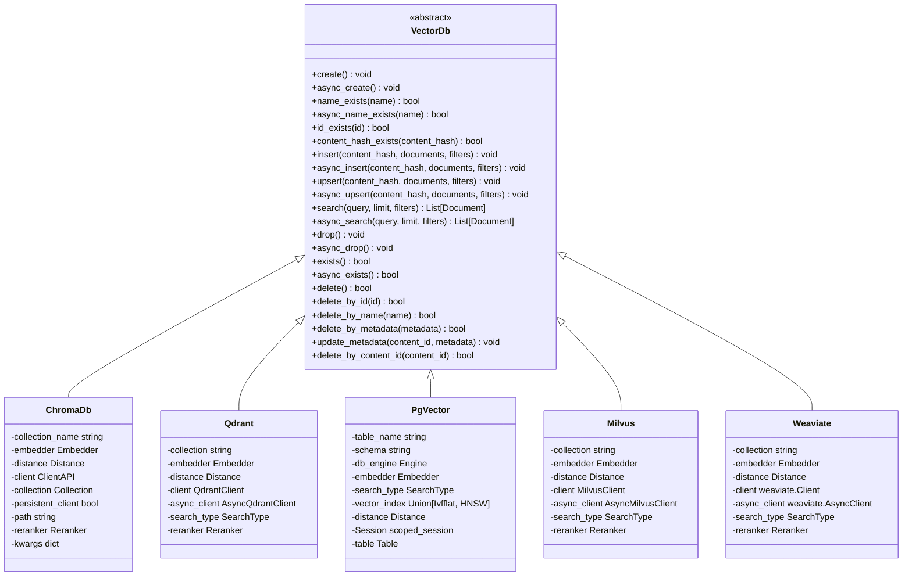
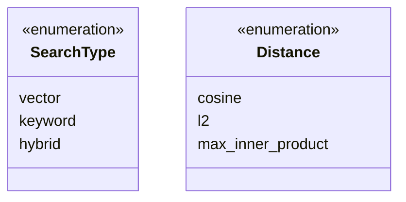
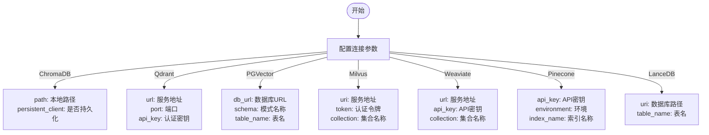
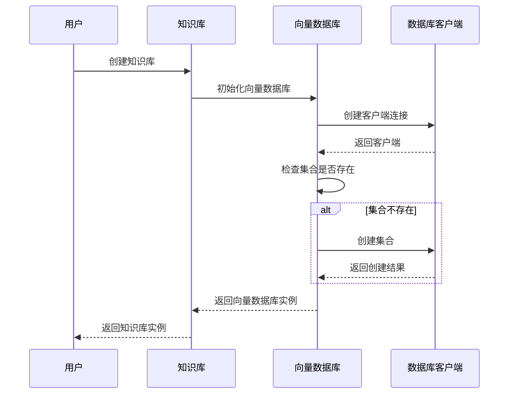
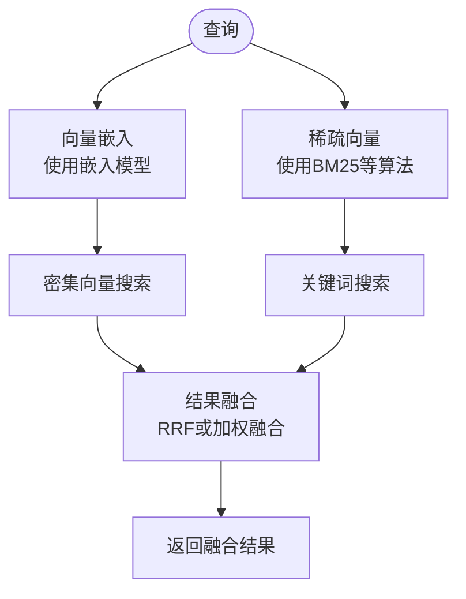

# 向量数据库

<cite>
**本文档中引用的文件**  
- [base.py](file://libs/agno/agno/vectordb/base.py)
- [search.py](file://libs/agno/agno/vectordb/search.py)
- [distance.py](file://libs/agno/agno/vectordb/distance.py)
- [chromadb.py](file://libs/agno/agno/vectordb/chroma/chromadb.py)
- [qdrant.py](file://libs/agno/agno/vectordb/qdrant/qdrant.py)
- [pgvector.py](file://libs/agno/agno/vectordb/pgvector/pgvector.py)
- [milvus.py](file://libs/agno/agno/vectordb/milvus/milvus.py)
- [weaviate.py](file://libs/agno/agno/vectordb/weaviate/weaviate.py)
- [pineconedb.py](file://libs/agno/agno/vectordb/pineconedb/pineconedb.py)
- [lance_db.py](file://libs/agno/agno/vectordb/lancedb/lance_db.py)
- [README.md](file://cookbook/knowledge/vector_db/README.md)
- [chroma_db.py](file://cookbook/knowledge/vector_db/chroma_db/chroma_db.py)
- [qdrant_db.py](file://cookbook/knowledge/vector_db/qdrant_db/qdrant_db.py)
</cite>

## 目录
1. [引言](#引言)
2. [向量数据库在知识库中的角色](#向量数据库在知识库中的角色)
3. [核心架构与设计模式](#核心架构与设计模式)
4. [支持的向量数据库后端](#支持的向量数据库后端)
5. [连接配置与集合管理](#连接配置与集合管理)
6. [数据持久化与混合搜索](#数据持久化与混合搜索)
7. [代码示例：数据存储与检索](#代码示例：数据存储与检索)
8. [性能、可扩展性与部署复杂性分析](#性能、可扩展性与部署复杂性分析)
9. [决策建议](#决策建议)
10. [结论](#结论)

## 引言

向量数据库是现代人工智能系统中知识检索的核心组件。它们通过存储和索引向量嵌入，支持高效的近似最近邻（ANN）搜索，从而实现语义级别的信息检索。本文档详细介绍了向量数据库在知识库系统中的角色，分析了多种支持的向量数据库后端，包括Chroma、Qdrant、Pinecone、PGVector、Milvus、Weaviate等，并提供了连接配置、集合管理、数据持久化和混合搜索功能的详细说明。

**Section sources**
- [README.md](file://cookbook/knowledge/vector_db/README.md)

## 向量数据库在知识库中的角色

向量数据库在知识库系统中扮演着至关重要的角色。它们的主要功能是存储和索引通过嵌入模型生成的向量表示，这些向量表示能够捕捉文本、图像或其他数据的语义特征。通过高效的近似最近邻搜索算法，向量数据库能够快速找到与查询最相似的向量，从而实现语义级别的信息检索。

在知识库系统中，向量数据库通常与分块和嵌入流程结合使用。原始文档首先被分割成较小的块，然后每个块通过嵌入模型转换为向量表示，并存储在向量数据库中。当用户提出查询时，查询同样被转换为向量，并在向量数据库中进行相似性搜索，返回最相关的文档块。

**Section sources**
- [README.md](file://cookbook/knowledge/vector_db/README.md)

## 核心架构与设计模式

### 抽象基类设计

向量数据库的实现遵循抽象基类设计模式，通过`VectorDb`抽象基类定义了所有向量数据库必须实现的接口。这种设计模式确保了不同向量数据库之间的接口一致性，使得系统可以轻松地在不同后端之间切换。



**Diagram sources**
- [base.py](file://libs/agno/agno/vectordb/base.py)

### 搜索类型与距离度量

系统支持多种搜索类型和距离度量，通过枚举类进行定义。搜索类型包括向量搜索、关键词搜索和混合搜索，而距离度量则包括余弦距离、L2距离和最大内积。



**Diagram sources**
- [search.py](file://libs/agno/agno/vectordb/search.py)
- [distance.py](file://libs/agno/agno/vectordb/distance.py)

## 支持的向量数据库后端

### ChromaDB

ChromaDB是一个嵌入式向量数据库，适用于本地开发和小型部署。它支持持久化存储，可以通过文件路径保存数据。

**Section sources**
- [chromadb.py](file://libs/agno/agno/vectordb/chroma/chromadb.py)

### Qdrant

Qdrant是一个高性能的向量搜索引擎，支持向量、关键词和混合搜索。它提供了REST和gRPC接口，适用于大规模部署。

**Section sources**
- [qdrant.py](file://libs/agno/agno/vectordb/qdrant/qdrant.py)

### PGVector

PGVector是PostgreSQL的一个扩展，将向量搜索功能集成到关系型数据库中。它适用于已经使用PostgreSQL作为主要数据库的系统。

**Section sources**
- [pgvector.py](file://libs/agno/agno/vectordb/pgvector/pgvector.py)

### Milvus

Milvus是一个可扩展的向量数据库，支持分布式部署和大规模向量搜索。它适用于需要高吞吐量和低延迟的企业级应用。

**Section sources**
- [milvus.py](file://libs/agno/agno/vectordb/milvus/milvus.py)

### Weaviate

Weaviate是一个多模态向量数据库，支持向量搜索和图遍历。它适用于需要复杂数据关系和语义搜索的应用。

**Section sources**
- [weaviate.py](file://libs/agno/agno/vectordb/weaviate/weaviate.py)

### Pinecone

Pinecone是一个托管的向量数据库服务，提供完全托管的向量搜索功能。它适用于希望避免基础设施管理的用户。

**Section sources**
- [pineconedb.py](file://libs/agno/agno/vectordb/pineconedb/pineconedb.py)

### LanceDB

LanceDB是一个快速的列式向量数据库，适用于需要高性能向量搜索的场景。

**Section sources**
- [lance_db.py](file://libs/agno/agno/vectordb/lancedb/lance_db.py)

## 连接配置与集合管理

### 连接配置

每个向量数据库后端都提供了详细的连接配置选项。例如，Qdrant支持通过URL、主机名、端口等多种方式连接，而PGVector则支持通过数据库URL或SQLAlchemy引擎连接。



**Diagram sources**
- [qdrant.py](file://libs/agno/agno/vectordb/qdrant/qdrant.py)
- [pgvector.py](file://libs/agno/agno/vectordb/pgvector/pgvector.py)
- [milvus.py](file://libs/agno/agno/vectordb/milvus/milvus.py)
- [weaviate.py](file://libs/agno/agno/vectordb/weaviate/weaviate.py)
- [pineconedb.py](file://libs/agno/agno/vectordb/pineconedb/pineconedb.py)
- [lance_db.py](file://libs/agno/agno/vectordb/lancedb/lance_db.py)

### 集合管理

向量数据库的集合管理功能包括创建、删除、检查存在性等操作。所有后端都实现了统一的接口，确保了操作的一致性。



**Diagram sources**
- [base.py](file://libs/agno/agno/vectordb/base.py)

## 数据持久化与混合搜索

### 数据持久化

不同的向量数据库后端提供了不同的数据持久化策略。ChromaDB通过文件系统持久化，PGVector利用PostgreSQL的持久化机制，而云托管服务如Pinecone则提供自动持久化。

**Section sources**
- [chromadb.py](file://libs/agno/agno/vectordb/chroma/chromadb.py)
- [pgvector.py](file://libs/agno/agno/vectordb/pgvector/pgvector.py)

### 混合搜索

混合搜索结合了向量搜索和关键词搜索的优势，通过融合策略提高检索的准确性和相关性。Qdrant和Milvus等后端支持混合搜索功能。



**Diagram sources**
- [qdrant.py](file://libs/agno/agno/vectordb/qdrant/qdrant.py)
- [milvus.py](file://libs/agno/agno/vectordb/milvus/milvus.py)

## 代码示例：数据存储与检索

### ChromaDB示例

```python
from agno.knowledge.knowledge import Knowledge
from agno.vectordb.chroma import ChromaDb

# 创建使用ChromaDB的知识库
knowledge = Knowledge(
    name="基础SDK知识库",
    description="使用ChromaDB的Agno 2.0知识实现",
    vector_db=ChromaDb(
        collection="vectors", 
        path="tmp/chromadb", 
        persistent_client=True
    ),
)
```

**Section sources**
- [chroma_db.py](file://cookbook/knowledge/vector_db/chroma_db/chroma_db.py)

### Qdrant示例

```python
from agno.knowledge.knowledge import Knowledge
from agno.vectordb.qdrant import Qdrant

# 创建使用Qdrant的知识库
vector_db = Qdrant(collection="thai-recipes", url="http://localhost:6333")

knowledge = Knowledge(
    name="我的Qdrant向量知识库",
    description="使用Qdrant向量数据库的知识库",
    vector_db=vector_db,
)
```

**Section sources**
- [qdrant_db.py](file://cookbook/knowledge/vector_db/qdrant_db/qdrant_db.py)

### 数据检索示例

```python
# 使用代理进行查询
agent = Agent(knowledge=knowledge)
agent.print_response("列出制作马萨曼鸡的配料", markdown=True)
```

**Section sources**
- [chroma_db.py](file://cookbook/knowledge/vector_db/chroma_db/chroma_db.py)
- [qdrant_db.py](file://cookbook/knowledge/vector_db/qdrant_db/qdrant_db.py)

## 性能、可扩展性与部署复杂性分析

### 性能比较

| 数据库 | 查询延迟 | 吞吐量 | 索引速度 | 内存占用 |
|--------|---------|--------|---------|---------|
| ChromaDB | 低 | 中 | 中 | 低 |
| Qdrant | 极低 | 高 | 高 | 中 |
| PGVector | 中 | 中 | 中 | 低 |
| Milvus | 极低 | 极高 | 极高 | 高 |
| Weaviate | 低 | 高 | 高 | 中 |
| Pinecone | 低 | 高 | 高 | 低 |
| LanceDB | 极低 | 极高 | 极高 | 低 |

### 可扩展性

- **ChromaDB**: 适用于单机部署，可扩展性有限
- **Qdrant**: 支持分布式部署，良好的水平扩展能力
- **PGVector**: 依赖PostgreSQL的扩展能力，垂直扩展为主
- **Milvus**: 专为大规模分布式部署设计，优秀的水平扩展能力
- **Weaviate**: 支持分布式部署，良好的扩展能力
- **Pinecone**: 完全托管服务，自动扩展
- **LanceDB**: 适用于单机高性能场景，扩展性有限

### 部署复杂性

- **ChromaDB**: 部署简单，适合本地开发
- **Qdrant**: 需要Docker或Kubernetes部署，中等复杂性
- **PGVector**: 需要PostgreSQL扩展，中等复杂性
- **Milvus**: 部署复杂，需要Kubernetes环境
- **Weaviate**: 支持Docker部署，中等复杂性
- **Pinecone**: 无需部署，完全托管
- **LanceDB**: 部署简单，适合本地使用

**Section sources**
- [README.md](file://cookbook/knowledge/vector_db/README.md)

## 决策建议

### 选择指南

根据不同的使用场景，推荐以下向量数据库：

- **本地开发和原型设计**: ChromaDB或LanceDB，部署简单，易于使用
- **生产环境，已有PostgreSQL**: PGVector，无缝集成现有基础设施
- **大规模生产环境**: Milvus或Qdrant，高性能和良好的扩展性
- **云原生应用**: Pinecone，完全托管，无需管理基础设施
- **复杂数据关系**: Weaviate，支持图遍历和多模态搜索
- **混合搜索需求**: Qdrant或Milvus，强大的混合搜索功能

### 迁移策略

系统设计支持向量数据库的无缝切换。通过统一的`VectorDb`接口，可以在不修改业务逻辑的情况下更换后端实现。建议的迁移策略：

1. 在开发环境中测试目标数据库
2. 逐步迁移数据，验证数据完整性
3. 在生产环境中进行A/B测试
4. 完全切换到新数据库

**Section sources**
- [README.md](file://cookbook/knowledge/vector_db/README.md)

## 结论

向量数据库是现代知识库系统的核心组件，通过存储和索引向量嵌入实现高效的语义搜索。本文档详细介绍了多种向量数据库后端的实现、配置和使用方法，为用户选择合适的数据库提供了全面的决策依据。通过抽象基类设计，系统实现了向量数据库的可插拔性，使得在不同后端之间切换变得简单而安全。