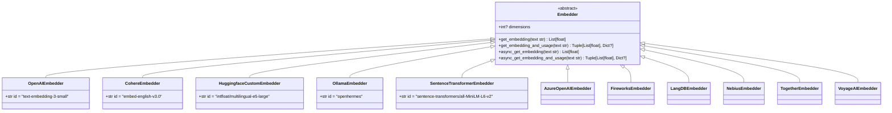
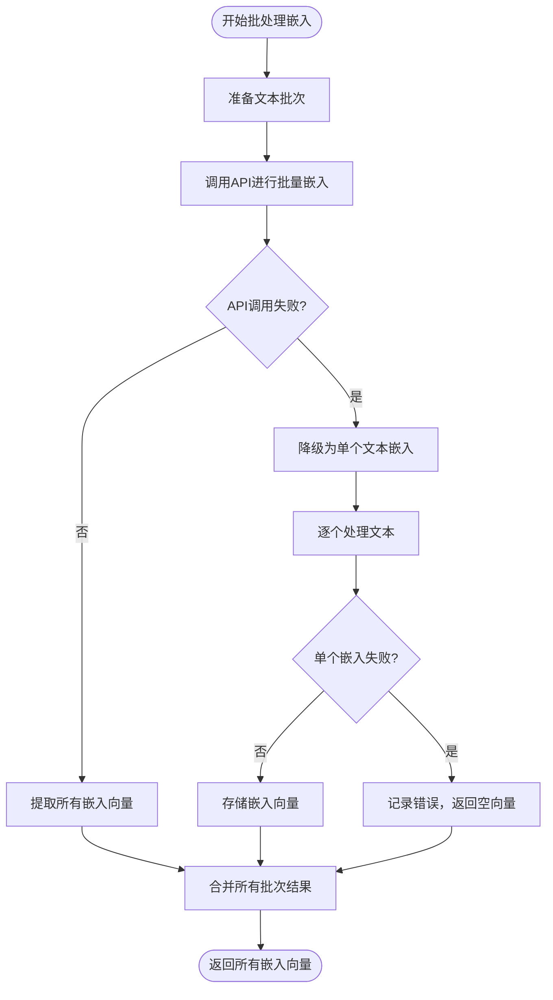

# 嵌入模型

<cite>
**本文档中引用的文件**  
- [openai_embedder.py](file://libs/agno/agno/knowledge/embedder/openai.py)
- [cohere_embedder.py](file://libs/agno/agno/knowledge/embedder/cohere.py)
- [huggingface_embedder.py](file://libs/agno/agno/knowledge/embedder/huggingface.py)
- [jina_embedder.py](file://libs/agno/agno/knowledge/embedder/jina.py)
- [mistral_embedder.py](file://libs/agno/agno/knowledge/embedder/mistral.py)
- [ollama_embedder.py](file://libs/agno/agno/knowledge/embedder/ollama.py)
- [sentence_transformer_embedder.py](file://libs/agno/agno/knowledge/embedder/sentence_transformer.py)
- [base.py](file://libs/agno/agno/knowledge/embedder/base.py)
- [knowledge.py](file://libs/agno/agno/knowledge/knowledge.py)
- [pgvector.py](file://libs/agno/agno/vectordb/pgvector/pgvector.py)
- [aws_bedrock_embedder.py](file://libs/agno/agno/knowledge/embedder/aws_bedrock.py)
- [azure_embedder.py](file://libs/agno/agno/knowledge/embedder/azure_openai.py)
- [fireworks_embedder.py](file://libs/agno/agno/knowledge/embedder/fireworks.py)
- [gemini_embedder.py](file://libs/agno/agno/knowledge/embedder/gemini.py)
- [langdb_embedder.py](file://libs/agno/agno/knowledge/embedder/langdb.py)
- [nebius_embedder.py](file://libs/agno/agno/knowledge/embedder/nebius.py)
- [qdrant_fastembed.py](file://libs/agno/agno/knowledge/embedder/qdrant_fastembed.py)
- [together_embedder.py](file://libs/agno/agno/knowledge/embedder/together.py)
- [voyageai_embedder.py](file://libs/agno/agno/knowledge/embedder/voyageai.py)
</cite>

## 目录
1. [引言](#引言)
2. [嵌入模型的作用与原理](#嵌入模型的作用与原理)
3. [支持的嵌入模型提供商](#支持的嵌入模型提供商)
4. [嵌入模型配置与API使用](#嵌入模型配置与api使用)
5. [代码示例：为知识库配置嵌入模型](#代码示例为知识库配置嵌入模型)
6. [嵌入模型选型考量](#嵌入模型选型考量)
7. [嵌入过程的批处理与错误处理](#嵌入过程的批处理与错误处理)
8. [结论](#结论)

## 引言
嵌入模型（Embedders）是现代语义搜索和知识检索系统的核心组件。它们将文本块转换为高维向量表示，使得计算机能够理解文本的语义相似性，从而实现超越关键词匹配的智能搜索。本文件将详细介绍嵌入模型在本项目中的实现，涵盖其作用、支持的提供商、配置方式、代码示例以及选型策略。

## 嵌入模型的作用与原理

嵌入模型的核心作用是将离散的文本信息（如单词、句子或段落）映射到一个连续的、高维的向量空间中。在这个向量空间里，语义上相似的文本会彼此靠近，而语义上不同的文本则相距较远。这种向量表示是实现语义搜索的基础，它允许系统根据查询的“含义”而非仅仅是“字面”来检索相关信息。

在本项目中，所有嵌入模型都继承自一个统一的基类 `Embedder`。该基类定义了所有嵌入器必须实现的核心接口，确保了不同提供商之间的可互换性。



**图源**  
- [base.py](file://libs/agno/agno/knowledge/embedder/base.py#L0-L21)

**节源**  
- [base.py](file://libs/agno/agno/knowledge/embedder/base.py#L0-L21)

## 支持的嵌入模型提供商

本项目支持多种嵌入模型提供商，以满足不同的部署需求、性能要求和成本考量。主要提供商包括：

- **OpenAI**: 提供 `text-embedding-3-small` 和 `text-embedding-3-large` 模型，默认使用 `text-embedding-3-small`，维度为1536或3072。
- **Cohere**: 提供多语言嵌入模型，如 `embed-english-v3.0`，维度为1024。
- **HuggingFace**: 通过 `HuggingfaceCustomEmbedder` 支持 Hugging Face Hub 上的任何嵌入模型，例如 `intfloat/multilingual-e5-large`，支持多语言场景。
- **Jina**: 集成 Jina AI 的嵌入服务。
- **Mistral**: 集成 Mistral AI 的嵌入模型。
- **Ollama**: 支持在本地运行开源嵌入模型，如 `nomic-ai/nomic-embed-text-v1.5`，适合私有化部署。
- **SentenceTransformers**: 使用 `sentence-transformers` 库在本地运行轻量级模型，如 `all-MiniLM-L6-v2`，维度为384，适合资源受限环境。
- **Azure OpenAI**: 通过 Azure 服务访问 OpenAI 模型，适合企业级安全和合规需求。
- **Fireworks**: 提供快速推理的嵌入模型。
- **Google Gemini**: 集成 Google 的嵌入模型。
- **LangDB**: 集成 LangDB 的嵌入服务。
- **Nebius**: 集成 Nebius 的嵌入服务。
- **Together**: 集成 Together AI 的嵌入模型。
- **VoyageAI**: 集成 VoyageAI 的嵌入模型。
- **AWS Bedrock**: 通过 AWS Bedrock 访问多种基础模型。

**节源**  
- [README.md](file://cookbook/knowledge/embedders/README.md#L28-L73)

## 嵌入模型配置与API使用

每个嵌入模型提供商都通过一个特定的 `dataclass` 实现，该类继承自 `Embedder` 基类。配置通常通过类的字段完成，支持环境变量注入。

### OpenAI 配置
`OpenAIEmbedder` 是默认的嵌入器。其配置包括：
- `id`: 模型ID，如 `text-embedding-3-small`。
- `dimensions`: 向量维度，会根据模型ID自动设置。
- `api_key`: OpenAI API 密钥，通常从 `OPENAI_API_KEY` 环境变量读取。
- `base_url`: 可选的API基础URL，用于自定义端点。

```python
from agno.knowledge.embedder.openai import OpenAIEmbedder

embedder = OpenAIEmbedder(
    id="text-embedding-3-large",
    api_key="your-api-key-here"
)
```

### Cohere 配置
`CohereEmbedder` 支持指定输入类型（如 `search_query` 或 `search_document`）以优化嵌入效果。
- `input_type`: 输入文本的类型。
- `api_key`: Cohere API 密钥。

### HuggingFace 配置
`HuggingfaceCustomEmbedder` 允许指定 Hugging Face Hub 上的任何模型ID。
- `id`: Hugging Face 模型仓库ID。
- `api_key`: Hugging Face API 密钥（如果模型是私有的）。

### 本地模型配置 (Ollama 和 SentenceTransformers)
对于 `OllamaEmbedder` 和 `SentenceTransformerEmbedder`，模型在本地运行，无需API密钥。
- `OllamaEmbedder` 通过 `ollama` Python 客户端与本地Ollama服务器通信。
- `SentenceTransformerEmbedder` 直接在Python进程中加载和运行模型，适合CPU环境。

**节源**  
- [openai.py](file://libs/agno/agno/knowledge/embedder/openai.py#L0-L37)
- [cohere.py](file://libs/agno/agno/knowledge/embedder/cohere.py#L0-L144)
- [huggingface.py](file://libs/agno/agno/knowledge/embedder/huggingface.py#L0-L89)
- [ollama.py](file://libs/agno/agno/knowledge/embedder/ollama.py#L0-L141)
- [sentence_transformer.py](file://libs/agno/agno/knowledge/embedder/sentence_transformer.py#L0-L59)

## 代码示例：为知识库配置嵌入模型

嵌入模型通过与向量数据库集成来为知识库提供语义搜索能力。以下是如何为知识库配置不同嵌入模型的代码示例。

### 配置 OpenAI 嵌入器
```python
from agno.knowledge.knowledge import Knowledge
from agno.knowledge.embedder.openai import OpenAIEmbedder
from agno.vectordb.pgvector import PgVector

# 创建使用 OpenAI 嵌入器的知识库
knowledge = Knowledge(
    vector_db=PgVector(
        embedder=OpenAIEmbedder(),
        table_name="openai_embeddings",
        db_url="postgresql+psycopg://ai:ai@localhost:5532/ai"
    ),
    max_results=2
)
```

### 配置本地 SentenceTransformers 嵌入器
```python
from agno.knowledge.embedder.sentence_transformer import SentenceTransformerEmbedder

# 创建使用本地 SentenceTransformers 嵌入器的知识库
knowledge = Knowledge(
    vector_db=PgVector(
        db_url="postgresql+psycopg://ai:ai@localhost:5532/ai",
        table_name="sentence_transformer_embeddings",
        embedder=SentenceTransformerEmbedder(),
    ),
    max_results=2,
)
```

### 配置 Cohere 嵌入器
```python
from agno.knowledge.embedder.cohere import CohereEmbedder

# 创建使用 Cohere 嵌入器的知识库
knowledge = Knowledge(
    vector_db=PgVector(
        embedder=CohereEmbedder(
            id="embed-multilingual-v3.0",  # 多语言模型
            input_type="search_query"
        ),
        table_name="cohere_embeddings",
        db_url="postgresql+psycopg://ai:ai@localhost:5532/ai"
    )
)
```

**节源**  
- [openai_embedder.py](file://cookbook/knowledge/embedders/openai_embedder.py#L0-L21)
- [sentence_transformer_embedder.py](file://cookbook/knowledge/embedders/sentence_transformer_embedder.py#L0-L21)

## 嵌入模型选型考量

选择合适的嵌入模型需要综合考虑多个因素：

### 检索质量
- **模型能力**: 通常，参数量更大、训练数据更丰富的模型（如 OpenAI 的 `text-embedding-3-large`）能提供更高质量的语义表示，检索准确率更高。
- **领域适配**: 对于特定领域（如法律、医疗），使用在该领域数据上微调过的模型或本地模型进行微调，能显著提升检索质量。

### 成本
- **云服务成本**: OpenAI、Cohere 等按API调用次数和token数量计费。高频率的检索会带来持续的成本。
- **本地部署成本**: Ollama 和 SentenceTransformers 在本地运行，没有API费用，但需要承担硬件（GPU）和运维成本。

### 部署需求
- **多语言支持**: 如果应用需要处理多种语言，应选择明确支持多语言的模型，如 Cohere 的 `embed-multilingual-v3.0` 或 Hugging Face 上的 `intfloat/multilingual-e5-large`。
- **私有化部署**: 对于数据敏感或需要完全控制的应用，本地嵌入模型（Ollama, SentenceTransformers）是唯一选择，确保数据不出内网。
- **延迟要求**: 本地模型的延迟通常更可控，而云服务的延迟受网络状况影响。

**节源**  
- [README.md](file://cookbook/knowledge/embedders/README.md#L1-L73)

## 嵌入过程的批处理与错误处理

为了提高效率和鲁棒性，嵌入过程实现了批处理和完善的错误恢复机制。

### 批处理机制
`OpenAIEmbedder` 等云服务嵌入器实现了 `get_embeddings_batch` 方法，可以一次性处理多个文本，显著减少API调用次数，提高吞吐量。
- **批量调用**: 方法内部将文本列表分批发送给API，每批最多可处理数千个文本。
- **异步支持**: 提供 `async_get_embeddings_batch` 方法，支持异步非阻塞调用，适用于高并发场景。

### 错误处理与恢复
系统设计了多层次的错误处理策略：
- **异常捕获**: 所有API调用都包裹在 `try-except` 块中，捕获网络错误、认证失败等异常。
- **降级策略**: 当批量嵌入失败时，系统会自动降级为对批中的每个文本进行单独的嵌入调用，确保部分成功。
- **日志记录**: 所有错误和警告都会被记录，便于监控和调试。
- **空向量返回**: 在发生不可恢复的错误时，方法返回空列表 `[]` 而不是抛出异常，防止整个流程中断。



**图源**  
- [openai.py](file://libs/agno/agno/knowledge/embedder/openai.py#L150-L231)

**节源**  
- [openai.py](file://libs/agno/agno/knowledge/embedder/openai.py#L150-L231)

## 结论
嵌入模型是实现智能语义搜索的关键。本项目通过一个统一的 `Embedder` 接口，灵活支持了从 OpenAI、Cohere 等云服务到 Ollama、SentenceTransformers 等本地模型的广泛提供商。开发者可以根据具体的应用场景，在检索质量、成本、多语言支持和私有化部署等维度进行权衡，选择最合适的嵌入模型。同时，系统内置的批处理和错误恢复机制确保了嵌入过程的高效与稳定。