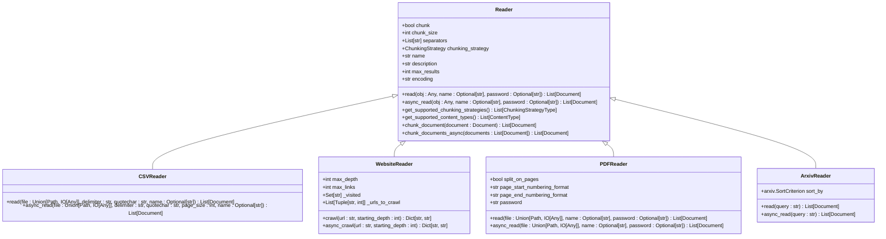
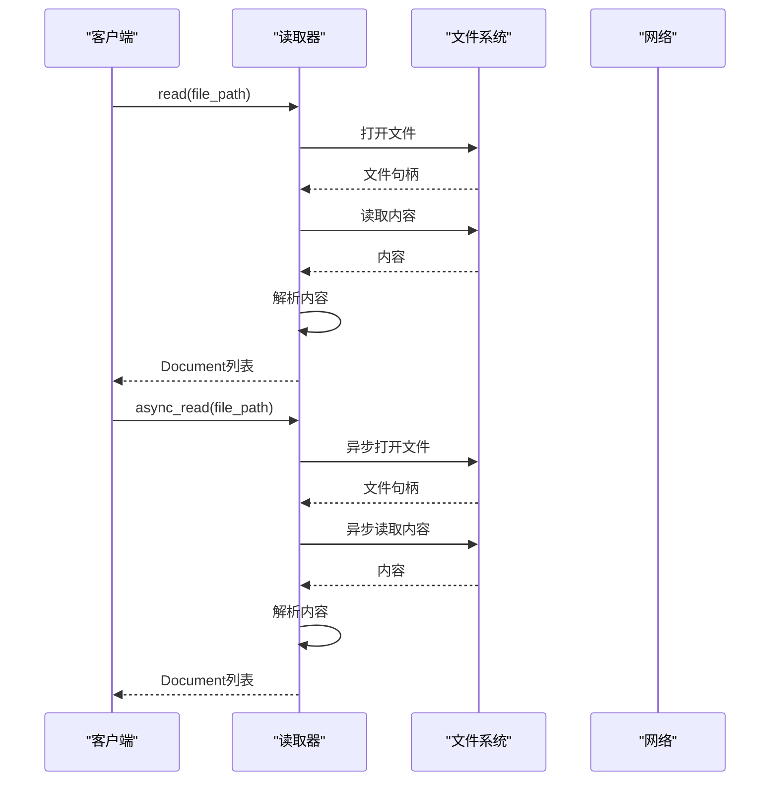

# 知识读取器

<cite>
**本文档中引用的文件**  
- [README.md](file://cookbook/knowledge/readers/README.md)
- [csv_reader.py](file://libs/agno/agno/knowledge/reader/csv_reader.py)
- [web_reader.py](file://libs/agno/agno/knowledge/reader/website_reader.py)
- [pdf_reader.py](file://libs/agno/agno/knowledge/reader/pdf_reader.py)
- [arxiv_reader.py](file://libs/agno/agno/knowledge/reader/arxiv_reader.py)
- [base.py](file://libs/agno/agno/knowledge/reader/base.py)
- [knowledge.py](file://libs/agno/agno/knowledge/knowledge.py)
- [reader_factory.py](file://libs/agno/agno/knowledge/reader/reader_factory.py)
</cite>

## 目录
1. [引言](#引言)
2. [核心组件](#核心组件)
3. [统一接口与工厂模式](#统一接口与工厂模式)
4. [具体读取器实现](#具体读取器实现)
5. [同步与异步模式](#同步与异步模式)
6. [错误处理与超时设置](#错误处理与超时设置)
7. [内容解析策略](#内容解析策略)
8. [扩展性设计](#扩展性设计)

## 引言
知识读取器是知识库系统中的核心组件，负责从多种异构数据源加载原始内容。这些数据源包括本地文件、URL、S3、GCS、数据库、PDF、CSV、网页、学术论文等。读取器的设计目标是提供统一的接口，支持灵活扩展，并确保高效、可靠的内容加载。

## 核心组件
知识读取器的核心组件包括基础读取器类、具体读取器实现和读取器工厂。基础读取器类定义了所有读取器的通用接口和行为，具体读取器实现针对不同数据源提供了特定的读取逻辑，读取器工厂负责创建和管理读取器实例。

**本节来源**
- [base.py](file://libs/agno/agno/knowledge/reader/base.py)
- [reader_factory.py](file://libs/agno/agno/knowledge/reader/reader_factory.py)

## 统一接口与工厂模式
知识读取器采用统一接口和工厂模式设计，确保了系统的灵活性和可扩展性。所有读取器都继承自`Reader`基类，实现了`read`和`async_read`方法。读取器工厂`ReaderFactory`根据数据源类型动态创建相应的读取器实例。

**图表来源**
- [base.py](file://libs/agno/agno/knowledge/reader/base.py)
- [csv_reader.py](file://libs/agno/agno/knowledge/reader/csv_reader.py)
- [web_reader.py](file://libs/agno/agno/knowledge/reader/website_reader.py)
- [pdf_reader.py](file://libs/agno/agno/knowledge/reader/pdf_reader.py)
- [arxiv_reader.py](file://libs/agno/agno/knowledge/reader/arxiv_reader.py)

## 具体读取器实现
### CSV读取器
CSV读取器用于处理逗号分隔值文件。它支持同步和异步读取模式，能够处理本地文件和URL来源的CSV文件。读取器会将CSV文件转换为`Document`对象列表，每个文档包含文件名、ID和内容。

**本节来源**
- [csv_reader.py](file://libs/agno/agno/knowledge/reader/csv_reader.py)

### Web读取器
Web读取器用于爬取和抓取网站内容。它支持深度优先和广度优先的爬取策略，能够处理复杂的网站结构。读取器会提取网页的主要内容，去除脚本、样式表和导航元素。

**本节来源**
- [web_reader.py](file://libs/agno/agno/knowledge/reader/website_reader.py)

### PDF读取器
PDF读取器用于处理PDF文档，支持文本提取和OCR（光学字符识别）。它能够处理加密的PDF文件，并支持分页读取。读取器会将PDF文件转换为`Document`对象列表，每个文档包含页面内容和元数据。

**本节来源**
- [pdf_reader.py](file://libs/agno/agno/knowledge/reader/pdf_reader.py)

### ArXiv读取器
ArXiv读取器用于从ArXiv数据库中检索学术论文。它支持按主题搜索，能够获取论文的标题、摘要、PDF链接和相关链接。读取器会将检索到的论文转换为`Document`对象列表。

**本节来源**
- [arxiv_reader.py](file://libs/agno/agno/knowledge/reader/arxiv_reader.py)

## 同步与异步模式
知识读取器支持同步和异步两种模式。同步模式适用于简单的读取任务，异步模式适用于需要高并发和低延迟的场景。异步模式通过`asyncio`库实现，能够并行处理多个读取任务。

**图表来源**
- [csv_reader.py](file://libs/agno/agno/knowledge/reader/csv_reader.py)
- [web_reader.py](file://libs/agno/agno/knowledge/reader/website_reader.py)
- [pdf_reader.py](file://libs/agno/agno/knowledge/reader/pdf_reader.py)
- [arxiv_reader.py](file://libs/agno/agno/knowledge/reader/arxiv_reader.py)

## 错误处理与超时设置
知识读取器在读取过程中会遇到各种错误，如文件不存在、网络连接失败、解析错误等。读取器通过异常处理机制捕获和处理这些错误，确保系统的稳定性。此外，读取器还支持超时设置，防止长时间等待。

**本节来源**
- [base.py](file://libs/agno/agno/knowledge/reader/base.py)
- [csv_reader.py](file://libs/agno/agno/knowledge/reader/csv_reader.py)
- [web_reader.py](file://libs/agno/agno/knowledge/reader/website_reader.py)
- [pdf_reader.py](file://libs/agno/agno/knowledge/reader/pdf_reader.py)
- [arxiv_reader.py](file://libs/agno/agno/knowledge/reader/arxiv_reader.py)

## 内容解析策略
知识读取器采用多种内容解析策略，以适应不同的数据源和内容类型。例如，CSV读取器使用`csv`模块解析CSV文件，Web读取器使用`BeautifulSoup`提取网页内容，PDF读取器使用`pypdf`和`rapidocr_onnxruntime`进行文本提取和OCR。

**本节来源**
- [csv_reader.py](file://libs/agno/agno/knowledge/reader/csv_reader.py)
- [web_reader.py](file://libs/agno/agno/knowledge/reader/website_reader.py)
- [pdf_reader.py](file://libs/agno/agno/knowledge/reader/pdf_reader.py)

## 扩展性设计
知识读取器的设计具有良好的扩展性，支持轻松集成新的数据源。通过继承`Reader`基类并实现`read`和`async_read`方法，可以创建新的读取器。读取器工厂会自动识别和管理新读取器。

**本节来源**
- [base.py](file://libs/agno/agno/knowledge/reader/base.py)
- [reader_factory.py](file://libs/agno/agno/knowledge/reader/reader_factory.py)