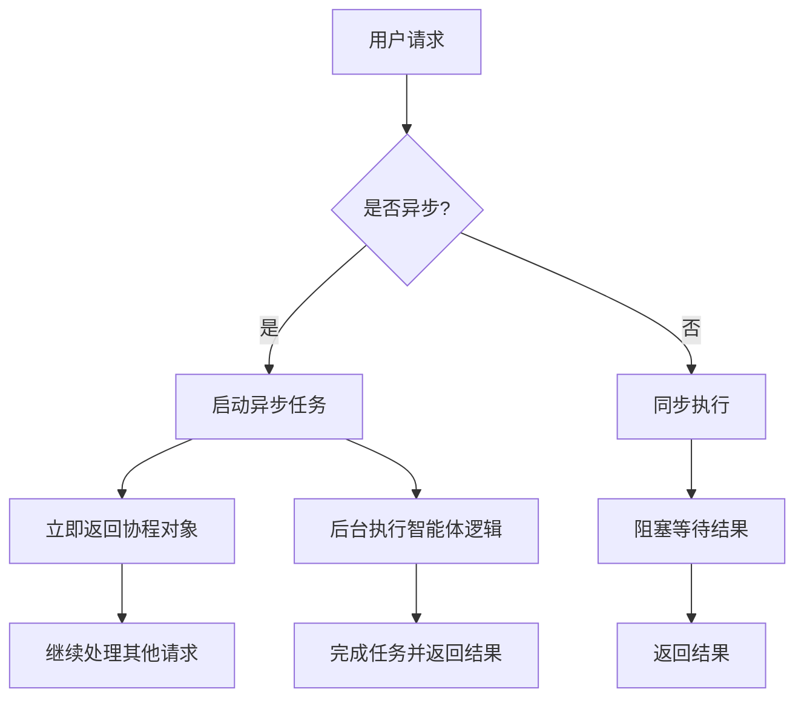
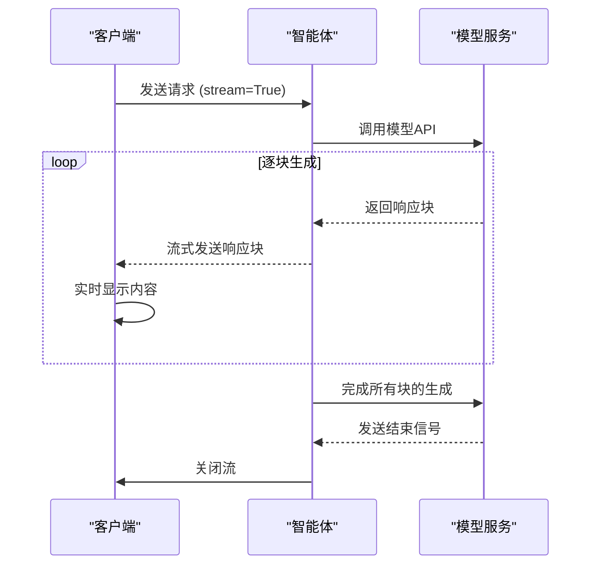
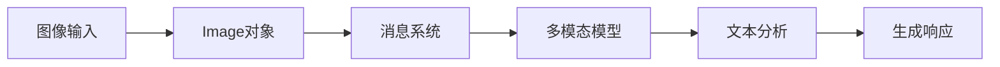
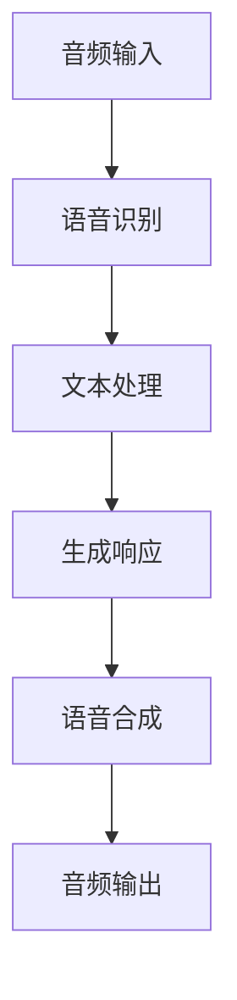
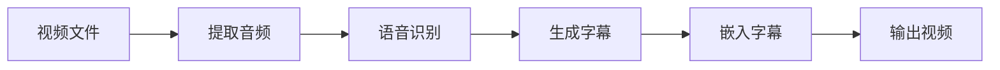
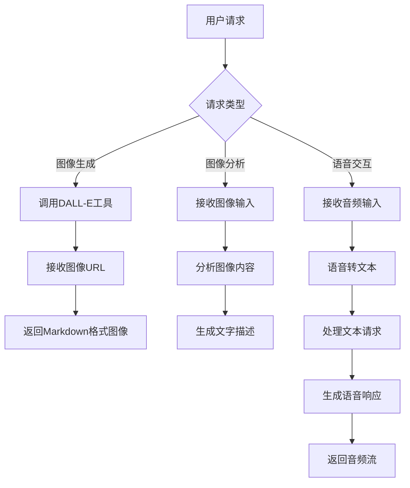

# 异步与多模态

<cite>
**本文档引用的文件**  
- [streaming.py](file://cookbook/agents/async/streaming.py)
- [basic.py](file://cookbook/agents/async/basic.py)
- [audio_input_output.py](file://cookbook/agents/multimodal/audio_input_output.py)
- [image_to_text.py](file://cookbook/agents/multimodal/image_to_text.py)
- [generate_image_with_intermediate_steps.py](file://cookbook/agents/multimodal/generate_image_with_intermediate_steps.py)
- [video_caption_agent.py](file://cookbook/agents/multimodal/video_caption_agent.py)
- [agent.py](file://libs/agno/agno/agent/agent.py)
- [base.py](file://libs/agno/agno/models/base.py)
- [chat.py](file://libs/agno/agno/models/openai/chat.py)
</cite>

## 目录
1. [简介](#简介)
2. [异步操作](#异步操作)
3. [流式响应](#流式响应)
4. [多模态输入输出](#多模态输入输出)
5. [综合示例](#综合示例)
6. [结论](#结论)

## 简介
本文档详细阐述了智能体系统中异步操作与多模态能力的实现机制。通过分析代码库中的核心组件，我们将深入探讨如何利用异步编程提高智能体的性能和响应能力，特别是在处理耗时的I/O操作时。同时，我们将详细介绍系统对多模态输入/输出的支持，包括处理图像、音频和视频的能力，以及流式响应的工作原理和优势。

**Section sources**
- [streaming.py](file://cookbook/agents/async/streaming.py#L1-L31)
- [basic.py](file://cookbook/agents/async/basic.py#L1-L32)

## 异步操作
异步操作是提高智能体性能的关键技术，特别是在处理网络请求、数据库查询等耗时的I/O操作时。系统通过Python的asyncio框架实现了完整的异步支持，允许智能体在等待外部操作完成的同时处理其他任务。

在代码实现中，`Agent`类提供了`arun`方法来支持异步执行。当调用`arun`方法时，智能体不会阻塞主线程，而是返回一个协程对象，可以通过`await`关键字等待其完成。这种非阻塞的执行模式显著提高了系统的吞吐量和响应速度。

**Diagram sources**
- [agent.py](file://libs/agno/agno/agent/agent.py#L3234-L3267)
- [basic.py](file://cookbook/agents/async/basic.py#L10-L32)

**Section sources**
- [agent.py](file://libs/agno/agno/agent/agent.py#L3234-L3267)
- [basic.py](file://cookbook/agents/async/basic.py#L10-L32)

## 流式响应
流式响应是一种重要的性能优化技术，它允许智能体在生成响应的过程中逐步向客户端发送数据，而不是等待整个响应生成完毕后再一次性发送。这种技术特别适用于处理长文本生成、复杂计算等耗时操作的场景。

系统通过`stream=True`参数启用流式响应功能。当启用流式响应时，`arun`方法会返回一个异步迭代器，客户端可以逐块接收响应内容。这种方式不仅提供了即时反馈，改善了用户体验，还能有效降低内存占用，因为不需要在内存中缓存完整的响应内容。

**Diagram sources**
- [streaming.py](file://cookbook/agents/async/streaming.py#L10-L31)
- [base.py](file://libs/agno/agno/models/base.py#L855-L1054)

**Section sources**
- [streaming.py](file://cookbook/agents/async/streaming.py#L10-L31)
- [base.py](file://libs/agno/agno/models/base.py#L855-L1054)

## 多模态输入输出
系统提供了全面的多模态输入/输出支持，能够处理图像、音频、视频等多种媒体类型。这种能力使得智能体可以接收和生成丰富的多媒体内容，大大扩展了其应用场景。

### 图像处理
智能体能够接收图像作为输入，并基于图像内容生成文字描述。通过`Image`类封装图像数据，系统支持从文件路径、字节数据或URL等多种方式加载图像。在模型层面，系统配置了支持视觉理解的模型（如gpt-4o），能够分析图像内容并生成相应的文本响应。

**Diagram sources**
- [image_to_text.py](file://cookbook/agents/multimodal/image_to_text.py#L1-L17)
- [chat.py](file://libs/agno/agno/models/openai/chat.py#L1-L199)

### 音频处理
系统支持音频输入和输出的完整流程。对于音频输入，智能体可以接收音频文件并将其转换为文本进行处理。对于音频输出，系统能够生成语音响应并以音频流的形式返回。通过配置`modalities`和`audio`参数，可以指定模型的音频处理能力。

**Diagram sources**
- [audio_input_output.py](file://cookbook/agents/multimodal/audio_input_output.py#L1-L33)
- [base.py](file://libs/agno/agno/models/base.py#L1030-L1058)

### 视频处理
视频处理能力通过集成专门的工具实现。系统可以处理视频文件，提取音频轨道，生成字幕，并将字幕嵌入到视频中。这种能力在视频内容分析、字幕生成等场景中非常有用。

**Diagram sources**
- [video_caption_agent.py](file://cookbook/agents/multimodal/video_caption_agent.py#L1-L38)
- [agent.py](file://libs/agno/agno/agent/agent.py#L3068-L3085)

**Section sources**
- [audio_input_output.py](file://cookbook/agents/multimodal/audio_input_output.py#L1-L33)
- [image_to_text.py](file://cookbook/agents/multimodal/image_to_text.py#L1-L17)
- [video_caption_agent.py](file://cookbook/agents/multimodal/video_caption_agent.py#L1-L38)

## 综合示例
以下是一个综合示例，展示了如何构建一个能够处理多模态输入并生成图像的智能体：

该示例展示了智能体如何根据不同的输入类型选择相应的处理路径，并生成相应的输出。系统通过工具集成和模型配置，实现了对多种模态的无缝支持。

**Diagram sources**
- [generate_image_with_intermediate_steps.py](file://cookbook/agents/multimodal/generate_image_with_intermediate_steps.py#L1-L29)
- [agent.py](file://libs/agno/agno/agent/agent.py#L3068-L3267)

**Section sources**
- [generate_image_with_intermediate_steps.py](file://cookbook/agents/multimodal/generate_image_with_intermediate_steps.py#L1-L29)

## 结论
本文档详细介绍了智能体系统的异步与多模态能力。通过异步操作，系统能够高效处理耗时的I/O操作，提高整体性能和响应速度。流式响应技术提供了即时反馈，改善了用户体验。多模态支持使得智能体能够处理图像、音频、视频等多种媒体类型，大大扩展了其应用范围。

这些技术的结合使得智能体能够处理复杂的现实世界任务，如分析图像内容、处理语音指令、生成多媒体响应等。开发者可以根据具体需求，灵活组合这些能力，构建功能强大、响应迅速的智能应用。