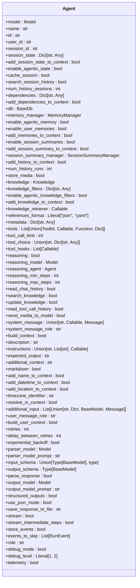
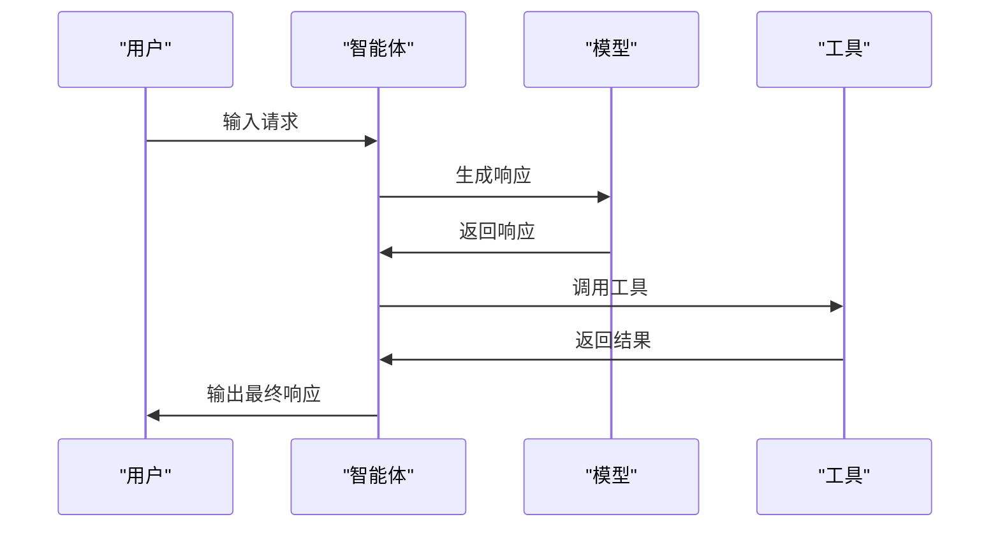
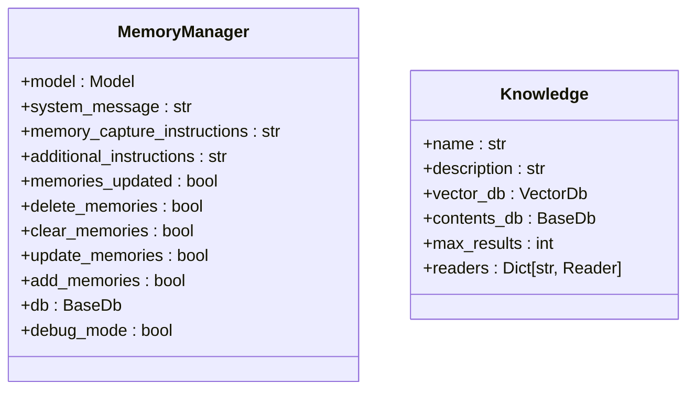
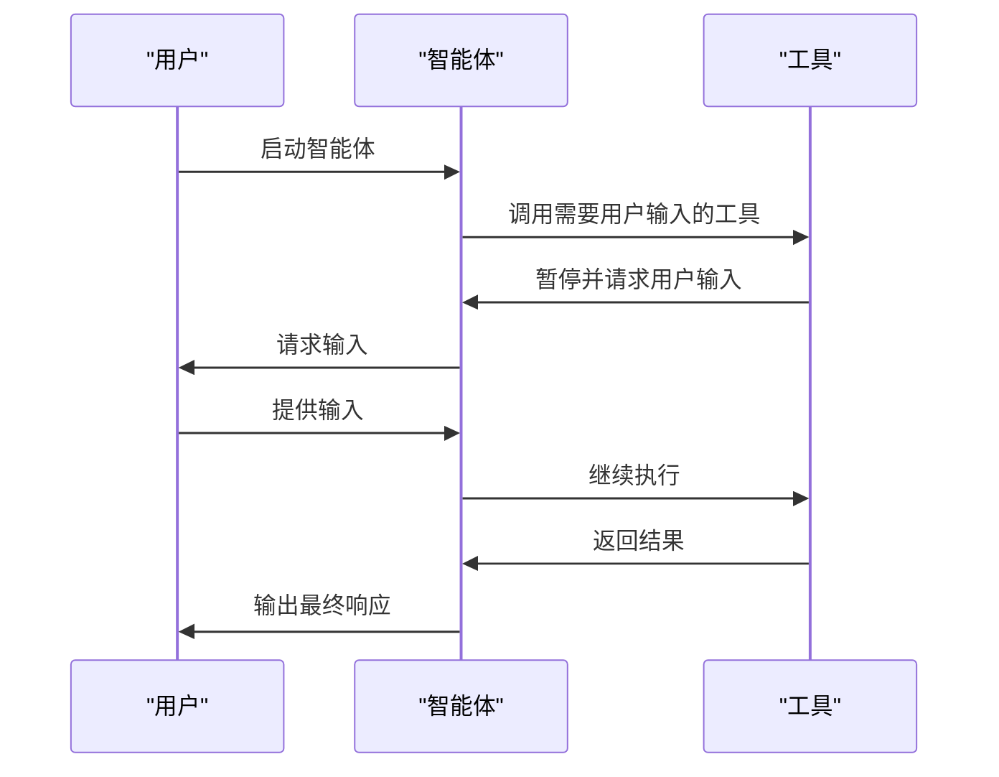
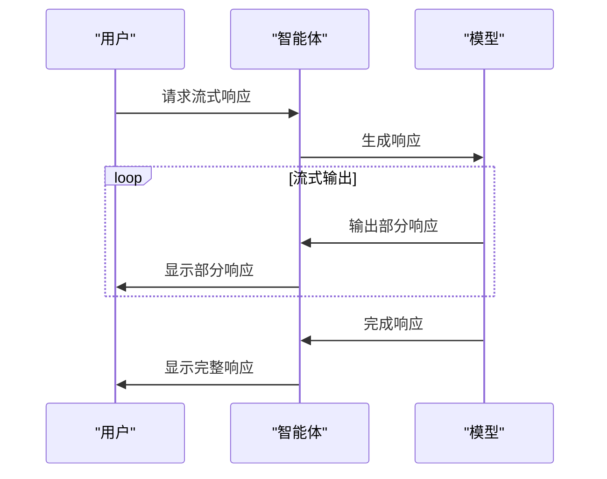
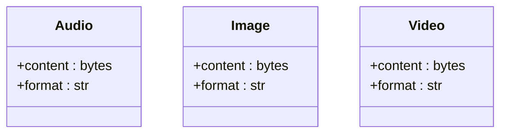
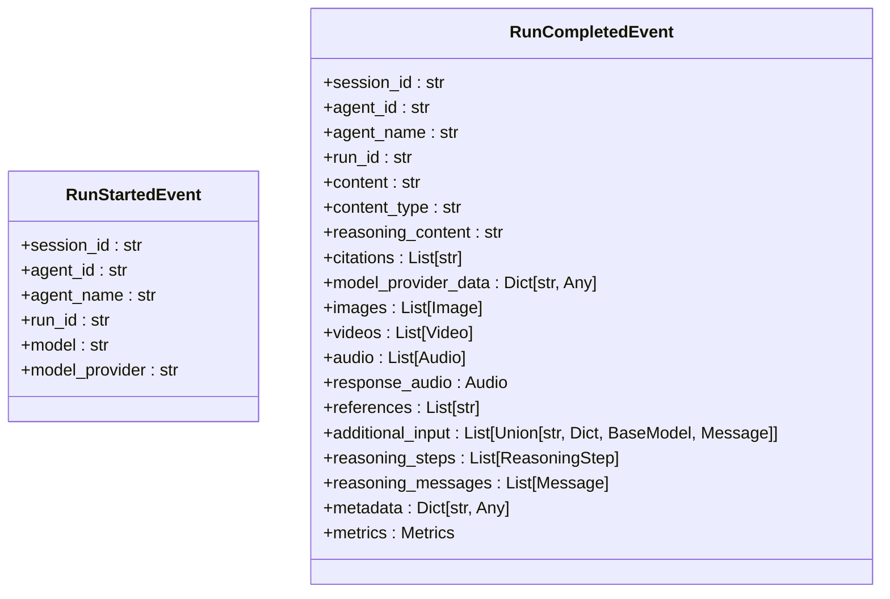

# 智能体

<cite>
**本文档中引用的文件**  
- [agent.py](file://libs/agno/agno/agent/agent.py)
- [memory.py](file://libs/agno/agno/memory/manager.py)
- [knowledge.py](file://libs/agno/agno/knowledge/knowledge.py)
- [events.py](file://libs/agno/agno/utils/events.py)
- [base.py](file://libs/agno/agno/db/base.py)
- [session_state_basic.py](file://cookbook/agents/state/session_state_basic.py)
- [audio_input_output.py](file://cookbook/agents/multimodal/audio_input_output.py)
- [user_input_required.py](file://cookbook/agents/human_in_the_loop/user_input_required.py)
- [streaming.py](file://cookbook/agents/async/streaming.py)
- [custom_logging.py](file://cookbook/agents/custom_logging/custom_logging.py)
</cite>

## 目录
1. [简介](#简介)
2. [智能体创建与配置](#智能体创建与配置)
3. [核心功能](#核心功能)
4. [持久化内存与知识库](#持久化内存与知识库)
5. [人机协作](#人机协作)
6. [异步操作与流式响应](#异步操作与流式响应)
7. [多模态输入/输出](#多模态输入/输出)
8. [事件、指标与调试](#事件、指标与调试)
9. [高级功能示例](#高级功能示例)
10. [结论](#结论)

## 简介
智能体是基于AI的自主系统，能够处理用户输入、生成响应、调用工具、管理上下文和指令。本文档全面介绍智能体的创建、配置和使用，涵盖其核心功能和高级特性。通过具体的代码示例，展示从基础智能体到具备复杂功能的高级智能体的构建过程。

## 智能体创建与配置
智能体的创建和配置是构建AI应用的基础。通过`Agent`类，可以定义智能体的模型、名称、用户ID、会话ID、依赖项、数据库、内存管理器等属性。智能体的配置包括系统消息设置、用户消息设置、响应设置等，以确保智能体能够按照预期工作。



**图示来源**
- [agent.py](file://libs/agno/agno/agent/agent.py)

**本节来源**
- [agent.py](file://libs/agno/agno/agent/agent.py)

## 核心功能
智能体的核心功能包括处理用户输入、生成响应、调用工具、管理上下文和指令。通过`Agent`类的方法，可以实现这些功能。例如，`print_response`方法用于生成响应并打印到终端，`run`方法用于运行智能体并返回运行结果。



**图示来源**
- [agent.py](file://libs/agno/agno/agent/agent.py)

**本节来源**
- [agent.py](file://libs/agno/agno/agent/agent.py)

## 持久化内存与知识库
智能体可以通过配置持久化内存（Memory）和知识库（Knowledge）来增强其功能。持久化内存允许智能体在不同会话之间保持状态，而知识库则提供了丰富的信息源，使智能体能够提供更准确的回答。



**图示来源**
- [memory.py](file://libs/agno/agno/memory/manager.py)
- [knowledge.py](file://libs/agno/agno/knowledge/knowledge.py)

**本节来源**
- [memory.py](file://libs/agno/agno/memory/manager.py)
- [knowledge.py](file://libs/agno/agno/knowledge/knowledge.py)

## 人机协作
人机协作（Human-in-the-Loop）允许用户在智能体运行过程中提供外部输入。通过`requires_user_input`参数，可以指定哪些工具需要用户输入。当智能体运行到需要用户输入的步骤时，会暂停并等待用户输入，然后继续执行。



**图示来源**
- [user_input_required.py](file://cookbook/agents/human_in_the_loop/user_input_required.py)

**本节来源**
- [user_input_required.py](file://cookbook/agents/human_in_the_loop/user_input_required.py)

## 异步操作与流式响应
智能体支持异步操作和流式响应，以提高性能和用户体验。通过`async`关键字，可以定义异步函数，使用`await`关键字等待异步操作完成。流式响应允许智能体在生成响应的过程中逐步输出内容，而不是等待全部生成后再输出。



**图示来源**
- [streaming.py](file://cookbook/agents/async/streaming.py)

**本节来源**
- [streaming.py](file://cookbook/agents/async/streaming.py)

## 多模态输入/输出
智能体支持多模态输入/输出，包括音频、图像、视频等。通过`Audio`、`Image`、`Video`等类，可以处理多模态数据。智能体可以接收多模态输入，并生成相应的多模态输出。



**图示来源**
- [audio_input_output.py](file://cookbook/agents/multimodal/audio_input_output.py)

**本节来源**
- [audio_input_output.py](file://cookbook/agents/multimodal/audio_input_output.py)

## 事件、指标与调试
智能体提供了丰富的事件、指标和调试功能，帮助开发者监控和优化智能体的性能。通过`create_run_started_event`、`create_run_completed_event`等函数，可以生成事件。通过`Metrics`类，可以收集和分析性能指标。通过`debug_mode`参数，可以启用调试模式，查看详细的日志信息。



**图示来源**
- [events.py](file://libs/agno/agno/utils/events.py)

**本节来源**
- [events.py](file://libs/agno/agno/utils/events.py)

## 高级功能示例
通过具体的代码示例，可以更好地理解智能体的高级功能。以下是一些高级功能的示例：

### 状态管理
通过`session_state`参数，可以管理智能体的状态。智能体可以在不同会话之间保持状态，实现更复杂的交互。

```python
from agno.agent import Agent
from agno.db.sqlite import SqliteDb
from agno.models.openai import OpenAIChat

def add_item(session_state, item: str) -> str:
    """Add an item to the shopping list."""
    session_state["shopping_list"].append(item)  # type: ignore
    return f"The shopping list is now {session_state['shopping_list']}"  # type: ignore

# Create an Agent that maintains state
agent = Agent(
    model=OpenAIChat(id="gpt-4o-mini"),
    # Initialize the session state with a counter starting at 0 (this is the default session state for all users)
    session_state={"shopping_list": []},
    db=SqliteDb(db_file="tmp/agents.db"),
    tools=[add_item],
    # You can use variables from the session state in the instructions
    instructions="Current state (shopping list) is: {shopping_list}",
    markdown=True,
)

# Example usage
agent.print_response("Add milk, eggs, and bread to the shopping list", stream=True)
print(f"Final session state: {agent.get_session_state()}")
```

**本节来源**
- [session_state_basic.py](file://cookbook/agents/state/session_state_basic.py)

### 自定义日志记录
通过`configure_agno_logging`函数，可以配置自定义日志记录器。智能体的所有日志信息将使用自定义日志记录器输出。

```python
"""Example showing how to use a custom logger with Agno."""

import logging

from agno.agent import Agent
from agno.utils.log import configure_agno_logging, log_info


def get_custom_logger():
    """Return an example custom logger."""
    custom_logger = logging.getLogger("custom_logger")
    handler = logging.StreamHandler()
    formatter = logging.Formatter("[CUSTOM_LOGGER] %(levelname)s: %(message)s")
    handler.setFormatter(formatter)
    custom_logger.addHandler(handler)
    custom_logger.setLevel(logging.INFO)  # Set level to INFO to show info messages
    custom_logger.propagate = False
    return custom_logger


# Get the custom logger we will use for the example.
custom_logger = get_custom_logger()

# Configure Agno to use our custom logger. It will be used for all logging.
configure_agno_logging(custom_default_logger=custom_logger)

# Every use of the logging function in agno.utils.log will now use our custom logger.
log_info("This is using our custom logger!")

# Now let's setup an Agent and run it.
# All logging coming from the Agent will use our custom logger.
agent = Agent()
agent.print_response("What can I do to improve my sleep?")
```

**本节来源**
- [custom_logging.py](file://cookbook/agents/custom_logging/custom_logging.py)

## 结论
智能体是一个强大的AI系统，能够处理用户输入、生成响应、调用工具、管理上下文和指令。通过配置持久化内存、知识库、人机协作、异步操作、流式响应和多模态输入/输出，可以构建出功能丰富、性能优越的智能体应用。通过事件、指标和调试功能，可以有效地监控和优化智能体的性能。希望本文档能帮助您更好地理解和使用智能体。