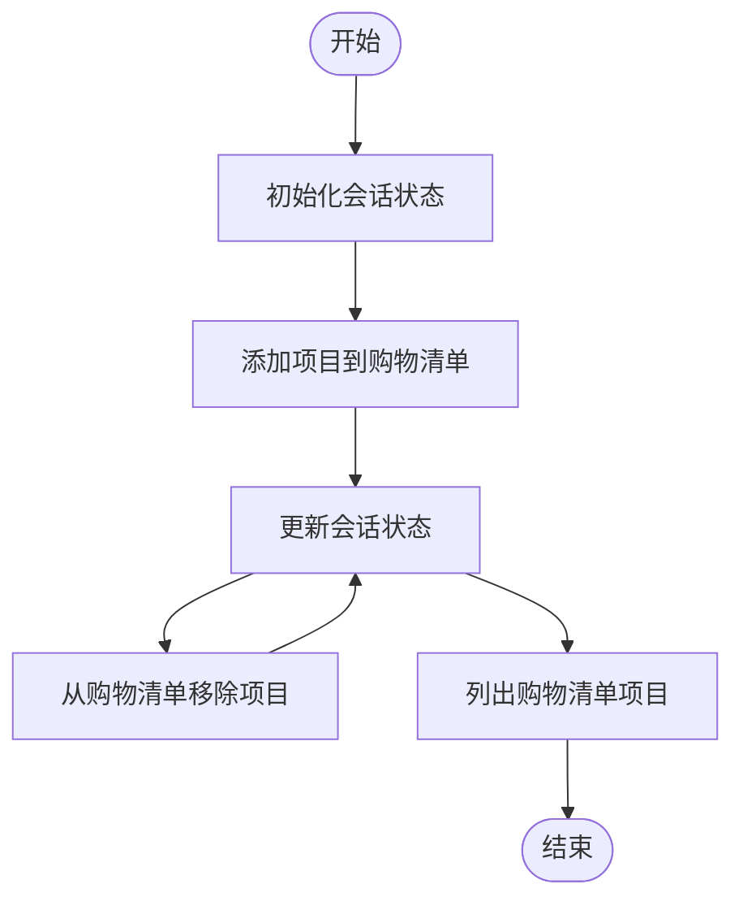
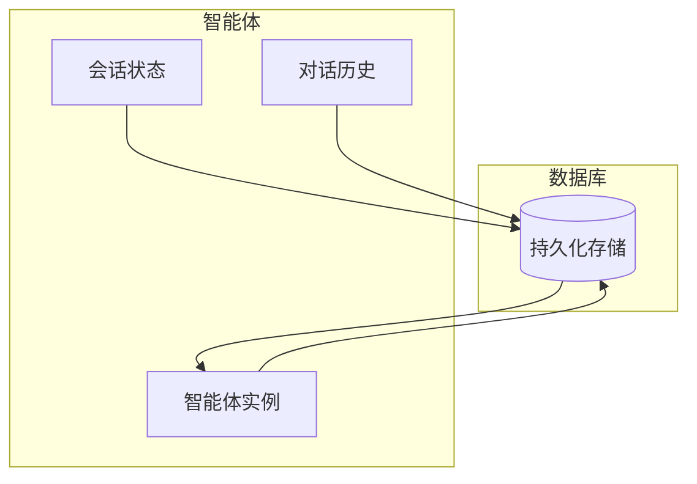
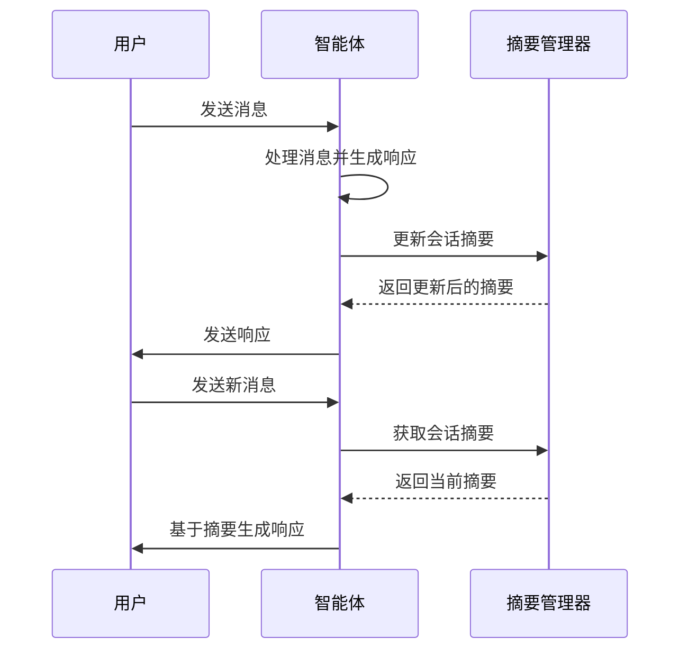
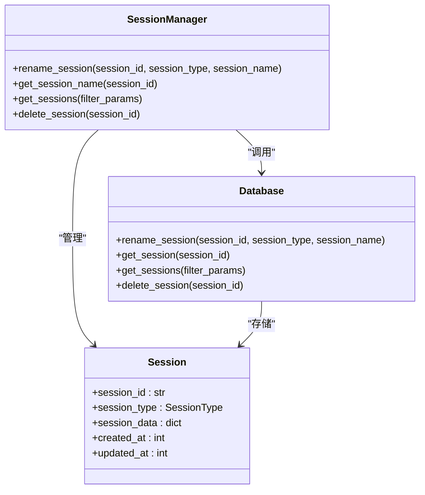
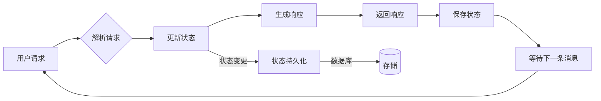
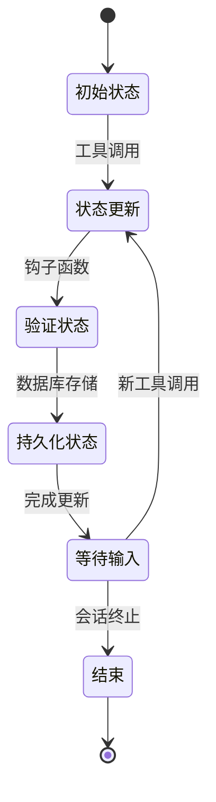

# 状态与会话管理

<cite>
**本文档中引用的文件**  
- [01_persistent_session.py](file://cookbook/agents/session/01_persistent_session.py)
- [02_persistent_session_history.py](file://cookbook/agents/session/02_persistent_session_history.py)
- [03_session_summary.py](file://cookbook/agents/session/03_session_summary.py)
- [04_session_summary_references.py](file://cookbook/agents/session/04_session_summary_references.py)
- [05_chat_history.py](file://cookbook/agents/session/05_chat_history.py)
- [06_rename_session.py](file://cookbook/agents/session/06_rename_session.py)
- [07_in_memory_db.py](file://cookbook/agents/session/07_in_memory_db.py)
- [08_cache_session.py](file://cookbook/agents/session/08_cache_session.py)
- [session_state_basic.py](file://cookbook/agents/state/session_state_basic.py)
- [session_state_advanced.py](file://cookbook/agents/state/session_state_advanced.py)
- [dynamic_session_state.py](file://cookbook/agents/state/dynamic_session_state.py)
- [agentic_session_state.py](file://cookbook/agents/state/agentic_session_state.py)
- [session_state_in_context.py](file://cookbook/agents/state/session_state_in_context.py)
- [session_state_in_instructions.py](file://cookbook/agents/state/session_state_in_instructions.py)
- [session_state_multiple_users.py](file://cookbook/agents/state/session_state_multiple_users.py)
- [session.py](file://libs/agno/agno/os/routers/session/session.py)
- [postgres.py](file://libs/agno/agno/db/postgres/postgres.py)
- [redis.py](file://libs/agno/agno/db/redis/redis.py)
- [base.py](file://libs/agno/agno/db/base.py)
</cite>

## 目录
1. [简介](#简介)
2. [会话状态管理](#会话状态管理)
3. [会话持久化](#会话持久化)
4. [会话摘要功能](#会话摘要功能)
5. [会话重命名与管理](#会话重命名与管理)
6. [多轮对话中的状态跟踪](#多轮对话中的状态跟踪)
7. [高级状态管理](#高级状态管理)
8. [总结](#总结)

## 简介
本文档详细介绍了智能体系统中的状态与会话管理机制。系统提供了完整的会话状态维护、持久化存储、会话摘要生成和会话管理功能，确保在复杂的多轮对话中能够有效跟踪任务进度和用户偏好。通过灵活的状态管理机制，智能体能够在会话重启后保留对话历史和上下文，为用户提供连贯的交互体验。

## 会话状态管理

会话状态管理是智能体系统的核心功能之一，允许智能体在运行期间维护和修改会话状态。系统支持基本状态、高级状态和代理式会话状态等多种状态管理方式。

基本会话状态通过`session_state`参数初始化，可以在智能体运行过程中动态更新。例如，在购物清单管理场景中，可以通过工具函数添加、删除和查看购物清单项目，状态会自动保存和更新。

**图示来源**
- [session_state_basic.py](file://cookbook/agents/state/session_state_basic.py#L1-L27)
- [session_state_advanced.py](file://cookbook/agents/state/session_state_advanced.py#L1-L77)

**本节来源**
- [session_state_basic.py](file://cookbook/agents/state/session_state_basic.py#L1-L27)
- [session_state_advanced.py](file://cookbook/agents/state/session_state_advanced.py#L1-L77)

## 会话持久化

会话持久化功能确保对话历史和上下文在会话重启后得以保留。系统支持多种数据库后端，包括PostgreSQL、SQLite、Redis等，通过配置数据库连接实现会话数据的持久化存储。

在配置智能体时，通过指定`db`参数和`session_id`，系统会自动将会话数据存储到指定的数据库中。`add_history_to_context`参数控制是否将历史记录添加到上下文中，`num_history_runs`参数设置添加到消息中的历史运行次数。

**图示来源**
- [01_persistent_session.py](file://cookbook/agents/session/01_persistent_session.py#L1-L17)
- [02_persistent_session_history.py](file://cookbook/agents/session/02_persistent_session_history.py#L1-L24)
- [postgres.py](file://libs/agno/agno/db/postgres/postgres.py#L1-L100)

**本节来源**
- [01_persistent_session.py](file://cookbook/agents/session/01_persistent_session.py#L1-L17)
- [02_persistent_session_history.py](file://cookbook/agents/session/02_persistent_session_history.py#L1-L24)

## 会话摘要功能

会话摘要功能自动生成和管理会话的摘要信息，帮助智能体在长对话中保持上下文连贯性。通过`enable_session_summaries`参数启用会话摘要功能，系统会自动为会话生成摘要。

会话摘要可以添加到上下文中，通过`add_session_summary_to_context`参数控制。这使得智能体在后续交互中能够参考会话摘要，而不需要加载完整的对话历史，提高了效率并减少了上下文长度。

**图示来源**
- [03_session_summary.py](file://cookbook/agents/session/03_session_summary.py#L1-L39)
- [04_session_summary_references.py](file://cookbook/agents/session/04_session_summary_references.py#L1-L49)
- [session.py](file://libs/agno/agno/os/routers/session/session.py#L1-L200)

**本节来源**
- [03_session_summary.py](file://cookbook/agents/session/03_session_summary.py#L1-L39)
- [04_session_summary_references.py](file://cookbook/agents/session/04_session_summary_references.py#L1-L49)

## 会话重命名与管理

系统提供了完整的会话管理功能，包括会话重命名、会话查询和会话删除等操作。通过`set_session_name`方法可以为会话设置自定义名称，也可以通过`autogenerate=True`参数自动生成会话名称。

会话管理功能通过数据库的`rename_session`接口实现，支持对不同类型的会话（智能体、团队、工作流）进行重命名操作。会话名称存储在会话数据的`session_data`字段中，便于后续查询和展示。

**图示来源**
- [06_rename_session.py](file://cookbook/agents/session/06_rename_session.py#L1-L27)
- [redis.py](file://libs/agno/agno/db/redis/redis.py#L424-L454)
- [postgres.py](file://libs/agno/agno/db/postgres/postgres.py#L522-L548)
- [base.py](file://libs/agno/agno/db/base.py#L40-L83)

**本节来源**
- [06_rename_session.py](file://cookbook/agents/session/06_rename_session.py#L1-L27)
- [redis.py](file://libs/agno/agno/db/redis/redis.py#L424-L454)
- [postgres.py](file://libs/agno/agno/db/postgres/postgres.py#L522-L548)

## 多轮对话中的状态跟踪

在复杂的多轮对话中，状态管理功能可以有效跟踪任务进度和用户偏好。通过将状态变量嵌入到指令中，智能体能够实时反映当前状态，并根据状态变化调整行为。

例如，在购物清单管理场景中，智能体的指令中包含`{shopping_list}`变量，系统会自动将当前购物清单状态注入到指令中。这使得智能体在每次响应时都能准确反映最新的购物清单状态。

**图示来源**
- [05_chat_history.py](file://cookbook/agents/session/05_chat_history.py#L1-L22)
- [session_state_in_instructions.py](file://cookbook/agents/state/session_state_in_instructions.py#L1-L20)
- [session_state_in_context.py](file://cookbook/agents/state/session_state_in_context.py#L1-L20)

**本节来源**
- [05_chat_history.py](file://cookbook/agents/session/05_chat_history.py#L1-L22)
- [session_state_in_instructions.py](file://cookbook/agents/state/session_state_in_instructions.py#L1-L20)

## 高级状态管理

系统支持高级状态管理功能，包括动态会话状态、多用户会话状态和代理式会话状态。动态会话状态允许在运行时根据函数调用动态更新状态，通过工具钩子（tool hooks）实现复杂的状态变更逻辑。

代理式会话状态通过`enable_agentic_state`参数启用，允许智能体自主决定何时更新状态。这种模式下，智能体可以根据对话内容和上下文自主管理状态，提供更灵活的状态管理能力。

**图示来源**
- [dynamic_session_state.py](file://cookbook/agents/state/dynamic_session_state.py#L1-L79)
- [agentic_session_state.py](file://cookbook/agents/state/agentic_session_state.py#L1-L19)
- [session_state_multiple_users.py](file://cookbook/agents/state/session_state_multiple_users.py#L1-L25)

**本节来源**
- [dynamic_session_state.py](file://cookbook/agents/state/dynamic_session_state.py#L1-L79)
- [agentic_session_state.py](file://cookbook/agents/state/agentic_session_state.py#L1-L19)

## 总结
智能体系统的状态与会话管理功能提供了全面的解决方案，支持在复杂多轮对话中有效维护和修改会话状态。通过基本状态、高级状态和代理式会话状态等多种模式，系统能够满足不同场景下的状态管理需求。

会话持久化功能确保对话历史和上下文在会话重启后得以保留，会话摘要功能提高了长对话的上下文管理效率。会话重命名和管理功能提供了完整的会话生命周期管理能力。这些功能共同构成了一个强大而灵活的状态管理系统，为构建复杂的智能体应用提供了坚实的基础。