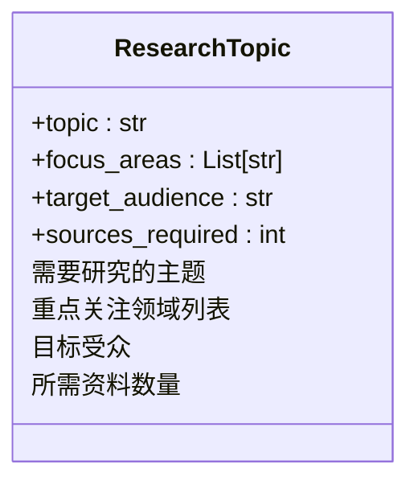
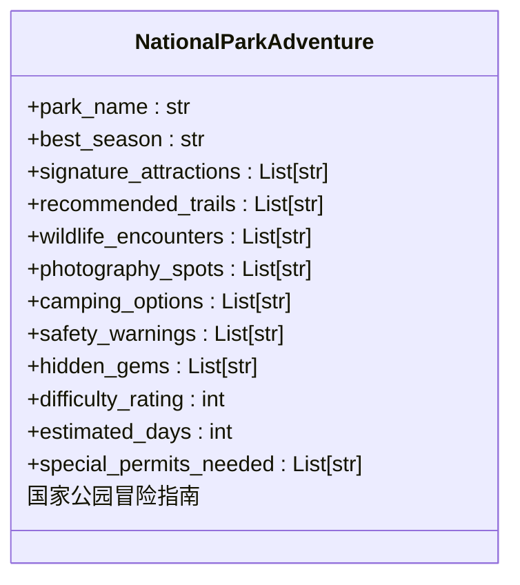
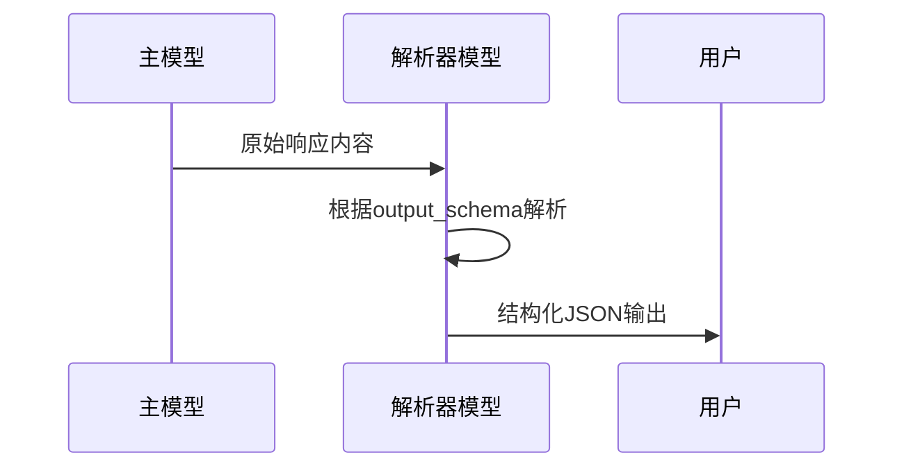
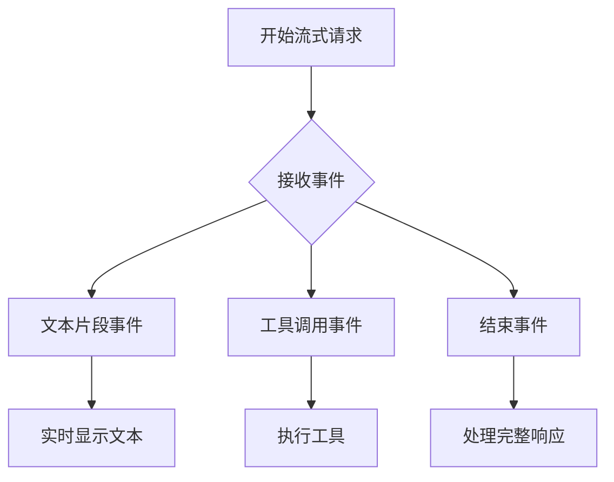

# 输入与输出

<cite>
**本文档引用的文件**
- [input_as_dict.py](file://cookbook/agents/input_and_output/input_as_dict.py)
- [input_as_list.py](file://cookbook/agents/input_and_output/input_as_list.py)
- [input_as_message.py](file://cookbook/agents/input_and_output/input_as_message.py)
- [input_as_messages_list.py](file://cookbook/agents/input_and_output/input_as_messages_list.py)
- [input_schema_on_agent.py](file://cookbook/agents/input_and_output/input_schema_on_agent.py)
- [output_model.py](file://cookbook/agents/input_and_output/output_model.py)
- [parser_model.py](file://cookbook/agents/input_and_output/parser_model.py)
- [parser_model_stream.py](file://cookbook/agents/input_and_output/parser_model_stream.py)
- [response_as_variable.py](file://cookbook/agents/input_and_output/response_as_variable.py)
- [structured_input.py](file://cookbook/agents/input_and_output/structured_input.py)
- [structured_input_output_with_parser_model.py](file://cookbook/agents/input_and_output/structured_input_output_with_parser_model.py)
- [agent.py](file://libs/agno/agno/agent/agent.py)
- [schema.py](file://libs/agno/agno/os/schema.py)
- [test_input_schema.py](file://libs/agno/tests/unit/agent/test_input_schema.py)
</cite>

## 目录
1. [简介](#简介)
2. [输入处理机制](#输入处理机制)
3. [输入模式验证](#输入模式验证)
4. [结构化输出配置](#结构化输出配置)
5. [解析器模型与输出模型](#解析器模型与输出模型)
6. [流式响应处理](#流式响应处理)
7. [响应作为变量捕获](#响应作为变量捕获)
8. [核心机制的重要性](#核心机制的重要性)

## 简介
本文档详细阐述了智能体如何接收、处理和验证不同格式的输入，以及如何配置智能体生成结构化输出。涵盖了字典、列表、消息对象和结构化输入模型等多种输入格式的处理方式，详细说明了输入模式（Input Schema）的定义与验证机制。同时，深入探讨了使用 Pydantic 模型作为输出模型（Output Model）和解析器模型（Parser Model）来确保响应格式化和准确性的方法。文档还提供了处理流式响应和将响应作为变量捕获的实践示例，解释了这些机制在构建可靠、可预测的智能体应用中的关键作用。

## 输入处理机制

智能体支持多种格式的输入，包括字典、列表、消息对象和消息列表，为开发者提供了极大的灵活性。

### 字典格式输入
当输入为字典时，智能体能够直接解析包含角色（role）和内容（content）的结构化数据。这种格式特别适用于包含多模态内容（如文本和图像）的复杂输入。

**Section sources**
- [input_as_dict.py](file://cookbook/agents/input_and_output/input_as_dict.py)

### 列表格式输入
智能体可以接收一个包含多个内容项的列表作为输入。每个内容项可以是文本或图像等不同类型的媒体，系统会自动将其组合成有效的消息格式。

**Section sources**
- [input_as_list.py](file://cookbook/agents/input_and_output/input_as_list.py)

### 消息对象输入
通过创建 `Message` 对象，开发者可以更精确地控制输入消息的结构，明确指定角色和内容，实现更规范的输入处理。

**Section sources**
- [input_as_message.py](file://cookbook/agents/input_and_output/input_as_message.py)

### 消息列表输入
对于多轮对话场景，智能体支持接收一个 `Message` 对象列表作为输入。这使得智能体能够基于完整的对话历史生成响应，保持上下文连贯性。

**Section sources**
- [input_as_messages_list.py](file://cookbook/agents/input_and_output/input_as_messages_list.py)

## 输入模式验证

输入模式（Input Schema）是确保用户输入符合预期结构和类型的关键机制，通过 Pydantic 模型实现严格的验证。

### 定义输入模式
通过定义继承自 `BaseModel` 的 Pydantic 模型来创建输入模式。模型中的字段可以指定数据类型、描述和默认值，从而精确描述所需的输入结构。



**Diagram sources**
- [input_schema_on_agent.py](file://cookbook/agents/input_and_output/input_schema_on_agent.py)
- [structured_input.py](file://cookbook/agents/input_and_output/structured_input.py)

### 模式验证流程
当智能体接收到输入时，会自动调用 `_validate_input` 方法进行验证。如果输入是符合模式的字典，系统会将其转换为相应的 Pydantic 模型实例；如果输入已经是正确的 Pydantic 模型实例，则直接通过验证。

**Section sources**
- [input_schema_on_agent.py](file://cookbook/agents/input_and_output/input_schema_on_agent.py)
- [test_input_schema.py](file://libs/agno/tests/unit/agent/test_input_schema.py)

## 结构化输出配置

结构化输出配置确保智能体的响应具有可预测和一致的格式，便于后续程序化处理。

### 输出模式定义
通过 `output_schema` 参数指定一个 Pydantic 模型，强制智能体的最终输出必须符合该模型的结构。这在需要将智能体响应直接集成到应用程序数据流中时尤为重要。



**Diagram sources**
- [parser_model.py](file://cookbook/agents/input_and_output/parser_model.py)
- [parser_model_stream.py](file://cookbook/agents/input_and_output/parser_model_stream.py)

### 响应格式化
当设置了 `output_schema` 时，系统会自动向解析器模型添加特定的系统提示，指导其如何将原始响应转换为符合 JSON 模式的结构化输出。

**Section sources**
- [schema.py](file://libs/agno/agno/os/schema.py)
- [agent.py](file://libs/agno/agno/agent/agent.py)

## 解析器模型与输出模型

解析器模型和输出模型是实现高级输出控制的两个核心组件，它们协同工作以确保响应的质量和格式。

### 解析器模型（Parser Model）
解析器模型负责将主模型的原始响应转换为符合预定义模式的结构化输出。它接收主模型的响应内容和输出模式作为输入，生成格式正确的 JSON 数据。



**Diagram sources**
- [parser_model.py](file://cookbook/agents/input_and_output/parser_model.py)
- [agent.py](file://libs/agno/agno/agent/agent.py)

### 输出模型（Output Model）
输出模型是专门用于生成最终响应的模型，与主模型分离。这允许使用高性能模型进行思考和推理，而使用成本更低或响应更快的模型来生成最终输出。

**Section sources**
- [output_model.py](file://cookbook/agents/input_and_output/output_model.py)

## 流式响应处理

流式响应处理允许实时接收和处理智能体的输出，提供更流畅的用户体验。

### 流式API调用
通过在 `run` 方法中设置 `stream=True`，可以获取一个事件迭代器，逐个接收响应事件。这对于构建实时聊天界面或需要逐步处理响应的应用场景非常有用。



**Section sources**
- [parser_model_stream.py](file://cookbook/agents/input_and_output/parser_model_stream.py)

## 响应作为变量捕获

将智能体的响应捕获为变量是实现程序化控制和数据处理的基础。

### 同步响应捕获
通过 `run` 方法的返回值，可以直接将智能体的完整响应捕获到一个变量中。返回的对象通常包含内容、工具调用、成本等详细信息。

```python
run_response: RunOutput = agent.run("查询NVDA股票价格")
```

**Section sources**
- [response_as_variable.py](file://cookbook/agents/input_and_output/response_as_variable.py)

### 异步流式响应捕获
对于流式响应，可以捕获事件迭代器并在循环中处理每个事件，实现对响应过程的精细控制。

**Section sources**
- [response_as_variable.py](file://cookbook/agents/input_and_output/response_as_variable.py)

## 核心机制的重要性

智能体的输入输出机制是构建可靠、可预测的AI应用的基石。

### 确保数据一致性
通过输入模式验证和结构化输出，可以确保智能体始终处理和生成符合预期格式的数据，减少因格式错误导致的程序崩溃。

### 提高应用可靠性
严格的输入验证防止了恶意或错误数据的注入，而结构化输出使得前端应用可以安全地解析和显示响应，无需担心数据结构的意外变化。

### 支持复杂工作流
解析器模型和输出模型的分离设计，使得智能体系统可以优化性能和成本，同时保持输出的高质量和一致性，支持构建复杂的多阶段AI工作流。

**Section sources**
- [structured_input_output_with_parser_model.py](file://cookbook/agents/input_and_output/structured_input_output_with_parser_model.py)
- [agent.py](file://libs/agno/agno/agent/agent.py)