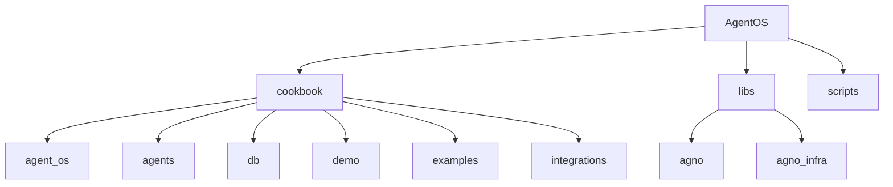
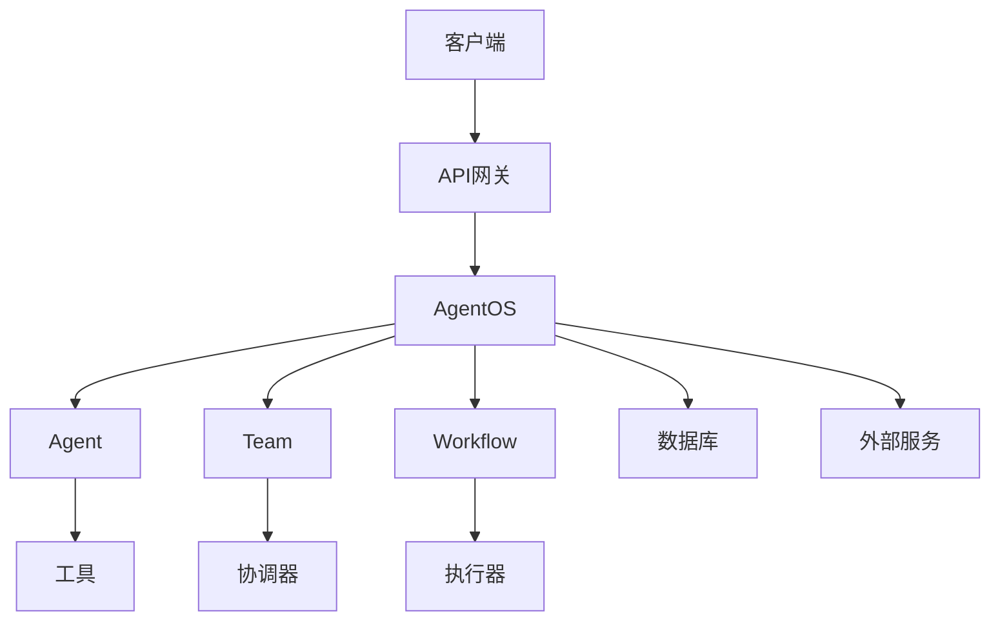
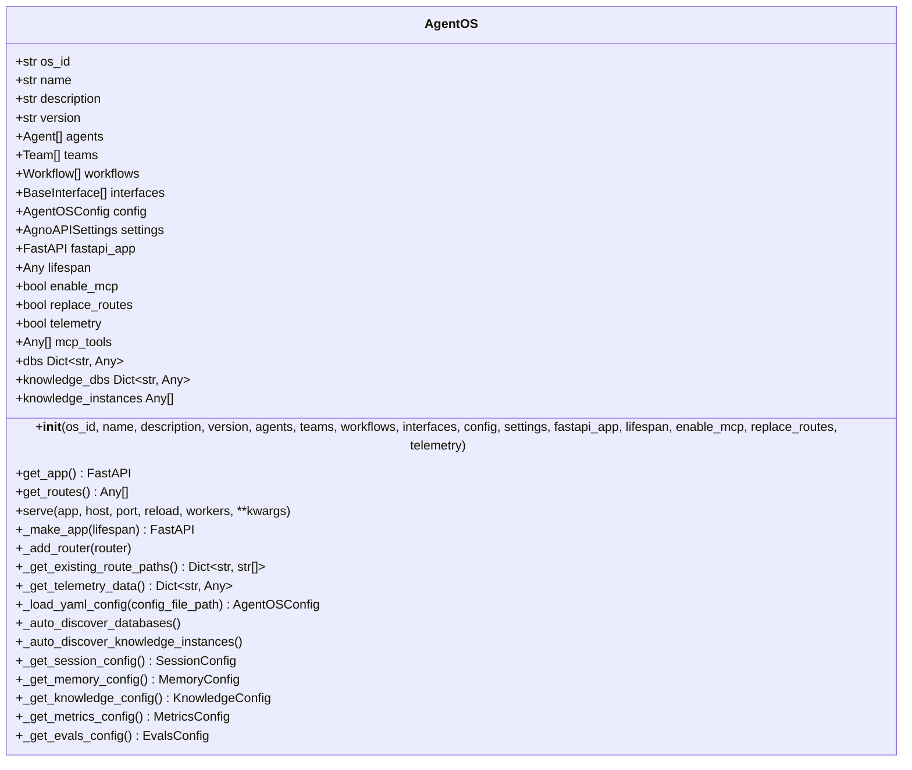
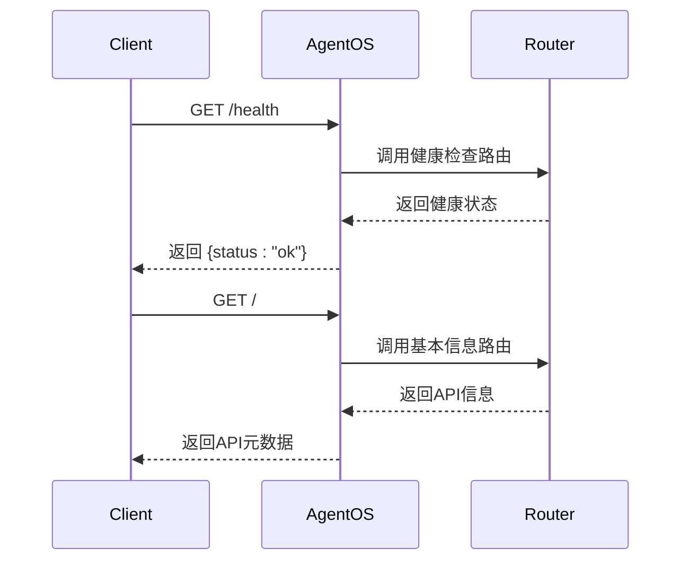
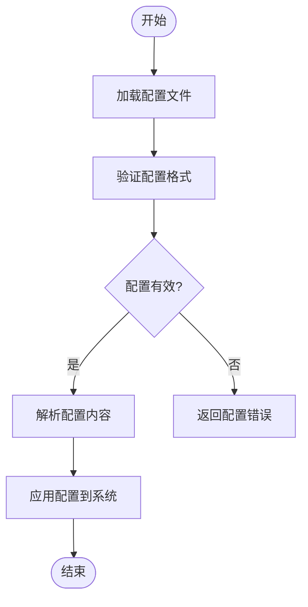
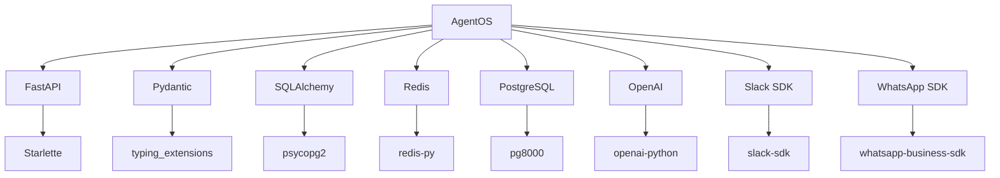

# AgentOS

<cite>
**本文档中引用的文件**  
- [basic.py](file://cookbook/agent_os/basic.py)
- [app.py](file://libs/agno/agno/os/app.py)
- [config.yaml](file://cookbook/agent_os/os_config/config.yaml)
- [health.py](file://libs/agno/agno/os/routers/health.py)
- [home.py](file://libs/agno/agno/os/routers/home.py)
- [websocket_client.py](file://cookbook/workflows/_06_advanced_concepts/_05_background_execution/background_execution_using_websocket/websocket_client.py)
- [slack/basic.py](file://cookbook/agent_os/interfaces/slack/basic.py)
- [whatsapp/basic.py](file://cookbook/agent_os/interfaces/whatsapp/basic.py)
</cite>

## 目录
1. [简介](#简介)
2. [项目结构](#项目结构)
3. [核心组件](#核心组件)
4. [架构概述](#架构概述)
5. [详细组件分析](#详细组件分析)
6. [依赖分析](#依赖分析)
7. [性能考虑](#性能考虑)
8. [故障排除指南](#故障排除指南)
9. [结论](#结论)

## 简介
AgentOS是一个预构建的FastAPI应用，旨在作为智能体操作系统，提供管理智能体、团队和工作流生命周期的完整解决方案。它支持通过YAML配置文件或自定义代码进行扩展和定制，并能处理来自Slack、WhatsApp等外部接口的请求。本架构文档将详细描述其系统设计、组件边界、集成模式、API端点、路由机制、中间件管道和认证系统。

## 项目结构
AgentOS项目采用模块化设计，主要分为cookbook、libs和scripts三个目录。cookbook目录包含各种使用示例和演示代码，libs目录包含核心库实现，scripts目录包含各种脚本工具。

**图源**
- [basic.py](file://cookbook/agent_os/basic.py)
- [app.py](file://libs/agno/agno/os/app.py)

**节源**
- [basic.py](file://cookbook/agent_os/basic.py)
- [app.py](file://libs/agno/agno/os/app.py)

## 核心组件
AgentOS的核心组件包括Agent、Team、Workflow和AgentOS类。Agent代表单个智能体，Team代表智能体团队，Workflow代表工作流，AgentOS是整个系统的入口点。

**节源**
- [basic.py](file://cookbook/agent_os/basic.py)
- [app.py](file://libs/agno/agno/os/app.py)

## 架构概述
AgentOS基于FastAPI构建，采用微服务架构设计。它通过AgentOS类封装了所有核心功能，包括智能体管理、团队协作、工作流执行和外部接口集成。

**图源**
- [app.py](file://libs/agno/agno/os/app.py)
- [basic.py](file://cookbook/agent_os/basic.py)

## 详细组件分析

### AgentOS类分析
AgentOS类是整个系统的核心，负责初始化和管理所有组件。

**图源**
- [app.py](file://libs/agno/agno/os/app.py)

**节源**
- [app.py](file://libs/agno/agno/os/app.py)

### API路由分析
AgentOS提供了标准的REST API路由，包括健康检查、基本信息获取等。

**图源**
- [health.py](file://libs/agno/agno/os/routers/health.py)
- [home.py](file://libs/agno/agno/os/routers/home.py)

**节源**
- [health.py](file://libs/agno/agno/os/routers/health.py)
- [home.py](file://libs/agno/agno/os/routers/home.py)

### 配置系统分析
AgentOS支持通过YAML文件进行配置，提供了灵活的配置选项。

**图源**
- [config.yaml](file://cookbook/agent_os/os_config/config.yaml)
- [app.py](file://libs/agno/agno/os/app.py)

**节源**
- [config.yaml](file://cookbook/agent_os/os_config/config.yaml)
- [app.py](file://libs/agno/agno/os/app.py)

## 依赖分析
AgentOS依赖于多个外部库和组件，形成了复杂的依赖网络。

**图源**
- [app.py](file://libs/agno/agno/os/app.py)
- [requirements.txt](file://libs/agno/requirements.txt)

**节源**
- [app.py](file://libs/agno/agno/os/app.py)
- [requirements.txt](file://libs/agno/requirements.txt)

## 性能考虑
AgentOS在设计时考虑了性能优化，包括异步处理、缓存机制和连接池等。

[无源，因为本节提供一般性指导]

## 故障排除指南
当遇到问题时，可以检查以下常见问题：

**节源**
- [app.py](file://libs/agno/agno/os/app.py)
- [websocket_client.py](file://cookbook/workflows/_06_advanced_concepts/_05_background_execution/background_execution_using_websocket/websocket_client.py)

## 结论
AgentOS提供了一个完整的智能体操作系统解决方案，具有良好的架构设计和扩展性。通过本文档，用户可以深入了解其内部工作原理和使用方法。

[无源，因为本节总结而不分析特定文件]