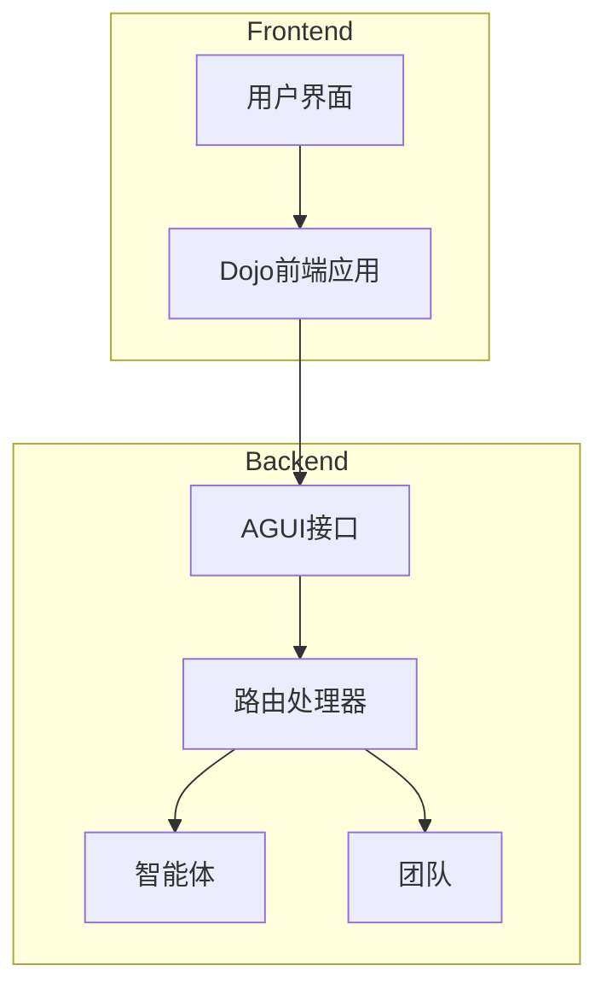
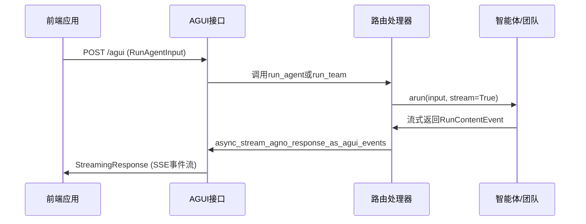
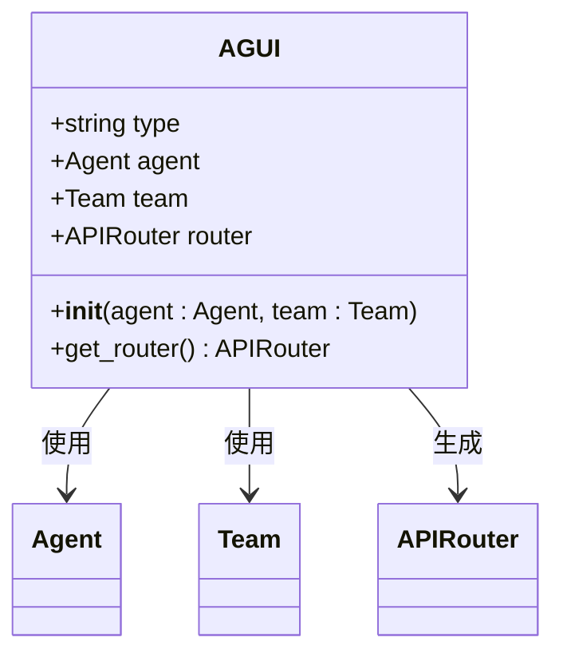
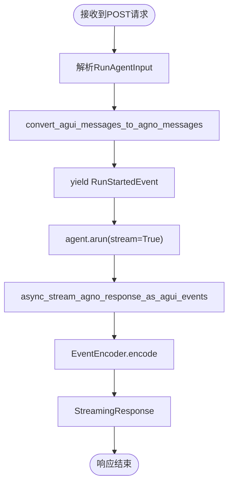
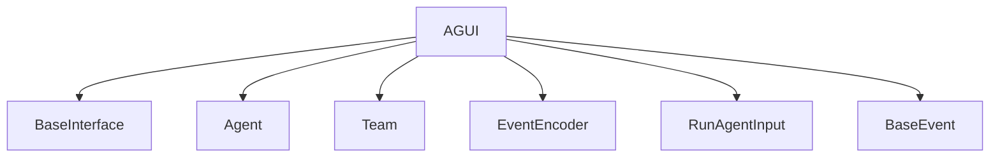

# AGUI 集成

<cite>
**本文档中引用的文件**
- [agui.py](file://libs/agno/agno/os/interfaces/agui/agui.py)
- [router.py](file://libs/agno/agno/os/interfaces/agui/router.py)
- [utils.py](file://libs/agno/agno/os/interfaces/agui/utils.py)
- [basic.py](file://cookbook/agent_os/interfaces/agui/basic.py)
- [README.md](file://cookbook/agent_os/interfaces/agui/README.md)
</cite>

## 目录
1. [简介](#简介)
2. [项目结构](#项目结构)
3. [核心组件](#核心组件)
4. [架构概述](#架构概述)
5. [详细组件分析](#详细组件分析)
6. [依赖分析](#依赖分析)
7. [性能考虑](#性能考虑)
8. [故障排除指南](#故障排除指南)
9. [结论](#结论)

## 简介
AGUI（自定义图形用户界面）是AgentOS的一个接口模块，用于将智能体（Agent）或团队（Team）以标准化的方式暴露给前端应用。通过AGUI集成，开发者可以快速构建类似ChatGPT的用户界面，并实现与智能体的实时交互。本文档详细说明了AGUI的架构设计、WebSocket通信协议、消息传输机制以及在前端中集成智能体工具调用和流式响应的方法。

## 项目结构
AGUI模块位于`libs/agno/agno/os/interfaces/agui/`目录下，主要包括核心类、路由处理和工具函数。前端通过`/agui`端点与后端进行通信，所有消息均以SSE（Server-Sent Events）格式流式传输。

**图示来源**
- [agui.py](file://libs/agno/agno/os/interfaces/agui/agui.py#L1-L30)
- [router.py](file://libs/agno/agno/os/interfaces/agui/router.py#L1-L120)

**章节来源**
- [agui.py](file://libs/agno/agno/os/interfaces/agui/agui.py#L1-L30)
- [router.py](file://libs/agno/agno/os/interfaces/agui/router.py#L1-L120)

## 核心组件
AGUI的核心组件包括`AGUI`类、路由处理函数和事件编码器。`AGUI`类继承自`BaseInterface`，负责初始化智能体或团队实例，并提供路由接口。路由处理函数`attach_routes`定义了`/agui`和`/status`两个端点，分别用于处理智能体运行请求和状态查询。

**章节来源**
- [agui.py](file://libs/agno/agno/os/interfaces/agui/agui.py#L1-L30)
- [router.py](file://libs/agno/agno/os/interfaces/agui/router.py#L1-L120)

## 架构概述
AGUI的架构基于FastAPI框架，采用异步路由处理智能体或团队的请求。前端通过POST请求发送`RunAgentInput`对象，后端将其转换为智能体可识别的格式，并通过`arun`方法异步执行。响应以SSE格式流式返回，包含运行开始、工具调用、文本消息和运行结束等事件。

**图示来源**
- [router.py](file://libs/agno/agno/os/interfaces/agui/router.py#L1-L120)
- [utils.py](file://libs/agno/agno/os/interfaces/agui/utils.py#L1-L44)

## 详细组件分析

### AGUI类分析
`AGUI`类是AGUI接口的核心，负责初始化智能体或团队实例，并提供路由接口。该类要求至少提供一个智能体或团队实例，否则会抛出异常。

**图示来源**
- [agui.py](file://libs/agno/agno/os/interfaces/agui/agui.py#L1-L30)

### 路由处理分析
路由处理模块定义了`/agui`端点，接收前端发送的`RunAgentInput`对象，并将其转换为智能体可识别的格式。响应以SSE格式流式返回，包含多种事件类型，如`RunStartedEvent`、`TextMessageContentEvent`、`ToolCallStartedEvent`等。

**图示来源**
- [router.py](file://libs/agno/agno/os/interfaces/agui/router.py#L1-L120)
- [utils.py](file://libs/agno/agno/os/interfaces/agui/utils.py#L1-L44)

### 消息转换与事件流分析
AGUI通过`convert_agui_messages_to_agno_messages`函数将前端消息转换为智能体可识别的格式，并通过`async_stream_agno_response_as_agui_events`函数将智能体的响应转换为AGUI兼容的事件流。事件流包括文本消息、工具调用、中间步骤等，支持结构化输出和流式响应。

**章节来源**
- [utils.py](file://libs/agno/agno/os/interfaces/agui/utils.py#L1-L44)
- [router.py](file://libs/agno/agno/os/interfaces/agui/router.py#L1-L120)

## 依赖分析
AGUI模块依赖于`agno.agent`、`agno.team`、`agno.os.interfaces.base`等核心模块，以及`ag_ui.core`和`ag_ui.encoder`等外部协议库。这些依赖关系确保了AGUI能够正确处理智能体和团队的请求，并以标准化格式返回响应。

**图示来源**
- [agui.py](file://libs/agno/agno/os/interfaces/agui/agui.py#L1-L30)
- [router.py](file://libs/agno/agno/os/interfaces/agui/router.py#L1-L120)

**章节来源**
- [agui.py](file://libs/agno/agno/os/interfaces/agui/agui.py#L1-L30)
- [router.py](file://libs/agno/agno/os/interfaces/agui/router.py#L1-L120)

## 性能考虑
AGUI采用异步非阻塞I/O模型，能够高效处理大量并发请求。通过流式响应机制，前端可以实时接收智能体的思考过程和中间步骤，提升用户体验。建议在生产环境中使用WebSocket替代SSE以获得更低的延迟和更高的效率。

## 故障排除指南
当AGUI集成出现问题时，首先检查以下几点：
1. 确保`AGUI`实例正确初始化，提供了有效的智能体或团队实例。
2. 检查`/agui`端点是否正确暴露，且前端能够访问。
3. 验证`RunAgentInput`对象的格式是否正确，特别是`messages`字段。
4. 查看日志文件中的错误信息，定位具体问题。

**章节来源**
- [router.py](file://libs/agno/agno/os/interfaces/agui/router.py#L1-L120)
- [utils.py](file://libs/agno/agno/os/interfaces/agui/utils.py#L1-L44)

## 结论
AGUI为AgentOS提供了一个标准化的前端集成方案，通过简单的配置即可实现智能体或团队的可视化交互。其基于SSE的流式响应机制支持实时消息传输、工具调用和中间步骤展示，为构建复杂的智能体应用提供了坚实的基础。未来可考虑支持WebSocket协议以进一步提升性能和用户体验。