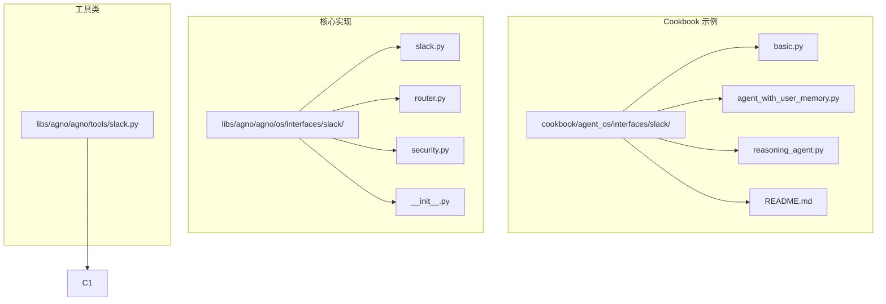
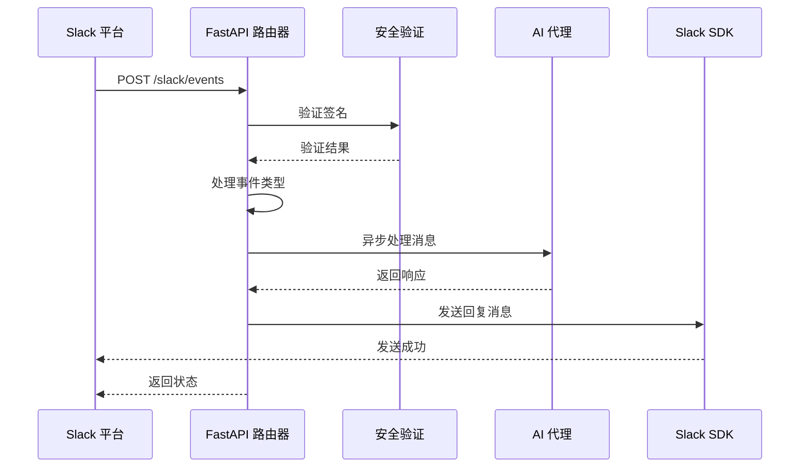
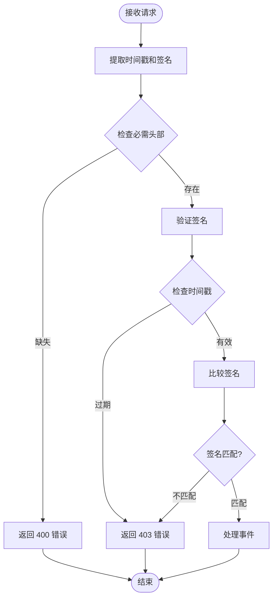
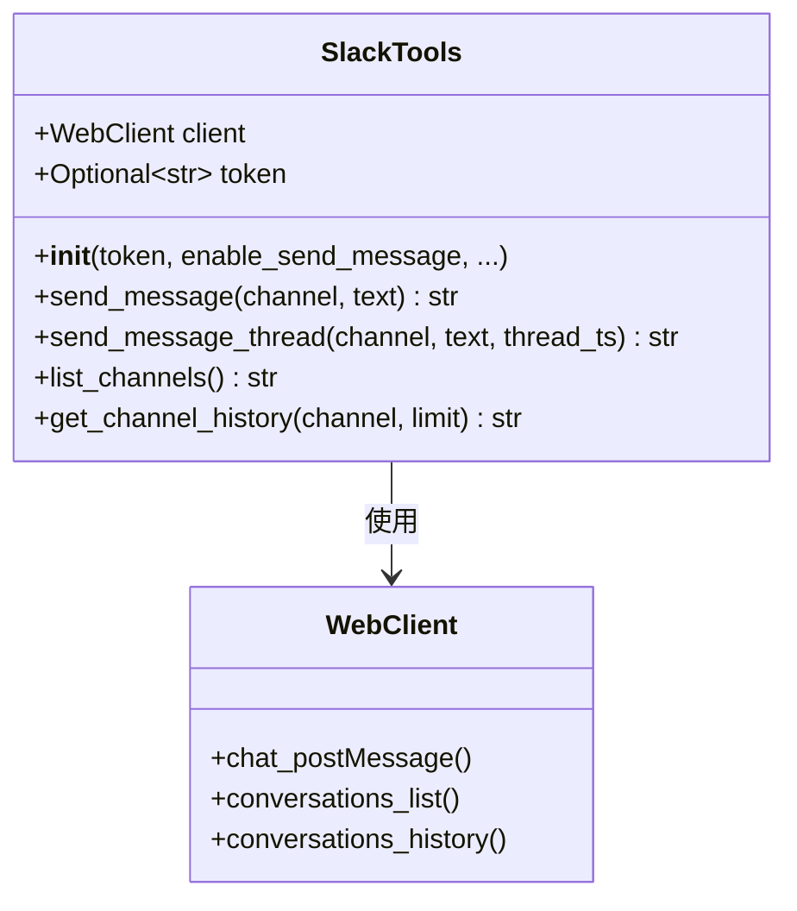
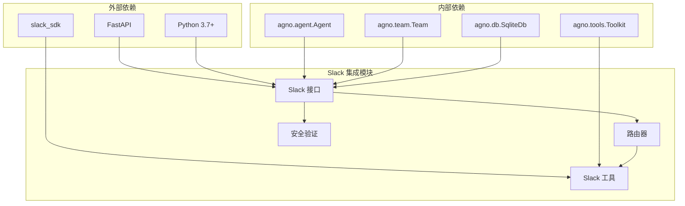

# Slack 集成

<cite>
**本文档中引用的文件**
- [basic.py](file://cookbook/agent_os/interfaces/slack/basic.py)
- [README.md](file://cookbook/agent_os/interfaces/slack/README.md)
- [agent_with_user_memory.py](file://cookbook/agent_os/interfaces/slack/agent_with_user_memory.py)
- [reasoning_agent.py](file://cookbook/agent_os/interfaces/slack/reasoning_agent.py)
- [slack.py](file://libs/agno/agno/os/interfaces/slack/slack.py)
- [router.py](file://libs/agno/agno/os/interfaces/slack/router.py)
- [security.py](file://libs/agno/agno/os/interfaces/slack/security.py)
- [slack.py](file://libs/agno/agno/tools/slack.py)
- [slack_tools.py](file://cookbook/tools/slack_tools.py)
</cite>

## 目录
1. [简介](#简介)
2. [项目结构](#项目结构)
3. [核心组件](#核心组件)
4. [架构概览](#架构概览)
5. [详细组件分析](#详细组件分析)
6. [依赖关系分析](#依赖关系分析)
7. [性能考虑](#性能考虑)
8. [故障排除指南](#故障排除指南)
9. [结论](#结论)

## 简介

AgentOS 与 Slack 的集成提供了强大的实时对话能力，允许用户通过 Slack 平台与 AI 代理进行交互。该集成支持多种功能，包括消息事件处理、线程回复、富媒体消息以及用户记忆管理。通过这个系统，开发者可以轻松地将 AI 功能部署到 Slack 工作区中，为用户提供智能对话体验。

## 项目结构

Slack 集成功能主要分布在以下目录结构中：



**图表来源**
- [basic.py](file://cookbook/agent_os/interfaces/slack/basic.py#L1-L34)
- [slack.py](file://libs/agno/agno/os/interfaces/slack/slack.py#L1-L31)
- [slack.py](file://libs/agno/agno/tools/slack.py#L1-L122)

**章节来源**
- [README.md](file://cookbook/agent_os/interfaces/slack/README.md#L1-L105)

## 核心组件

### Slack 接口类

Slack 接口是整个集成的核心组件，负责管理与 Slack 平台的通信：

```python
class Slack(BaseInterface):
    type = "slack"
    
    def __init__(self, agent: Optional[Agent] = None, team: Optional[Team] = None):
        self.agent = agent
        self.team = team
        
    def get_router(self, **kwargs) -> APIRouter:
        self.router = APIRouter(prefix="/slack", tags=["Slack"])
        self.router = attach_routes(router=self.router, agent=self.agent, team=self.team)
        return self.router
```

### 消息处理路由器

路由器负责处理来自 Slack 的各种事件类型：

```python
async def _process_slack_event(event: dict):
    if event.get("type") == "message":
        user = event.get("user")
        message_text = event.get("text", "")
        channel_id = event.get("channel", "")
        ts = event.get("thread_ts", "") or event.get("ts", "")
        
        session_id = ts
        
        if agent:
            response = await agent.arun(message_text, user_id=user, session_id=session_id)
        elif team:
            response = await team.arun(message_text, user_id=user, session_id=session_id)
            
        if response.reasoning_content:
            _send_slack_message(channel=channel_id, message=f"Reasoning: \n{response.reasoning_content}", 
                              thread_ts=ts, italics=True)
        _send_slack_message(channel=channel_id, message=response.content or "", thread_ts=ts)
```

**章节来源**
- [slack.py](file://libs/agno/agno/os/interfaces/slack/slack.py#L1-L31)
- [router.py](file://libs/agno/agno/os/interfaces/slack/router.py#L35-L60)

## 架构概览

Slack 集成采用事件驱动架构，通过 FastAPI 路由器处理 Slack 事件：



**图表来源**
- [router.py](file://libs/agno/agno/os/interfaces/slack/router.py#L10-L35)
- [security.py](file://libs/agno/agno/os/interfaces/slack/security.py#L12-L30)

## 详细组件分析

### 安全验证模块

安全验证确保所有传入的 Slack 请求都是合法的：



**图表来源**
- [security.py](file://libs/agno/agno/os/interfaces/slack/security.py#L12-L30)

### 消息发送工具

Slack 工具类提供了丰富的消息发送功能：



**图表来源**
- [slack.py](file://libs/agno/agno/tools/slack.py#L13-L40)

### 用户记忆管理

在高级示例中，集成了用户记忆管理功能：

```python
memory_manager = MemoryManager(
    memory_capture_instructions="""\
        Collect User's name,
        Collect Information about user's passion and hobbies,
        Collect Information about the users likes and dislikes,
        Collect information about what the user is doing with their life right now
    """,
    model=Claude(id="claude-3-5-sonnet-20241022"),
)

personal_agent = Agent(
    name="Basic Agent",
    model=Claude(id="claude-sonnet-4-20250514"),
    tools=[GoogleSearchTools()],
    enable_user_memories=True,
    memory_manager=memory_manager,
    # ... 其他配置
)
```

**章节来源**
- [agent_with_user_memory.py](file://cookbook/agent_os/interfaces/slack/agent_with_user_memory.py#L12-L25)
- [agent_with_user_memory.py](file://cookbook/agent_os/interfaces/slack/agent_with_user_memory.py#L27-L50)

### 理性思考代理

理性思考代理展示了如何结合推理工具和金融数据：

```python
reasoning_finance_agent = Agent(
    name="Reasoning Finance Agent",
    model=Claude(id="claude-3-7-sonnet-latest"),
    tools=[
        ReasoningTools(add_instructions=True),
        YFinanceTools(
            stock_price=True,
            analyst_recommendations=True,
            company_info=True,
            company_news=True,
        ),
    ],
    instructions="Use tables to display data. When you use thinking tools, keep the thinking brief.",
    markdown=True,
)
```

**章节来源**
- [reasoning_agent.py](file://cookbook/agent_os/interfaces/slack/reasoning_agent.py#L8-L25)

## 依赖关系分析

Slack 集成的依赖关系图如下：



**图表来源**
- [slack.py](file://libs/agno/agno/os/interfaces/slack/slack.py#L1-L10)
- [router.py](file://libs/agno/agno/os/interfaces/slack/router.py#L1-L5)
- [slack.py](file://libs/agno/agno/tools/slack.py#L1-L10)

**章节来源**
- [slack.py](file://libs/agno/agno/os/interfaces/slack/slack.py#L1-L31)
- [router.py](file://libs/agno/agno/os/interfaces/slack/router.py#L1-L91)

## 性能考虑

### 消息长度限制处理

系统自动处理 Slack 的消息长度限制（40000字符）：

```python
def _send_slack_message(channel: str, thread_ts: str, message: str, italics: bool = False):
    if len(message) <= 40000:
        # 单条消息发送
        return
    
    # 分割消息为批次
    message_batches = [message[i : i + 40000] for i in range(0, len(message), 40000)]
    
    for i, batch in enumerate(message_batches, 1):
        batch_message = f"[{i}/{len(message_batches)}] {batch}"
        # 发送每个批次
```

### 异步处理

所有消息处理都采用异步方式，避免阻塞主进程：

```python
@router.post("/events")
async def slack_events(request: Request, background_tasks: BackgroundTasks):
    # 异步处理签名验证
    if not verify_slack_signature(body, timestamp, slack_signature):
        raise HTTPException(status_code=403, detail="Invalid signature")
    
    # 异步处理事件
    if "event" in data:
        event = data["event"]
        background_tasks.add_task(_process_slack_event, event)
```

### 会话管理

使用消息时间戳作为会话ID，支持线程级别的会话隔离：

```python
session_id = ts  # 使用时间戳作为会话ID
response = await agent.arun(message_text, user_id=user, session_id=session_id)
```

## 故障排除指南

### 常见问题及解决方案

#### 1. 签名验证失败

**问题**: `HTTPException: Invalid signature`

**解决方案**:
- 确保设置了正确的 `SLACK_SIGNING_SECRET`
- 检查环境变量是否正确加载
- 验证 ngrok URL 是否正确配置

#### 2. 消息发送失败

**问题**: Slack API 错误

**解决方案**:
- 检查 `SLACK_TOKEN` 是否有效
- 确认机器人权限是否包含 `chat:write` 权限
- 验证频道 ID 或名称是否正确

#### 3. 事件未被接收

**问题**: Slack 事件没有触发

**解决方案**:
- 确保 ngrok 正在运行且 URL 可访问
- 检查 Event Subscriptions 中的 URL 配置
- 验证机器人是否已安装到工作区

#### 4. 线程回复问题

**问题**: 回复消息不在正确线程中

**解决方案**:
- 确保使用正确的 `thread_ts` 参数
- 检查消息是否确实存在于线程中
- 验证机器人是否有读取线程历史的权限

**章节来源**
- [README.md](file://cookbook/agent_os/interfaces/slack/README.md#L80-L105)
- [security.py](file://libs/agno/agno/os/interfaces/slack/security.py#L12-L30)

## 结论

AgentOS 与 Slack 的集成提供了一个强大而灵活的平台，用于构建智能对话应用。通过事件驱动的架构、完善的安全验证机制和丰富的消息处理功能，开发者可以快速构建高质量的 Slack 应用程序。

主要优势包括：
- **简单易用**: 通过简单的配置即可启用 Slack 集成
- **安全性高**: 完整的签名验证和时间戳检查
- **功能丰富**: 支持消息发送、线程回复、频道管理等
- **扩展性强**: 易于添加自定义工具和功能
- **性能优秀**: 异步处理和消息分批发送优化

建议开发者根据具体需求选择合适的示例进行参考，并根据实际应用场景调整配置参数和功能设置。