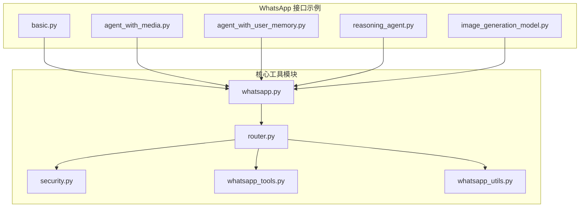
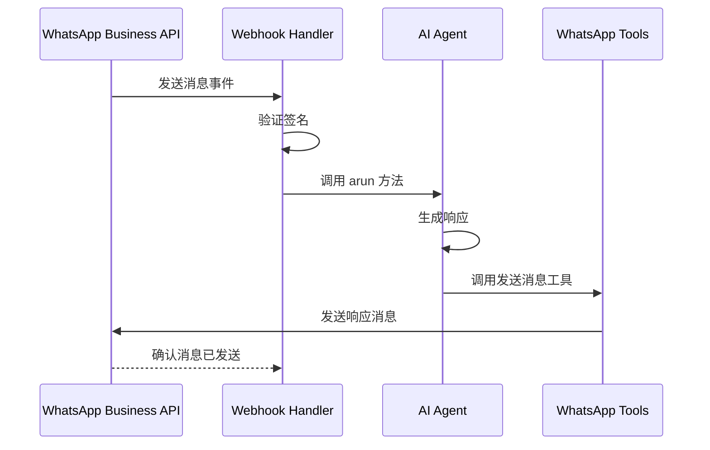
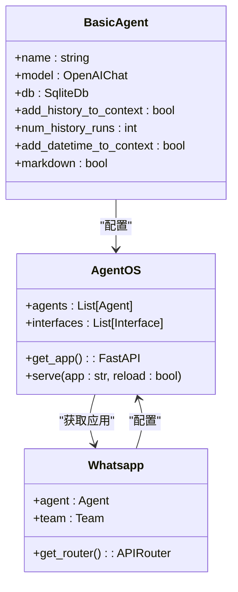
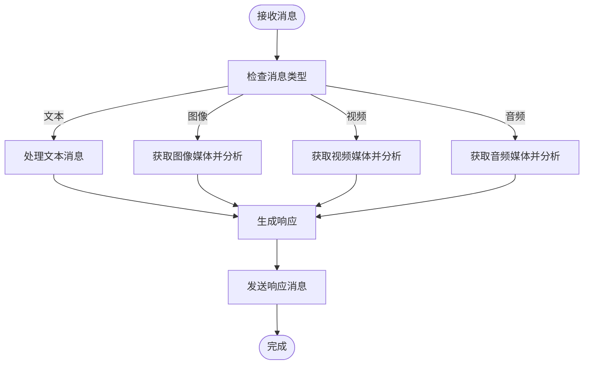
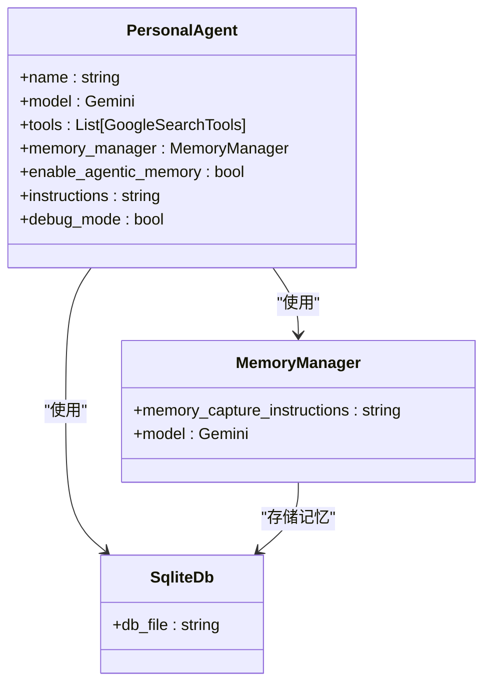
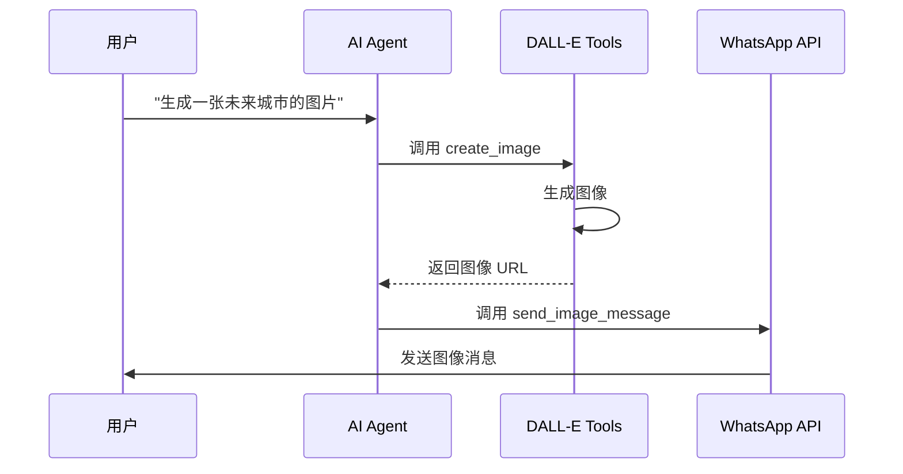
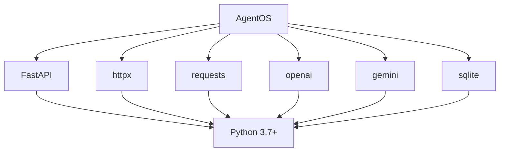

# WhatsApp 集成

<cite>
**本文档中引用的文件**
- [basic.py](file://cookbook/agent_os/interfaces/whatsapp/basic.py)
- [agent_with_media.py](file://cookbook/agent_os/interfaces/whatsapp/agent_with_media.py)
- [agent_with_user_memory.py](file://cookbook/agent_os/interfaces/whatsapp/agent_with_user_memory.py)
- [whatsapp.py](file://libs/agno/agno/os/interfaces/whatsapp/whatsapp.py)
- [router.py](file://libs/agno/agno/os/interfaces/whatsapp/router.py)
- [security.py](file://libs/agno/agno/os/interfaces/whatsapp/security.py)
- [whatsapp.py](file://libs/agno/agno/tools/whatsapp.py)
- [whatsapp.py](file://libs/agno/agno/utils/whatsapp.py)
- [image_generation_tools.py](file://cookbook/agent_os/interfaces/whatsapp/image_generation_tools.py)
- [image_generation_model.py](file://cookbook/agent_os/interfaces/whatsapp/image_generation_model.py)
- [dalle_tools.py](file://cookbook/tools/dalle_tools.py)
</cite>

## 目录
1. [简介](#简介)
2. [项目结构](#项目结构)
3. [核心组件](#核心组件)
4. [架构概述](#架构概述)
5. [详细组件分析](#详细组件分析)
6. [依赖分析](#依赖分析)
7. [性能考虑](#性能考虑)
8. [故障排除指南](#故障排除指南)
9. [结论](#结论)

## 简介
本文档详细阐述了 AgentOS 与 WhatsApp 的集成方案，重点介绍如何通过 Twilio 或官方 API 连接到 WhatsApp Business Platform。文档涵盖了文本、图像、音频和视频等多媒体消息的收发处理，提供了生成和发送媒体内容（如图像生成）的代码示例，并解释了如何管理用户对话上下文和状态，以及处理媒体文件的存储和检索。此外，还讨论了消息模板、审核要求和高延迟场景下的最佳实践。

## 项目结构
AgentOS 的 WhatsApp 集成主要位于 `cookbook/agent_os/interfaces/whatsapp` 目录下，包含多种实现示例和核心工具模块。集成基于 FastAPI 构建，支持与不同 AI 模型（如 GPT-4、Gemini、Claude）的对接。

**Diagram sources**
- [basic.py](file://cookbook/agent_os/interfaces/whatsapp/basic.py)
- [whatsapp.py](file://libs/agno/agno/os/interfaces/whatsapp/whatsapp.py)
- [router.py](file://libs/agno/agno/os/interfaces/whatsapp/router.py)

**Section sources**
- [basic.py](file://cookbook/agent_os/interfaces/whatsapp/basic.py)
- [agent_with_media.py](file://cookbook/agent_os/interfaces/whatsapp/agent_with_media.py)
- [agent_with_user_memory.py](file://cookbook/agent_os/interfaces/whatsapp/agent_with_user_memory.py)

## 核心组件
AgentOS 的 WhatsApp 集成包含多个核心组件，包括基础代理、媒体代理、用户记忆代理等。这些组件通过 `AgentOS` 类进行配置和管理，并通过 `Whatsapp` 接口与 WhatsApp Business API 进行通信。

**Section sources**
- [basic.py](file://cookbook/agent_os/interfaces/whatsapp/basic.py)
- [agent_with_media.py](file://cookbook/agent_os/interfaces/whatsapp/agent_with_media.py)
- [agent_with_user_memory.py](file://cookbook/agent_os/interfaces/whatsapp/agent_with_user_memory.py)

## 架构概述
AgentOS 的 WhatsApp 集成架构基于 FastAPI 构建，通过 Webhook 接收和处理来自 WhatsApp 的消息。消息处理流程包括验证 Webhook 签名、解析消息内容、调用 AI 代理生成响应，并通过 WhatsApp API 发送响应。

**Diagram sources**
- [router.py](file://libs/agno/agno/os/interfaces/whatsapp/router.py)
- [whatsapp.py](file://libs/agno/agno/os/interfaces/whatsapp/whatsapp.py)
- [whatsapp.py](file://libs/agno/agno/tools/whatsapp.py)

## 详细组件分析

### 基础代理分析
基础代理是最简单的实现，使用 GPT-4 模型处理文本消息，并支持消息历史和日期时间上下文。

**Diagram sources**
- [basic.py](file://cookbook/agent_os/interfaces/whatsapp/basic.py)

**Section sources**
- [basic.py](file://cookbook/agent_os/interfaces/whatsapp/basic.py)

### 媒体代理分析
媒体代理使用 Gemini 模型处理图像、视频和音频消息，能够分析图像内容并生成响应。

**Diagram sources**
- [agent_with_media.py](file://cookbook/agent_os/interfaces/whatsapp/agent_with_media.py)
- [router.py](file://libs/agno/agno/os/interfaces/whatsapp/router.py)

**Section sources**
- [agent_with_media.py](file://cookbook/agent_os/interfaces/whatsapp/agent_with_media.py)

### 用户记忆代理分析
用户记忆代理使用 SQLite 数据库存储用户信息，并通过 MemoryManager 管理用户记忆，能够收集和利用用户信息进行个性化响应。

**Diagram sources**
- [agent_with_user_memory.py](file://cookbook/agent_os/interfaces/whatsapp/agent_with_user_memory.py)

**Section sources**
- [agent_with_user_memory.py](file://cookbook/agent_os/interfaces/whatsapp/agent_with_user_memory.py)

### 图像生成分析
图像生成功能通过 DALL-E 工具实现，能够根据文本描述生成图像，并通过 WhatsApp 发送。

**Diagram sources**
- [dalle_tools.py](file://cookbook/tools/dalle_tools.py)
- [image_generation_tools.py](file://cookbook/agent_os/interfaces/whatsapp/image_generation_tools.py)

**Section sources**
- [dalle_tools.py](file://cookbook/tools/dalle_tools.py)
- [image_generation_model.py](file://cookbook/agent_os/interfaces/whatsapp/image_generation_model.py)

## 依赖分析
AgentOS 的 WhatsApp 集成依赖于多个外部库和服务，包括 FastAPI、httpx、requests 等。这些依赖关系通过 `requirements.txt` 文件进行管理。

**Diagram sources**
- [requirements.txt](file://libs/agno/requirements.txt)

**Section sources**
- [requirements.txt](file://libs/agno/requirements.txt)

## 性能考虑
在高延迟场景下，建议使用异步方法处理消息，以避免阻塞主线程。此外，应合理设置消息大小限制，避免发送过大的媒体文件。

## 故障排除指南
常见问题包括 Webhook 验证失败、消息发送失败和内存存储问题。应检查验证令牌、ngrok 连接状态和数据库权限。

**Section sources**
- [security.py](file://libs/agno/agno/os/interfaces/whatsapp/security.py)
- [router.py](file://libs/agno/agno/os/interfaces/whatsapp/router.py)

## 结论
AgentOS 提供了完整的 WhatsApp 集成方案，支持多种 AI 模型和多媒体消息处理。通过合理的配置和管理，可以实现高效、可靠的 WhatsApp 机器人服务。