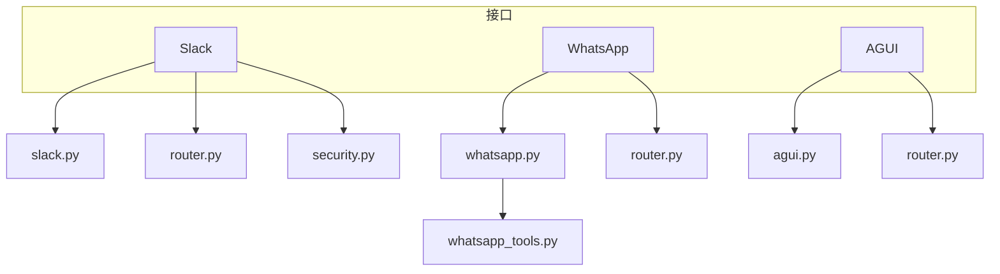
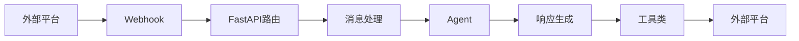
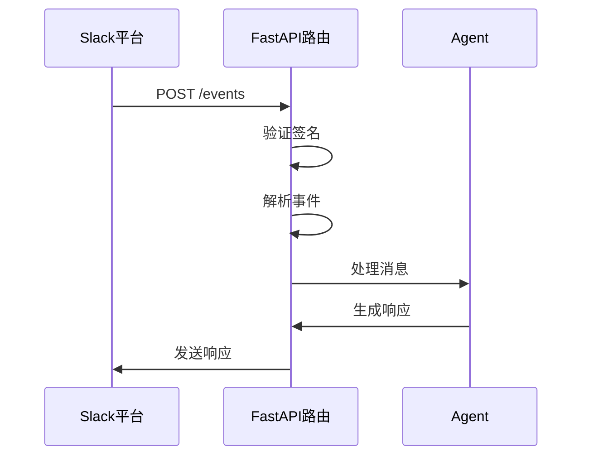
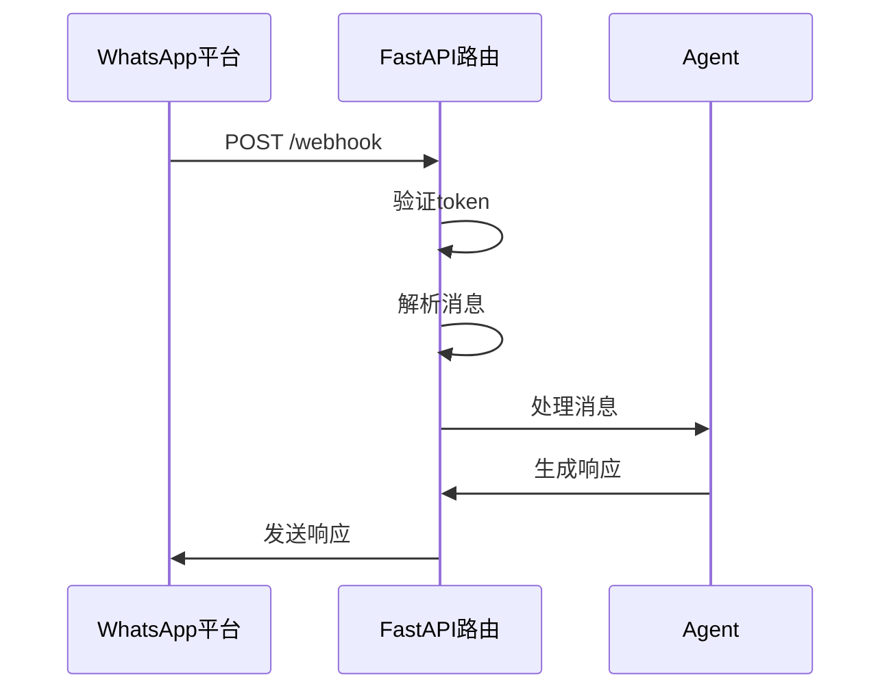
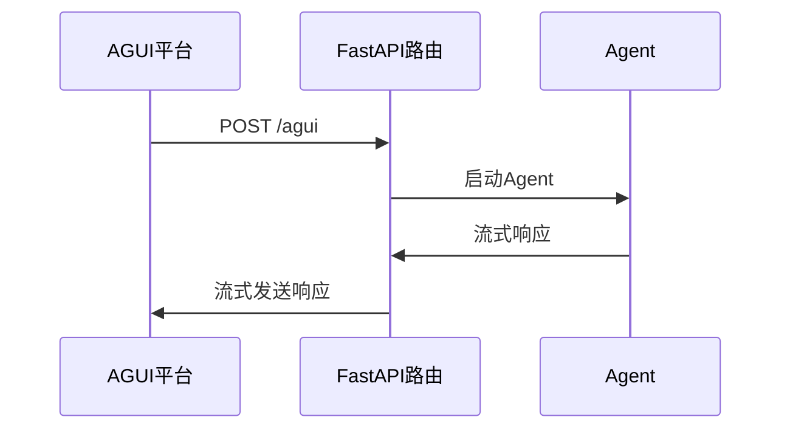
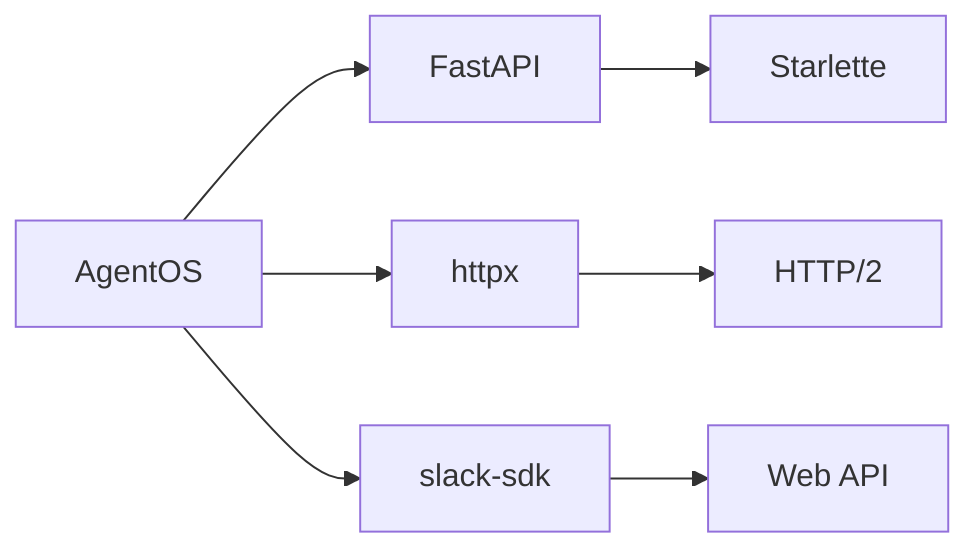

# 接口集成

<cite>
**本文档中引用的文件**  
- [basic.py](file://cookbook/agent_os/interfaces/slack/basic.py)
- [agent_with_user_memory.py](file://cookbook/agent_os/interfaces/slack/agent_with_user_memory.py)
- [README.md](file://cookbook/agent_os/interfaces/slack/README.md)
- [basic.py](file://cookbook/agent_os/interfaces/whatsapp/basic.py)
- [agent_with_media.py](file://cookbook/agent_os/interfaces/whatsapp/agent_with_media.py)
- [readme.md](file://cookbook/agent_os/interfaces/whatsapp/readme.md)
- [whatsapp.py](file://libs/agno/agno/os/interfaces/whatsapp/whatsapp.py)
- [router.py](file://libs/agno/agno/os/interfaces/whatsapp/router.py)
- [whatsapp.py](file://libs/agno/agno/tools/whatsapp.py)
- [slack.py](file://libs/agno/agno/os/interfaces/slack/slack.py)
- [router.py](file://libs/agno/agno/os/interfaces/slack/router.py)
- [security.py](file://libs/agno/agno/os/interfaces/slack/security.py)
- [slack.py](file://libs/agno/agno/tools/slack.py)
- [basic.py](file://cookbook/agent_os/interfaces/agui/basic.py)
- [agui.py](file://libs/agno/agno/os/interfaces/agui/agui.py)
- [router.py](file://libs/agno/agno/os/interfaces/agui/router.py)
</cite>

## 目录
1. [简介](#简介)
2. [项目结构](#项目结构)
3. [核心组件](#核心组件)
4. [架构概述](#架构概述)
5. [详细组件分析](#详细组件分析)
6. [依赖分析](#依赖分析)
7. [性能考虑](#性能考虑)
8. [故障排除指南](#故障排除指南)
9. [结论](#结论)

## 简介
本文档详细介绍了AgentOS如何与外部平台（如Slack、WhatsApp和自定义GUI（AGUI））进行接口集成。文档深入解释了每个接口的事件处理机制、消息格式转换和身份验证流程。提供了配置Webhook、处理传入消息和发送响应的分步指南。包括处理媒体文件（如图像、音频）和用户内存的代码示例。讨论了每个集成的性能考虑因素和最佳实践，例如错误重试和消息队列。

## 项目结构
AgentOS的接口集成主要位于`cookbook/agent_os/interfaces`目录下，包含Slack、WhatsApp和AGUI三个主要接口。每个接口都有其特定的实现文件和配置说明。

**Diagram sources**
- [slack.py](file://libs/agno/agno/os/interfaces/slack/slack.py)
- [whatsapp.py](file://libs/agno/agno/os/interfaces/whatsapp/whatsapp.py)
- [agui.py](file://libs/agno/agno/os/interfaces/agui/agui.py)

**Section sources**
- [slack.py](file://libs/agno/agno/os/interfaces/slack/slack.py)
- [whatsapp.py](file://libs/agno/agno/os/interfaces/whatsapp/whatsapp.py)
- [agui.py](file://libs/agno/agno/os/interfaces/agui/agui.py)

## 核心组件
AgentOS的接口集成核心组件包括Slack、WhatsApp和AGUI接口。每个接口都通过FastAPI路由处理传入的Webhook事件，并将消息传递给相应的Agent进行处理。

**Section sources**
- [slack.py](file://libs/agno/agno/os/interfaces/slack/slack.py)
- [whatsapp.py](file://libs/agno/agno/os/interfaces/whatsapp/whatsapp.py)
- [agui.py](file://libs/agno/agno/os/interfaces/agui/agui.py)

## 架构概述
AgentOS的接口集成架构基于FastAPI，通过Webhook接收外部平台的消息，并将其转换为内部消息格式。消息经过处理后，通过相应的工具类发送回外部平台。

**Diagram sources**
- [router.py](file://libs/agno/agno/os/interfaces/slack/router.py)
- [router.py](file://libs/agno/agno/os/interfaces/whatsapp/router.py)
- [router.py](file://libs/agno/agno/os/interfaces/agui/router.py)

## 详细组件分析

### Slack接口分析
Slack接口通过`Slack`类实现，处理来自Slack的Webhook事件。事件处理包括URL验证、消息处理和身份验证。

#### 事件处理机制
Slack接口通过`attach_routes`函数注册路由，处理`/events`端点的POST请求。请求头中的`X-Slack-Request-Timestamp`和`X-Slack-Signature`用于验证请求的合法性。

**Diagram sources**
- [router.py](file://libs/agno/agno/os/interfaces/slack/router.py)
- [security.py](file://libs/agno/agno/os/interfaces/slack/security.py)

#### 消息格式转换
Slack消息通过`_process_slack_event`函数处理，提取用户、消息文本、频道ID等信息，并将其传递给Agent进行处理。

**Section sources**
- [router.py](file://libs/agno/agno/os/interfaces/slack/router.py)

#### 身份验证流程
Slack接口使用`verify_slack_signature`函数验证请求签名，确保请求来自合法的Slack应用。

**Section sources**
- [security.py](file://libs/agno/agno/os/interfaces/slack/security.py)

### WhatsApp接口分析
WhatsApp接口通过`Whatsapp`类实现，处理来自WhatsApp的Webhook事件。事件处理包括URL验证、消息处理和媒体文件处理。

#### 事件处理机制
WhatsApp接口通过`attach_routes`函数注册路由，处理`/webhook`端点的POST请求。请求参数中的`hub.verify_token`用于验证请求的合法性。

**Diagram sources**
- [router.py](file://libs/agno/agno/os/interfaces/whatsapp/router.py)

#### 消息格式转换
WhatsApp消息通过`process_message`函数处理，提取消息ID、文本、媒体文件等信息，并将其传递给Agent进行处理。

**Section sources**
- [router.py](file://libs/agno/agno/os/interfaces/whatsapp/router.py)

#### 身份验证流程
WhatsApp接口使用`hub.verify_token`验证请求的合法性，确保请求来自合法的WhatsApp应用。

**Section sources**
- [router.py](file://libs/agno/agno/os/interfaces/whatsapp/router.py)

### AGUI接口分析
AGUI接口通过`AGUI`类实现，处理来自AGUI的Webhook事件。事件处理包括运行Agent和流式响应。

#### 事件处理机制
AGUI接口通过`attach_routes`函数注册路由，处理`/agui`端点的POST请求。请求体中的`RunAgentInput`用于启动Agent运行。

**Diagram sources**
- [router.py](file://libs/agno/agno/os/interfaces/agui/router.py)

#### 消息格式转换
AGUI消息通过`run_agent`函数处理，将`RunAgentInput`转换为内部消息格式，并启动Agent运行。

**Section sources**
- [router.py](file://libs/agno/agno/os/interfaces/agui/router.py)

## 依赖分析
AgentOS的接口集成依赖于FastAPI、httpx和slack-sdk等库。这些依赖项通过`requirements.txt`文件管理。

**Diagram sources**
- [pyproject.toml](file://libs/agno/pyproject.toml)

**Section sources**
- [pyproject.toml](file://libs/agno/pyproject.toml)

## 性能考虑
在处理大量消息时，建议使用异步处理和消息队列来提高性能。此外，应定期监控API调用频率和响应时间，以确保系统的稳定性。

## 故障排除指南
常见问题包括Webhook验证失败、消息处理错误和API通信问题。建议检查环境变量、API凭证和网络连接。

**Section sources**
- [security.py](file://libs/agno/agno/os/interfaces/slack/security.py)
- [router.py](file://libs/agno/agno/os/interfaces/whatsapp/router.py)

## 结论
AgentOS的接口集成提供了与Slack、WhatsApp和AGUI等外部平台的无缝连接。通过详细的配置和实现，可以轻松地将AgentOS集成到各种应用场景中。