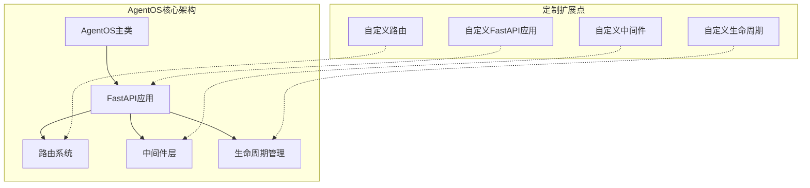
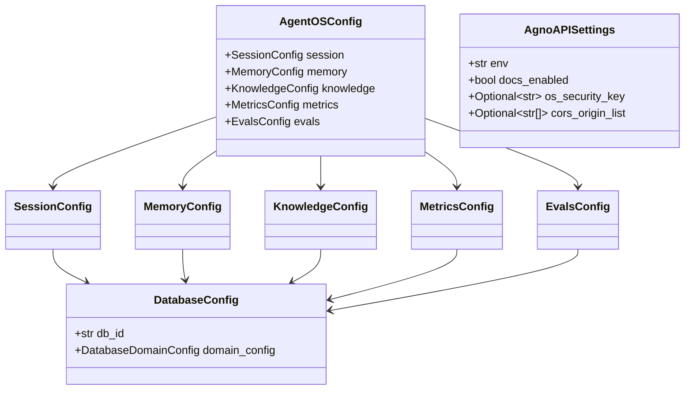
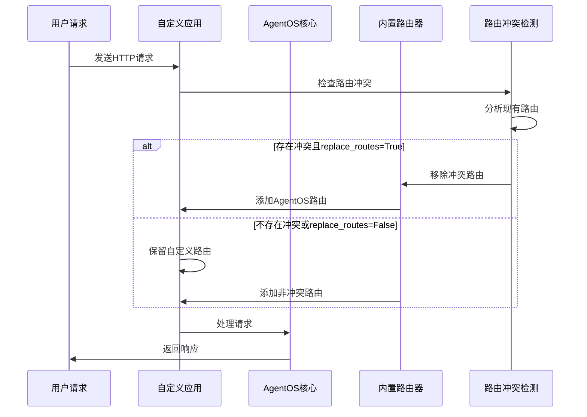
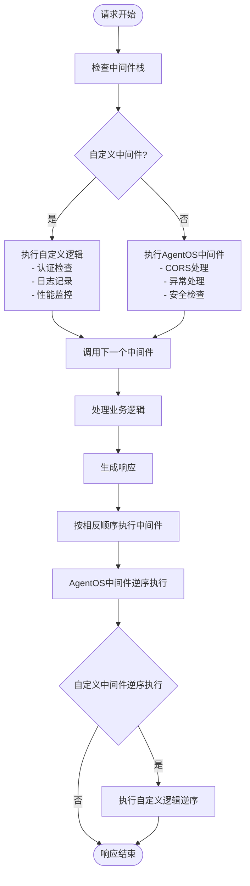
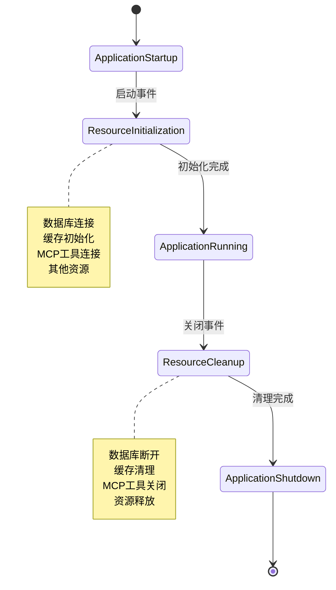
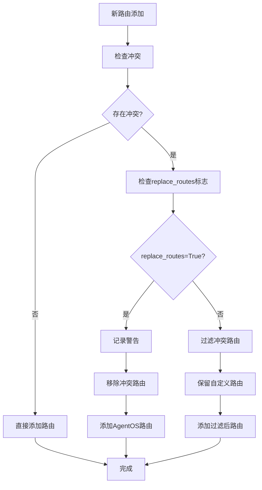

# AgentOS代码级定制深度指南

<cite>
**本文档中引用的文件**
- [custom_fastapi_app.py](file://cookbook/agent_os/customize/custom_fastapi_app.py)
- [fastapi_app_with_custom_middleware.py](file://cookbook/agent_os/customize/fastapi_app_with_custom_middleware.py)
- [custom_lifespan.py](file://cookbook/agent_os/customize/custom_lifespan.py)
- [override_routes.py](file://cookbook/agent_os/customize/override_routes.py)
- [app.py](file://libs/agno/agno/os/app.py)
- [home.py](file://libs/agno/agno/os/routers/home.py)
- [health.py](file://libs/agno/agno/os/routers/health.py)
- [settings.py](file://libs/agno/agno/os/settings.py)
- [test_custom_fastapi_app.py](file://libs/agno/tests/integration/os/test_custom_fastapi_app.py)
</cite>

## 目录
1. [简介](#简介)
2. [项目架构概览](#项目架构概览)
3. [核心定制组件](#核心定制组件)
4. [FastAPI应用定制](#fastapi应用定制)
5. [中间件集成](#中间件集成)
6. [生命周期管理](#生命周期管理)
7. [路由冲突处理](#路由冲突处理)
8. [最佳实践](#最佳实践)
9. [故障排除](#故障排除)
10. [总结](#总结)

## 简介

AgentOS是一个强大的AI代理操作系统，提供了丰富的代码级定制能力。本指南将深入探讨如何通过编程方式扩展默认的FastAPI应用，包括创建自定义FastAPI实例、注入自定义中间件以实现认证、日志记录或性能监控，以及安全地覆盖或扩展内置路由和API端点。

AgentOS的设计允许开发者在保持核心功能的同时，灵活地添加自定义功能，确保系统的可扩展性和可维护性。

## 项目架构概览

AgentOS采用模块化架构设计，主要组件包括：



**图表来源**
- [app.py](file://libs/agno/agno/os/app.py#L1-L50)
- [settings.py](file://libs/agno/agno/os/settings.py#L1-L20)

## 核心定制组件

### AgentOS主类设计

AgentOS类是整个系统的核心，提供了丰富的初始化参数来支持各种定制需求：

```python
class AgentOS:
    def __init__(
        self,
        os_id: Optional[str] = None,
        name: Optional[str] = None,
        description: Optional[str] = None,
        version: Optional[str] = None,
        agents: Optional[List[Agent]] = None,
        teams: Optional[List[Team]] = None,
        workflows: Optional[List[Workflow]] = None,
        interfaces: Optional[List[BaseInterface]] = None,
        config: Optional[Union[str, AgentOSConfig]] = None,
        settings: Optional[AgnoAPISettings] = None,
        fastapi_app: Optional[FastAPI] = None,
        lifespan: Optional[Any] = None,
        enable_mcp: bool = False,
        replace_routes: bool = True,
        telemetry: bool = True,
    ):
```

**章节来源**
- [app.py](file://libs/agno/agno/os/app.py#L50-L120)

### 配置系统

AgentOS提供了灵活的配置系统，支持YAML配置文件和程序化配置：



**图表来源**
- [app.py](file://libs/agno/agno/os/app.py#L20-L40)

## FastAPI应用定制

### 创建自定义FastAPI实例

AgentOS允许完全替换默认的FastAPI应用，同时保留所有内置功能：

```python
from agno.agent import Agent
from agno.db.postgres import PostgresDb
from agno.models.anthropic import Claude
from agno.os import AgentOS
from fastapi import FastAPI

# 设置数据库
db = PostgresDb(db_url="postgresql+psycopg://ai:ai@localhost:5532/ai")

# 创建代理
web_research_agent = Agent(
    id="web-research-agent",
    name="Web Research Agent",
    model=Claude(id="claude-sonnet-4-0"),
    db=db,
    tools=[DuckDuckGoTools()],
    add_history_to_context=True,
    num_history_runs=3,
    add_datetime_to_context=True,
    markdown=True,
)

# 自定义FastAPI应用
app: FastAPI = FastAPI(
    title="Custom FastAPI App",
    version="1.0.0",
)

# 添加自定义路由
@app.post("/customers")
async def get_customers():
    return [
        {
            "id": 1,
            "name": "John Doe",
            "email": "john.doe@example.com",
        },
        {
            "id": 2,
            "name": "Jane Doe",
            "email": "jane.doe@example.com",
        },
    ]

# 使用自定义FastAPI应用创建AgentOS
agent_os = AgentOS(
    description="Example app with custom routers",
    agents=[web_research_agent],
    fastapi_app=app,
)

app = agent_os.get_app()
```

**章节来源**
- [custom_fastapi_app.py](file://cookbook/agent_os/customize/custom_fastapi_app.py#L1-L79)

### 路由系统架构

AgentOS的路由系统采用分层设计，支持动态路由管理和冲突检测：



**图表来源**
- [app.py](file://libs/agno/agno/os/app.py#L350-L390)

## 中间件集成

### 自定义中间件实现

AgentOS支持完整的中间件栈集成，允许开发者添加认证、日志记录、性能监控等功能：

```python
from fastapi import Request, Response
from fastapi.responses import JSONResponse
from starlette.middleware.base import BaseHTTPMiddleware

# 请求/响应日志中间件
class RequestLoggingMiddleware(BaseHTTPMiddleware):
    """
    带有计时和基本信息的请求/响应日志中间件。
    """
    def __init__(self, app, log_body: bool = False, log_headers: bool = False):
        super().__init__(app)
        self.log_body = log_body
        self.log_headers = log_headers
        self.request_count = 0

    async def dispatch(self, request: Request, call_next) -> Response:
        self.request_count += 1
        start_time = time.time()

        # 基本请求信息
        client_ip = request.client.host if request.client else "unknown"
        print(f"🔍 Request #{self.request_count}: {request.method} {request.url.path} from {client_ip}")

        # 可选：记录请求体
        if self.log_body and request.method in ["POST", "PUT", "PATCH"]:
            body = await request.body()
            if body:
                print(f"📝 Body: {body.decode()}")

        # 处理请求
        response = await call_next(request)

        # 记录响应信息
        duration = time.time() - start_time
        status_emoji = "✅" if response.status_code < 400 else "❌"
        print(f"{status_emoji} Response: {response.status_code} in {duration * 1000:.1f}ms")

        # 将请求计数添加到响应头
        response.headers["X-Request-Count"] = str(self.request_count)

        return response
```

**章节来源**
- [fastapi_app_with_custom_middleware.py](file://cookbook/agent_os/customize/fastapi_app_with_custom_middleware.py#L70-L120)

### 中间件执行流程



**图表来源**
- [fastapi_app_with_custom_middleware.py](file://cookbook/agent_os/customize/fastapi_app_with_custom_middleware.py#L1-L50)

### 多中间件协作

AgentOS支持多个中间件的协调工作，确保自定义中间件和内置中间件能够正确交互：

```python
# 添加多个中间件
app.add_middleware(
    RateLimitMiddleware,
    requests_per_minute=10,
    window_size=60,
)

app.add_middleware(
    RequestLoggingMiddleware,
    log_body=False,
    log_headers=False,
)
```

**章节来源**
- [fastapi_app_with_custom_middleware.py](file://cookbook/agent_os/customize/fastapi_app_with_custom_middleware.py#L170-L181)

## 生命周期管理

### 自定义生命周期实现

AgentOS支持自定义生命周期管理，用于管理数据库连接、缓存和其他资源：

```python
from contextlib import asynccontextmanager
from agno.utils.log import log_info

@asynccontextmanager
async def lifespan(app):
    log_info("Starting My FastAPI App")
    yield
    log_info("Stopping My FastAPI App")

agent_os = AgentOS(
    description="Example app with custom lifespan",
    agents=[agno_support_agent],
    lifespan=lifespan,
)
```

**章节来源**
- [custom_lifespan.py](file://cookbook/agent_os/customize/custom_lifespan.py#L1-L51)

### 生命周期事件处理



**图表来源**
- [app.py](file://libs/agno/agno/os/app.py#L150-L200)

### MCP工具生命周期

对于使用MCP（模型上下文协议）的AgentOS实例，系统会自动管理MCP连接的生命周期：

```python
@asynccontextmanager
async def mcp_lifespan(app, mcp_tools):
    """管理MCP连接生命周期"""
    # 启动逻辑：连接到所有上下文MCP服务器
    for tool in mcp_tools:
        await tool.connect()

    yield

    # 关闭逻辑：关闭所有上下文MCP连接
    for tool in mcp_tools:
        await tool.close()
```

**章节来源**
- [app.py](file://libs/agno/agno/os/app.py#L60-L75)

## 路由冲突处理

### 冲突检测机制

AgentOS实现了智能的路由冲突检测和处理机制：

```python
def _add_router(self, router: APIRouter) -> None:
    """添加路由器到FastAPI应用，避免路由冲突。"""
    if not self.fastapi_app:
        return

    # 获取现有路由
    existing_paths = self._get_existing_route_paths()

    # 检查冲突
    conflicts = []
    conflicting_routes = []

    for route in router.routes:
        if isinstance(route, APIRoute):
            full_path = route.path
            route_methods = list(route.methods) if route.methods else []

            if full_path in existing_paths:
                conflicting_methods: Set[str] = set(route_methods) & set(existing_paths[full_path])
                if conflicting_methods:
                    conflicts.append({
                        "path": full_path, 
                        "methods": list(conflicting_methods), 
                        "route": route
                    })
                    conflicting_routes.append(route)

    # 处理冲突
    if conflicts and self._app_set:
        if self.replace_routes:
            # 记录警告但仍添加所有路由（AgentOS路由将覆盖）
            for conflict in conflicts:
                methods_str = ", ".join(conflict["methods"])
                logger.warning(
                    f"检测到路由冲突: {methods_str} {conflict['path']} - "
                    f"AgentOS路由将覆盖现有自定义路由"
                )
            
            # 移除冲突路由
            for route in self.fastapi_app.routes:
                for conflict in conflicts:
                    if isinstance(route, APIRoute):
                        if route.path == conflict["path"] and list(route.methods) == list(conflict["methods"]):
                            self.fastapi_app.routes.pop(self.fastapi_app.routes.index(route))

            self.fastapi_app.include_router(router)
```

**章节来源**
- [app.py](file://libs/agno/agno/os/app.py#L350-L390)

### 路由优先级策略



**图表来源**
- [app.py](file://libs/agno/agno/os/app.py#L350-L390)

### 自定义路由优先级

当使用`replace_routes=False`时，AgentOS会优先保留自定义路由：

```python
# 使用replace_routes=False保留自定义路由
agent_os = AgentOS(
    description="Example app with route replacement",
    agents=[web_research_agent],
    fastapi_app=app,
    replace_routes=False,  # 跳过冲突的AgentOS路由，保留自定义路由
)
```

**章节来源**
- [override_routes.py](file://cookbook/agent_os/customize/override_routes.py#L50-L60)

## 最佳实践

### 1. 中间件设计原则

- **单一职责**：每个中间件应专注于单一功能
- **性能考虑**：避免在中间件中执行耗时操作
- **错误处理**：确保中间件能够优雅处理异常
- **状态管理**：合理使用请求上下文传递状态

### 2. 生命周期管理

- **资源隔离**：确保不同组件的资源独立管理
- **异常恢复**：在生命周期事件中包含适当的错误处理
- **性能监控**：在启动和关闭阶段添加性能指标收集

### 3. 路由设计

- **命名空间**：为自定义路由使用明确的命名空间
- **版本控制**：在路由路径中包含版本信息
- **文档完整**：为自定义路由提供完整的API文档

### 4. 配置管理

- **环境变量**：使用环境变量管理配置
- **配置验证**：确保配置的有效性
- **默认值**：提供合理的默认配置

## 故障排除

### 常见问题及解决方案

#### 1. 路由冲突

**问题**：自定义路由被AgentOS路由覆盖

**解决方案**：
```python
# 使用replace_routes=False
agent_os = AgentOS(
    agents=[agents],
    fastapi_app=custom_app,
    replace_routes=False,
)
```

#### 2. 中间件执行顺序问题

**问题**：自定义中间件未按预期执行

**解决方案**：
```python
# 明确指定中间件添加顺序
app.add_middleware(CustomMiddleware1)
app.add_middleware(CustomMiddleware2)
```

#### 3. 生命周期事件未触发

**问题**：自定义生命周期事件未执行

**解决方案**：
```python
# 确保使用正确的装饰器
@asynccontextmanager
async def lifespan(app):
    # 启动逻辑
    yield
    # 关闭逻辑
```

### 调试技巧

1. **启用详细日志**：设置适当的日志级别
2. **中间件链检查**：验证中间件是否正确注册
3. **路由列表检查**：使用`get_routes()`方法检查路由状态
4. **生命周期事件跟踪**：在关键点添加日志输出

**章节来源**
- [test_custom_fastapi_app.py](file://libs/agno/tests/integration/os/test_custom_fastapi_app.py#L1-L50)

## 总结

AgentOS提供了强大而灵活的代码级定制能力，通过以下核心特性支持开发者：

1. **完全可定制的FastAPI应用**：支持替换默认应用并保留所有内置功能
2. **灵活的中间件集成**：支持自定义中间件添加和多中间件协作
3. **智能路由冲突处理**：提供多种路由优先级策略
4. **完善的生命周期管理**：支持自定义资源管理和MCP工具生命周期
5. **丰富的配置选项**：支持YAML配置和程序化配置

这些特性使得AgentOS能够在保持核心功能完整性的同时，满足各种复杂的定制需求。开发者可以根据具体场景选择合适的定制策略，确保系统的可扩展性和可维护性。

通过遵循本指南中的最佳实践和故障排除建议，开发者可以有效地利用AgentOS的定制能力，构建符合特定需求的AI代理操作系统。