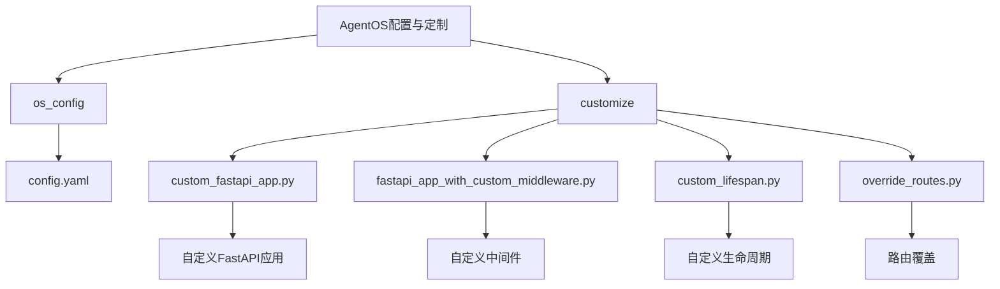
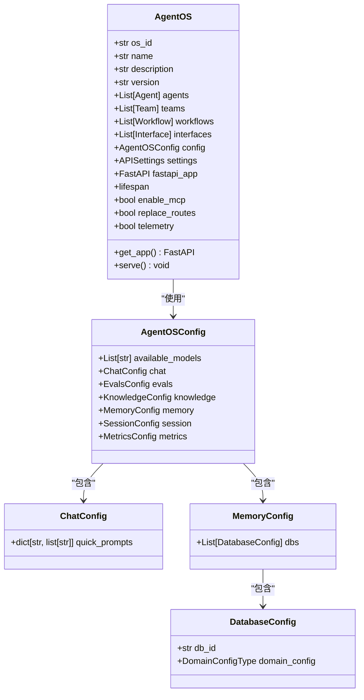
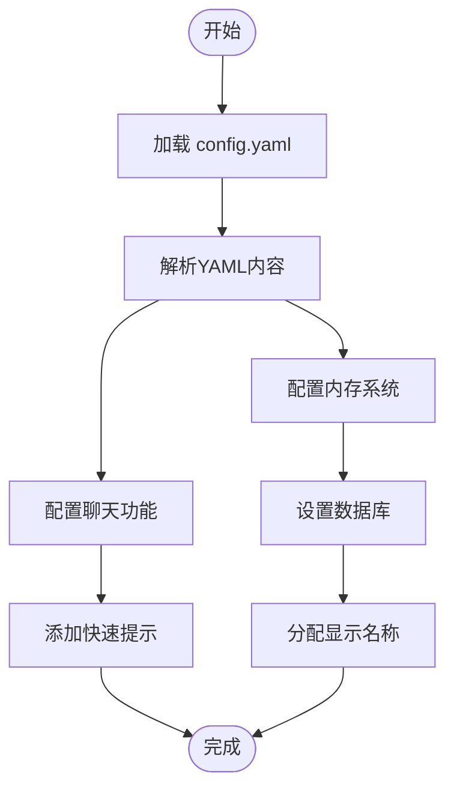
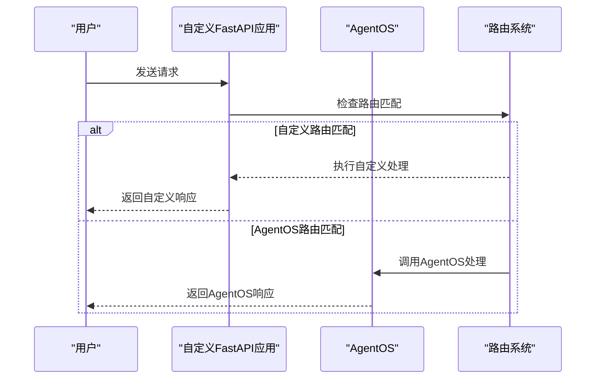
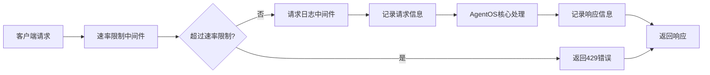
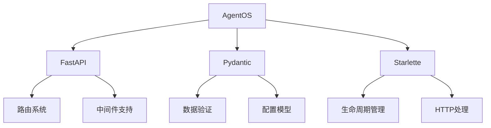

# 配置与定制

<cite>
**本文档中引用的文件**  
- [config.yaml](file://cookbook/agent_os/os_config/config.yaml)
- [basic.py](file://cookbook/agent_os/os_config/basic.py)
- [yaml_config.py](file://cookbook/agent_os/os_config/yaml_config.py)
- [custom_fastapi_app.py](file://cookbook/agent_os/customize/custom_fastapi_app.py)
- [fastapi_app_with_custom_middleware.py](file://cookbook/agent_os/customize/fastapi_app_with_custom_middleware.py)
- [custom_lifespan.py](file://cookbook/agent_os/customize/custom_lifespan.py)
- [override_routes.py](file://cookbook/agent_os/customize/override_routes.py)
- [config.py](file://libs/agno/agno/os/config.py)
</cite>

## 目录
1. [简介](#简介)
2. [项目结构](#项目结构)
3. [核心组件](#核心组件)
4. [架构概述](#架构概述)
5. [详细组件分析](#详细组件分析)
6. [依赖分析](#依赖分析)
7. [性能考虑](#性能考虑)
8. [故障排除指南](#故障排除指南)
9. [结论](#结论)

## 简介
本指南详细介绍了如何通过YAML配置文件和编程方式对AgentOS进行配置与定制。涵盖智能体、团队和工作流的默认行为定义，以及如何扩展和覆盖FastAPI应用的核心功能。文档还提供了自定义插件创建、环境变量管理、日志记录配置和安全设置的最佳实践，并讨论了定制化对系统可维护性和升级路径的影响。

## 项目结构
AgentOS的配置与定制功能主要分布在`cookbook/agent_os`目录下的`os_config`和`customize`子目录中。`os_config`包含YAML配置文件和相关Python脚本，而`customize`目录则展示了如何通过编程方式扩展和覆盖默认行为。



**Diagram sources**
- [config.yaml](file://cookbook/agent_os/os_config/config.yaml)
- [custom_fastapi_app.py](file://cookbook/agent_os/customize/custom_fastapi_app.py)
- [fastapi_app_with_custom_middleware.py](file://cookbook/agent_os/customize/fastapi_app_with_custom_middleware.py)
- [custom_lifespan.py](file://cookbook/agent_os/customize/custom_lifespan.py)
- [override_routes.py](file://cookbook/agent_os/customize/override_routes.py)

**Section sources**
- [config.yaml](file://cookbook/agent_os/os_config/config.yaml)
- [custom_fastapi_app.py](file://cookbook/agent_os/customize/custom_fastapi_app.py)
- [fastapi_app_with_custom_middleware.py](file://cookbook/agent_os/customize/fastapi_app_with_custom_middleware.py)
- [custom_lifespan.py](file://cookbook/agent_os/customize/custom_lifespan.py)
- [override_routes.py](file://cookbook/agent_os/customize/override_routes.py)

## 核心组件
AgentOS的核心配置与定制功能围绕`AgentOS`类展开，该类接受多种参数来定义系统行为。关键组件包括YAML配置文件、自定义FastAPI应用、中间件、生命周期事件和路由管理。

**Section sources**
- [basic.py](file://cookbook/agent_os/os_config/basic.py)
- [yaml_config.py](file://cookbook/agent_os/os_config/yaml_config.py)
- [config.py](file://libs/agno/agno/os/config.py)

## 架构概述
AgentOS的配置架构采用分层设计，允许通过YAML文件进行声明式配置，同时支持通过编程方式进行更精细的控制。系统通过`AgentOSConfig`类定义配置结构，并通过`AgentOS`类的初始化参数实现灵活的定制。



**Diagram sources**
- [config.py](file://libs/agno/agno/os/config.py)
- [basic.py](file://cookbook/agent_os/os_config/basic.py)

## 详细组件分析

### YAML配置文件分析
YAML配置文件提供了一种声明式的方式来定义AgentOS的默认行为，包括聊天界面的快速提示和内存数据库配置。



**Diagram sources**
- [config.yaml](file://cookbook/agent_os/os_config/config.yaml)
- [yaml_config.py](file://cookbook/agent_os/os_config/yaml_config.py)

**Section sources**
- [config.yaml](file://cookbook/agent_os/os_config/config.yaml)
- [yaml_config.py](file://cookbook/agent_os/os_config/yaml_config.py)

### 自定义FastAPI应用分析
通过传递自定义的FastAPI应用实例，用户可以扩展AgentOS的功能，添加自己的路由和中间件。



**Diagram sources**
- [custom_fastapi_app.py](file://cookbook/agent_os/customize/custom_fastapi_app.py)
- [override_routes.py](file://cookbook/agent_os/customize/override_routes.py)

**Section sources**
- [custom_fastapi_app.py](file://cookbook/agent_os/customize/custom_fastapi_app.py)
- [override_routes.py](file://cookbook/agent_os/customize/override_routes.py)

### 自定义中间件分析
自定义中间件允许在请求处理过程中添加额外的功能，如速率限制和请求日志记录。



**Diagram sources**
- [fastapi_app_with_custom_middleware.py](file://cookbook/agent_os/customize/fastapi_app_with_custom_middleware.py)

**Section sources**
- [fastapi_app_with_custom_middleware.py](file://cookbook/agent_os/customize/fastapi_app_with_custom_middleware.py)

### 自定义生命周期分析
自定义生命周期事件允许在应用启动和关闭时执行特定的初始化和清理操作。

```mermaid
stateDiagram-v2
[*] --> Startup
Startup --> "执行启动逻辑" : 启动事件
"执行启动逻辑" --> Running
Running --> "执行核心功能"
"执行核心功能" --> Shutdown : 关闭事件
Shutdown --> "执行清理逻辑"
"执行清理逻辑" --> [*]
```

**Diagram sources**
- [custom_lifespan.py](file://cookbook/agent_os/customize/custom_lifespan.py)

**Section sources**
- [custom_lifespan.py](file://cookbook/agent_os/customize/custom_lifespan.py)

## 依赖分析
AgentOS的配置与定制功能依赖于多个核心组件和外部库，包括FastAPI、Pydantic和Starlette。这些依赖关系确保了系统的灵活性和可扩展性。



**Diagram sources**
- [config.py](file://libs/agno/agno/os/config.py)
- [custom_lifespan.py](file://cookbook/agent_os/customize/custom_lifespan.py)
- [fastapi_app_with_custom_middleware.py](file://cookbook/agent_os/customize/fastapi_app_with_custom_middleware.py)

**Section sources**
- [config.py](file://libs/agno/agno/os/config.py)

## 性能考虑
在进行AgentOS定制时，需要考虑性能影响。自定义中间件可能会增加请求处理时间，而复杂的生命周期逻辑可能会影响应用的启动和关闭速度。建议对自定义功能进行性能测试，确保不会对系统整体性能产生负面影响。

## 故障排除指南
当遇到配置与定制问题时，可以参考以下常见问题的解决方案：

**Section sources**
- [custom_fastapi_app.py](file://cookbook/agent_os/customize/custom_fastapi_app.py)
- [override_routes.py](file://cookbook/agent_os/customize/override_routes.py)
- [custom_lifespan.py](file://cookbook/agent_os/customize/custom_lifespan.py)

## 结论
AgentOS提供了灵活的配置与定制机制，允许开发者通过YAML文件进行声明式配置，同时支持通过编程方式进行更精细的控制。这种双重配置方式既满足了简单场景的需求，又为复杂应用提供了足够的扩展能力。在进行定制时，建议遵循最佳实践，确保系统的可维护性和升级路径的顺畅。