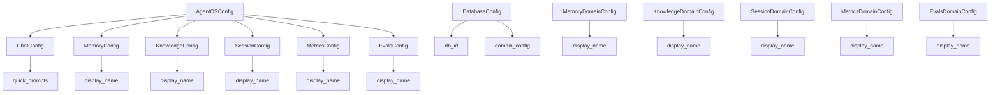
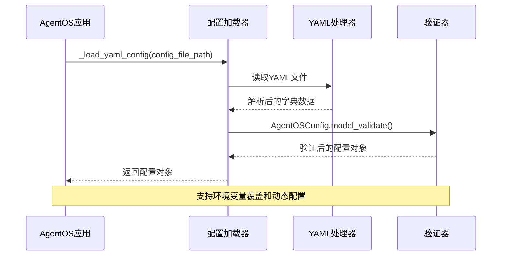
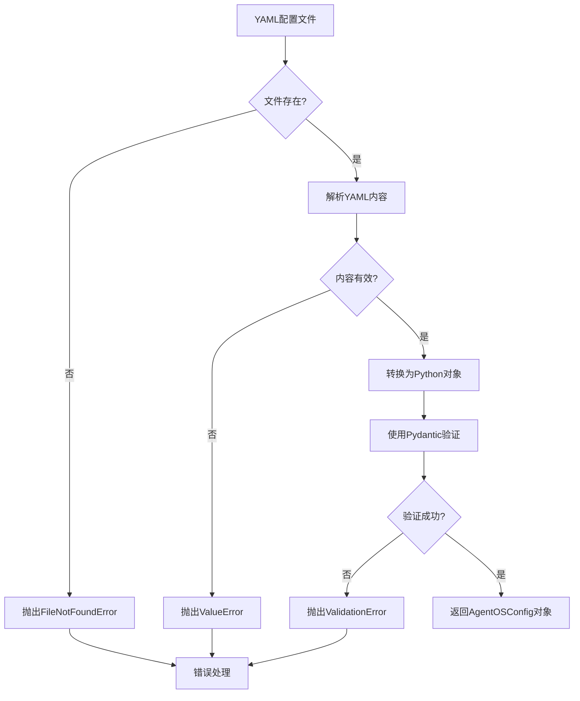

# AgentOS YAML配置文件详细文档

<cite>
**本文档引用的文件**
- [config.yaml](file://cookbook/agent_os/os_config/config.yaml)
- [yaml_config.py](file://cookbook/agent_os/os_config/yaml_config.py)
- [basic.py](file://cookbook/agent_os/os_config/basic.py)
- [config.py](file://libs/agno/agno/os/config.py)
- [app.py](file://libs/agno/agno/os/app.py)
- [demo/config.yaml](file://cookbook/demo/config.yaml)
- [run.py](file://cookbook/demo/run.py)
</cite>

## 目录
1. [简介](#简介)
2. [配置文件结构](#配置文件结构)
3. [核心配置组件](#核心配置组件)
4. [配置加载机制](#配置加载机制)
5. [完整配置示例](#完整配置示例)
6. [环境变量覆盖](#环境变量覆盖)
7. [配置验证与错误处理](#配置验证与错误处理)
8. [最佳实践](#最佳实践)
9. [故障排除指南](#故障排除指南)

## 简介

AgentOS YAML配置文件是用于定义智能体操作系统（AgentOS）行为和特性的核心配置文件。它允许开发者通过声明式的方式配置智能体（agents）、团队（teams）和工作流（workflows）的默认参数，包括模型设置、工具集成、知识库连接、会话超时和日志级别等关键配置。

配置文件采用YAML格式，具有以下特点：
- **声明式配置**：通过简单的键值对定义配置
- **层次化结构**：支持嵌套配置对象
- **可扩展性**：支持多种配置域和数据库类型
- **灵活性**：支持环境变量覆盖和动态配置

## 配置文件结构

AgentOS配置文件遵循分层架构设计，主要包含以下几个核心配置域：



**图表来源**
- [config.py](file://libs/agno/agno/os/config.py#L1-L104)

### 基本配置结构

```yaml
chat:
  quick_prompts:
    agent-name:
      - "Prompt 1"
      - "Prompt 2"
      - "Prompt 3"

memory:
  dbs:
    - db_id: db-0001
      domain_config:
        display_name: "Main app user memories"

knowledge:
  dbs:
    - db_id: db-0001
      domain_config:
        display_name: "Knowledge base"

session:
  dbs:
    - db_id: db-0001
      domain_config:
        display_name: "Session data"

metrics:
  dbs:
    - db_id: db-0001
      domain_config:
        display_name: "Performance metrics"

evals:
  dbs:
    - db_id: db-0001
      domain_config:
        display_name: "Evaluation data"
```

**章节来源**
- [config.yaml](file://cookbook/agent_os/os_config/config.yaml#L1-L14)
- [demo/config.yaml](file://cookbook/demo/config.yaml#L1-L11)

## 核心配置组件

### 聊天配置（ChatConfig）

聊天配置控制AgentOS界面中的快速提示功能，为不同类型的智能体提供预设的交互提示。

```yaml
chat:
  quick_prompts:
    marketing-agent:
      - "What can you do?"
      - "How is our latest post working?"
      - "Tell me about our active marketing campaigns"
    web-search-agent:
      - "What can you do?"
      - "What is currently happening in France?"
      - "What is the latest news on the stock market?"
```

**配置特性：**
- 每个智能体最多可配置3个快速提示
- 提示内容应简洁明了，便于用户快速选择
- 支持多语言和多场景的提示配置

### 内存配置（MemoryConfig）

内存配置定义智能体和团队的记忆存储设置，包括数据库连接和显示名称。

```yaml
memory:
  dbs:
    - db_id: db-0001
      domain_config:
        display_name: "Main app user memories"
    - db_id: db-0002
      domain_config:
        display_name: "Support flow user memories"
```

**配置特性：**
- 支持多个数据库实例
- 每个数据库可配置不同的显示名称
- 自动检测和管理数据库连接

### 知识库配置（KnowledgeConfig）

知识库配置管理智能体的知识源连接和存储设置。

```yaml
knowledge:
  dbs:
    - db_id: knowledge-db-001
      domain_config:
        display_name: "Company Knowledge Base"
```

**配置特性：**
- 支持向量数据库集成
- 多源知识内容管理
- 自动知识检索优化

### 会话配置（SessionConfig）

会话配置控制智能体会话数据的存储和管理。

```yaml
session:
  dbs:
    - db_id: session-db-001
      domain_config:
        display_name: "Active Sessions"
```

**配置特性：**
- 会话状态持久化
- 多用户会话隔离
- 会话超时管理

**章节来源**
- [config.py](file://libs/agno/agno/os/config.py#L60-L104)

## 配置加载机制

AgentOS使用智能的配置加载机制，支持从文件路径或直接传入配置对象两种方式。



**图表来源**
- [app.py](file://libs/agno/agno/os/app.py#L400-L410)

### 加载流程

1. **文件验证**：检查文件是否存在且为YAML格式
2. **内容解析**：使用PyYAML安全加载器解析文件内容
3. **数据验证**：使用Pydantic模型验证配置结构
4. **自动发现**：自动发现和配置数据库连接
5. **配置合并**：合并用户配置与默认配置

### 配置优先级

配置系统遵循以下优先级顺序：
1. **运行时配置**：直接传入的AgentOSConfig对象
2. **YAML配置**：配置文件中的显式设置
3. **默认配置**：框架提供的默认值

**章节来源**
- [app.py](file://libs/agno/agno/os/app.py#L400-L410)

## 完整配置示例

以下是一个完整的AgentOS配置示例，展示了所有可用的配置选项：

```yaml
# 聊天配置
chat:
  quick_prompts:
    marketing-agent:
      - "What can you do?"
      - "How is our latest post working?"
      - "Tell me about our active marketing campaigns"
    research-agent:
      - "What can you do?"
      - "Research the latest trends in AI"
      - "Find recent publications on machine learning"
    finance-analyst:
      - "What can you do?"
      - "Analyze the stock market trends"
      - "Provide investment recommendations"

# 内存配置
memory:
  dbs:
    - db_id: memory-db-001
      domain_config:
        display_name: "User Interaction Memories"
    - db_id: memory-db-002
      domain_config:
        display_name: "Team Collaboration Memories"

# 知识库配置
knowledge:
  dbs:
    - db_id: knowledge-db-001
      domain_config:
        display_name: "Company Knowledge Base"
    - db_id: knowledge-db-002
      domain_config:
        display_name: "Industry Research Database"

# 会话配置
session:
  dbs:
    - db_id: session-db-001
      domain_config:
        display_name: "Active User Sessions"
    - db_id: session-db-002
      domain_config:
        display_name: "Team Session History"

# 性能指标配置
metrics:
  dbs:
    - db_id: metrics-db-001
      domain_config:
        display_name: "Performance Metrics"
    - db_id: metrics-db-002
      domain_config:
        display_name: "Usage Analytics"

# 评估配置
evals:
  dbs:
    - db_id: evals-db-001
      domain_config:
        display_name: "Model Evaluation Results"
        available_models:
          - "gpt-4o"
          - "claude-3-opus"
          - "gemini-pro"
```

### Python配置对象示例

```python
from agno.os.config import (
    AgentOSConfig,
    ChatConfig,
    MemoryConfig,
    KnowledgeConfig,
    SessionConfig,
    MetricsConfig,
    EvalsConfig,
    DatabaseConfig,
    MemoryDomainConfig,
    KnowledgeDomainConfig,
    SessionDomainConfig,
    MetricsDomainConfig,
    EvalsDomainConfig,
)

# 创建完整的配置对象
config = AgentOSConfig(
    available_models=["gpt-4o", "claude-3-opus", "gemini-pro"],
    chat=ChatConfig(
        quick_prompts={
            "marketing-agent": [
                "What can you do?",
                "How is our latest post working?",
                "Tell me about our active marketing campaigns",
            ],
            "research-agent": [
                "What can you do?",
                "Research the latest trends in AI",
                "Find recent publications on machine learning",
            ],
        },
    ),
    memory=MemoryConfig(
        dbs=[
            DatabaseConfig(
                db_id="memory-db-001",
                domain_config=MemoryDomainConfig(display_name="User Interaction Memories"),
            ),
            DatabaseConfig(
                db_id="memory-db-002",
                domain_config=MemoryDomainConfig(display_name="Team Collaboration Memories"),
            ),
        ],
    ),
    knowledge=KnowledgeConfig(
        dbs=[
            DatabaseConfig(
                db_id="knowledge-db-001",
                domain_config=KnowledgeDomainConfig(display_name="Company Knowledge Base"),
            ),
        ],
    ),
    session=SessionConfig(
        dbs=[
            DatabaseConfig(
                db_id="session-db-001",
                domain_config=SessionDomainConfig(display_name="Active User Sessions"),
            ),
        ],
    ),
    metrics=MetricsConfig(
        dbs=[
            DatabaseConfig(
                db_id="metrics-db-001",
                domain_config=MetricsDomainConfig(display_name="Performance Metrics"),
            ),
        ],
    ),
    evals=EvalsConfig(
        dbs=[
            DatabaseConfig(
                db_id="evals-db-001",
                domain_config=EvalsDomainConfig(
                    display_name="Model Evaluation Results",
                    available_models=["gpt-4o", "claude-3-opus", "gemini-pro"],
                ),
            ),
        ],
    ),
)
```

**章节来源**
- [basic.py](file://cookbook/agent_os/os_config/basic.py#L40-L93)

## 环境变量覆盖

AgentOS支持通过环境变量覆盖配置文件中的特定设置，提供了灵活的部署选项。

### 可覆盖的配置项

| 配置项 | 环境变量 | 描述 |
|--------|----------|------|
| `chat.quick_prompts` | `AGNO_CHAT_QUICK_PROMPTS` | 快速提示配置 |
| `memory.dbs[].domain_config.display_name` | `AGNO_MEMORY_DISPLAY_NAME` | 内存显示名称 |
| `knowledge.dbs[].domain_config.display_name` | `AGNO_KNOWLEDGE_DISPLAY_NAME` | 知识库显示名称 |
| `session.dbs[].domain_config.display_name` | `AGNO_SESSION_DISPLAY_NAME` | 会话显示名称 |
| `metrics.dbs[].domain_config.display_name` | `AGNO_METRICS_DISPLAY_NAME` | 指标显示名称 |
| `evals.dbs[].domain_config.display_name` | `AGNO_EVALS_DISPLAY_NAME` | 评估显示名称 |

### 环境变量使用示例

```bash
# 设置快速提示
export AGNO_CHAT_QUICK_PROMPTS='{"marketing-agent":["Custom prompt 1","Custom prompt 2"]}'

# 设置内存显示名称
export AGNO_MEMORY_DISPLAY_NAME="Production User Memories"

# 设置知识库显示名称
export AGNO_KNOWLEDGE_DISPLAY_NAME="Enterprise Knowledge Base"

# 设置会话显示名称
export AGNO_SESSION_DISPLAY_NAME="Active Production Sessions"
```

### 动态配置更新

```python
import os
from agno.os import AgentOS

# 从环境变量加载配置
agent_os = AgentOS(
    config="config.yaml",
    # 其他配置...
)

# 运行时修改配置
agent_os.config.chat.quick_prompts["marketing-agent"].append("New custom prompt")
```

## 配置验证与错误处理

AgentOS使用Pydantic进行配置验证，确保配置的正确性和一致性。



**图表来源**
- [app.py](file://libs/agno/agno/os/app.py#L400-L410)

### 常见验证错误

1. **文件格式错误**
   ```yaml
   # 错误：缺少冒号
   chat:
     quick_prompts
       marketing-agent:
         - "What can you do?"
   
   # 正确：
   chat:
     quick_prompts:
       marketing-agent:
         - "What can you do?"
   ```

2. **快速提示数量限制**
   ```yaml
   # 错误：超过3个快速提示
   chat:
     quick_prompts:
       marketing-agent:
         - "Prompt 1"
         - "Prompt 2"
         - "Prompt 3"
         - "Prompt 4"  # 超过限制
   
   # 正确：最多3个提示
   chat:
     quick_prompts:
       marketing-agent:
         - "Prompt 1"
         - "Prompt 2"
         - "Prompt 3"
   ```

3. **数据库ID重复**
   ```yaml
   # 错误：数据库ID重复
   memory:
     dbs:
       - db_id: db-0001
         domain_config:
           display_name: "Memory 1"
       - db_id: db-0001  # 重复ID
         domain_config:
           display_name: "Memory 2"
   
   # 正确：唯一ID
   memory:
     dbs:
       - db_id: db-0001
         domain_config:
           display_name: "Memory 1"
       - db_id: db-0002
         domain_config:
           display_name: "Memory 2"
   ```

### 错误处理策略

```python
from agno.os import AgentOS
from agno.os.config import AgentOSConfig
import yaml

try:
    # 尝试加载配置
    agent_os = AgentOS(
        config="config.yaml",
        # 其他配置...
    )
except FileNotFoundError:
    print("配置文件不存在，请检查文件路径")
except yaml.YAMLError:
    print("YAML格式错误，请检查语法")
except ValueError as e:
    print(f"配置值错误: {e}")
except Exception as e:
    print(f"未知错误: {e}")
```

**章节来源**
- [app.py](file://libs/agno/agno/os/app.py#L400-L410)
- [config.py](file://libs/agno/agno/os/config.py#L60-L75)

## 最佳实践

### 配置文件组织

1. **按功能分组**
   ```
   config/
   ├── production.yaml
   ├── staging.yaml
   ├── development.yaml
   └── shared/
       ├── agents.yaml
       ├── teams.yaml
       └── workflows.yaml
   ```

2. **使用配置模板**
   ```yaml
   # config/template.yaml
   chat:
     quick_prompts:
       ${AGENT_TYPE}:
         - "${DEFAULT_PROMPT_1}"
         - "${DEFAULT_PROMPT_2}"
         - "${DEFAULT_PROMPT_3}"
   
   memory:
     dbs:
       - db_id: ${DB_ID}
         domain_config:
           display_name: "${DISPLAY_NAME}"
   ```

### 数据库配置最佳实践

1. **分离开发和生产数据库**
   ```yaml
   # config/development.yaml
   memory:
     dbs:
       - db_id: dev-memory-db
         domain_config:
           display_name: "Development User Memories"
   
   # config/production.yaml
   memory:
     dbs:
       - db_id: prod-memory-db
         domain_config:
           display_name: "Production User Memories"
   ```

2. **使用连接池配置**
   ```yaml
   memory:
     dbs:
       - db_id: memory-db
         domain_config:
           display_name: "User Memories"
           connection_pool:
             min_size: 5
             max_size: 20
             timeout: 30
   ```

### 安全配置

1. **敏感信息加密**
   ```yaml
   # 使用环境变量引用
   memory:
     dbs:
       - db_id: memory-db
         domain_config:
           display_name: "User Memories"
           connection_string: "${DATABASE_URL}"
   ```

2. **访问控制配置**
   ```yaml
   # 配置访问权限
   memory:
     dbs:
       - db_id: memory-db
         domain_config:
           display_name: "User Memories"
           access_control:
             read: ["admin", "user"]
             write: ["admin"]
             delete: ["admin"]
   ```

### 性能优化配置

1. **缓存配置**
   ```yaml
   memory:
     dbs:
       - db_id: memory-db
         domain_config:
           display_name: "User Memories"
           cache:
             enabled: true
             ttl: 3600
             max_size: 1000
   ```

2. **批量操作配置**
   ```yaml
   memory:
     dbs:
       - db_id: memory-db
         domain_config:
           display_name: "User Memories"
           batch_operations:
             enabled: true
             batch_size: 100
             flush_interval: 60
   ```

## 故障排除指南

### 常见问题及解决方案

1. **配置文件加载失败**
   ```bash
   # 检查文件路径
   ls -la config.yaml
   
   # 验证YAML语法
   python -c "import yaml; yaml.safe_load(open('config.yaml'))"
   
   # 检查文件权限
   chmod 644 config.yaml
   ```

2. **数据库连接问题**
   ```yaml
   # 检查数据库配置
   memory:
     dbs:
       - db_id: memory-db
         domain_config:
           display_name: "User Memories"
           # 添加连接测试
           connection_test: true
   ```

3. **快速提示验证错误**
   ```yaml
   # 确保每个智能体不超过3个提示
   chat:
     quick_prompts:
       marketing-agent:
         - "What can you do?"
         - "How is our latest post working?"
         - "Tell me about our active marketing campaigns"
   ```

### 调试技巧

1. **启用调试模式**
   ```python
   import logging
   logging.basicConfig(level=logging.DEBUG)
   
   agent_os = AgentOS(
       config="config.yaml",
       # 启用调试模式
       settings=AgnoAPISettings(debug=True)
   )
   ```

2. **配置验证**
   ```python
   from agno.os.config import AgentOSConfig
   import yaml
   
   # 手动验证配置
   with open("config.yaml", "r") as f:
       config_data = yaml.safe_load(f)
   
   config = AgentOSConfig(**config_data)
   print("配置验证成功!")
   ```

3. **日志分析**
   ```python
   # 查看AgentOS启动日志
   # 日志通常包含配置加载信息
   # 搜索关键字："Loading config", "Config validated", "Database connected"
   ```

### 性能监控

1. **配置性能指标**
   ```yaml
   metrics:
     dbs:
       - db_id: metrics-db
         domain_config:
           display_name: "Configuration Metrics"
           monitoring:
             enabled: true
             metrics:
               - config_load_time
               - validation_duration
               - database_connection_time
   ```

2. **健康检查配置**
   ```yaml
   # 在配置中添加健康检查
   evals:
     dbs:
       - db_id: health-check-db
         domain_config:
           display_name: "Health Checks"
           health_check:
             enabled: true
             interval: 300  # 5分钟
             timeout: 30
   ```

通过遵循这些最佳实践和故障排除指南，您可以有效地管理和维护AgentOS配置文件，确保系统的稳定性和性能。