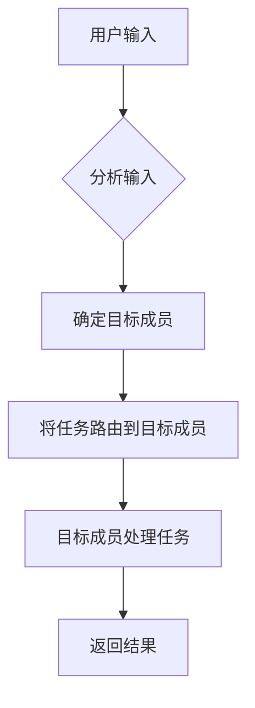
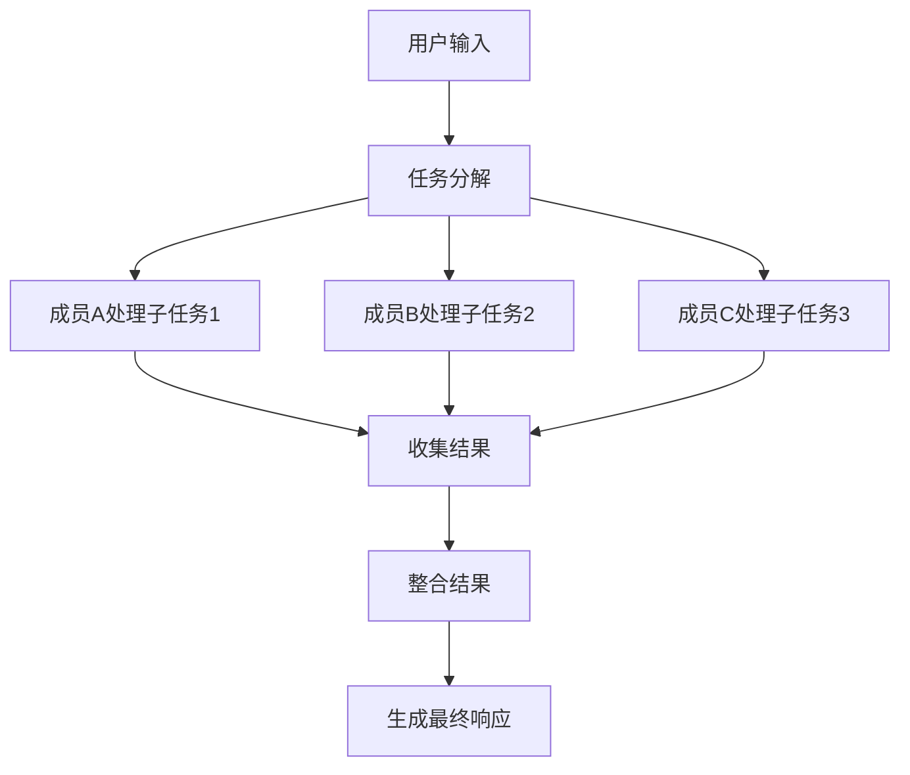
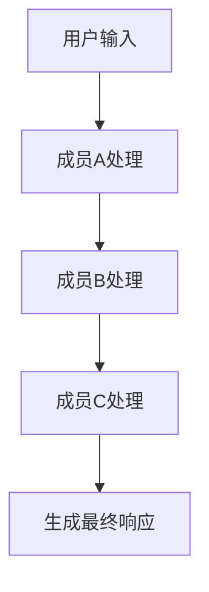

# 团队

<cite>
**本文档中引用的文件**  
- [team.py](file://libs/agno/agno/team/team.py)
- [teams_demo.py](file://cookbook/agent_os/advanced/teams_demo.py)
- [multilingual_team.py](file://cookbook/demo/teams/multilingual_team.py)
- [reasoning_finance_team.py](file://cookbook/demo/teams/reasoning_finance_team.py)
- [_teams.py](file://cookbook/agent_os/advanced/_teams.py)
- [01_coordinated_agentic_rag.py](file://cookbook/teams/search_coordination/01_coordinated_agentic_rag.py)
</cite>

## 目录
1. [引言](#引言)
2. [团队架构设计](#团队架构设计)
3. [核心模式详解](#核心模式详解)
4. [团队成员协调机制](#团队成员协调机制)
5. [任务分发模式](#任务分发模式)
6. [状态共享与结果聚合](#状态共享与结果聚合)
7. [性能特征与容错能力](#性能特征与容错能力)
8. [优化建议](#优化建议)
9. [结论](#结论)

## 引言

Agno团队系统提供了一种强大的多智能体协作框架，通过将多个专业化的智能体组织成团队来解决复杂任务。该系统支持三种主要的协作模式：路由模式、协作模式和协调模式，每种模式都针对不同的应用场景和任务需求进行了优化。团队系统不仅能够处理复杂的多步骤任务，还能在成员之间共享状态、聚合结果并进行高效的通信。本文档将全面阐述Agno团队的架构设计、成员协调机制和任务分发模式，为开发者提供深入的理解和实用的指导。

**Section sources**
- [team.py](file://libs/agno/agno/team/team.py#L1-L100)

## 团队架构设计

Agno团队的核心架构基于一个灵活的层次化设计，其中团队由多个成员（可以是智能体或其他团队）组成，并通过一个团队领导者进行协调。团队领导者负责接收输入、决定任务分配策略，并最终生成响应。每个团队成员都有自己的专业领域和工具集，能够独立处理特定类型的任务。团队架构的关键组件包括成员列表、模型配置、指令集、工具集和各种设置选项，如响应模式、任务委派策略和历史记录管理。

团队的初始化过程包括设置默认模型、配置调试模式、生成团队ID以及初始化所有成员。团队领导者可以访问共享的知识库、数据库和内存管理器，这些资源在团队成员之间共享，确保了信息的一致性和可访问性。此外，团队还支持会话状态管理，允许在不同运行之间保持状态，这对于需要上下文感知的应用场景至关重要。

```mermaid
classDiagram
class Team {
+List[Union[Agent, Team]] members
+Optional[Model] model
+Optional[str] name
+Optional[str] id
+bool respond_directly
+bool delegate_task_to_all_members
+bool determine_input_for_members
+Optional[str] user_id
+Optional[str] session_id
+Optional[Dict[str, Any]] session_state
+bool add_session_state_to_context
+bool enable_agentic_state
+Optional[str] description
+Optional[Union[str, List[str], Callable]] instructions
+Optional[str] expected_output
+bool markdown
+bool add_datetime_to_context
+bool add_location_to_context
+Optional[str] timezone_identifier
+bool add_name_to_context
+bool add_member_tools_to_context
+Optional[Union[str, Callable, Message]] system_message
+str system_message_role
+Optional[List[Union[str, Dict, BaseModel, Message]]] additional_input
+Optional[BaseDb] db
+Optional[MemoryManager] memory_manager
+Optional[Dict[str, Any]] dependencies
+bool add_dependencies_to_context
+Optional[Knowledge] knowledge
+Optional[Dict[str, Any]] knowledge_filters
+Optional[bool] enable_agentic_knowledge_filters
+bool update_knowledge
+bool add_knowledge_to_context
+Optional[Callable[..., Optional[List[Union[Dict, str]]]]] knowledge_retriever
+Literal["json", "yaml"] references_format
+bool share_member_interactions
+bool get_member_information_tool
+bool search_knowledge
+bool read_team_history
+bool send_media_to_model
+bool store_media
+Optional[List[Union[Toolkit, Callable, Function, Dict]]] tools
+Optional[Union[str, Dict[str, Any]]] tool_choice
+Optional[int] tool_call_limit
+Optional[List[Callable]] tool_hooks
+Optional[Type[BaseModel]] input_schema
+Optional[Type[BaseModel]] output_schema
+Optional[Model] parser_model
+Optional[str] parser_model_prompt
+Optional[Model] output_model
+Optional[str] output_model_prompt
+bool use_json_mode
+bool parse_response
+bool enable_agentic_memory
+bool enable_user_memories
+Optional[bool] add_memories_to_context
+Optional[SessionSummaryManager] session_summary_manager
+Optional[bool] add_session_summary_to_context
+bool add_history_to_context
+int num_history_runs
+Optional[Dict[str, Any]] metadata
+bool reasoning
+Optional[Model] reasoning_model
+Optional[Agent] reasoning_agent
+int reasoning_min_steps
+int reasoning_max_steps
+Optional[bool] stream
+bool stream_intermediate_steps
+bool store_events
+Optional[List[Union[RunEvent, TeamRunEvent]]] events_to_skip
+bool store_member_responses
+bool stream_member_events
+bool debug_mode
+Literal[1, 2] debug_level
+bool show_members_responses
+int retries
+int delay_between_retries
+bool exponential_backoff
+bool telemetry
+Optional[List[Image]] images
+Optional[List[Audio]] audio
+Optional[List[Video]] videos
+Optional[TeamSession] _team_session
+Optional[List[str]] _tool_instructions
+Optional[Dict[str, Function]] _functions_for_model
+Optional[List[Dict[str, Any]]] _tools_for_model
+Optional[Type[BaseModel]] _member_response_model
+Optional[SafeFormatter] _formatter
+bool _rebuild_tools
+__init__(members, id, model, name, role, respond_directly, determine_input_for_members, delegate_task_to_all_members, user_id, session_id, session_state, add_session_state_to_context, enable_agentic_state, resolve_in_context, cache_session, description, instructions, expected_output, additional_context, markdown, add_datetime_to_context, add_location_to_context, timezone_identifier, add_name_to_context, add_member_tools_to_context, system_message, system_message_role, additional_input, dependencies, add_dependencies_to_context, knowledge, knowledge_filters, add_knowledge_to_context, enable_agentic_knowledge_filters, update_knowledge, knowledge_retriever, references_format, share_member_interactions, get_member_information_tool, search_knowledge, read_team_history, store_media, send_media_to_model, tools, tool_call_limit, tool_choice, tool_hooks, input_schema, output_schema, parser_model, parser_model_prompt, output_model, output_model_prompt, use_json_mode, parse_response, db, enable_agentic_memory, enable_user_memories, add_memories_to_context, memory_manager, enable_session_summaries, session_summary_manager, add_session_summary_to_context, add_history_to_context, num_history_runs, metadata, reasoning, reasoning_model, reasoning_agent, reasoning_min_steps, reasoning_max_steps, stream, stream_intermediate_steps, store_events, events_to_skip, store_member_responses, stream_member_events, debug_mode, debug_level, show_members_responses, retries, delay_between_retries, exponential_backoff, telemetry)
+set_id() void
+_set_debug(debug_mode) void
+_set_telemetry() void
+_validate_input(input) Union[str, List, Dict, Message, BaseModel]
+_initialize_member(member, debug_mode) void
+_set_default_model() void
+_set_memory_manager() void
+_set_session_summary_manager() void
+_initialize_session(run_id, user_id, session_id, session_state) Tuple[str, Optional[str], Dict[str, Any]]
+initialize_team(debug_mode) void
+add_tool(tool) void
+set_tools(tools) void
+cancel_run(run_id) bool
+run(input, stream, stream_intermediate_steps, session_id, session_state, user_id, retries, audio, images, videos, files, knowledge_filters, add_history_to_context, add_dependencies_to_context, add_session_state_to_context, dependencies, metadata, debug_mode, yield_run_response, **kwargs) Union[TeamRunOutput, Iterator[Union[RunOutputEvent, TeamRunOutputEvent]]]
+_arun(run_response, input_message, session, session_state, user_id, images, videos, audio, files, knowledge_filters, add_history_to_context, add_dependencies_to_context, add_session_state_to_context, metadata, response_format, dependencies, **kwargs) TeamRunOutput
+_run_stream(run_response, run_messages, session, user_id, response_format, stream_intermediate_steps, workflow_context, yield_run_response) Iterator[Union[RunOutputEvent, TeamRunOutputEvent]]
+_get_run_messages(run_response, session, session_state, user_id, input_message, audio, images, videos, files, knowledge_filters, add_history_to_context, dependencies, add_dependencies_to_context, add_session_state_to_context, **kwargs) RunMessages
+_handle_reasoning(run_response, run_messages) None
+_ahandle_reasoning(run_response, run_messages) None
+_update_run_response(model_response, run_response, run_messages) None
+_generate_response_with_output_model(model_response, run_messages) None
+_agenerate_response_with_output_model(model_response, run_messages) None
+_parse_response_with_parser_model(model_response, run_messages) None
+_aparse_response_with_parser_model(model_response, run_messages) None
+_get_response_format() Optional[Union[Dict, Type[BaseModel]]]
+determine_tools_for_model(model, run_response, team_run_context, session, session_state, user_id, async_mode, knowledge_filters, input_message, images, videos, audio, files, workflow_context, debug_mode, add_history_to_context, add_dependencies_to_context, add_session_state_to_context, dependencies, add_dependencies_to_context, metadata) None
+_resolve_run_dependencies(dependencies) None
+_aresolve_run_dependencies(dependencies) None
+_update_metadata(session) None
+_read_or_create_session(session_id, user_id) TeamSession
+_update_session_state(session, session_state) Dict[str, Any]
+_get_effective_filters(knowledge_filters) Dict[str, Any]
+_validate_media_object_id(images, videos, audios, files) Tuple[Optional[List[Image]], Optional[List[Video]], Optional[List[Audio]], Optional[List[File]]]
+save_session(session) None
+print_response(input, stream, stream_intermediate_steps, session_id, session_state, user_id, retries, audio, images, videos, files, knowledge_filters, add_history_to_context, add_dependencies_to_context, add_session_state_to_context, dependencies, metadata, debug_mode, **kwargs) None
+aprint_response(input, stream, stream_intermediate_steps, session_id, session_state, user_id, retries, audio, images, videos, files, knowledge_filters, add_history_to_context, add_dependencies_to_context, add_session_state_to_context, dependencies, metadata, debug_mode, **kwargs) None
}
class Agent {
+str name
+str role
+Model model
+Optional[str] id
+Optional[BaseDb] db
+Optional[MemoryManager] memory_manager
+Optional[Knowledge] knowledge
+Optional[List[Union[Toolkit, Callable, Function, Dict]]] tools
+Optional[Union[str, List[str], Callable]] instructions
+bool enable_user_memories
+bool add_history_to_context
+bool add_datetime_to_context
+bool add_location_to_context
+Optional[str] timezone_identifier
+bool markdown
+bool show_tool_calls
+bool debug_mode
+Literal[1, 2] debug_level
+int retries
+int delay_between_retries
+bool exponential_backoff
+bool telemetry
+Optional[Dict[str, Any]] metadata
+Optional[str] team_id
+Optional[str] parent_team_id
+Optional[str] workflow_id
+Optional[str] user_id
+Optional[str] session_id
+Optional[Dict[str, Any]] session_state
+bool add_session_state_to_context
+bool enable_agentic_state
+bool resolve_in_context
+bool cache_session
+Optional[str] description
+Optional[str] expected_output
+Optional[str] additional_context
+bool add_name_to_context
+bool add_member_tools_to_context
+Optional[Union[str, Callable, Message]] system_message
+str system_message_role
+Optional[List[Union[str, Dict, BaseModel, Message]]] additional_input
+Optional[Dict[str, Any]] dependencies
+bool add_dependencies_to_context
+Optional[Dict[str, Any]] knowledge_filters
+Optional[bool] enable_agentic_knowledge_filters
+bool update_knowledge
+bool add_knowledge_to_context
+Optional[Callable[..., Optional[List[Union[Dict, str]]]]] knowledge_retriever
+Literal["json", "yaml"] references_format
+bool share_member_interactions
+bool get_member_information_tool
+bool search_knowledge
+bool read_team_history
+bool send_media_to_model
+bool store_media
+Optional[Type[BaseModel]] input_schema
+Optional[Type[BaseModel]] output_schema
+Optional[Model] parser_model
+Optional[str] parser_model_prompt
+Optional[Model] output_model
+Optional[str] output_model_prompt
+bool use_json_mode
+bool parse_response
+bool enable_agentic_memory
+Optional[bool] add_memories_to_context
+Optional[SessionSummaryManager] session_summary_manager
+Optional[bool] add_session_summary_to_context
+bool add_history_to_context
+int num_history_runs
+Optional[Dict[str, Any]] metadata
+bool reasoning
+Optional[Model] reasoning_model
+Optional[Agent] reasoning_agent
+int reasoning_min_steps
+int reasoning_max_steps
+Optional[bool] stream
+bool stream_intermediate_steps
+bool store_events
+Optional[List[Union[RunEvent, TeamRunEvent]]] events_to_skip
+bool store_member_responses
+bool stream_member_events
+bool debug_mode
+Literal[1, 2] debug_level
+bool show_members_responses
+int retries
+int delay_between_retries
+bool exponential_backoff
+bool telemetry
+Optional[List[Image]] images
+Optional[List[Audio]] audio
+Optional[List[Video]] videos
+Optional[AgentSession] _agent_session
+Optional[List[str]] _tool_instructions
+Optional[Dict[str, Function]] _functions_for_model
+Optional[List[Dict[str, Any]]] _tools_for_model
+Optional[Type[BaseModel]] _member_response_model
+Optional[SafeFormatter] _formatter
+bool _rebuild_tools
+__init__(name, role, model, id, db, memory_manager, knowledge, tools, instructions, enable_user_memories, add_history_to_context, add_datetime_to_context, add_location_to_context, timezone_identifier, markdown, show_tool_calls, debug_mode, debug_level, retries, delay_between_retries, exponential_backoff, telemetry, metadata, team_id, parent_team_id, workflow_id, user_id, session_id, session_state, add_session_state_to_context, enable_agentic_state, resolve_in_context, cache_session, description, expected_output, additional_context, add_name_to_context, add_member_tools_to_context, system_message, system_message_role, additional_input, dependencies, add_dependencies_to_context, knowledge_filters, enable_agentic_knowledge_filters, update_knowledge, add_knowledge_to_context, knowledge_retriever, references_format, share_member_interactions, get_member_information_tool, search_knowledge, read_team_history, store_media, send_media_to_model, input_schema, output_schema, parser_model, parser_model_prompt, output_model, output_model_prompt, use_json_mode, parse_response, enable_agentic_memory, add_memories_to_context, session_summary_manager, add_session_summary_to_context, add_history_to_context, num_history_runs, metadata, reasoning, reasoning_model, reasoning_agent, reasoning_min_steps, reasoning_max_steps, stream, stream_intermediate_steps, store_events, events_to_skip, store_member_responses, stream_member_events, debug_mode, debug_level, show_members_responses, retries, delay_between_retries, exponential_backoff, telemetry)
+set_id() void
+_set_debug(debug_mode) void
+_set_telemetry() void
+_validate_input(input) Union[str, List, Dict, Message, BaseModel]
+_set_default_model() void
+_set_memory_manager() void
+_set_session_summary_manager() void
+_initialize_session(run_id, user_id, session_id, session_state) Tuple[str, Optional[str], Dict[str, Any]]
+initialize_agent(debug_mode) void
+add_tool(tool) void
+set_tools(tools) void
+cancel_run(run_id) bool
+run(input, stream, stream_intermediate_steps, session_id, session_state, user_id, retries, audio, images, videos, files, knowledge_filters, add_history_to_context, add_dependencies_to_context, add_session_state_to_context, dependencies, metadata, debug_mode, yield_run_response, **kwargs) Union[RunOutput, Iterator[Union[RunOutputEvent, TeamRunOutputEvent]]]
+_arun(run_response, input_message, session, session_state, user_id, images, videos, audio, files, knowledge_filters, add_history_to_context, add_dependencies_to_context, add_session_state_to_context, metadata, response_format, dependencies, **kwargs) RunOutput
+_run_stream(run_response, run_messages, session, user_id, response_format, stream_intermediate_steps, workflow_context, yield_run_response) Iterator[Union[RunOutputEvent, RunOutputEvent]]
+_get_run_messages(run_response, session, session_state, user_id, input_message, audio, images, videos, files, knowledge_filters, add_history_to_context, dependencies, add_dependencies_to_context, add_session_state_to_context, **kwargs) RunMessages
+_handle_reasoning(run_response, run_messages) None
+_ahandle_reasoning(run_response, run_messages) None
+_update_run_response(model_response, run_response, run_messages) None
+_generate_response_with_output_model(model_response, run_messages) None
+_agenerate_response_with_output_model(model_response, run_messages) None
+_parse_response_with_parser_model(model_response, run_messages) None
+_aparse_response_with_parser_model(model_response, run_messages) None
+_get_response_format() Optional[Union[Dict, Type[BaseModel]]]
+determine_tools_for_model(model, run_response, agent_run_context, session, session_state, user_id, async_mode, knowledge_filters, input_message, images, videos, audio, files, workflow_context, debug_mode, add_history_to_context, add_dependencies_to_context, add_session_state_to_context, dependencies, add_dependencies_to_context, metadata) None
+_resolve_run_dependencies(dependencies) None
+_aresolve_run_dependencies(dependencies) None
+_update_metadata(session) None
+_read_or_create_session(session_id, user_id) AgentSession
+_update_session_state(session, session_state) Dict[str, Any]
+_get_effective_filters(knowledge_filters) Dict[str, Any]
+_validate_media_object_id(images, videos, audios, files) Tuple[Optional[List[Image]], Optional[List[Video]], Optional[List[Audio]], Optional[List[File]]]
+save_session(session) None
+print_response(input, stream, stream_intermediate_steps, session_id, session_state, user_id, retries, audio, images, videos, files, knowledge_filters, add_history_to_context, add_dependencies_to_context, add_session_state_to_context, dependencies, metadata, debug_mode, **kwargs) None
+aprint_response(input, stream, stream_intermediate_steps, session_id, session_state, user_id, retries, audio, images, videos, files, knowledge_filters, add_history_to_context, add_dependencies_to_context, add_session_state_to_context, dependencies, metadata, debug_mode, **kwargs) None
}
class TeamRunOutput {
+str run_id
+str session_id
+str team_id
+Optional[str] team_name
+Optional[Dict[str, Any]] metadata
+TeamRunInput input
+Optional[str] content
+Optional[str] model
+Optional[str] model_provider
+Optional[List[Message]] messages
+Optional[List[MessageReferences]] references
+Optional[Dict[str, Any]] context
+Optional[Metrics] metrics
+Optional[Dict[str, Any]] session_state
+Optional[Dict[str, Any]] user_memory
+Optional[Dict[str, Any]] session_summary
+Optional[List[Dict[str, Any]]] member_responses
+Optional[List[Dict[str, Any]]] tool_calls
+Optional[List[Dict[str, Any]]] tool_call_results
+Optional[List[Dict[str, Any]]] reasoning_steps
+Optional[Dict[str, Any]] structured_output
+Optional[List[Image]] images
+Optional[List[Audio]] audio
+Optional[List[Video]] videos
+Optional[List[File]] files
+RunStatus status
+Optional[str] error
+Optional[str] reason
+Optional[Dict[str, Any]] raw_response
+Optional[Dict[str, Any]] raw_tool_calls
+Optional[Dict[str, Any]] raw_tool_call_results
+Optional[Dict[str, Any]] raw_reasoning_steps
+Optional[Dict[str, Any]] raw_structured_output
+Optional[Dict[str, Any]] raw_messages
+Optional[Dict[str, Any]] raw_references
+Optional[Dict[str, Any]] raw_context
+Optional[Dict[str, Any]] raw_metrics
+Optional[Dict[str, Any]] raw_session_state
+Optional[Dict[str, Any]] raw_user_memory
+Optional[Dict[str, Any]] raw_session_summary
+Optional[Dict[str, Any]] raw_member_responses
+Optional[Dict[str, Any]] raw_tool_calls
+Optional[Dict[str, Any]] raw_tool_call_results
+Optional[Dict[str, Any]] raw_reasoning_steps
+Optional[Dict[str, Any]] raw_structured_output
+Optional[Dict[str, Any]] raw_images
+Optional[Dict[str, Any]] raw_audio
+Optional[Dict[str, Any]] raw_videos
+Optional[Dict[str, Any]] raw_files
+Optional[Dict[str, Any]] raw_metadata
+Optional[Dict[str, Any]] raw_input
+Optional[Dict[str, Any]] raw_content
+Optional[Dict[str, Any]] raw_model
+Optional[Dict[str, Any]] raw_model_provider
+Optional[Dict[str, Any]] raw_messages
+Optional[Dict[str, Any]] raw_references
+Optional[Dict[str, Any]] raw_context
+Optional[Dict[str, Any]] raw_metrics
+Optional[Dict[str, Any]] raw_session_state
+Optional[Dict[str, Any]] raw_user_memory
+Optional[Dict[str, Any]] raw_session_summary
+Optional[Dict[str, Any]] raw_member_responses
+Optional[Dict[str, Any]] raw_tool_calls
+Optional[Dict[str, Any]] raw_tool_call_results
+Optional[Dict[str, Any]] raw_reasoning_steps
+Optional[Dict[str, Any]] raw_structured_output
+Optional[Dict[str, Any]] raw_images
+Optional[Dict[str, Any]] raw_audio
+Optional[Dict[str, Any]] raw_videos
+Optional[Dict[str, Any]] raw_files
+Optional[Dict[str, Any]] raw_status
+Optional[Dict[str, Any]] raw_error
+Optional[Dict[str, Any]] raw_reason
+Optional[Dict[str, Any]] raw_raw_response
+Optional[Dict[str, Any]] raw_raw_tool_calls
+Optional[Dict[str, Any]] raw_raw_tool_call_results
+Optional[Dict[str, Any]] raw_raw_reasoning_steps
+Optional[Dict[str, Any]] raw_raw_structured_output
}
class TeamRunInput {
+Union[str, List, Dict, Message, BaseModel, List[Message]] input_content
+Optional[List[Image]] images
+Optional[List[Video]] videos
+Optional[List[Audio]] audios
+Optional[List[File]] files
}
class RunMessages {
+List[Message] messages
+Optional[Dict[str, Any]] context
+Optional[Dict[str, Any]] metadata
+Optional[Dict[str, Any]] session_state
+Optional[Dict[str, Any]] user_memory
+Optional[Dict[str, Any]] session_summary
+Optional[List[Dict[str, Any]]] member_interactions
+Optional[List[Dict[str, Any]]] dependencies
+Optional[List[Dict[str, Any]]] knowledge_references
+Optional[List[Dict[str, Any]]] tool_calls
+Optional[List[Dict[str, Any]]] tool_call_results
+Optional[List[Dict[str, Any]]] reasoning_steps
+Optional[Dict[str, Any]] structured_output
+Optional[List[Image]] images
+Optional[List[Audio]] audio
+Optional[List[Video]] videos
+Optional[List[File]] files
}
Team "1" *-- "0..*" Agent : 包含
Team "1" -- "1" TeamRunOutput : 生成
Team "1" -- "1" RunMessages : 使用
TeamRunOutput "1" -- "1" TeamRunInput : 输入
</mermaid>
**Diagram sources**
- [team.py](file : //libs/agno/agno/team/team.py#L1-L1000)
**Section sources**
- [team.py](file : //libs/agno/agno/team/team.py#L1-L1000)
## 核心模式详解
Agno团队系统支持三种主要的协作模式：路由模式、协作模式和协调模式。每种模式都有其独特的工作原理、适用场景和实现细节，能够满足不同复杂度和需求的任务处理。
### 路由模式
路由模式是一种基于输入内容的语言或主题特征，将任务分配给最合适的成员的策略。在这种模式下，团队领导者分析输入并根据预定义的规则或条件将任务路由到特定的成员。例如，在多语言团队中，团队领导者会根据用户输入的语言将其路由到相应的语言专家。这种模式适用于需要专业领域知识或特定技能的任务，能够确保任务由最适合的成员处理，从而提高效率和准确性。


**Diagram sources**
- [multilingual_team.py](file://cookbook/demo/teams/multilingual_team.py#L1-L70)

### 协作模式

协作模式允许多个成员并行处理同一任务的不同方面，然后将结果汇总以生成最终响应。在这种模式下，团队领导者将任务分解为子任务，并将这些子任务分配给不同的成员。每个成员独立完成自己的部分，然后团队领导者收集所有结果并整合成一个连贯的输出。这种模式适用于需要综合多种信息源或技能的任务，如财务分析或市场研究，能够充分利用团队成员的专业知识。



**Diagram sources**
- [01_coordinated_agentic_rag.py](file://cookbook/teams/search_coordination/01_coordinated_agentic_rag.py#L1-L115)

### 协调模式

协调模式是一种更高级的协作形式，其中团队成员按照预定的顺序依次处理任务，每个成员的输出成为下一个成员的输入。这种模式适用于需要逐步推理或分阶段处理的任务，如复杂的决策制定或问题解决。团队领导者负责协调整个流程，确保每个步骤都正确执行，并在必要时进行干预。这种模式能够处理高度复杂的任务，通过分步处理降低整体复杂性。



**Diagram sources**
- [reasoning_finance_team.py](file://cookbook/demo/teams/reasoning_finance_team.py#L1-L120)

**Section sources**
- [multilingual_team.py](file://cookbook/demo/teams/multilingual_team.py#L1-L70)
- [01_coordinated_agentic_rag.py](file://cookbook/teams/search_coordination/01_coordinated_agentic_rag.py#L1-L115)
- [reasoning_finance_team.py](file