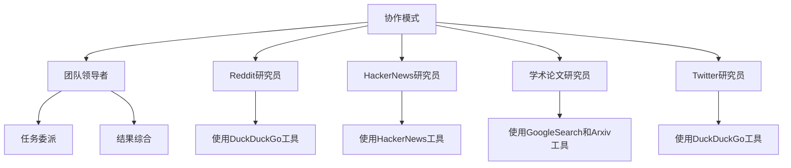
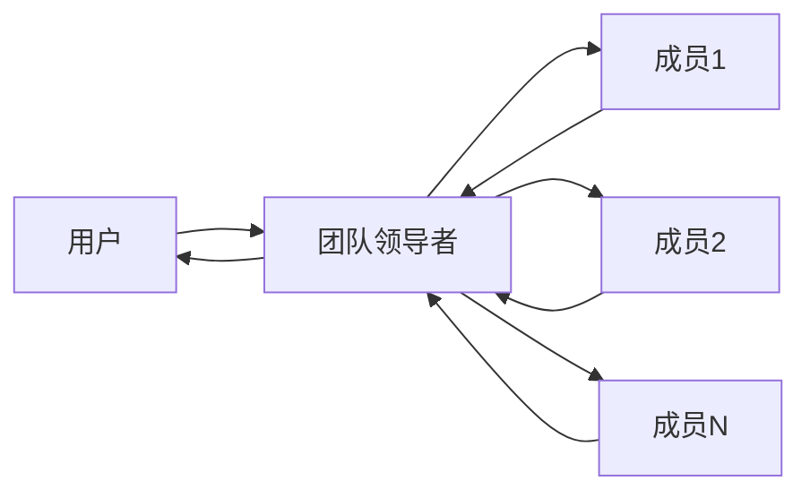
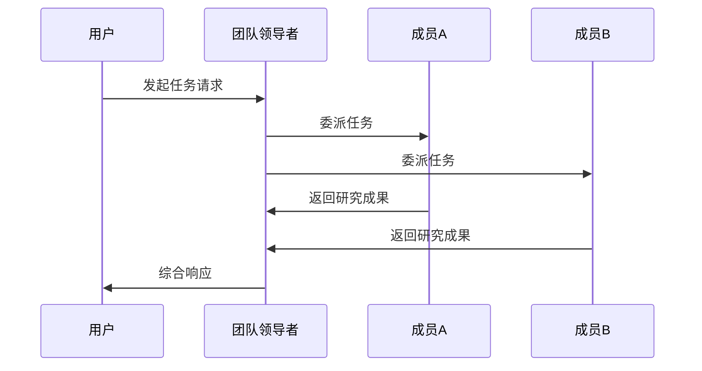
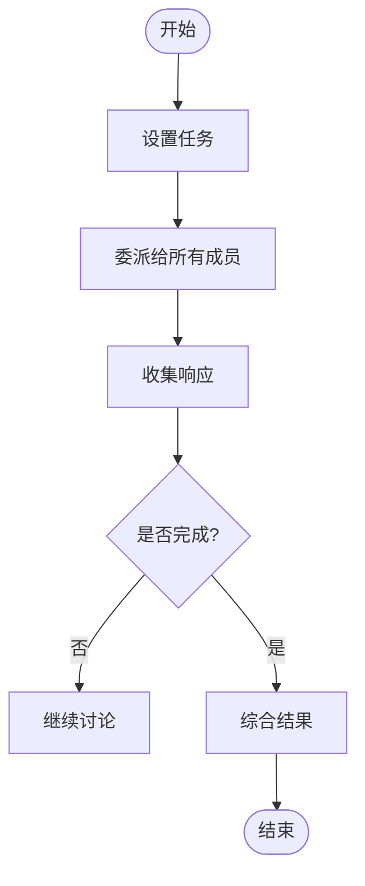
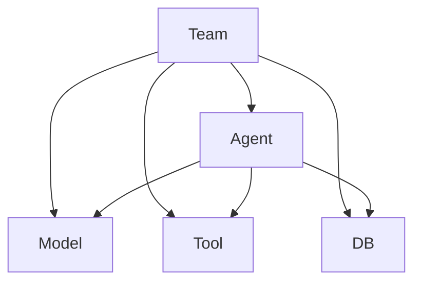

# 协作模式

<cite>
**本文档引用的文件**
- [collaboration_team.py](file://cookbook/examples/teams/collaborate_mode/collaboration_team.py)
- [team.py](file://libs/agno/agno/team/team.py)
- [test_team_delegation.py](file://libs/agno/tests/integration/teams/test_team_delegation.py)
- [02_async_delegate_to_all_members.py](file://cookbook/teams/async/02_async_delegate_to_all_members.py)
</cite>

## 目录
1. [引言](#引言)
2. [项目结构](#项目结构)
3. [核心组件](#核心组件)
4. [架构概述](#架构概述)
5. [详细组件分析](#详细组件分析)
6. [依赖分析](#依赖分析)
7. [性能考虑](#性能考虑)
8. [故障排除指南](#故障排除指南)
9. [结论](#结论)

## 引言
Agno的协作模式是一种去中心化的团队工作方式，其中团队成员可以直接通信和协作。这种模式允许所有成员同时处理相同任务，并由团队领导者综合各成员的输出形成连贯响应。该模式特别适用于需要深度交互和知识共享的场景，如研究团队或跨领域项目组。

## 项目结构
协作模式的实现主要分布在`cookbook/examples/teams/collaborate_mode`目录下，核心逻辑位于`libs/agno/agno/team/team.py`文件中。团队成员作为独立代理(agent)存在，通过统一的团队接口进行协调。

**Diagram sources**
- [collaboration_team.py](file://cookbook/examples/teams/collaborate_mode/collaboration_team.py#L0-L105)

**Section sources**
- [collaboration_team.py](file://cookbook/examples/teams/collaborate_mode/collaboration_team.py#L0-L105)

## 核心组件
协作模式的核心在于`Team`类的`delegate_task_to_all_members`属性，当设置为`True`时，团队会将任务委派给所有成员。团队领导者负责协调讨论并在认为团队达成共识时停止讨论。

**Section sources**
- [team.py](file://libs/agno/agno/team/team.py#L4400-L4414)
- [team.py](file://libs/agno/agno/team/team.py#L5604-L5630)

## 架构概述
协作模式采用分布式架构，每个团队成员都是独立的代理，具有特定的角色和工具集。团队领导者作为协调者，负责初始化任务、收集成员响应并生成最终输出。

**Diagram sources**
- [team.py](file://libs/agno/agno/team/team.py#L5700-L5899)

## 详细组件分析

### 协作模式分析
在协作模式下，所有团队成员都被赋予相同的任务，团队领导者综合他们的输出形成最终响应。这种模式促进了创新和灵活性，但也带来了管理复杂性的挑战。

#### 通信协议

**Diagram sources**
- [team.py](file://libs/agno/agno/team/team.py#L5604-L5630)
- [team.py](file://libs/agno/agno/team/team.py#L5714-L5737)

#### 消息传递机制
协作模式使用异步消息传递机制，支持流式传输和中间步骤。成员的响应可以实时显示，提高了透明度和可观察性。

**Diagram sources**
- [team.py](file://libs/agno/agno/team/team.py#L5700-L5899)

**Section sources**
- [team.py](file://libs/agno/agno/team/team.py#L5604-L5899)

### 应用示例
协作模式特别适用于需要多角度分析的场景，如研究团队或跨领域项目组。通过整合不同来源的信息，可以获得更全面的见解。

**Section sources**
- [collaboration_team.py](file://cookbook/examples/teams/collaborate_mode/collaboration_team.py#L0-L105)
- [02_async_delegate_to_all_members.py](file://cookbook/teams/async/02_async_delegate_to_all_members.py#L0-L86)

## 依赖分析
协作模式依赖于多个核心组件，包括代理(agent)、模型(model)、工具(tool)和数据库(db)。这些组件共同构成了协作团队的基础架构。

**Diagram sources**
- [team.py](file://libs/agno/agno/team/team.py#L0-L199)

**Section sources**
- [team.py](file://libs/agno/agno/team/team.py#L0-L699)

## 性能考虑
协作模式的性能受多个因素影响，包括成员数量、任务复杂度和网络延迟。异步执行模式可以提高整体效率，但需要 careful management of resources.

## 故障排除指南
在使用协作模式时，可能遇到的问题包括成员响应超时、任务委派失败和结果综合错误。建议启用调试模式以获取详细的执行日志。

**Section sources**
- [test_team_delegation.py](file://libs/agno/tests/integration/teams/test_team_delegation.py#L121-L146)

## 结论
Agno的协作模式提供了一种强大的去中心化工作方式，允许多个代理协同解决问题。通过合理配置团队成员和工具，可以在各种复杂场景中实现高效的知识共享和创新。