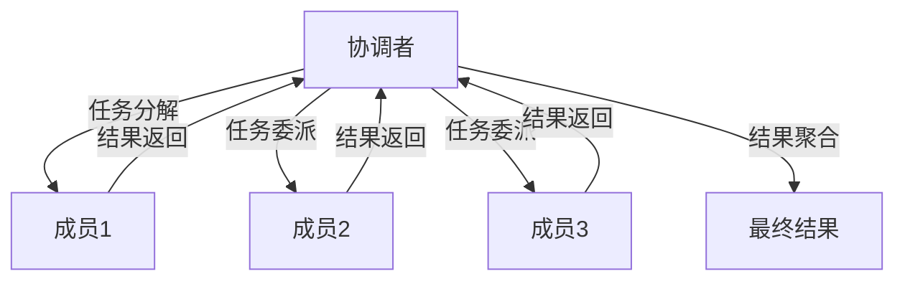
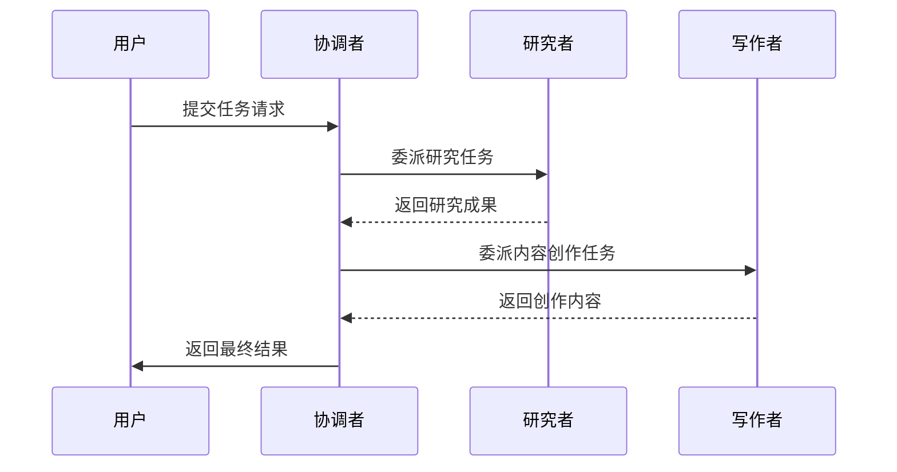
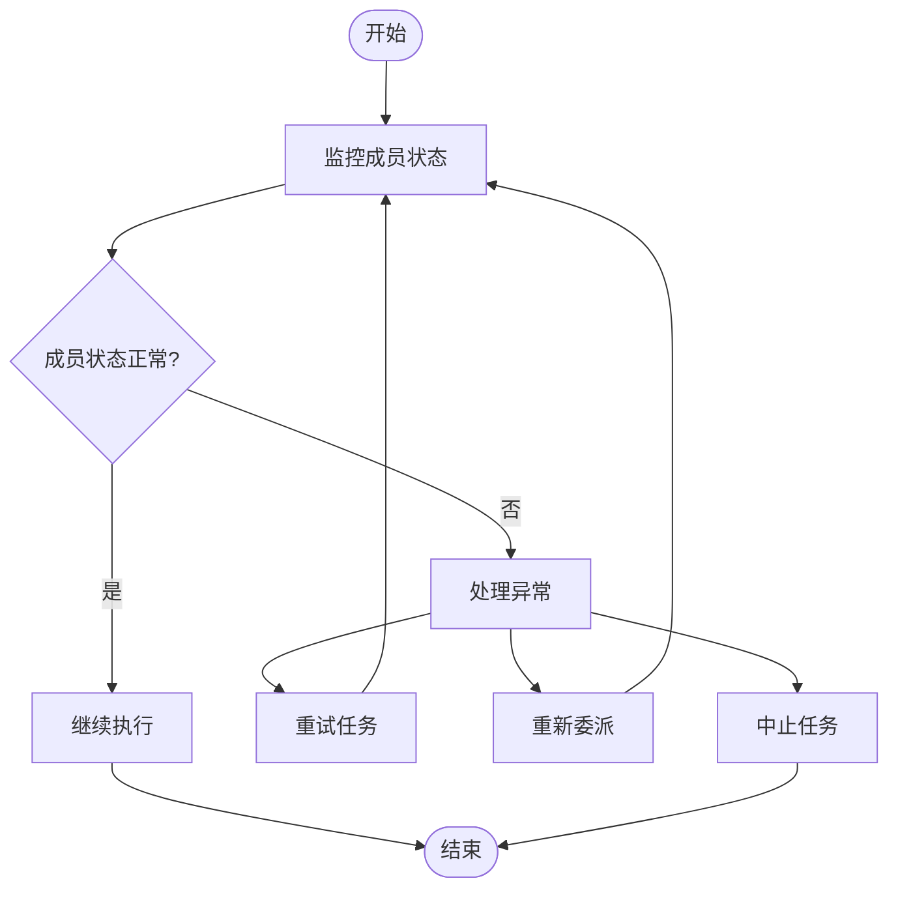
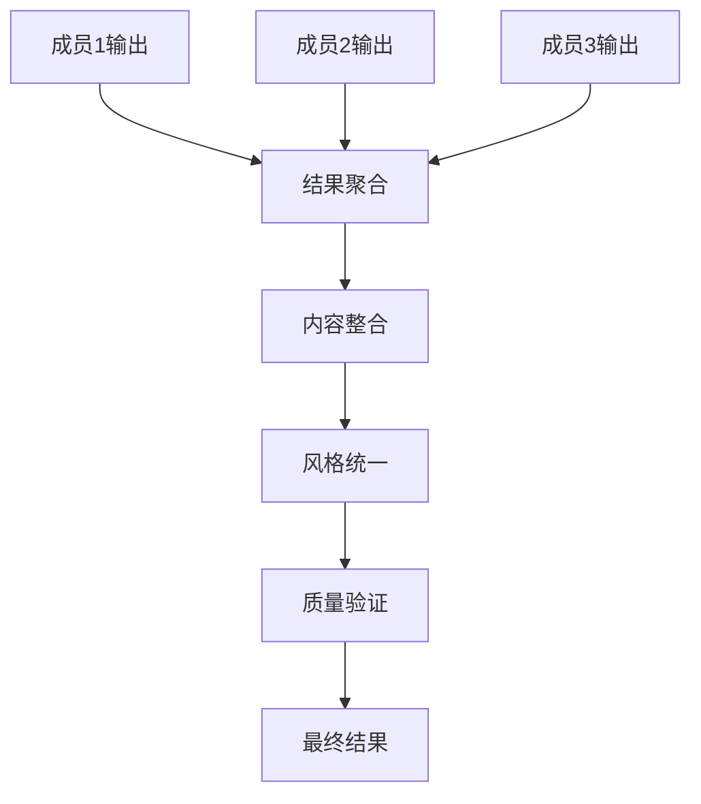
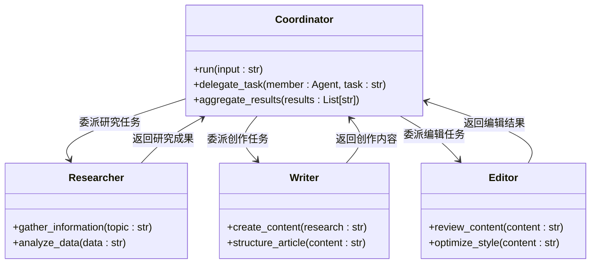

# 协调模式

<cite>
**本文档中引用的文件**  
- [01_async_coordination_team.py](file://cookbook/teams/async/01_async_coordination_team.py)
- [team.py](file://libs/agno/agno/team/team.py)
- [test_team_delegation.py](file://libs/agno/tests/integration/teams/test_team_delegation.py)
- [team_with_local_agentic_rag.py](file://cookbook/teams/team_with_local_agentic_rag.py)
</cite>

## 目录
1. [引言](#引言)
2. [协调模式核心架构](#协调模式核心架构)
3. [任务分解与委派机制](#任务分解与委派机制)
4. [成员状态监控](#成员状态监控)
5. [结果聚合逻辑](#结果聚合逻辑)
6. [内容创作团队示例分析](#内容创作团队示例分析)
7. [应用场景](#应用场景)
8. [组织优势与性能瓶颈](#组织优势与性能瓶颈)
9. [结论](#结论)

## 引言
协调模式是一种分布式智能系统架构，其中由一个中央协调者负责管理多个专业成员的协作。该模式通过任务分解、委派和结果聚合的机制，实现复杂问题的高效解决。在Agno框架中，协调模式被设计为一种灵活的团队协作机制，适用于内容创作、复杂问题求解等多种场景。本文档将深入分析该模式的工作流程、核心组件和实际应用。

## 协调模式核心架构
协调模式的核心架构由一个中央协调者和多个专业成员组成。协调者负责整体任务的规划、分解和结果整合，而成员则专注于特定领域的任务执行。这种架构通过明确的职责划分，实现了任务处理的专业化和高效化。

**图示来源**
- [01_async_coordination_team.py](file://cookbook/teams/async/01_async_coordination_team.py#L25-L87)

**本节来源**
- [01_async_coordination_team.py](file://cookbook/teams/async/01_async_coordination_team.py#L1-L87)
- [team.py](file://libs/agno/agno/team/team.py#L112-L147)

## 任务分解与委派机制
协调模式中的任务分解与委派机制是其核心功能之一。协调者根据预设的指令序列，将复杂任务分解为多个子任务，并委派给最适合的成员执行。这一过程通过清晰的指令链实现，确保每个成员都明确自己的任务目标和期望输出。

在Agno框架中，任务分解通过`instructions`参数实现，该参数定义了任务执行的顺序和逻辑。例如，在内容创作场景中，协调者首先委派研究任务给研究者成员，然后将研究成果传递给写作者成员进行内容创作。

**图示来源**
- [test_team_delegation.py](file://libs/agno/tests/integration/teams/test_team_delegation.py#L0-L45)

**本节来源**
- [team.py](file://libs/agno/agno/team/team.py#L809-L841)
- [test_team_delegation.py](file://libs/agno/tests/integration/teams/test_team_delegation.py#L0-L45)

## 成员状态监控
协调模式中的成员状态监控机制确保了任务执行过程的可控性和可靠性。协调者通过实时监控成员的状态，能够及时发现和处理执行过程中的异常情况。这种监控机制不仅包括任务完成状态的跟踪，还涵盖了成员资源使用情况和响应时间的监测。

在Agno框架中，成员状态监控通过运行时事件系统实现。每个成员的执行过程都会产生相应的事件，这些事件被协调者收集和处理。当检测到成员执行超时或失败时，协调者可以采取相应的恢复措施，如重新委派任务或调整任务优先级。

**图示来源**
- [team.py](file://libs/agno/agno/team/team.py#L809-L841)

**本节来源**
- [team.py](file://libs/agno/agno/team/team.py#L809-L841)
- [team_with_local_agentic_rag.py](file://cookbook/teams/team_with_local_agentic_rag.py)

## 结果聚合逻辑
结果聚合是协调模式的关键环节，它将各个成员的输出整合为一个连贯的最终结果。这一过程不仅涉及简单的结果拼接，还包括内容的逻辑整合、风格统一和质量验证。协调者作为聚合中心，需要具备强大的信息处理和内容组织能力。

在Agno框架中，结果聚合通过`output_schema`参数实现，该参数定义了最终输出的结构和格式。协调者根据预设的模式，将各个成员的输出进行结构化整合，确保最终结果的一致性和完整性。此外，协调者还可以对聚合结果进行质量评估和优化，进一步提升输出质量。

**图示来源**
- [01_async_coordination_team.py](file://cookbook/teams/async/01_async_coordination_team.py#L25-L87)

**本节来源**
- [01_async_coordination_team.py](file://cookbook/teams/async/01_async_coordination_team.py#L25-L87)
- [team.py](file://libs/agno/agno/team/team.py#L809-L841)

## 内容创作团队示例分析
内容创作团队是协调模式的一个典型应用示例。在这个场景中，协调者管理一个由研究者、写作者和编辑者组成的专业团队，共同完成高质量内容的创作任务。该示例展示了协调模式在实际应用中的完整工作流程。

在Agno框架的实现中，内容创作团队通过明确的指令序列工作：首先由研究者收集和分析相关信息，然后由写作者基于研究成果创作内容，最后由编辑者对内容进行润色和优化。整个过程通过协调者的统一管理，确保了内容质量和创作效率。

**图示来源**
- [test_team_delegation.py](file://libs/agno/tests/integration/teams/test_team_delegation.py#L0-L45)

**本节来源**
- [test_team_delegation.py](file://libs/agno/tests/integration/teams/test_team_delegation.py#L0-L45)
- [01_async_coordination_team.py](file://cookbook/teams/async/01_async_coordination_team.py#L25-L87)

## 应用场景
协调模式适用于多种复杂任务处理场景，特别是在需要多领域专业知识协同工作的场合。以下是几个典型的应用场景：

### 内容创作
在内容创作领域，协调模式可以管理一个由研究者、写作者和编辑者组成的专业团队。协调者负责任务的分解和结果的整合，确保内容的质量和一致性。这种模式特别适合需要深度研究和高质量写作的场景，如科技文章、市场分析报告等。

### 复杂问题求解
在解决复杂问题时，协调模式可以将问题分解为多个子问题，并委派给具有相应专业知识的成员。例如，在金融分析场景中，可以将任务分解为数据收集、趋势分析、风险评估和投资建议等子任务，由不同的专业成员分别处理。

### 跨领域协作
协调模式支持跨领域的专业协作，能够整合不同领域的专业知识。例如，在医疗诊断场景中，可以协调放射科医生、病理学家和临床医生等不同专业人员的协作，提供更全面的诊断建议。

## 组织优势与性能瓶颈
协调模式在组织效率和任务处理能力方面具有显著优势，但也存在一些潜在的性能瓶颈。

### 组织优势
1. **专业化分工**：通过将任务分解给专业成员，实现了工作专业化，提高了任务处理的质量和效率。
2. **灵活性**：协调模式支持动态的任务委派和成员管理，能够根据任务需求灵活调整团队结构。
3. **可扩展性**：通过增加专业成员，可以轻松扩展系统的处理能力，适应更复杂的任务需求。
4. **容错性**：当某个成员出现故障时，协调者可以重新委派任务，提高了系统的可靠性。

### 潜在性能瓶颈
1. **协调开销**：随着成员数量的增加，协调者的管理开销也会相应增加，可能成为性能瓶颈。
2. **通信延迟**：成员间的通信延迟会影响整体处理效率，特别是在分布式部署场景中。
3. **单点故障**：协调者作为中央控制节点，其故障可能导致整个系统无法正常工作。
4. **资源竞争**：多个成员可能同时竞争有限的资源，导致资源瓶颈。

## 结论
协调模式通过中央协调者管理多成员协作的机制，为复杂任务处理提供了一种高效的解决方案。该模式在内容创作、复杂问题求解等场景中展现出显著优势，通过专业化分工和灵活的任务管理，实现了高质量的任务处理。然而，该模式也存在协调开销、通信延迟等潜在性能瓶颈，需要在实际应用中加以考虑和优化。未来的发展方向包括分布式协调架构、自适应任务分配算法等，以进一步提升系统的性能和可靠性。