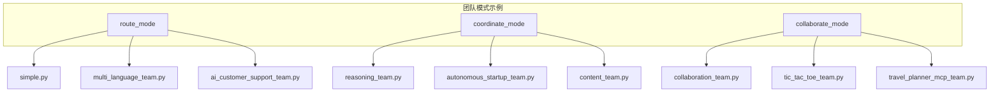
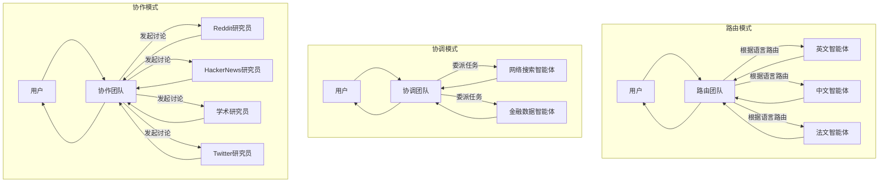
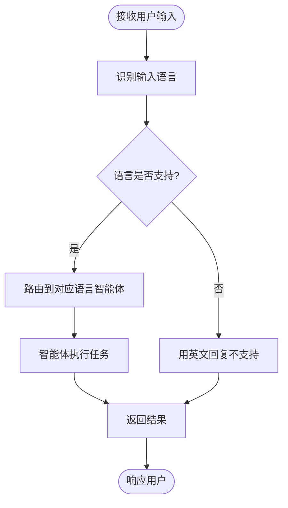
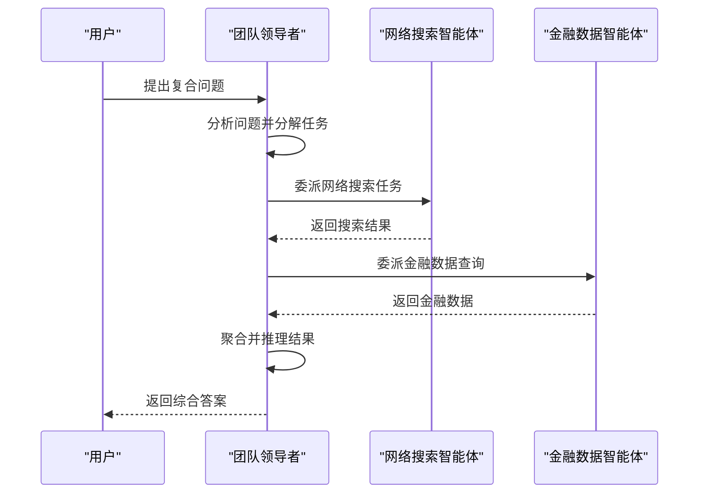
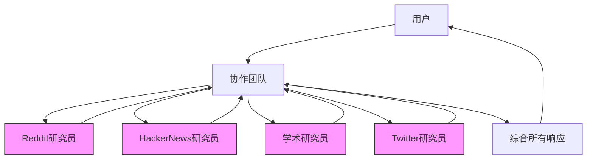
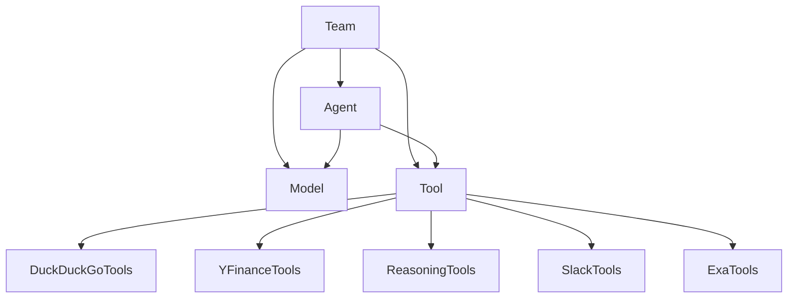

# 团队模式

<cite>
**本文档引用的文件**  
- [simple.py](file://cookbook/examples/teams/route_mode/simple.py)
- [multi_language_team.py](file://cookbook/examples/teams/route_mode/multi_language_team.py)
- [ai_customer_support_team.py](file://cookbook/examples/teams/route_mode/ai_customer_support_team.py)
- [reasoning_team.py](file://cookbook/examples/teams/coordinate_mode/reasoning_team.py)
- [reasoning_finance_team.py](file://cookbook/reasoning/teams/reasoning_finance_team.py)
- [collaboration_team.py](file://cookbook/examples/teams/collaborate_mode/collaboration_team.py)
</cite>

## 目录
1. [引言](#引言)
2. [项目结构](#项目结构)
3. [核心组件](#核心组件)
4. [架构概述](#架构概述)
5. [详细组件分析](#详细组件分析)
6. [依赖分析](#依赖分析)
7. [性能考量](#性能考量)
8. [故障排除指南](#故障排除指南)
9. [结论](#结论)

## 引言
本文档深入探讨 Agno 框架中的三种核心团队模式：路由模式、协调模式和协作模式。这些模式为构建复杂的多智能体系统提供了灵活的架构选择，适用于不同的应用场景和任务需求。通过分析实际代码示例，本文将详细解释每种模式的工作原理、配置方法和交互流程，并对比其在性能、复杂性和容错性方面的特点，为开发者提供模式选择的决策指南。

## 项目结构
Agno 项目的团队模式实现主要分布在 `cookbook/examples/teams` 目录下，该目录按模式类型组织了清晰的示例代码。项目结构体现了模块化的设计理念，将不同的团队模式分离到独立的子目录中，便于学习和复用。

**图示来源**  
- [simple.py](file://cookbook/examples/teams/route_mode/simple.py)
- [reasoning_team.py](file://cookbook/examples/teams/coordinate_mode/reasoning_team.py)
- [collaboration_team.py](file://cookbook/examples/teams/collaborate_mode/collaboration_team.py)

**本节来源**  
- [cookbook/examples/teams](file://cookbook/examples/teams)

## 核心组件
Agno 团队模式的核心组件包括 `Agent`（智能体）和 `Team`（团队）。`Agent` 是基本的执行单元，封装了特定的角色、模型和工具。`Team` 则是更高层次的协调者，负责管理多个 `Agent` 之间的交互逻辑。通过配置 `Team` 的不同参数，可以实现路由、协调和协作三种模式。

**本节来源**  
- [simple.py](file://cookbook/examples/teams/route_mode/simple.py#L1-L10)
- [collaboration_team.py](file://cookbook/examples/teams/collaborate_mode/collaboration_team.py#L1-L10)

## 架构概述
Agno 团队模式的架构基于一个中心化的 `Team` 实例，该实例作为用户请求的入口点。根据配置的模式，`Team` 会采用不同的策略来处理输入并生成输出。在路由模式下，`Team` 充当决策者，将任务分配给最合适的成员；在协调模式下，`Team` 作为领导者，主动委派任务并聚合结果；在协作模式下，`Team` 促进成员间的直接通信，形成一个讨论式的决策过程。

**图示来源**  
- [simple.py](file://cookbook/examples/teams/route_mode/simple.py)
- [reasoning_team.py](file://cookbook/examples/teams/coordinate_mode/reasoning_team.py)
- [collaboration_team.py](file://cookbook/examples/teams/collaborate_mode/collaboration_team.py)

## 详细组件分析
本节将深入分析三种团队模式的具体实现，通过代码示例展示其配置方法、成员交互流程和任务分发逻辑。

### 路由模式分析
路由模式的核心在于决策机制。`Team` 实例根据预设的规则（如用户输入的语言）将任务路由到最合适的成员智能体。这种模式适用于需要根据输入特征进行分类处理的场景。

#### 决策机制
在 `simple.py` 示例中，多语言团队通过分析用户输入的语言来决定由哪个智能体响应。`Team` 的 `instructions` 明确规定了决策逻辑：识别问题语言并将其路由到相应的语言智能体。如果语言不支持，则返回默认的英文提示。

**图示来源**  
- [simple.py](file://cookbook/examples/teams/route_mode/simple.py#L20-L50)

#### 多语言支持实现
`multi_language_team.py` 示例扩展了语言支持，包含了日语、西班牙语、德语等更多语言的智能体。这展示了路由模式的可扩展性：只需添加新的成员智能体并更新决策指令，即可支持新的语言。

**本节来源**  
- [simple.py](file://cookbook/examples/teams/route_mode/simple.py)
- [multi_language_team.py](file://cookbook/examples/teams/route_mode/multi_language_team.py)

### 协调模式分析
协调模式的核心在于任务委派与结果聚合。`Team` 实例扮演领导者角色，主动将复杂任务分解并委派给具备相应能力的成员智能体，然后收集并整合各成员的响应，形成最终的综合答案。

#### 任务委派与聚合
在 `reasoning_team.py` 示例中，团队领导者（使用 Claude 模型）负责处理一个包含网络搜索和金融数据查询的复合任务。它会自动将任务分解，并委派给 `web_agent` 和 `finance_agent`。`Team` 配置了 `ReasoningTools` 工具，这增强了其推理和任务分解能力。

**图示来源**  
- [reasoning_team.py](file://cookbook/examples/teams/coordinate_mode/reasoning_team.py)

#### 金融分析应用
`reasoning_finance_team.py` 示例展示了协调模式在复杂金融分析中的应用。团队领导者被赋予更详细的指令，要求其使用表格展示数据，并仅输出最终答案。这体现了协调模式在处理专业领域复杂任务时的优势，能够整合来自不同数据源的信息并生成结构化的报告。

**本节来源**  
- [reasoning_team.py](file://cookbook/examples/teams/coordinate_mode/reasoning_team.py)
- [reasoning_finance_team.py](file://cookbook/reasoning/teams/reasoning_finance_team.py)

### 协作模式分析
协作模式的核心在于成员间的直接通信。在这种模式下，所有成员智能体都被赋予相同的任务，它们可以相互“看到”彼此的响应，并在此基础上进行讨论和迭代，最终由团队领导者综合所有意见形成最终答案。

#### 成员间直接通信
`collaboration_team.py` 示例创建了一个“讨论团队”，成员包括 Reddit 研究员、HackerNews 研究员、学术论文研究员和 Twitter 研究员。当团队被要求就“如何学习编程”展开讨论时，所有成员都会参与进来，分享各自领域的见解。`Team` 的 `delegate_task_to_all_members=True` 配置是实现此模式的关键。

**图示来源**  
- [collaboration_team.py](file://cookbook/examples/teams/collaborate_mode/collaboration_team.py)

#### 讨论式决策流程
该模式模拟了人类专家的圆桌会议。每个智能体都基于其专业领域（如社交媒体、学术界）提供信息，团队领导者则负责引导讨论，并在认为已达成共识时停止讨论。这非常适合需要多角度、深度探讨的开放式问题。

**本节来源**  
- [collaboration_team.py](file://cookbook/examples/teams/collaborate_mode/collaboration_team.py)

## 依赖分析
团队模式的实现依赖于 Agno 框架的核心模块，包括 `agent`、`models`、`tools` 和 `team`。`Team` 类是所有模式的共同基础，而不同的行为模式通过配置不同的参数和工具来实现。

**图示来源**  
- [simple.py](file://cookbook/examples/teams/route_mode/simple.py)
- [reasoning_team.py](file://cookbook/examples/teams/coordinate_mode/reasoning_team.py)
- [collaboration_team.py](file://cookbook/examples/teams/collaborate_mode/collaboration_team.py)

**本节来源**  
- [simple.py](file://cookbook/examples/teams/route_mode/simple.py)
- [reasoning_team.py](file://cookbook/examples/teams/coordinate_mode/reasoning_team.py)
- [collaboration_team.py](file://cookbook/examples/teams/collaborate_mode/collaboration_team.py)

## 性能考量
- **路由模式**：性能最高，延迟最低。因为它通常只调用一个智能体，适合需要快速响应的场景。
- **协调模式**：性能中等，延迟取决于任务的复杂性和所需调用的智能体数量。任务可以并行委派，但结果聚合需要时间。
- **协作模式**：性能最低，延迟最高。因为所有成员都参与，且可能存在多轮讨论，计算开销最大。

## 故障排除指南
- **路由模式失效**：检查 `Team` 的 `instructions` 是否清晰定义了路由规则，确保输入特征（如语言）能被准确识别。
- **协调模式任务未委派**：确认 `Team` 的 `tools` 中包含了 `ReasoningTools`，并检查成员智能体的 `tools` 配置是否正确。
- **协作模式讨论无进展**：调整 `Team` 的 `instructions`，明确停止讨论的条件，或检查成员智能体是否具备足够的专业知识来贡献有价值的信息。

**本节来源**  
- [simple.py](file://cookbook/examples/teams/route_mode/simple.py)
- [reasoning_team.py](file://cookbook/examples/teams/coordinate_mode/reasoning_team.py)
- [collaboration_team.py](file://cookbook/examples/teams/collaborate_mode/collaboration_team.py)

## 结论
Agno 的三种团队模式为构建智能代理系统提供了强大的工具集。**路由模式**适用于基于规则的简单任务分发，**协调模式**适用于需要专业分工的复杂任务处理，而**协作模式**则适用于需要多视角深度探讨的开放式问题。开发者应根据具体的应用场景、对响应速度的要求以及任务的复杂性来选择最合适的模式。通过合理利用这些模式，可以构建出功能强大且行为智能的多代理系统。