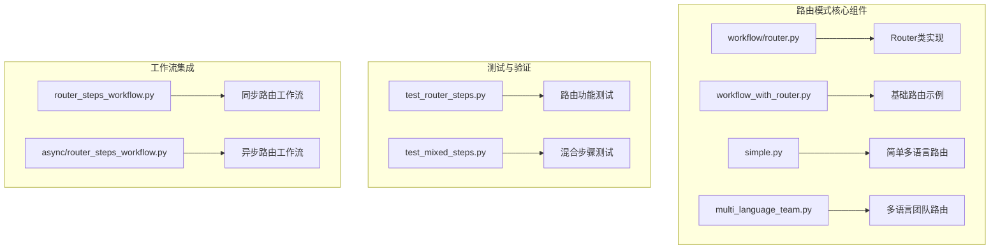
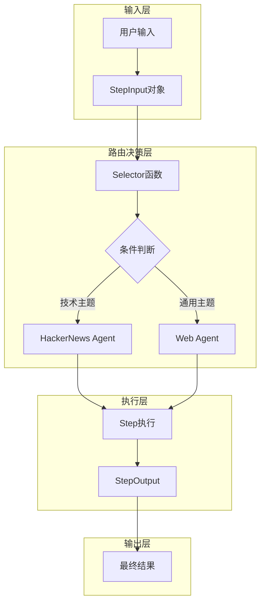
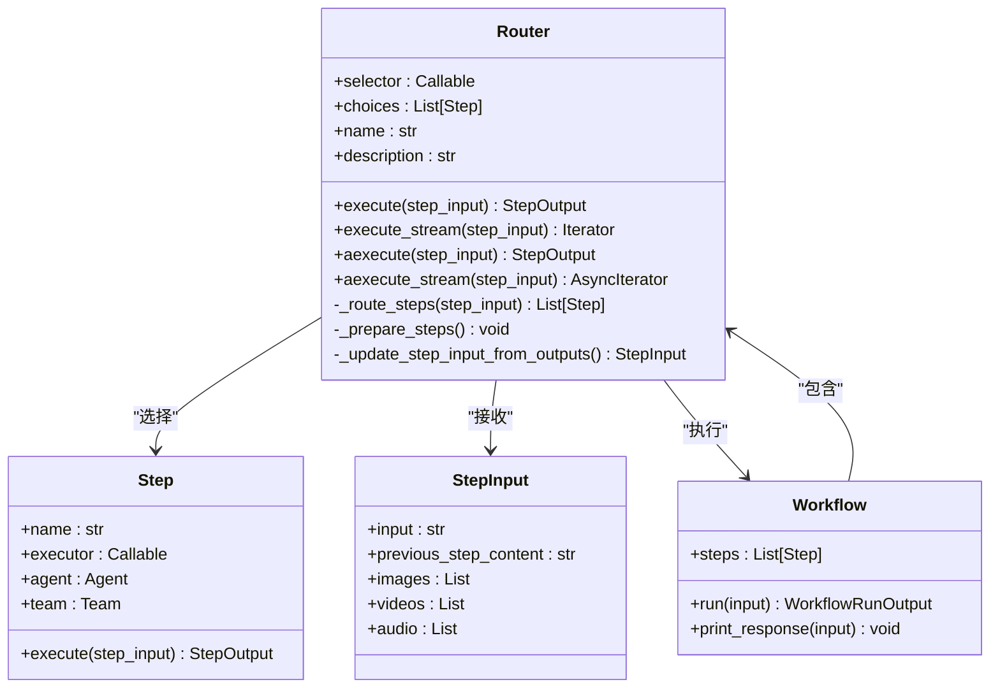
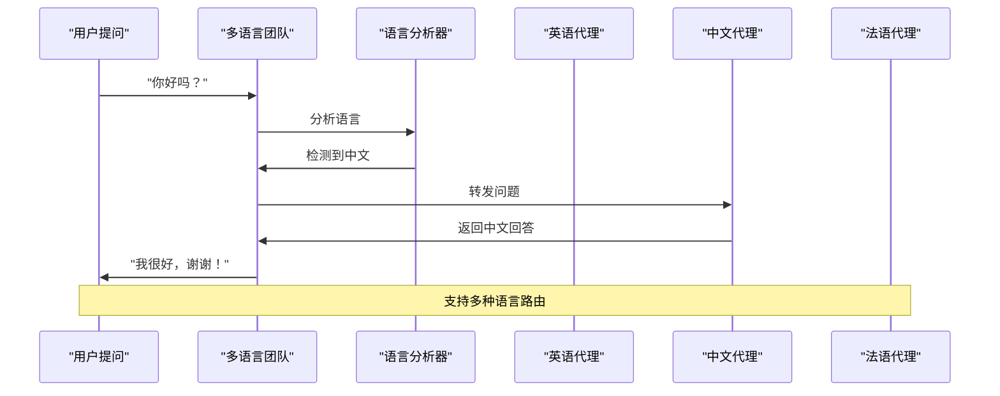
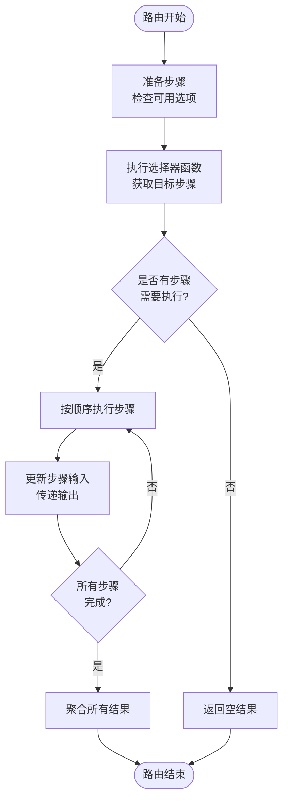
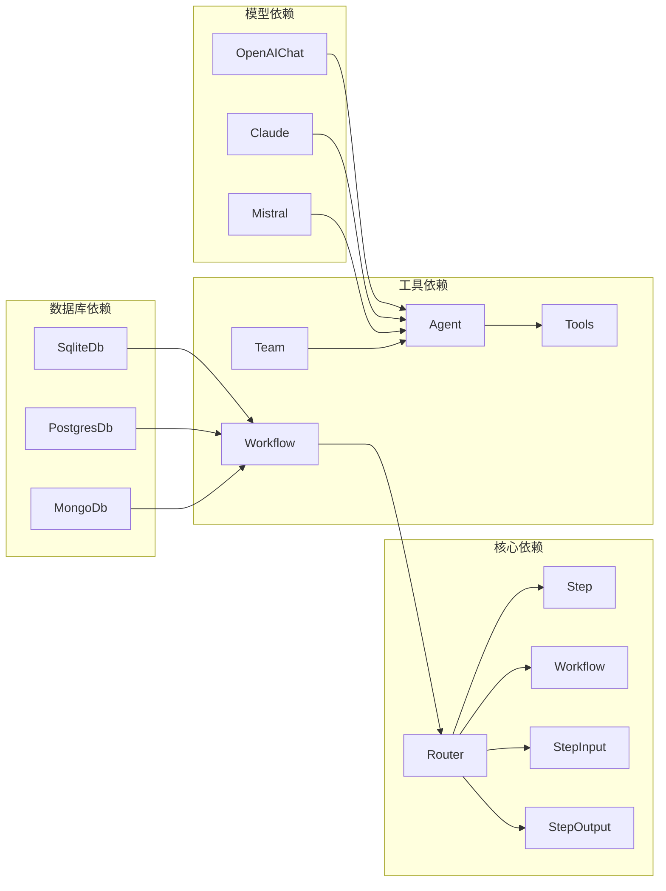

# Agno路由模式详细文档

<cite>
**本文档中引用的文件**
- [workflow_with_router.py](file://cookbook/agent_os/workflow/workflow_with_router.py)
- [router.py](file://libs/agno/agno/workflow/router.py)
- [test_router_steps.py](file://libs/agno/tests/integration/workflows/test_router_steps.py)
- [simple.py](file://cookbook/examples/teams/route_mode/simple.py)
- [multi_language_team.py](file://cookbook/examples/teams/route_mode/multi_language_team.py)
- [router_steps_workflow.py](file://cookbook/workflows/_05_workflows_conditional_branching/sync/router_steps_workflow.py)
- [README.md](file://cookbook/README.md)
</cite>

## 目录
1. [简介](#简介)
2. [项目结构概览](#项目结构概览)
3. [核心组件分析](#核心组件分析)
4. [架构概览](#架构概览)
5. [详细组件分析](#详细组件分析)
6. [依赖关系分析](#依赖关系分析)
7. [性能考虑](#性能考虑)
8. [故障排除指南](#故障排除指南)
9. [结论](#结论)

## 简介

Agno路由模式是一种强大的工作流管理机制，它根据预定义规则或动态决策将任务路由到最合适的团队成员。这种模式通过智能选择机制实现了任务分发的灵活性和效率，能够显著简化系统架构并提高响应速度。

路由模式的核心思想是：不是让所有任务都经过同一个处理流程，而是根据输入内容、上下文信息或其他条件，自动选择最适合的处理路径或团队成员。这种设计模式特别适用于需要根据不同场景选择不同处理策略的应用场景。

## 项目结构概览

Agno框架中的路由模式主要分布在以下几个关键目录中：



**图表来源**
- [workflow/router.py](file://libs/agno/agno/workflow/router.py#L1-L50)
- [workflow_with_router.py](file://cookbook/agent_os/workflow/workflow_with_router.py#L1-L30)

**章节来源**
- [README.md](file://cookbook/README.md#L1-L50)

## 核心组件分析

### Router类核心功能

Router类是Agno路由模式的核心实现，它提供了动态选择执行步骤的能力：

```python
@dataclass
class Router:
    """基于输入动态选择要执行的步骤的路由器"""
    
    # 返回要执行的步骤的路由器函数
    selector: Union[
        Callable[[StepInput], Union[WorkflowSteps, List[WorkflowSteps]]],
        Callable[[StepInput], Awaitable[Union[WorkflowSteps, List[WorkflowSteps]]]],
    ]
    choices: WorkflowSteps  # 可供选择的步骤
    
    name: Optional[str] = None
    description: Optional[str] = None
```

### 路由器选择器函数

路由器的核心是选择器函数，它决定了如何根据输入内容选择合适的步骤：

```python
def research_router(step_input: StepInput) -> List[Step]:
    """
    基于输入主题决定使用哪种研究方法。
    返回要执行的步骤列表。
    """
    topic = step_input.previous_step_content or step_input.input or ""
    topic = topic.lower()
    
    # 检查是否为技术/创业相关主题 - 使用HackerNews
    tech_keywords = [
        "startup", "programming", "ai", "machine learning",
        "software", "developer", "coding", "tech"
    ]
    
    if any(keyword in topic for keyword in tech_keywords):
        return [research_hackernews]  # 技术主题使用HackerNews研究
    else:
        return [research_web]  # 通用主题使用网络研究
```

**章节来源**
- [router.py](file://libs/agno/agno/workflow/router.py#L30-L60)
- [workflow_with_router.py](file://cookbook/agent_os/workflow/workflow_with_router.py#L50-L80)

## 架构概览

Agno路由模式采用分层架构设计，确保了系统的可扩展性和灵活性：



**图表来源**
- [workflow_with_router.py](file://cookbook/agent_os/workflow/workflow_with_router.py#L50-L90)
- [router.py](file://libs/agno/agno/workflow/router.py#L130-L170)

## 详细组件分析

### 工作流中的路由模式

在工作流中，Router组件可以作为工作流的一个步骤，根据输入内容动态选择后续步骤：



**图表来源**
- [router.py](file://libs/agno/agno/workflow/router.py#L30-L80)
- [workflow_with_router.py](file://cookbook/agent_os/workflow/workflow_with_router.py#L20-L50)

### 多语言路由团队示例

多语言路由团队展示了如何在团队级别实现路由功能：



**图表来源**
- [multi_language_team.py](file://cookbook/examples/teams/route_mode/multi_language_team.py#L30-L60)
- [simple.py](file://cookbook/examples/teams/route_mode/simple.py#L20-L50)

### 路由执行流程

路由组件的执行过程包括准备步骤、路由选择和顺序执行：



**图表来源**
- [router.py](file://libs/agno/agno/workflow/router.py#L140-L200)
- [test_router_steps.py](file://libs/agno/tests/integration/workflows/test_router_steps.py#L150-L200)

**章节来源**
- [router.py](file://libs/agno/agno/workflow/router.py#L140-L250)
- [workflow_with_router.py](file://cookbook/agent_os/workflow/workflow_with_router.py#L80-L115)

## 依赖关系分析

路由模式的依赖关系展现了其与其他Agno组件的紧密集成：



**图表来源**
- [router.py](file://libs/agno/agno/workflow/router.py#L1-L20)
- [workflow_with_router.py](file://cookbook/agent_os/workflow/workflow_with_router.py#L1-L15)

**章节来源**
- [router.py](file://libs/agno/agno/workflow/router.py#L1-L30)
- [workflow_with_router.py](file://cookbook/agent_os/workflow/workflow_with_router.py#L1-L20)

## 性能考虑

路由模式在设计时充分考虑了性能优化：

### 异步执行支持
- 支持同步和异步执行模式
- 提供流式执行能力
- 支持并发步骤执行

### 内存管理
- 避免不必要的数据复制
- 合理的缓存策略
- 及时释放临时资源

### 错误处理
- 完善的异常捕获机制
- 优雅的失败恢复
- 详细的错误日志记录

## 故障排除指南

### 常见问题及解决方案

1. **路由选择器返回类型错误**
   ```python
   # 错误：返回非Step或List类型
   def bad_selector(step_input: StepInput):
       return "invalid"  # 应该返回Step或List[Step]
   
   # 正确：返回正确的类型
   def good_selector(step_input: StepInput):
       return [Step(name="correct", executor=lambda x: StepOutput(content="OK"))]
   ```

2. **步骤准备失败**
   - 确保所有步骤都是有效的Step、Agent或Team实例
   - 检查步骤名称的唯一性
   - 验证步骤之间的依赖关系

3. **输入数据格式不匹配**
   - 确保StepInput对象包含必要的字段
   - 检查媒体文件（图片、视频、音频）的格式
   - 验证额外数据的结构

**章节来源**
- [test_router_steps.py](file://libs/agno/tests/integration/workflows/test_router_steps.py#L80-L120)
- [router.py](file://libs/agno/agno/workflow/router.py#L130-L150)

## 结论

Agno路由模式是一个功能强大且灵活的任务分发机制，它通过智能选择算法实现了高效的资源利用和任务处理。该模式的主要优势包括：

1. **智能化决策**：根据输入内容自动选择最优处理路径
2. **高度可扩展**：支持多种类型的步骤和执行器
3. **灵活配置**：通过选择器函数实现复杂的路由逻辑
4. **性能优化**：支持异步执行和流式处理
5. **易于维护**：清晰的代码结构和完善的测试覆盖

路由模式特别适用于需要根据不同场景选择不同处理策略的应用场景，如多语言支持、专业领域任务分配、复杂业务流程等。通过合理的设计和配置，可以显著提升系统的响应速度和用户体验。