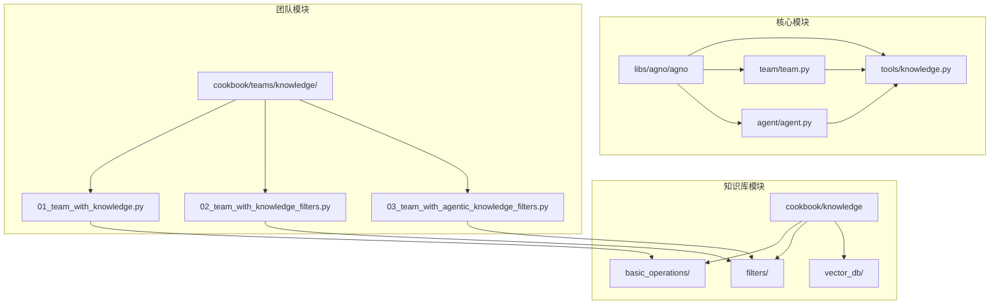
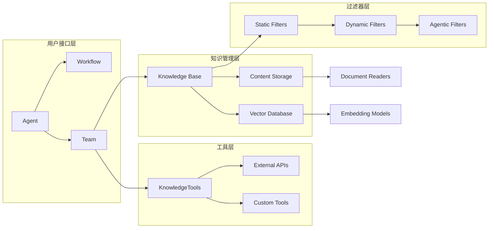
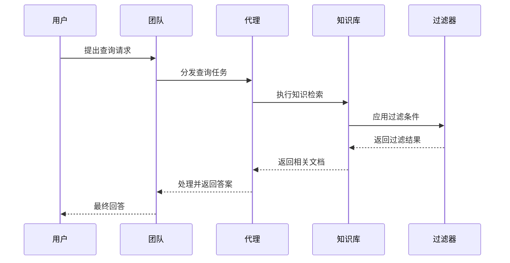
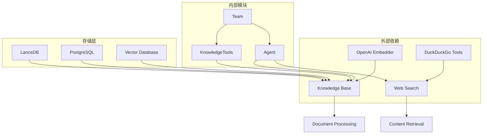

# 工具与知识

<cite>
**本文档中引用的文件**
- [team.py](file://libs/agno/agno/team/team.py)
- [knowledge.py](file://libs/agno/agno/tools/knowledge.py)
- [01_team_with_knowledge.py](file://cookbook/teams/knowledge/01_team_with_knowledge.py)
- [02_team_with_knowledge_filters.py](file://cookbook/teams/knowledge/02_team_with_knowledge_filters.py)
- [03_team_with_agentic_knowledge_filters.py](file://cookbook/teams/knowledge/03_team_with_agentic_knowledge_filters.py)
- [01_from_path.py](file://cookbook/knowledge/basic_operations/01_from_path.py)
- [agent.py](file://libs/agno/agno/agent/agent.py)
- [knowledge.py](file://libs/agno/agno/os/routers/knowledge/knowledge.py)
</cite>

## 目录
1. [简介](#简介)
2. [项目结构](#项目结构)
3. [核心组件](#核心组件)
4. [架构概览](#架构概览)
5. [详细组件分析](#详细组件分析)
6. [依赖关系分析](#依赖关系分析)
7. [性能考虑](#性能考虑)
8. [故障排除指南](#故障排除指南)
9. [结论](#结论)

## 简介

Agno 是一个强大的人工智能框架，专门设计用于构建智能代理和团队系统。该框架的核心优势在于其先进的工具与知识集成能力，使团队能够共享工具集和知识库，并为团队整体或单个成员配置定制化的工具。

本文档详细阐述了 Agno 团队如何实现工具共享、知识库集成，以及如何为团队整体或单个成员配置工具。通过实际代码示例展示了如何为团队添加自定义工具、如何集成外部 API 作为团队能力，以及如何利用知识库增强团队的问答能力。同时详细说明了工具调用的权限控制、知识检索的过滤机制，以及这些功能如何共同提升团队的智能水平。

## 项目结构

Agno 框架采用模块化设计，将工具与知识集成功能分布在多个目录中：



**图表来源**
- [team.py](file://libs/agno/agno/team/team.py#L1-L50)
- [knowledge.py](file://libs/agno/agno/tools/knowledge.py#L1-L30)

**章节来源**
- [team.py](file://libs/agno/agno/team/team.py#L6600-L6850)
- [knowledge.py](file://libs/agno/agno/tools/knowledge.py#L1-L219)

## 核心组件

### 知识库工具类 (KnowledgeTools)

KnowledgeTools 类是 Agno 框架中负责知识检索的核心工具类，提供了思考、搜索和分析三大功能：

```python
class KnowledgeTools(Toolkit):
    def __init__(
        self,
        knowledge: Knowledge,
        enable_think: bool = True,
        enable_search: bool = True,
        enable_analyze: bool = True,
        instructions: Optional[str] = None,
        **kwargs,
    ):
        # 初始化知识工具
        self.knowledge: Knowledge = knowledge
        
        # 添加思考、搜索、分析工具
        tools: List[Any] = []
        if enable_think:
            tools.append(self.think)
        if enable_search:
            tools.append(self.search)
        if enable_analyze:
            tools.append(self.analyze)
```

### 团队知识集成

团队级别的知识集成通过 Team 类实现，支持以下特性：

- **共享知识库访问**：所有团队成员可以访问相同的知识库
- **过滤器支持**：支持基于元数据的知识过滤
- **异步处理**：支持异步知识检索操作
- **参考追踪**：自动追踪知识来源和检索时间

**章节来源**
- [knowledge.py](file://libs/agno/agno/tools/knowledge.py#L10-L50)
- [team.py](file://libs/agno/agno/team/team.py#L6600-L6700)

## 架构概览

Agno 的工具与知识集成架构采用分层设计，确保了系统的可扩展性和灵活性：



**图表来源**
- [team.py](file://libs/agno/agno/team/team.py#L6600-L6750)
- [knowledge.py](file://libs/agno/agno/tools/knowledge.py#L10-L50)

## 详细组件分析

### 团队知识集成组件

#### 基础团队知识集成

基础团队知识集成允许团队成员共享同一个知识库，实现知识的统一管理和检索：

```python
# 创建知识库实例
agno_docs_knowledge = Knowledge(
    vector_db=LanceDb(
        uri=str(tmp_dir.joinpath("lancedb")),
        table_name="agno_docs",
        search_type=SearchType.hybrid,
        embedder=OpenAIEmbedder(id="text-embedding-3-small"),
    ),
)

# 添加内容到知识库
agno_docs_knowledge.add_content(url="https://docs.agno.com/llms-full.txt")

# 创建团队并集成知识库
team_with_knowledge = Team(
    name="Team with Knowledge",
    members=[web_agent],
    model=OpenAIChat(id="o3-mini"),
    knowledge=agno_docs_knowledge,
    show_members_responses=True,
    markdown=True,
)
```

#### 知识过滤器集成

知识过滤器允许根据元数据限制知识搜索范围，实现个性化和上下文化的响应：



**图表来源**
- [02_team_with_knowledge_filters.py](file://cookbook/teams/knowledge/02_team_with_knowledge_filters.py#L40-L80)
- [team.py](file://libs/agno/agno/team/team.py#L6650-L6700)

#### 智能知识过滤器

智能知识过滤器允许 AI 动态确定要搜索的文档，而不是使用预定义的过滤器：

```python
# 创建支持智能过滤的团队
team_with_knowledge = Team(
    name="Team with Knowledge",
    members=[web_agent],
    model=OpenAIChat(id="o3-mini"),
    knowledge=knowledge,
    show_members_responses=True,
    markdown=True,
    enable_agentic_knowledge_filters=True,  # 启用智能过滤
)
```

**章节来源**
- [01_team_with_knowledge.py](file://cookbook/teams/knowledge/01_team_with_knowledge.py#L1-L57)
- [02_team_with_knowledge_filters.py](file://cookbook/teams/knowledge/02_team_with_knowledge_filters.py#L1-L110)
- [03_team_with_agentic_knowledge_filters.py](file://cookbook/teams/knowledge/03_team_with_agentic_knowledge_filters.py#L1-L107)

### 知识库工具组件

#### 思考工具 (Think Tool)

思考工具作为内部思维记录板，帮助代理规划、头脑风暴关键词和细化方法：

```python
def think(self, session_state: Dict[str, Any], thought: str) -> str:
    """使用此工具作为草稿板来推理问题、完善方法、头脑风暴搜索词或修订计划。
    
    Args:
        thought: 您的思考过程和推理
        
    Returns:
        str: 完整的推理日志和新思考
    """
    # 记录思考到代理状态
    if session_state is None:
        session_state = {}
    if "thoughts" not in session_state:
        session_state["thoughts"] = []
    session_state["thoughts"].append(thought)
    
    # 返回完整的思考日志
    thoughts = "\n".join([f"- {t}" for t in session_state["thoughts"]])
    return f"Thoughts:\n{thoughts}"
```

#### 搜索工具 (Search Tool)

搜索工具执行针对知识库的查询，支持多次调用以获取相关信息：

```python
def search(self, session_state: Dict[str, Any], query: str) -> str:
    """使用此工具搜索知识库以获取相关信息。
    
    Args:
        query: 要在知识库中搜索的查询
        
    Returns:
        str: 包含知识库响应的字符串
    """
    # 从知识库获取相关文档
    relevant_docs: List[Document] = self.knowledge.search(query=query)
    if len(relevant_docs) == 0:
        return "No documents found"
    return json.dumps([doc.to_dict() for doc in relevant_docs])
```

#### 分析工具 (Analyze Tool)

分析工具评估返回的文档是否正确和充分，如果不充分则返回思考或搜索阶段进行细化：

```python
def analyze(self, session_state: Dict[str, Any], analysis: str) -> str:
    """使用此工具评估返回的文档是否正确和充分。
    
    Args:
        analysis: 要思考和记录的想法
        
    Returns:
        str: 完整的思考日志和新想法
    """
    # 记录分析到代理状态
    if session_state is None:
        session_state = {}
    if "analysis" not in session_state:
        session_state["analysis"] = []
    session_state["analysis"].append(analysis)
    
    # 返回完整的分析日志
    analysis_log = "\n".join([f"- {a}" for a in session_state["analysis"]])
    return f"Analysis:\n{analysis_log}"
```

**章节来源**
- [knowledge.py](file://libs/agno/agno/tools/knowledge.py#L50-L200)

### 知识库基础操作

#### 文件路径知识库

从本地文件添加内容到知识库的基础操作：

```python
# 创建知识库实例
knowledge = Knowledge(
    name="Basic SDK Knowledge Base",
    description="Agno 2.0 Knowledge Implementation",
    vector_db=vector_db,
    contents_db=contents_db,
)

# 异步添加内容
await knowledge.add_content_async(
    name="CV",
    path="cookbook/knowledge/testing_resources/cv_1.pdf",
    metadata={"user_tag": "Engineering Candidates"},
)

# 创建带有知识库的代理
agent = Agent(
    name="My Agent",
    description="Agno 2.0 Agent Implementation",
    knowledge=knowledge,
    search_knowledge=True,
    debug_mode=True,
)
```

#### URL 内容集成

从 URL 添加内容到知识库：

```python
# 添加网页内容到知识库
knowledge.add_content(url="https://docs.agno.com/llms-full.txt")
```

#### 主题内容集成

基于主题添加内容到知识库：

```python
# 添加特定主题的内容
knowledge.add_content(topic="Artificial Intelligence")
```

**章节来源**
- [01_from_path.py](file://cookbook/knowledge/basic_operations/01_from_path.py#L1-L48)

## 依赖关系分析

Agno 的工具与知识集成系统具有清晰的依赖关系结构：



**图表来源**
- [team.py](file://libs/agno/agno/team/team.py#L6600-L6650)
- [knowledge.py](file://libs/agno/agno/tools/knowledge.py#L1-L30)

**章节来源**
- [team.py](file://libs/agno/agno/team/team.py#L6600-L6850)
- [knowledge.py](file://libs/agno/agno/tools/knowledge.py#L1-L219)

## 性能考虑

### 异步处理优化

Agno 支持异步知识检索操作，显著提升性能：

```python
# 异步知识检索函数
async def asearch_knowledge_base(query: str, filters: Optional[List[KnowledgeFilter]] = None) -> str:
    """使用此函数异步搜索知识库以获取有关查询的信息。
    
    Args:
        query: 要搜索的查询
        filters (可选): 要应用到搜索的过滤器
        
    Returns:
        str: 包含知识库响应的字符串
    """
    # 获取相关文档，传递过滤器
    retrieval_timer = Timer()
    retrieval_timer.start()
    docs_from_knowledge = await self.aget_relevant_docs_from_knowledge(query=query, filters=search_filters)
    
    # 记录检索时间和参考
    if docs_from_knowledge is not None:
        references = MessageReferences(
            query=query, references=docs_from_knowledge, time=round(retrieval_timer.elapsed, 4)
        )
        if run_response.references is None:
            run_response.references = []
        run_response.references.append(references)
    
    retrieval_timer.stop()
    return self._convert_documents_to_string(docs_from_knowledge)
```

### 缓存和索引优化

- **向量数据库缓存**：支持多种向量数据库（LanceDB、ChromaDB、PgVector 等）
- **嵌入模型优化**：支持多种嵌入模型提供商
- **批量处理**：支持批量添加和检索文档

### 过滤器性能优化

- **静态过滤器**：在查询时直接应用固定过滤条件
- **动态过滤器**：运行时计算过滤条件
- **智能过滤器**：AI 自动确定最佳过滤策略

## 故障排除指南

### 常见问题及解决方案

#### 知识库初始化失败

**问题**：知识库无法正确初始化
**解决方案**：
1. 检查向量数据库连接
2. 验证嵌入模型配置
3. 确认文件路径和权限

#### 过滤器不生效

**问题**：知识过滤器没有按预期工作
**解决方案**：
1. 检查元数据格式
2. 验证过滤器语法
3. 确认知识库索引更新

#### 性能问题

**问题**：知识检索速度过慢
**解决方案**：
1. 使用异步操作
2. 优化向量数据库配置
3. 实施适当的缓存策略

**章节来源**
- [team.py](file://libs/agno/agno/team/team.py#L6600-L6700)
- [agent.py](file://libs/agno/agno/agent/agent.py#L4790-L4815)

## 结论

Agno 的工具与知识集成系统提供了一个强大而灵活的平台，用于构建智能代理和团队系统。通过共享工具集和知识库，团队能够实现高效的协作和知识管理。主要优势包括：

1. **统一的知识管理**：所有团队成员共享相同的知识库
2. **灵活的过滤机制**：支持静态、动态和智能过滤
3. **高性能检索**：异步处理和多种向量数据库支持
4. **易于扩展**：支持自定义工具和外部 API 集成
5. **智能决策**：AI 可以自动确定最佳的过滤策略

这些功能共同提升了团队的智能水平，使它们能够更有效地处理复杂任务和知识密集型问题。随着技术的不断发展，Agno 的工具与知识集成系统将继续演进，为用户提供更加强大和易用的功能。