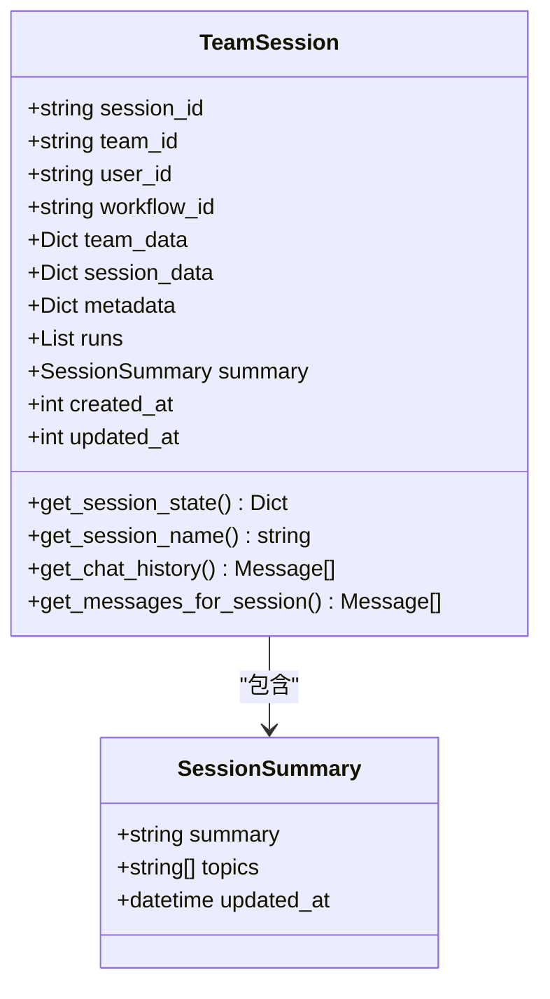
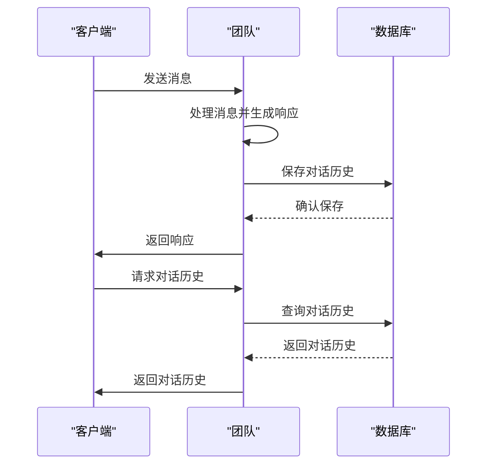
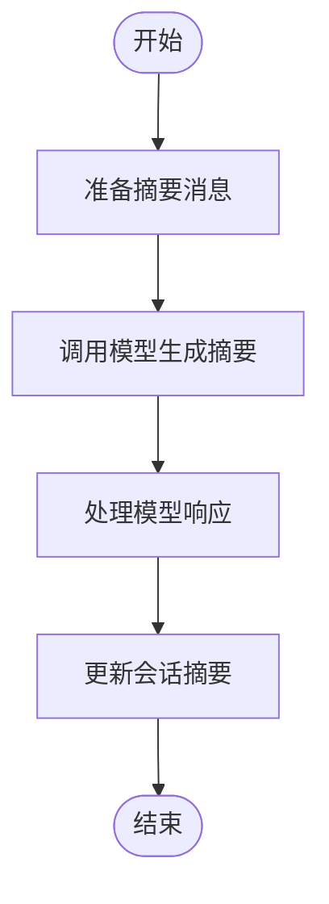
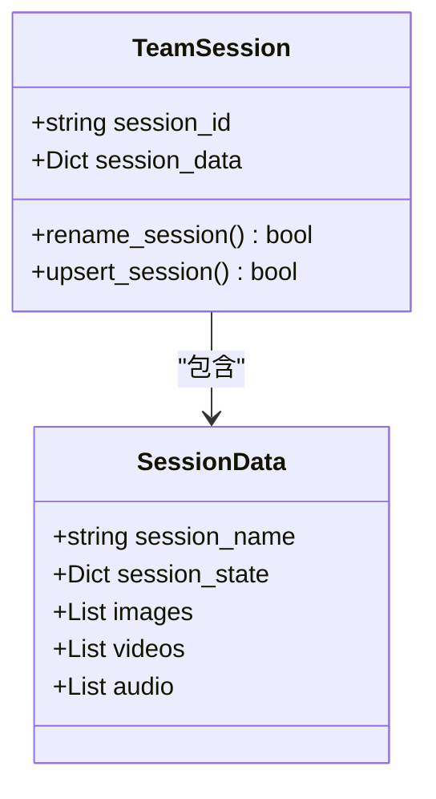
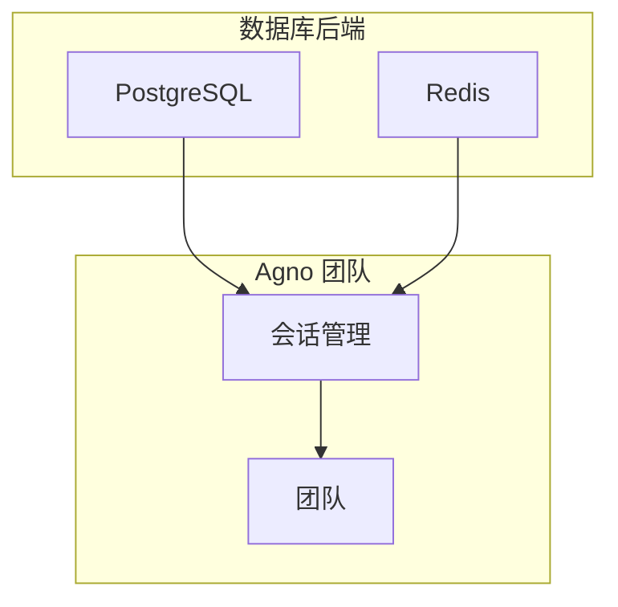

# 状态管理

<cite>
**本文档中引用的文件**  
- [01_persistent_session.py](file://cookbook/teams/session/01_persistent_session.py)
- [03_session_summary.py](file://cookbook/teams/session/03_session_summary.py)
- [05_chat_history.py](file://cookbook/teams/session/05_chat_history.py)
- [team.py](file://libs/agno/agno/team/team.py)
- [team.py](file://libs/agno/agno/session/team.py)
- [summary.py](file://libs/agno/agno/session/summary.py)
- [postgres.py](file://libs/agno/agno/db/postgres/postgres.py)
- [redis.py](file://libs/agno/agno/db/redis/redis.py)
- [base.py](file://libs/agno/agno/db/base.py)
</cite>

## 目录
1. [简介](#简介)
2. [会话状态管理](#会话状态管理)
3. [持久化对话历史](#持久化对话历史)
4. [会话摘要生成](#会话摘要生成)
5. [动态修改状态](#动态修改状态)
6. [数据库后端配置](#数据库后端配置)
7. [长期对话支持](#长期对话支持)
8. [团队上下文共享](#团队上下文共享)

## 简介
Agno 团队的状态管理系统提供了一套完整的解决方案，用于管理会话状态、持久化对话历史以及在团队成员间共享上下文。该系统支持多种数据库后端，包括 PostgreSQL 和 Redis，并提供了会话摘要生成、状态动态修改等高级功能。通过这套系统，团队能够支持长期对话和复杂任务的连续性，确保在多轮交互中保持上下文的一致性和完整性。

## 会话状态管理
Agno 团队的会话状态管理基于 `TeamSession` 类实现，该类定义了会话的核心数据结构。会话状态包括会话 ID、团队 ID、用户 ID、工作流 ID、团队数据、会话数据、元数据、运行记录、摘要以及创建和更新时间戳。会话数据中可以存储会话名称、会话状态、图片、视频、音频等信息。

会话状态的获取通过 `get_session_state` 方法实现，该方法从会话数据中提取 `session_state` 字段。如果会话数据为空，则返回空字典。会话状态的更新通过 `upsert_session` 方法实现，该方法将更新后的会话数据写入数据库。

**Diagram sources**
- [team.py](file://libs/agno/agno/session/team.py#L1-L266)

**Section sources**
- [team.py](file://libs/agno/agno/team/team.py#L6185-L6210)
- [team.py](file://libs/agno/agno/session/team.py#L1-L266)

## 持久化对话历史
Agno 团队通过数据库持久化存储对话历史，确保在会话中断后能够恢复上下文。对话历史的管理主要通过 `get_chat_history` 方法实现，该方法从会话的运行记录中提取所有消息，并过滤掉标记为历史的消息。

在示例代码中，通过配置 `PostgresDb` 实现了对话历史的持久化存储。团队在每次交互后，会将对话历史保存到 PostgreSQL 数据库中。当需要恢复会话时，可以通过 `get_chat_history` 方法获取完整的对话历史。

**Diagram sources**
- [05_chat_history.py](file://cookbook/teams/session/05_chat_history.py#L1-L25)
- [team.py](file://libs/agno/agno/session/team.py#L230-L265)

**Section sources**
- [05_chat_history.py](file://cookbook/teams/session/05_chat_history.py#L1-L25)
- [team.py](file://libs/agno/agno/session/team.py#L230-L265)

## 会话摘要生成
Agno 团队提供了自动会话摘要生成功能，通过 `SessionSummaryManager` 类实现。该类使用指定的模型（如 OpenAIChat）分析对话内容，生成简洁的会话摘要和讨论主题。

会话摘要的生成可以通过两种方式配置：一是设置 `enable_session_summaries=True`，二是显式创建 `SessionSummaryManager` 实例并传递给团队。摘要生成过程包括准备摘要消息、调用模型生成响应、处理响应并更新会话摘要。

**Diagram sources**
- [03_session_summary.py](file://cookbook/teams/session/03_session_summary.py#L1-L47)
- [summary.py](file://libs/agno/agno/session/summary.py#L1-L225)

**Section sources**
- [03_session_summary.py](file://cookbook/teams/session/03_session_summary.py#L1-L47)
- [summary.py](file://libs/agno/agno/session/summary.py#L1-L225)

## 动态修改状态
Agno 团队支持在运行过程中动态修改会话状态。通过 `rename_session` 方法可以修改会话名称，该方法会更新会话数据中的 `session_name` 字段，并将更改保存到数据库。

会话状态的动态修改不仅限于名称，还可以通过更新 `session_data` 中的其他字段来实现。例如，可以在会话数据中存储任务进度、用户偏好等信息，并在需要时进行更新。

**Diagram sources**
- [06_rename_session.py](file://cookbook/teams/session/06_rename_session.py)
- [postgres.py](file://libs/agno/agno/db/postgres/postgres.py#L1-L1720)
- [redis.py](file://libs/agno/agno/db/redis/redis.py#L1-L1374)

**Section sources**
- [06_rename_session.py](file://cookbook/teams/session/06_rename_session.py)
- [postgres.py](file://libs/agno/agno/db/postgres/postgres.py#L1-L1720)
- [redis.py](file://libs/agno/agno/db/redis/redis.py#L1-L1374)

## 数据库后端配置
Agno 团队支持多种数据库后端，包括 PostgreSQL 和 Redis。通过配置不同的数据库实例，可以轻松切换持久化存储方案。

对于 PostgreSQL，使用 `PostgresDb` 类进行配置，需要提供数据库 URL 和会话表名。对于 Redis，使用 `RedisDb` 类进行配置，需要提供 Redis 客户端或数据库 URL。两种数据库后端都实现了统一的接口，确保在不同存储方案之间的无缝切换。

**Diagram sources**
- [01_persistent_session.py](file://cookbook/teams/session/01_persistent_session.py#L1-L19)
- [postgres.py](file://libs/agno/agno/db/postgres/postgres.py#L1-L1720)
- [redis.py](file://libs/agno/agno/db/redis/redis.py#L1-L1374)
- [base.py](file://libs/agno/agno/db/base.py#L1-L246)

**Section sources**
- [01_persistent_session.py](file://cookbook/teams/session/01_persistent_session.py#L1-L19)
- [postgres.py](file://libs/agno/agno/db/postgres/postgres.py#L1-L1720)
- [redis.py](file://libs/agno/agno/db/redis/redis.py#L1-L1374)
- [base.py](file://libs/agno/agno/db/base.py#L1-L246)

## 长期对话支持
Agno 团队的状态管理系统通过持久化存储和会话摘要生成，为长期对话提供了强有力的支持。系统能够保存完整的对话历史，并在需要时恢复上下文。会话摘要功能使得团队能够在长时间中断后快速了解之前的讨论内容，从而保持对话的连贯性。

此外，系统还支持会话的重命名和状态更新，使得在长期对话中能够灵活调整会话的元数据和状态信息。这些功能共同确保了复杂任务的连续性，使得团队能够处理需要多轮交互的复杂场景。

**Section sources**
- [03_session_summary.py](file://cookbook/teams/session/03_session_summary.py#L1-L47)
- [05_chat_history.py](file://cookbook/teams/session/05_chat_history.py#L1-L25)

## 团队上下文共享
Agno 团队通过共享会话状态和对话历史，实现了成员间的上下文共享。所有团队成员都可以访问相同的会话数据，包括会话状态、对话历史和会话摘要。这种共享机制确保了团队成员在处理用户请求时具有相同的上下文信息，从而提高了协作效率和响应质量。

上下文共享不仅限于当前会话，还可以通过查询历史会话来获取更广泛的上下文信息。这种能力使得团队能够基于用户的历史交互提供更加个性化和连贯的服务。

**Section sources**
- [team.py](file://libs/agno/agno/team/team.py#L6156-L6210)
- [team.py](file://libs/agno/agno/session/team.py#L1-L266)