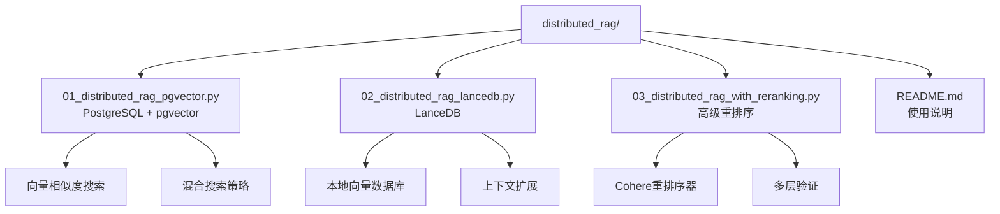
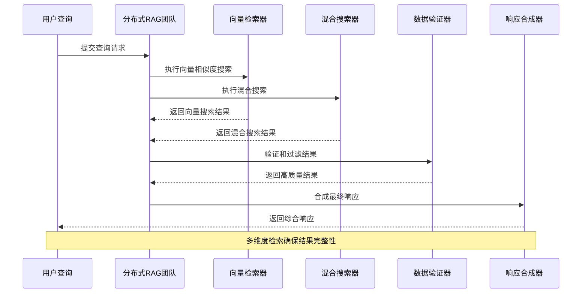
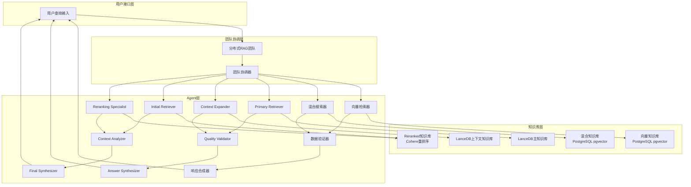
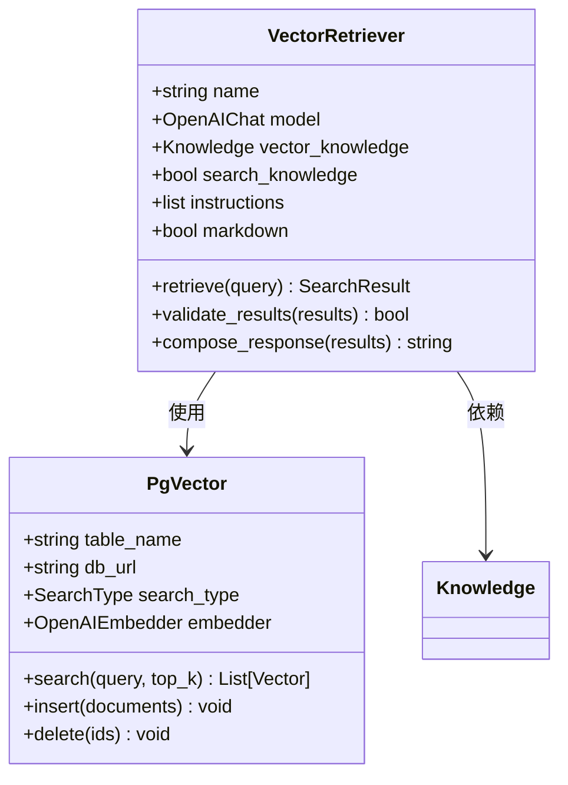
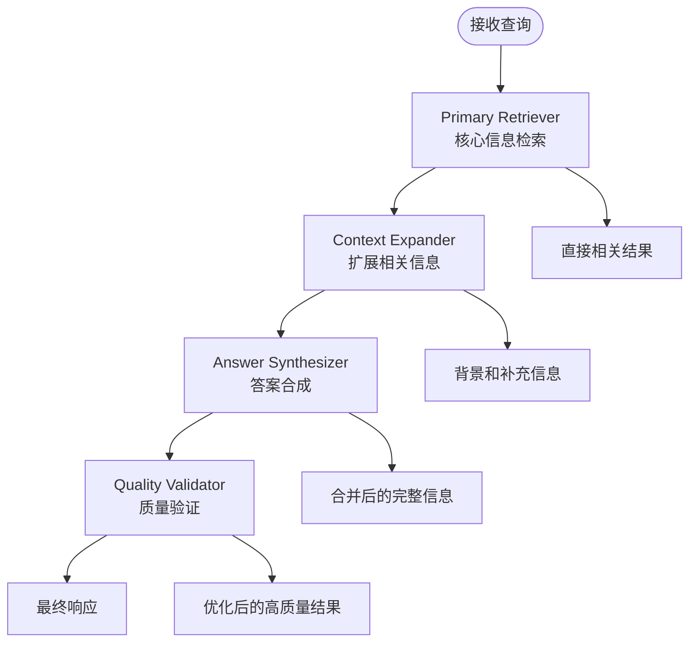
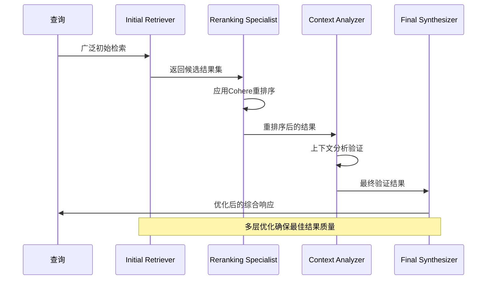

# 分布式RAG系统架构与实现指南

<cite>
**本文档引用的文件**
- [README.md](file://cookbook/teams/distributed_rag/README.md)
- [01_distributed_rag_pgvector.py](file://cookbook/teams/distributed_rag/01_distributed_rag_pgvector.py)
- [02_distributed_rag_lancedb.py](file://cookbook/teams/distributed_rag/02_distributed_rag_lancedb.py)
- [03_distributed_rag_with_reranking.py](file://cookbook/teams/distributed_rag/03_distributed_rag_with_reranking.py)
</cite>

## 目录
1. [简介](#简介)
2. [项目结构](#项目结构)
3. [核心组件](#核心组件)
4. [架构概览](#架构概览)
5. [详细组件分析](#详细组件分析)
6. [实现过程](#实现过程)
7. [性能优化](#性能优化)
8. [故障排除](#故障排除)
9. [结论](#结论)

## 简介

分布式检索增强生成（Distributed RAG）是一种先进的知识检索技术，通过将知识检索任务分布到团队的不同成员上，每个成员可以访问不同的知识库或数据库。这种架构设计能够显著提高检索效率和处理大规模知识库的能力，特别适用于企业级应用场景。

分布式RAG的核心优势在于：
- **可扩展性**：支持大规模知识库的高效检索
- **专业化分工**：不同团队成员专注于特定的检索策略
- **结果质量提升**：通过多维度检索和验证机制提高准确性
- **容错能力**：单个组件的故障不会影响整体系统运行

## 项目结构

分布式RAG示例位于`cookbook/teams/distributed_rag/`目录下，包含三个主要示例文件：



**图表来源**
- [README.md](file://cookbook/teams/distributed_rag/README.md#L1-L35)
- [01_distributed_rag_pgvector.py](file://cookbook/teams/distributed_rag/01_distributed_rag_pgvector.py#L1-L50)
- [02_distributed_rag_lancedb.py](file://cookbook/teams/distributed_rag/02_distributed_rag_lancedb.py#L1-L50)
- [03_distributed_rag_with_reranking.py](file://cookbook/teams/distributed_rag_with_reranking.py#L1-L50)

**章节来源**
- [README.md](file://cookbook/teams/distributed_rag/README.md#L1-L35)

## 核心组件

分布式RAG系统由多个专业化的Agent组成，每个Agent负责特定的知识检索和处理任务：

### 主要Agent类型

1. **向量检索器（Vector Retriever）**
   - 专门执行向量相似度搜索
   - 利用pgvector的高效相似度搜索能力
   - 专注于语义相关内容的发现

2. **混合搜索器（Hybrid Searcher）**
   - 结合向量和文本搜索
   - 提供更全面的结果覆盖
   - 利用PostgreSQL的混合搜索功能

3. **数据验证器（Data Validator）**
   - 验证检索数据的质量和相关性
   - 检查不同搜索结果之间的一致性
   - 过滤无关或低质量内容

4. **响应合成器（Response Composer）**
   - 组合验证后的信息
   - 创建结构化、全面的响应
   - 包含适当的源引用和数据溯源

**章节来源**
- [01_distributed_rag_pgvector.py](file://cookbook/teams/distributed_rag/01_distributed_rag_pgvector.py#L50-L100)
- [02_distributed_rag_lancedb.py](file://cookbook/teams/distributed_rag/02_distributed_rag_lancedb.py#L50-L100)
- [03_distributed_rag_with_reranking.py](file://cookbook/teams/distributed_rag_with_reranking.py#L50-L100)

## 架构概览

分布式RAG采用团队协作模式，通过多个专业化的Agent协同工作来提供全面的RAG响应：



**图表来源**
- [01_distributed_rag_pgvector.py](file://cookbook/teams/distributed_rag/01_distributed_rag_pgvector.py#L111-L127)
- [02_distributed_rag_lancedb.py](file://cookbook/teams/distributed_rag/02_distributed_rag_lancedb.py#L107-L120)
- [03_distributed_rag_with_reranking.py](file://cookbook/teams/distributed_rag_with_reranking.py#L111-L125)

### 系统架构图



**图表来源**
- [01_distributed_rag_pgvector.py](file://cookbook/teams/distributed_rag/01_distributed_rag_pgvector.py#L30-L50)
- [02_distributed_rag_lancedb.py](file://cookbook/teams/distributed_rag/02_distributed_rag_lancedb.py#L25-L45)
- [03_distributed_rag_with_reranking.py](file://cookbook/teams/distributed_rag_with_reranking.py#L25-L45)

## 详细组件分析

### PostgreSQL + pgvector 实现

PostgreSQL + pgvector实现展示了企业级的分布式RAG架构：

```python
# 数据库连接配置
db_url = "postgresql+psycopg://ai:ai@localhost:5532/ai"

# 向量知识库配置
vector_knowledge = Knowledge(
    vector_db=PgVector(
        table_name="recipes_vector",
        db_url=db_url,
        search_type=SearchType.vector,
        embedder=OpenAIEmbedder(id="text-embedding-3-small"),
    ),
)

# 混合知识库配置
hybrid_knowledge = Knowledge(
    vector_db=PgVector(
        table_name="recipes_hybrid",
        db_url=db_url,
        search_type=SearchType.hybrid,
        embedder=OpenAIEmbedder(id="text-embedding-3-small"),
    ),
)
```

#### 向量检索器Agent


**图表来源**
- [01_distributed_rag_pgvector.py](file://cookbook/teams/distributed_rag/01_distributed_rag_pgvector.py#L50-L70)

#### 混合搜索器Agent
混合搜索器结合了向量相似度搜索和文本搜索，提供更全面的结果：

```python
hybrid_searcher = Agent(
    name="Hybrid Searcher",
    model=OpenAIChat(id="o3-mini"),
    role="Perform hybrid search combining vector and text search",
    knowledge=hybrid_knowledge,
    search_knowledge=True,
    instructions=[
        "Combine vector similarity and text search for comprehensive results.",
        "Find information that matches both semantic and lexical criteria.",
        "Use PostgreSQL's hybrid search capabilities for best coverage.",
        "Ensure retrieval of both conceptually and textually relevant content.",
    ],
    markdown=True,
)
```

**章节来源**
- [01_distributed_rag_pgvector.py](file://cookbook/teams/distributed_rag/01_distributed_rag_pgvector.py#L50-L80)

### LanceDB 实现

LanceDB实现展示了轻量级分布式RAG架构：

```python
# 主要知识库配置
primary_knowledge = Knowledge(
    vector_db=LanceDb(
        table_name="recipes_primary",
        uri="tmp/lancedb",
        search_type=SearchType.vector,
        embedder=OpenAIEmbedder(id="text-embedding-3-small"),
    ),
)

# 上下文知识库配置
context_knowledge = Knowledge(
    vector_db=LanceDb(
        table_name="recipes_context",
        uri="tmp/lancedb",
        search_type=SearchType.hybrid,
        embedder=OpenAIEmbedder(id="text-embedding-3-small"),
    ),
)
```

#### 上下文扩展Agent


**图表来源**
- [02_distributed_rag_lancedb.py](file://cookbook/teams/distributed_rag/02_distributed_rag_lancedb.py#L107-L120)

**章节来源**
- [02_distributed_rag_lancedb.py](file://cookbook/teams/distributed_rag/02_distributed_rag_lancedb.py#L25-L80)

### 高级重排序实现

高级重排序实现引入了专业的重排序机制：

```python
# 重排序知识库配置
reranked_knowledge = Knowledge(
    vector_db=LanceDb(
        table_name="recipes_reranked",
        uri="tmp/lancedb",
        search_type=SearchType.hybrid,
        embedder=OpenAIEmbedder(id="text-embedding-3-small"),
        reranker=CohereReranker(model="rerank-v3.5"),
    ),
)
```

#### 重排序流程


**图表来源**
- [03_distributed_rag_with_reranking.py](file://cookbook/teams/distributed_rag_with_reranking.py#L111-L125)

**章节来源**
- [03_distributed_rag_with_reranking.py](file://cookbook/teams/distributed_rag_with_reranking.py#L25-L80)

## 实现过程

### 步骤1：环境准备

1. **安装依赖包**
```bash
pip install agno openai anthropic cohere lancedb pgvector "psycopg[binary]" sqlalchemy
```

2. **设置API密钥**
```bash
export OPENAI_API_KEY=xxx
export ANTHROPIC_API_KEY=xxx
export CO_API_KEY=xxx
```

3. **启动PostgreSQL数据库**
```bash
docker run -d \
  -e POSTGRES_DB=ai \
  -e POSTGRES_USER=ai \
  -e POSTGRES_PASSWORD=ai \
  -p 5532:5432 \
  --name pgvector \
  agnohq/pgvector:16
```

### 步骤2：知识库配置

每个Agent都有独立的知识库配置：

```python
# 向量知识库配置
vector_knowledge = Knowledge(
    vector_db=PgVector(
        table_name="recipes_vector",
        db_url=db_url,
        search_type=SearchType.vector,
        embedder=OpenAIEmbedder(id="text-embedding-3-small"),
    ),
)

# 添加内容到知识库
await vector_knowledge.add_contents_async(
    url="https://agno-public.s3.amazonaws.com/recipes/ThaiRecipes.pdf"
)
```

### 步骤3：团队创建和配置

```python
# 创建分布式RAG团队
distributed_pgvector_team = Team(
    name="Distributed PgVector RAG Team",
    model=OpenAIChat(id="o3-mini"),
    members=[vector_retriever, hybrid_searcher, data_validator, response_composer],
    instructions=[
        "Work together to provide comprehensive RAG responses using PostgreSQL pgvector.",
        "Vector Retriever: First perform vector similarity search.",
        "Hybrid Searcher: Then perform hybrid search for comprehensive coverage.",
        "Data Validator: Validate and filter the retrieved information quality.",
        "Response Composer: Compose the final response with proper attribution.",
    ],
    show_members_responses=True,
    markdown=True,
)
```

### 步骤4：执行查询

```python
# 异步执行
await distributed_pgvector_team.aprint_response(input=query)

# 同步执行
distributed_pgvector_team.print_response(input=query)
```

**章节来源**
- [README.md](file://cookbook/teams/distributed_rag/README.md#L1-L35)
- [01_distributed_rag_pgvector.py](file://cookbook/teams/distributed_rag/01_distributed_rag_pgvector.py#L130-L180)

## 性能优化

### 1. 向量数据库优化

**PostgreSQL + pgvector优化策略：**
- 使用合适的索引类型（hnsw）
- 调整向量维度和距离度量
- 配置适当的并发连接数
- 启用查询缓存机制

**LanceDB优化策略：**
- 选择合适的存储格式（Parquet vs JSON）
- 配置内存映射和缓存策略
- 优化文件I/O操作
- 使用并行处理加速

### 2. 搜索策略优化

```python
# 向量搜索参数优化
vector_search_params = {
    "top_k": 50,           # 增加候选数量
    "min_score": 0.7,      # 设置最低相似度阈值
    "filter": None,        # 使用适当的过滤条件
}

# 混合搜索优化
hybrid_search_params = {
    "vector_weight": 0.7,  # 向量搜索权重
    "text_weight": 0.3,    # 文本搜索权重
    "boost_keywords": True # 关键词加权
}
```

### 3. 团队协调优化

```python
# 并行处理配置
team_config = {
    "parallel_processing": True,
    "timeout": 30,
    "retry_attempts": 3,
    "circuit_breaker": True
}

# 结果聚合优化
result_aggregation = {
    "merge_threshold": 0.8,
    "deduplication": True,
    "confidence_scoring": True
}
```

### 4. 缓存策略

```python
# 查询结果缓存
cache_config = {
    "enabled": True,
    "ttl": 3600,           # 1小时过期时间
    "max_size": 1000,      # 最大缓存条目数
    "invalidate_on_update": True
}

# 向量嵌入缓存
embedding_cache = {
    "enabled": True,
    "compression": True,
    "storage_format": "faiss"
}
```

## 故障排除

### 常见问题及解决方案

#### 1. 数据库连接问题

**问题症状：**
```
Connection refused: Unable to connect to PostgreSQL
```

**解决方案：**
```bash
# 检查数据库服务状态
docker ps | grep pgvector

# 重新启动数据库容器
docker restart pgvector

# 检查网络连接
telnet localhost 5532
```

#### 2. 向量搜索失败

**问题症状：**
```
pgvector extension not found
```

**解决方案：**
```sql
-- 在PostgreSQL中启用pgvector扩展
CREATE EXTENSION IF NOT EXISTS vector;

-- 检查扩展版本
SELECT * FROM pg_extension WHERE extname = 'vector';
```

#### 3. 内存不足错误

**问题症状：**
```
Out of memory during vector search
```

**解决方案：**
```python
# 减少批量处理大小
search_params = {
    "batch_size": 100,     # 从默认值减少
    "chunk_size": 1000,    # 减少分块大小
    "memory_limit": "2GB"  # 设置内存限制
}

# 启用流式处理
knowledge.add_contents_async(url, stream=True)
```

#### 4. 性能问题诊断

```python
# 启用详细日志记录
import logging
logging.basicConfig(level=logging.DEBUG)

# 性能监控
import time
start_time = time.time()
results = await team.aprint_response(input=query)
end_time = time.time()
print(f"查询耗时: {end_time - start_time}秒")

# 内存使用监控
import psutil
memory_usage = psutil.virtual_memory().percent
print(f"内存使用率: {memory_usage}%")
```

#### 5. 重排序器配置问题

**问题症状：**
```
Cohere reranker API error
```

**解决方案：**
```python
# 检查API密钥
import os
co_api_key = os.getenv("CO_API_KEY")
if not co_api_key:
    raise ValueError("CO_API_KEY not set")

# 测试重排序器连接
try:
    from agno.knowledge.reranker import CohereReranker
    reranker = CohereReranker(model="rerank-v3.5")
    test_results = reranker.rerank(["test query"], ["test result"])
except Exception as e:
    print(f"重排序器测试失败: {e}")
```

### 调试工具

```python
# 团队状态检查
def check_team_status(team):
    print(f"团队名称: {team.name}")
    print(f"成员数量: {len(team.members)}")
    for member in team.members:
        print(f"  - {member.name}: {member.role}")

# 知识库状态检查
def check_knowledge_status(knowledge):
    print(f"知识库状态:")
    print(f"  - 向量数据库: {type(knowledge.vector_db).__name__}")
    print(f"  - 搜索类型: {knowledge.vector_db.search_type}")
    print(f"  - 嵌入器: {type(knowledge.vector_db.embedder).__name__}")
    print(f"  - 文档数量: {knowledge.count_documents()}")

# 性能指标收集
def collect_performance_metrics(team, query):
    import time
    import psutil
    
    start_time = time.time()
    start_memory = psutil.virtual_memory().used
    
    # 执行查询
    result = team.print_response(input=query)
    
    end_time = time.time()
    end_memory = psutil.virtual_memory().used
    
    metrics = {
        "execution_time": end_time - start_time,
        "memory_used": end_memory - start_memory,
        "response_length": len(result),
        "timestamp": time.time()
    }
    
    return metrics
```

**章节来源**
- [README.md](file://cookbook/teams/distributed_rag/README.md#L10-L25)
- [01_distributed_rag_pgvector.py](file://cookbook/teams/distributed_rag/01_distributed_rag_pgvector.py#L130-L150)

## 结论

分布式RAG系统通过团队协作模式实现了高效的知识检索和处理能力。其核心优势包括：

### 技术优势
1. **可扩展性**：支持大规模知识库的分布式处理
2. **专业化分工**：不同Agent专注于特定的检索策略
3. **结果质量**：通过多维度验证和重排序提高准确性
4. **容错能力**：单点故障不影响整体系统运行

### 应用场景
- **企业知识管理**：处理大规模企业文档和知识库
- **智能客服系统**：提供准确、全面的客户咨询回答
- **研究辅助系统**：支持复杂的研究查询和文献检索
- **个性化推荐**：基于用户历史和偏好提供定制化建议

### 发展方向
1. **多模态支持**：扩展到图像、音频等多模态数据
2. **实时更新**：支持知识库的实时增量更新
3. **跨域协作**：实现不同领域知识库的协同检索
4. **边缘计算**：支持分布式部署和边缘节点处理

分布式RAG系统为现代知识密集型应用提供了强大的技术基础，其灵活的架构设计和高效的处理能力使其成为未来智能系统的重要组成部分。