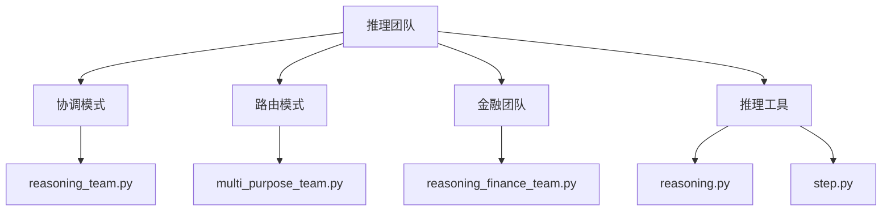
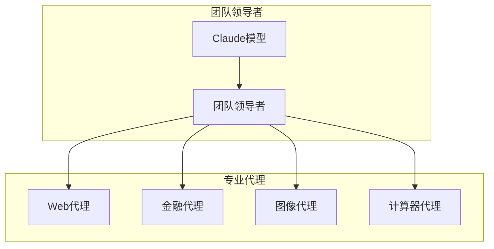
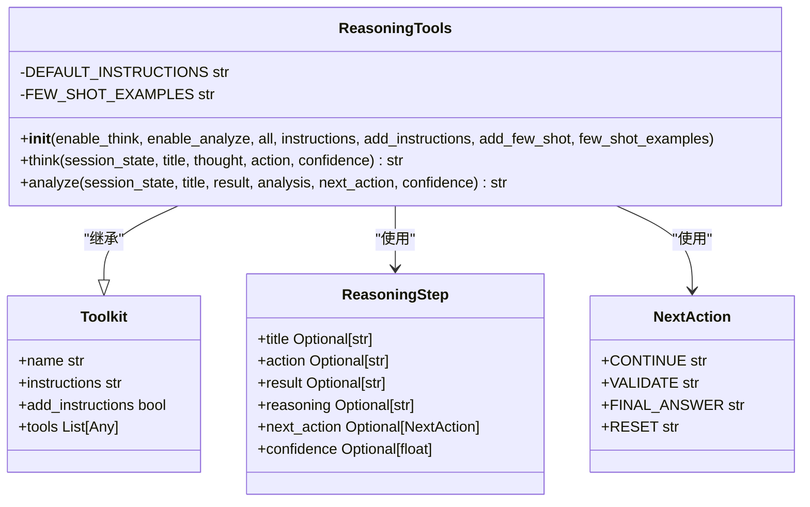
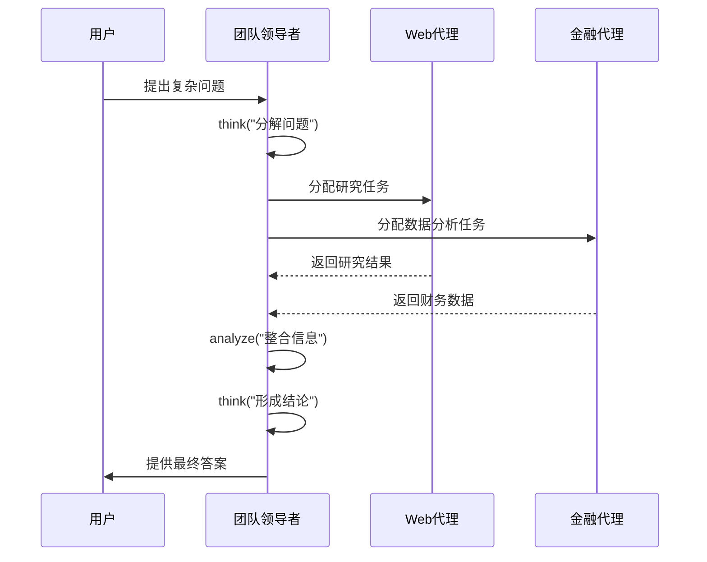
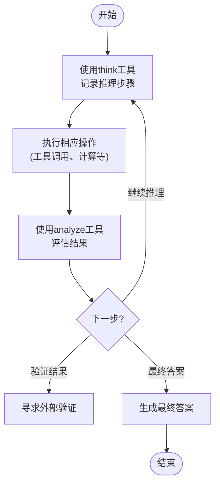
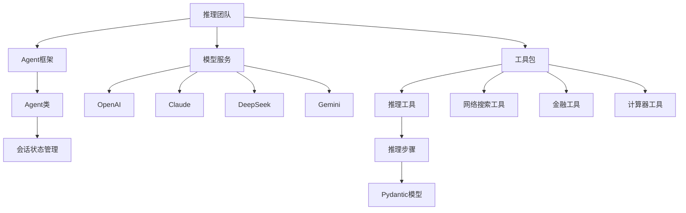

# 推理团队

<cite>
**本文档引用的文件**
- [reasoning_team.py](file://cookbook/examples/teams/coordinate_mode/reasoning_team.py)
- [reasoning_finance_team.py](file://cookbook/demo/teams/reasoning_finance_team.py)
- [reasoning.py](file://libs/agno/agno/tools/reasoning.py)
- [step.py](file://libs/agno/agno/reasoning/step.py)
- [multi_purpose_team.py](file://cookbook/examples/teams/route_mode/multi_purpose_team.py)
- [finance_team_chain_of_thought.py](file://cookbook/reasoning/teams/finance_team_chain_of_thought.py)
- [reasoning_o3_mini.py](file://cookbook/models/openai/chat/reasoning_o3_mini.py)
- [reasoning_agent.py](file://cookbook/models/deepseek/reasoning_agent.py)
- [reasoning_agent.py](file://cookbook/models/groq/reasoning_agent.py)
- [reasoning_agent.py](file://cookbook/models/xai/reasoning_agent.py)
</cite>

## 目录
1. [简介](#简介)
2. [项目结构](#项目结构)
3. [核心组件](#核心组件)
4. [架构概述](#架构概述)
5. [详细组件分析](#详细组件分析)
6. [依赖分析](#依赖分析)
7. [性能考量](#性能考量)
8. [故障排除指南](#故障排除指南)
9. [结论](#结论)

## 简介
本文档详细阐述了如何配置和使用推理团队进行复杂的链式思维（Chain-of-Thought）推理。通过分析代码示例，说明了团队成员如何通过协作和迭代来分解和解决复杂问题。文档解释了推理步骤的定义、中间状态的管理以及最终答案的整合过程。同时探讨了不同大模型（如OpenAI, DeepSeek）在推理任务中的表现差异，并提供了设计高效推理流程的最佳实践。

## 项目结构
推理团队功能分布在多个目录中，主要集中在`cookbook/examples/teams`和`libs/agno/agno/tools`目录下。核心的推理功能由`reasoning.py`工具包提供，而团队协作模式则通过不同的示例文件展示。

**Diagram sources**
- [reasoning_team.py](file://cookbook/examples/teams/coordinate_mode/reasoning_team.py)
- [multi_purpose_team.py](file://cookbook/examples/teams/route_mode/multi_purpose_team.py)
- [reasoning_finance_team.py](file://cookbook/demo/teams/reasoning_finance_team.py)
- [reasoning.py](file://libs/agno/agno/tools/reasoning.py)
- [step.py](file://libs/agno/agno/reasoning/step.py)

**Section sources**
- [reasoning_team.py](file://cookbook/examples/teams/coordinate_mode/reasoning_team.py)
- [multi_purpose_team.py](file://cookbook/examples/teams/route_mode/multi_purpose_team.py)
- [reasoning_finance_team.py](file://cookbook/demo/teams/reasoning_finance_team.py)

## 核心组件
推理团队的核心组件包括团队领导者、专业代理和推理工具包。团队领导者负责协调各个专业代理的工作，推理工具包提供了`think`和`analyze`工具来支持链式思维过程。

**Section sources**
- [reasoning_team.py](file://cookbook/examples/teams/coordinate_mode/reasoning_team.py)
- [reasoning.py](file://libs/agno/agno/tools/reasoning.py)

## 架构概述
推理团队采用分布式架构，由一个团队领导者和多个专业代理组成。团队领导者使用高级模型（如Claude）进行决策和协调，而专业代理则使用特定模型处理专门任务。

**Diagram sources**
- [multi_purpose_team.py](file://cookbook/examples/teams/route_mode/multi_purpose_team.py)
- [reasoning_team.py](file://cookbook/examples/teams/coordinate_mode/reasoning_team.py)

## 详细组件分析

### 推理工具分析
推理工具包提供了`think`和`analyze`两个核心工具，支持代理进行链式思维推理。

**Diagram sources**
- [reasoning.py](file://libs/agno/agno/tools/reasoning.py)
- [step.py](file://libs/agno/agno/reasoning/step.py)

### 团队协作流程分析
推理团队的协作流程遵循"思考-行动-分析"的循环模式，通过迭代逐步解决问题。

**Diagram sources**
- [reasoning_team.py](file://cookbook/examples/teams/coordinate_mode/reasoning_team.py)
- [reasoning_finance_team.py](file://cookbook/demo/teams/reasoning_finance_team.py)

### 链式思维实现分析
链式思维的实现依赖于推理步骤的管理和状态跟踪，确保推理过程的可追溯性和完整性。

**Diagram sources**
- [reasoning.py](file://libs/agno/agno/tools/reasoning.py)
- [finance_team_chain_of_thought.py](file://cookbook/reasoning/teams/finance_team_chain_of_thought.py)

**Section sources**
- [reasoning.py](file://libs/agno/agno/tools/reasoning.py)
- [step.py](file://libs/agno/agno/reasoning/step.py)
- [finance_team_chain_of_thought.py](file://cookbook/reasoning/teams/finance_team_chain_of_thought.py)

## 依赖分析
推理团队依赖于多个核心组件和外部服务，这些依赖关系确保了团队的正常运作和功能完整性。

**Diagram sources**
- [reasoning_team.py](file://cookbook/examples/teams/coordinate_mode/reasoning_team.py)
- [multi_purpose_team.py](file://cookbook/examples/teams/route_mode/multi_purpose_team.py)
- [reasoning.py](file://libs/agno/agno/tools/reasoning.py)

**Section sources**
- [reasoning_team.py](file://cookbook/examples/teams/coordinate_mode/reasoning_team.py)
- [multi_purpose_team.py](file://cookbook/examples/teams/route_mode/multi_purpose_team.py)
- [reasoning.py](file://libs/agno/agno/tools/reasoning.py)

## 性能考量
不同大模型在推理任务中的表现存在显著差异。OpenAI的o3-mini模型在金融分析任务中表现出色，而DeepSeek的推理专用模型在逻辑推理问题上具有优势。Groq平台通过使用专门的推理模型（deepseek-r1-distill-llama-70b）和响应生成模型（llama-3.3-70b-versatile）的组合，实现了高效的推理过程。团队配置中的`reasoning_effort="high"`参数可以优化模型在复杂推理任务中的表现。

**Section sources**
- [reasoning_o3_mini.py](file://cookbook/models/openai/chat/reasoning_o3_mini.py)
- [reasoning_agent.py](file://cookbook/models/deepseek/reasoning_agent.py)
- [reasoning_agent.py](file://cookbook/models/groq/reasoning_agent.py)

## 故障排除指南
在使用推理团队时，可能会遇到各种问题。以下是常见问题及其解决方案：

**Section sources**
- [reasoning.py](file://libs/agno/agno/tools/reasoning.py)
- [reasoning_team.py](file://cookbook/examples/teams/coordinate_mode/reasoning_team.py)

## 结论
推理团队提供了一种强大的机制，通过链式思维方法解决复杂问题。通过合理配置团队成员、使用适当的推理工具和选择合适的模型，可以显著提高问题解决的效率和准确性。最佳实践包括：始终在行动前进行思考、迭代式地分析结果、合理分配任务给专业代理，以及充分利用不同大模型的优势。