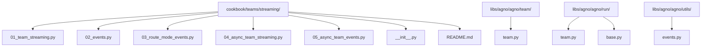
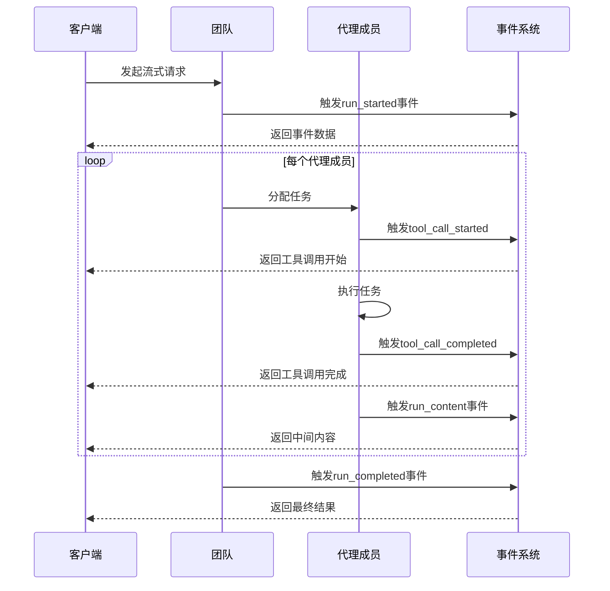
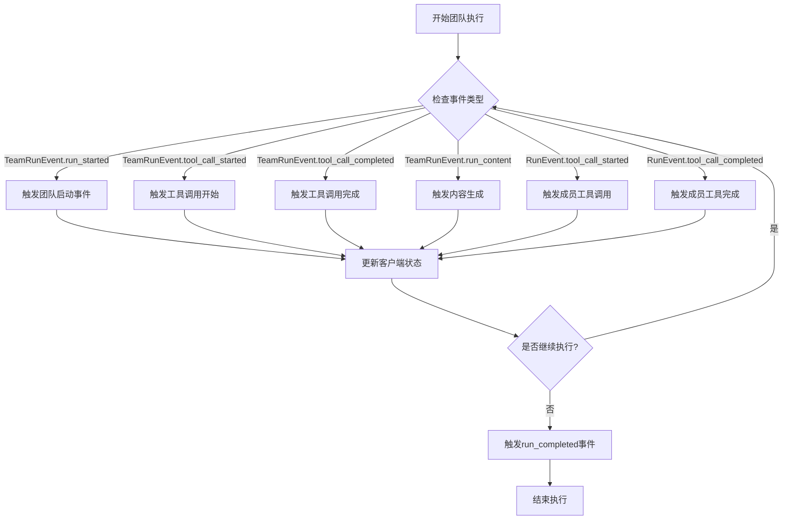
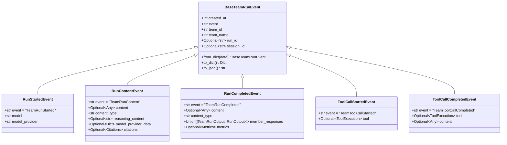
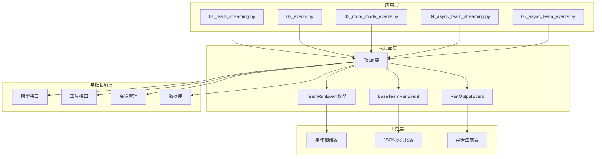

# 团队流式处理

<cite>
**本文档引用的文件**
- [01_team_streaming.py](file://cookbook/teams/streaming/01_team_streaming.py)
- [02_events.py](file://cookbook/teams/streaming/02_events.py)
- [03_route_mode_events.py](file://cookbook/teams/streaming/03_route_mode_events.py)
- [04_async_team_streaming.py](file://cookbook/teams/streaming/04_async_team_streaming.py)
- [05_async_team_events.py](file://cookbook/teams/streaming/05_async_team_events.py)
- [team.py](file://libs/agno/agno/team/team.py)
- [team.py](file://libs/agno/agno/run/team.py)
- [base.py](file://libs/agno/agno/run/base.py)
- [events.py](file://libs/agno/agno/utils/events.py)
</cite>

## 目录
1. [简介](#简介)
2. [项目结构](#项目结构)
3. [核心组件](#核心组件)
4. [架构概览](#架构概览)
5. [详细组件分析](#详细组件分析)
6. [依赖关系分析](#依赖关系分析)
7. [性能考虑](#性能考虑)
8. [故障排除指南](#故障排除指南)
9. [结论](#结论)

## 简介

团队流式处理是Agno框架中的一个高级功能，它允许团队级别的实时响应流。通过事件驱动的架构，用户可以即时看到团队的思考和生成过程，从而获得更流畅、更具交互性的用户体验。

这种流式处理机制基于异步事件系统，支持多种模式：
- 基础团队响应流
- 事件驱动的流式处理
- 路由模式事件流
- 异步团队流式处理
- 异步团队事件流

## 项目结构

团队流式处理功能主要位于以下目录结构中：



**图表来源**
- [01_team_streaming.py](file://cookbook/teams/streaming/01_team_streaming.py#L1-L56)
- [02_events.py](file://cookbook/teams/streaming/02_events.py#L1-L108)
- [team.py](file://libs/agno/agno/team/team.py#L1-L199)

**章节来源**
- [01_team_streaming.py](file://cookbook/teams/streaming/01_team_streaming.py#L1-L56)
- [02_events.py](file://cookbook/teams/streaming/02_events.py#L1-L108)
- [03_route_mode_events.py](file://cookbook/teams/streaming/03_route_mode_events.py#L1-L103)
- [04_async_team_streaming.py](file://cookbook/teams/streaming/04_async_team_streaming.py#L1-L69)
- [05_async_team_events.py](file://cookbook/teams/streaming/05_async_team_events.py#L1-L125)

## 核心组件

### Team类（团队类）

Team类是团队流式处理的核心组件，负责管理多个代理成员并协调它们的协作。

```python
@dataclass(init=False)
class Team:
    """
    表示一组代理的类。
    """
    members: List[Union[Agent, "Team"]]
    model: Optional[Model] = None
    name: Optional[str] = None
    id: Optional[str] = None
    # ... 其他属性
```

### TeamRunEvent枚举

TeamRunEvent定义了团队运行过程中可能发生的各种事件类型：

```python
class TeamRunEvent(str, Enum):
    """run()函数可以发送的事件"""
    
    run_started = "TeamRunStarted"
    run_content = "TeamRunContent"
    run_intermediate_content = "TeamRunIntermediateContent"
    run_completed = "TeamRunCompleted"
    run_error = "TeamRunError"
    run_cancelled = "TeamRunCancelled"
    
    tool_call_started = "TeamToolCallStarted"
    tool_call_completed = "TeamToolCallCompleted"
    
    reasoning_started = "TeamReasoningStarted"
    reasoning_step = "TeamReasoningStep"
    reasoning_completed = "TeamReasoningCompleted"
    
    memory_update_started = "TeamMemoryUpdateStarted"
    memory_update_completed = "TeamMemoryUpdateCompleted"
```

**章节来源**
- [team.py](file://libs/agno/agno/team/team.py#L60-L199)
- [team.py](file://libs/agno/agno/run/team.py#L18-L50)

## 架构概览

团队流式处理采用事件驱动的架构模式，通过异步事件流实现实时响应：



**图表来源**
- [02_events.py](file://cookbook/teams/streaming/02_events.py#L50-L107)
- [team.py](file://libs/agno/agno/run/team.py#L18-L50)

## 详细组件分析

### 基础团队流式处理

基础团队流式处理展示了如何使用`print_response`方法实现简单的流式输出：

```python
# 创建具有流式能力的团队
team = Team(
    name="Stock Research Team",
    model=OpenAIChat("o3-mini"),
    members=[stock_searcher, company_info_agent],
    markdown=True,
    show_members_responses=True,
)

# 测试流式响应
team.print_response(
    "What is the current stock price of NVDA?",
    stream=True,
    stream_intermediate_steps=True,
)
```

### 事件驱动的流式处理

事件驱动的流式处理提供了更细粒度的控制，允许捕获和处理各种事件：



**图表来源**
- [02_events.py](file://cookbook/teams/streaming/02_events.py#L50-L107)
- [03_route_mode_events.py](file://cookbook/teams/streaming/03_route_mode_events.py#L43-L101)

### 异步团队流式处理

异步团队流式处理支持并发执行，提高性能和响应速度：

```python
async def streaming_with_arun():
    """演示使用arun()方法进行异步流式处理"""
    await apprint_run_response(
        team.arun(input="What is the current stock price of NVDA?", stream=True)
    )

async def streaming_with_aprint_response():
    """演示使用aprint_response()方法进行异步流式处理"""
    await team.aprint_response("What is the current stock price of NVDA?", stream=True)
```

### 事件处理机制

事件处理机制通过`TeamRunOutputEvent`类实现，支持多种事件类型的处理：



**图表来源**
- [team.py](file://libs/agno/agno/run/team.py#L52-L199)
- [base.py](file://libs/agno/agno/run/base.py#L10-L193)

**章节来源**
- [01_team_streaming.py](file://cookbook/teams/streaming/01_team_streaming.py#L1-L56)
- [02_events.py](file://cookbook/teams/streaming/02_events.py#L1-L108)
- [04_async_team_streaming.py](file://cookbook/teams/streaming/04_async_team_streaming.py#L1-L69)
- [team.py](file://libs/agno/agno/run/team.py#L52-L199)

## 依赖关系分析

团队流式处理的依赖关系复杂且层次分明：



**图表来源**
- [team.py](file://libs/agno/agno/team/team.py#L1-L199)
- [team.py](file://libs/agno/agno/run/team.py#L1-L199)
- [events.py](file://libs/agno/agno/utils/events.py#L1-L199)

**章节来源**
- [team.py](file://libs/agno/agno/team/team.py#L1-L199)
- [team.py](file://libs/agno/agno/run/team.py#L1-L199)
- [base.py](file://libs/agno/agno/run/base.py#L1-L193)

## 性能考虑

### 流式处理的性能优势

1. **降低延迟**：用户可以立即看到部分结果，而不是等待完整响应
2. **更好的用户体验**：实时反馈让用户了解系统状态
3. **资源优化**：按需加载和处理数据，减少内存占用

### 性能挑战与解决方案

1. **并发控制**
   - 使用异步编程避免阻塞
   - 实现合理的并发限制
   - 优化事件处理流程

2. **内存管理**
   - 及时释放不需要的数据
   - 使用流式处理减少内存占用
   - 实现缓存策略

3. **网络优化**
   - 压缩传输数据
   - 实现断点续传
   - 优化连接池配置

### 监控策略

```python
# 事件监控示例
async def monitor_team_performance(team):
    start_time = time.time()
    
    async for event in team.arun("测试查询", stream=True):
        if event.event == TeamRunEvent.run_started:
            print(f"团队启动时间: {time.time() - start_time:.2f}秒")
        
        if event.event == TeamRunEvent.run_completed:
            print(f"团队完成时间: {time.time() - start_time:.2f}秒")
            break
```

## 故障排除指南

### 常见问题及解决方案

1. **流式响应中断**
   - 检查网络连接稳定性
   - 验证模型服务可用性
   - 实现重试机制

2. **事件丢失**
   - 确保事件订阅正确设置
   - 检查事件处理器逻辑
   - 实现事件确认机制

3. **性能问题**
   - 优化事件处理逻辑
   - 减少不必要的事件生成
   - 实现事件批处理

### 错误处理最佳实践

```python
async def robust_team_streaming(team, prompt):
    try:
        async for event in team.arun(prompt, stream=True):
            try:
                # 处理事件
                process_event(event)
            except Exception as e:
                log_error(f"事件处理失败: {e}")
                continue
                
    except Exception as e:
        log_error(f"团队流式处理失败: {e}")
        # 实现回退策略
        return team.run(prompt)
```

**章节来源**
- [05_async_team_events.py](file://cookbook/teams/streaming/05_async_team_events.py#L50-L125)
- [events.py](file://libs/agno/agno/utils/events.py#L1-L199)

## 结论

团队流式处理是Agno框架中的一个重要特性，它通过事件驱动的架构实现了真正的实时响应流。这种设计不仅提高了用户体验，还为复杂的多代理协作提供了强大的支持。

### 主要优势

1. **实时性**：即时反馈让用户了解系统状态
2. **可观察性**：详细的事件流便于调试和监控
3. **灵活性**：支持多种流式处理模式
4. **可扩展性**：模块化设计便于扩展和定制

### 应用场景

- 实时数据分析和报告生成
- 协作式决策支持系统
- 动态知识检索和整合
- 多模态内容生成

通过合理使用团队流式处理功能，开发者可以构建更加智能、响应迅速的AI应用系统。