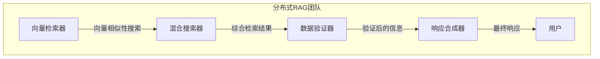
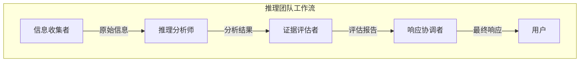
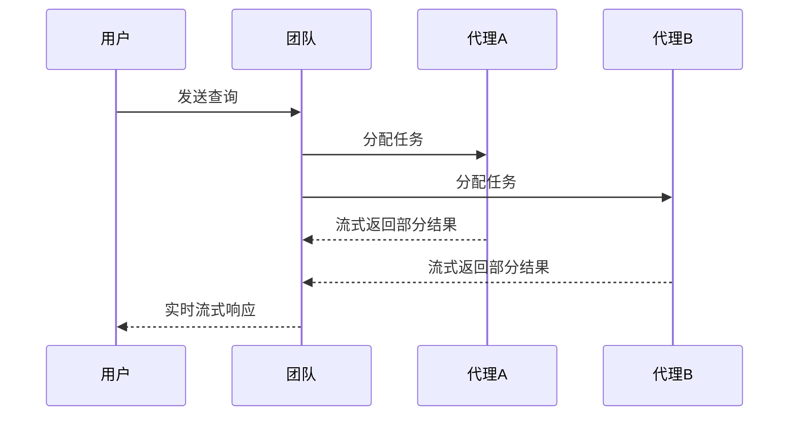

# 高级功能

<cite>
**本文档引用的文件**  
- [01_distributed_rag_pgvector.py](file://cookbook/teams/distributed_rag/01_distributed_rag_pgvector.py)
- [02_distributed_rag_lancedb.py](file://cookbook/teams/distributed_rag/02_distributed_rag_lancedb.py)
- [03_distributed_rag_with_reranking.py](file://cookbook/teams/distributed_rag/03_distributed_rag_with_reranking.py)
- [01_coordinated_agentic_rag.py](file://cookbook/teams/search_coordination/01_coordinated_agentic_rag.py)
- [02_coordinated_reasoning_rag.py](file://cookbook/teams/search_coordination/02_coordinated_reasoning_rag.py)
- [reasoning_finance_team.py](file://cookbook/demo/teams/reasoning_finance_team.py)
- [01_team_streaming.py](file://cookbook/teams/streaming/01_team_streaming.py)
- [04_async_team_streaming.py](file://cookbook/teams/streaming/04_async_team_streaming.py)
- [reasoning.py](file://cookbook/agents/async/reasoning.py)
- [reasoning_agent_events.py](file://cookbook/agents/events/reasoning_agent_events.py)
- [reasoning_team.py](file://cookbook/examples/teams/coordinate_mode/reasoning_team.py)
- [reasoning_tools.py](file://libs/agno/agno/tools/reasoning.py)
</cite>

## 目录
1. [引言](#引言)
2. [分布式RAG](#分布式rag)
3. [推理团队](#推理团队)
4. [流式处理](#流式处理)
5. [性能与资源考量](#性能与资源考量)
6. [结论](#结论)

## 引言
本文档全面阐述Agno团队的高级功能，重点介绍分布式RAG、推理团队和流式处理等特性的实现机制和使用模式。通过分析实际代码示例，展示如何构建具备分布式知识检索能力的团队，如何配置团队进行链式思维推理，以及如何实现团队级别的实时流式响应。这些功能显著提升了团队处理复杂任务的能力，为用户提供更智能、高效和透明的服务体验。

## 分布式RAG
分布式RAG（Retrieval-Augmented Generation）是一种高级知识检索架构，通过将检索任务分解给多个专业化的代理（Agent），实现更全面、准确和可靠的知识检索与响应生成。

### 架构设计
分布式RAG团队由多个具有特定职责的代理组成，每个代理专注于检索流程的特定环节。这种分工协作的模式确保了知识检索的深度和广度。

**Diagram sources**
- [01_distributed_rag_pgvector.py](file://cookbook/teams/distributed_rag/01_distributed_rag_pgvector.py#L96-L127)

### 实现机制
分布式RAG的实现依赖于多个专业代理的协同工作。例如，在使用PostgreSQL pgvector的示例中，团队成员包括：
- **向量检索器**：使用pgvector进行向量相似性搜索
- **混合搜索器**：结合向量和文本搜索进行综合检索
- **数据验证器**：评估检索结果的质量和相关性
- **响应合成器**：整合验证后的信息生成最终响应

团队通过明确的指令集协调各成员的工作流程，确保检索过程的系统性和完整性。

**Section sources**
- [01_distributed_rag_pgvector.py](file://cookbook/teams/distributed_rag/01_distributed_rag_pgvector.py#L11-L212)

### 使用模式
构建分布式RAG团队的代码模式如下：
1. 为每个专业代理创建独立的知识库实例
2. 定义具有特定角色和指令的专业代理
3. 将代理组合成团队，并设置团队级指令
4. 执行异步或同步的检索任务

这种模式支持多种向量数据库，如LanceDB和pgvector，提供了灵活的部署选项。

**Section sources**
- [02_distributed_rag_lancedb.py](file://cookbook/teams/distributed_rag/02_distributed_rag_lancedb.py#L0-L198)

## 推理团队
推理团队通过链式思维（Chain-of-Thought）技术，使代理能够展示其内部推理过程，从而提供更透明、可靠和深思熟虑的响应。

### 推理架构
推理团队采用协调式架构，其中不同代理负责推理流程的不同阶段。典型的推理团队包括：
- **信息收集者**：负责搜索和收集相关信息
- **推理分析师**：应用结构化推理分析信息
- **证据评估者**：评估证据质量和识别信息缺口
- **响应协调者**：综合所有信息生成最终响应

**Diagram sources**
- [02_coordinated_reasoning_rag.py](file://cookbook/teams/search_coordination/02_coordinated_reasoning_rag.py#L102-L136)

### 推理工具
推理功能的核心是`ReasoningTools`工具包，它提供了`think`和`analyze`两个关键工具：
- **think工具**：作为代理的"草稿纸"，用于逐步分解复杂问题
- **analyze工具**：用于评估推理步骤的结果并确定下一步行动

这些工具通过会话状态管理推理步骤，确保推理过程的连续性和完整性。

**Section sources**
- [reasoning_tools.py](file://libs/agno/agno/tools/reasoning.py#L0-L283)

### 实现与使用
配置推理团队的关键步骤包括：
1. 为团队代理添加`ReasoningTools`
2. 在团队指令中强调推理要求
3. 启用`show_full_reasoning`参数以显示完整推理过程

在金融分析团队示例中，团队被配置为提供全面的投资洞察，结合基本面分析和市场情绪，确保所有主张都有数据和来源支持。

**Section sources**
- [reasoning_finance_team.py](file://cookbook/demo/teams/reasoning_finance_team.py#L0-L120)
- [reasoning_team.py](file://cookbook/examples/teams/coordinate_mode/reasoning_team.py#L0-L44)

## 流式处理
流式处理功能使团队能够提供实时、渐进式的响应，显著改善用户体验，特别是在处理复杂查询时。

### 同步流式处理
同步流式处理允许客户端在响应生成过程中逐步接收内容。基本实现模式如下：
1. 创建具有专业代理的团队
2. 调用`print_response`方法并设置`stream=True`
3. 可选地启用`stream_intermediate_steps`以流式传输中间步骤

**Diagram sources**
- [01_team_streaming.py](file://cookbook/teams/streaming/01_team_streaming.py#L0-L55)

### 异步流式处理
异步流式处理提供了更高的并发性能和响应性，特别适合Web应用。实现方式包括：
- 使用`arun`方法进行异步运行
- 使用`aprint_response`方法进行异步打印响应
- 通过事件循环处理多个并发请求

异步模式允许团队在等待I/O操作（如数据库查询或API调用）时处理其他任务，最大化资源利用率。

**Section sources**
- [04_async_team_streaming.py](file://cookbook/teams/streaming/04_async_team_streaming.py#L0-L68)

### 事件流式处理
高级流式处理支持事件驱动的响应模式，允许客户端订阅不同类型的事件：
- `run_started`：运行开始事件
- `reasoning_started`：推理开始事件
- `reasoning_step`：推理步骤事件
- `run_content`：内容生成事件

这种细粒度的事件系统使客户端能够精确跟踪处理进度并提供详细的加载反馈。

**Section sources**
- [reasoning_agent_events.py](file://cookbook/agents/events/reasoning_agent_events.py#L0-L52)

## 性能与资源考量
高级功能的实现需要在性能、准确性和资源消耗之间进行权衡。

### 分布式RAG的权衡
分布式RAG虽然提高了检索质量，但也增加了系统复杂性和延迟。使用pgvector等生产级向量数据库可以提供更好的可扩展性，但需要额外的基础设施支持。相比之下，LanceDB等轻量级解决方案更适合开发和测试环境。

### 推理的开销
链式思维推理显著增加了计算开销，因为代理需要生成详细的内部推理步骤。然而，这种开销通常被更准确和可靠的响应所抵消，特别是在处理复杂或高风险任务时。

### 流式处理的效率
流式处理通过早期响应减少了用户的感知延迟，但可能增加网络传输的总开销。异步流式处理在高并发场景下表现更优，但需要更复杂的错误处理和状态管理机制。

## 结论
Agno团队的高级功能——分布式RAG、推理团队和流式处理——共同构成了一个强大而灵活的多代理系统框架。这些功能不仅提升了系统处理复杂任务的能力，还通过透明的推理过程和实时响应显著改善了用户体验。通过合理配置和组合这些功能，开发者可以构建出能够应对各种复杂场景的智能团队，为用户提供企业级的可靠性和性能。