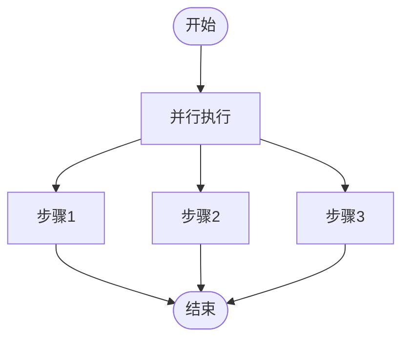

# 工作流

<cite>
**本文档中引用的文件**  
- [workflow.py](file://libs/agno/agno/workflow/workflow.py)
- [step.py](file://libs/agno/agno/workflow/step.py)
- [types.py](file://libs/agno/agno/workflow/types.py)
- [basic_workflow.py](file://cookbook/agent_os/workflow/basic_workflow.py)
- [workflow_with_parallel.py](file://cookbook/agent_os/workflow/workflow_with_parallel.py)
- [workflow_with_conditional.py](file://cookbook/agent_os/workflow/workflow_with_conditional.py)
- [workflow_with_loop.py](file://cookbook/agent_os/workflow/workflow_with_loop.py)
- [workflow_with_router.py](file://cookbook/agent_os/workflow/workflow_with_router.py)
- [run.py](file://libs/agno/agno/run/workflow.py)
- [workflow.py](file://libs/agno/agno/session/workflow.py)
</cite>

## 目录
1. [介绍](#介绍)
2. [工作流执行模型](#工作流执行模型)
3. [步骤定义与控制流](#步骤定义与控制流)
4. [复杂工作流构建](#复杂工作流构建)
5. [状态持久化与会话管理](#状态持久化与会话管理)
6. [指标收集与调试](#指标收集与调试)
7. [最佳实践](#最佳实践)

## 介绍

Agno工作流系统提供了一个强大的框架，用于自动化复杂的业务流程。该系统支持顺序、并行、条件和循环等控制流机制，允许开发者构建高度灵活和可扩展的工作流。通过集成会话管理、状态持久化和指标收集功能，Agno工作流能够处理长时间运行的任务，并提供详细的执行跟踪和分析。

**Section sources**
- [workflow.py](file://libs/agno/agno/workflow/workflow.py#L1-L50)
- [basic_workflow.py](file://cookbook/agent_os/workflow/basic_workflow.py#L1-L10)

## 工作流执行模型

Agno工作流的执行模型基于`Workflow`类，该类定义了工作流的基本结构和行为。每个工作流由一系列步骤组成，这些步骤可以是代理、团队或自定义函数。工作流的执行是异步的，支持流式输出和中间步骤的实时反馈。

工作流的执行过程包括初始化、步骤执行和结果聚合三个阶段。在初始化阶段，工作流会设置会话ID、用户ID和会话状态。在步骤执行阶段，工作流会按顺序或并行执行各个步骤，并处理步骤间的依赖关系。在结果聚合阶段，工作流会收集所有步骤的输出，并生成最终的结果。

**Diagram sources**
- [workflow.py](file://libs/agno/agno/workflow/workflow.py#L500-L600)
- [run.py](file://libs/agno/agno/run/workflow.py#L100-L200)

**Section sources**
- [workflow.py](file://libs/agno/agno/workflow/workflow.py#L500-L600)
- [run.py](file://libs/agno/agno/run/workflow.py#L100-L200)

## 步骤定义与控制流

工作流中的每个步骤由`Step`类定义，可以是代理、团队或自定义函数。步骤支持输入验证、重试机制和超时控制。通过组合不同的步骤类型，可以构建复杂的控制流。

### 顺序执行

顺序执行是最基本的控制流，步骤按定义的顺序依次执行。前一个步骤的输出会作为后一个步骤的输入。

**Diagram sources**
- [basic_workflow.py](file://cookbook/agent_os/workflow/basic_workflow.py#L30-L40)

### 并行执行

并行执行允许同时执行多个步骤，提高执行效率。`Parallel`类用于定义并行步骤组。

**Diagram sources**
- [workflow_with_parallel.py](file://cookbook/agent_os/workflow/workflow_with_parallel.py#L30-L40)

### 条件执行

条件执行根据指定的条件决定是否执行某个步骤。`Condition`类用于定义条件步骤。

**Diagram sources**
- [workflow_with_conditional.py](file://cookbook/agent_os/workflow/workflow_with_conditional.py#L80-L90)

### 循环执行

循环执行允许重复执行一组步骤，直到满足终止条件。`Loop`类用于定义循环步骤。

**Diagram sources**
- [workflow_with_loop.py](file://cookbook/agent_os/workflow/workflow_with_loop.py#L80-L90)

**Section sources**
- [step.py](file://libs/agno/agno/workflow/step.py#L1-L100)
- [types.py](file://libs/agno/agno/workflow/types.py#L1-L100)

## 复杂工作流构建

通过组合不同的控制流机制，可以构建复杂的多步骤工作流。例如，可以创建一个包含条件分支和并行执行的工作流。

### 路由器模式

路由器模式根据输入内容动态选择执行路径。`Router`类用于实现路由逻辑。

**Diagram sources**
- [workflow_with_router.py](file://cookbook/agent_os/workflow/workflow_with_router.py#L90-L100)

### 嵌套步骤

工作流支持嵌套步骤，允许在步骤中包含其他步骤组。这种机制可以实现更复杂的控制流。

**Section sources**
- [workflow_with_nested_steps.py](file://cookbook/agent_os/workflow/workflow_with_nested_steps.py#L1-L20)

## 状态持久化与会话管理

Agno工作流通过`WorkflowSession`类实现状态持久化和会话管理。会话数据包括会话ID、用户ID、会话状态和工作流数据。

### 会话生命周期

会话的生命周期包括创建、读取、更新和删除四个阶段。会话数据可以存储在数据库中，实现跨会话的状态持久化。

**Diagram sources**
- [workflow.py](file://libs/agno/agno/session/workflow.py#L1-L50)

### 状态管理

工作流支持会话状态管理，允许在步骤间共享状态数据。状态数据可以用于存储中间结果、配置信息或用户偏好。

**Section sources**
- [workflow.py](file://libs/agno/agno/session/workflow.py#L1-L50)
- [workflow.py](file://libs/agno/agno/workflow/workflow.py#L700-L800)

## 指标收集与调试

工作流系统提供详细的指标收集和调试功能，帮助开发者监控和优化工作流性能。

### 事件系统

工作流执行过程中会产生各种事件，包括工作流开始、步骤完成、循环迭代等。这些事件可以用于实时监控和调试。

**Diagram sources**
- [run.py](file://libs/agno/agno/run/workflow.py#L1-L100)

### 指标聚合

工作流会自动收集和聚合各个步骤的指标，包括执行时间、成功率和资源使用情况。这些指标可以用于性能分析和优化。

**Section sources**
- [run.py](file://libs/agno/agno/run/workflow.py#L1-L100)
- [types.py](file://libs/agno/agno/workflow/types.py#L300-L400)

## 最佳实践

### 错误处理

在工作流中实现健壮的错误处理机制，包括重试策略、超时控制和失败恢复。

### 性能优化

通过并行执行、缓存和资源管理优化工作流性能。

### 调试技巧

使用日志记录、事件跟踪和指标分析进行调试。

**Section sources**
- [workflow.py](file://libs/agno/agno/workflow/workflow.py#L900-L1000)
- [step.py](file://libs/agno/agno/workflow/step.py#L200-L300)