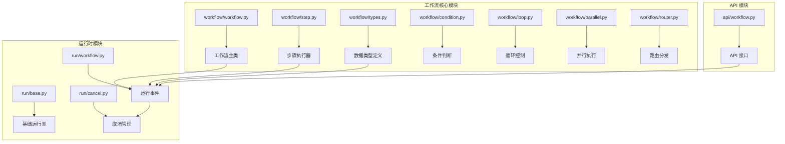
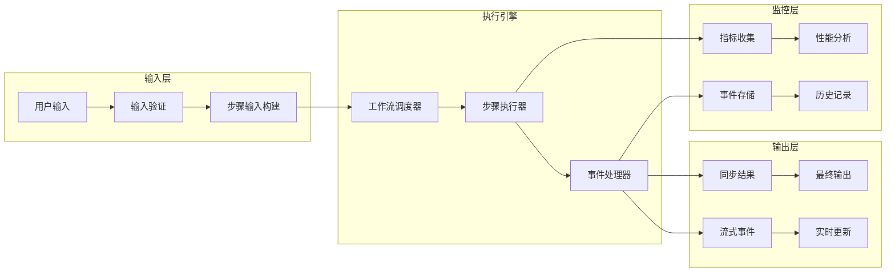
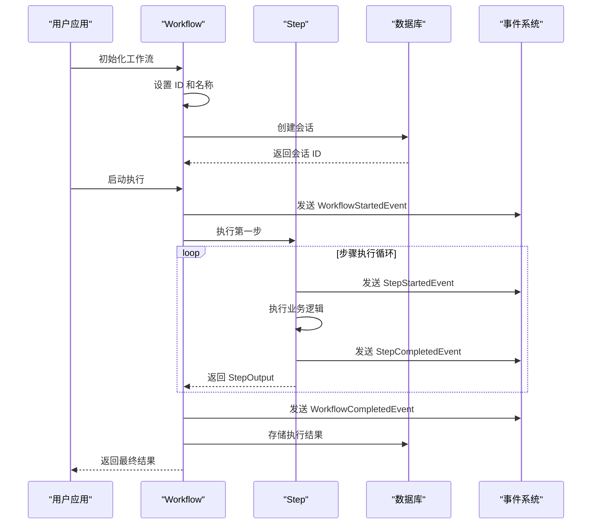
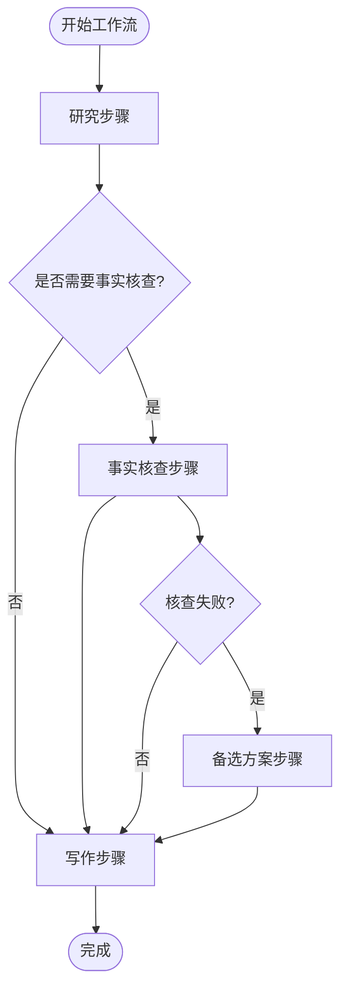
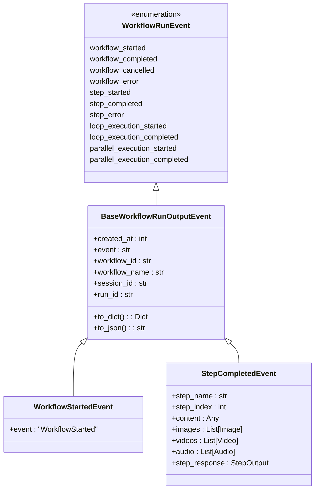

# Agno 工作流执行模型

<cite>
**本文档中引用的文件**
- [workflow.py](file://libs/agno/agno/workflow/workflow.py)
- [step.py](file://libs/agno/agno/workflow/step.py)
- [types.py](file://libs/agno/agno/workflow/types.py)
- [workflow.py](file://libs/agno/agno/run/workflow.py)
- [cancel.py](file://libs/agno/agno/run/cancel.py)
- [basic_workflow.py](file://cookbook/agent_os/workflow/basic_workflow.py)
- [workflow_with_steps.py](file://cookbook/agent_os/workflow/workflow_with_steps.py)
- [workflow_with_conditional.py](file://cookbook/agent_os/workflow/workflow_with_conditional.py)
- [workflow_with_parallel.py](file://cookbook/agent_os/workflow/workflow_with_parallel.py)
</cite>

## 目录
1. [简介](#简介)
2. [项目结构](#项目结构)
3. [核心组件](#核心组件)
4. [架构概览](#架构概览)
5. [详细组件分析](#详细组件分析)
6. [工作流执行机制](#工作流执行机制)
7. [性能考量](#性能考量)
8. [故障排除指南](#故障排除指南)
9. [结论](#结论)

## 简介

Agno 工作流执行模型是一个强大的管道式工作流管理系统，支持同步和异步执行机制。该系统提供了灵活的工作流编排能力，包括顺序执行、条件分支、循环执行、并行执行等多种控制结构。工作流系统的核心设计理念是通过 `run()` 和 `run_stream()` 方法提供统一的接口，同时支持实时事件驱动的响应处理。

## 项目结构

Agno 工作流系统采用模块化设计，主要组件分布在以下目录结构中：



**图表来源**
- [workflow.py](file://libs/agno/agno/workflow/workflow.py#L1-L50)
- [step.py](file://libs/agno/agno/workflow/step.py#L1-L50)
- [types.py](file://libs/agno/agno/workflow/types.py#L1-L50)

## 核心组件

### 工作流类 (Workflow)

工作流类是整个系统的核心，负责协调所有步骤的执行和状态管理：

```python
@dataclass
class Workflow:
    """基于管道的工作流执行"""
    
    # 工作流标识
    name: Optional[str] = None
    id: Optional[str] = None
    description: Optional[str] = None
    
    # 工作流步骤
    steps: Optional[WorkflowSteps] = None
    
    # 数据库配置
    db: Optional[BaseDb] = None
    
    # 会话管理
    session_id: Optional[str] = None
    user_id: Optional[str] = None
    session_state: Optional[Dict[str, Any]] = None
    
    # 调试模式
    debug_mode: Optional[bool] = False
    
    # 流式处理配置
    stream: Optional[bool] = None
    stream_intermediate_steps: bool = False
    
    # 事件存储配置
    store_events: bool = False
    events_to_skip: Optional[List[Union[WorkflowRunEvent, RunEvent, TeamRunEvent]]] = None
```

### 步骤类 (Step)

步骤类封装了单个工作单元的执行逻辑：

```python
@dataclass
class Step:
    """工作流管道中的单个工作单元"""
    
    name: Optional[str] = None
    agent: Optional[Agent] = None
    team: Optional[Team] = None
    executor: Optional[StepExecutor] = None
    
    step_id: Optional[str] = None
    description: Optional[str] = None
    
    # 执行配置
    max_retries: int = 3
    timeout_seconds: Optional[int] = None
    skip_on_failure: bool = False
    strict_input_validation: bool = False
```

**章节来源**
- [workflow.py](file://libs/agno/agno/workflow/workflow.py#L70-L150)
- [step.py](file://libs/agno/agno/workflow/step.py#L30-L80)

## 架构概览

Agno 工作流执行模型采用事件驱动的架构设计，支持多种执行模式：



**图表来源**
- [workflow.py](file://libs/agno/agno/workflow/workflow.py#L200-L300)
- [step.py](file://libs/agno/agno/workflow/step.py#L200-L300)

## 详细组件分析

### 工作流生命周期管理

工作流的生命周期包含初始化、执行、监控和清理四个阶段：



**图表来源**
- [workflow.py](file://libs/agno/agno/workflow/workflow.py#L400-L500)
- [step.py](file://libs/agno/agno/workflow/step.py#L300-L400)

### 同步执行机制

同步执行是最基本的执行模式，适用于简单的线性流程：

```python
# 基本同步执行示例
workflow = Workflow(
    name="content-creation-workflow",
    steps=[research_step, content_planning_step]
)

# 同步执行
result = workflow.run("研究 AI 技术趋势")
print(result.content)
```

同步执行的特点：
- 阻塞式调用，等待所有步骤完成
- 适合短时间任务和简单流程
- 结果直接返回，无需事件处理

### 异步执行机制

异步执行支持并发处理和实时事件响应：

```python
# 异步执行示例
async def async_workflow_execution():
    workflow = Workflow(
        name="async-content-workflow",
        steps=[research_step, content_planning_step],
        stream=True
    )
    
    # 异步流式执行
    async for event in workflow.arun("研究 AI 技术趋势"):
        if isinstance(event, StepCompletedEvent):
            print(f"步骤完成: {event.step_name}")
        elif isinstance(event, WorkflowCompletedEvent):
            print(f"工作流完成: {event.content}")
```

异步执行的优势：
- 支持并发步骤执行
- 实时事件通知
- 更好的资源利用率
- 适合复杂工作流和长时间运行的任务

### 条件执行控制

条件执行允许根据运行时状态动态选择执行路径：



**图表来源**
- [workflow_with_conditional.py](file://cookbook/agent_os/workflow/workflow_with_conditional.py#L50-L100)

### 并行执行控制

并行执行允许多个步骤同时执行，提高整体效率：

```python
# 并行执行示例
workflow = Workflow(
    name="content-creation-workflow",
    steps=[
        Parallel(
            research_hn_step,      # 研究 HackerNews
            research_web_step,     # 研究网络
            name="Research Phase"
        ),
        write_step,               # 写作
        review_step              # 审核
    ]
)
```

并行执行的优势：
- 提高处理速度
- 最大化资源利用
- 适合独立的子任务
- 支持动态负载均衡

**章节来源**
- [workflow.py](file://libs/agno/agno/workflow/workflow.py#L600-L800)
- [step.py](file://libs/agno/agno/workflow/step.py#L400-L600)

## 工作流执行机制

### 执行方法对比

| 特性 | run() | run_stream() | arun() | arun_stream() |
|------|-------|--------------|--------|---------------|
| 执行模式 | 同步阻塞 | 同步事件流 | 异步非阻塞 | 异步事件流 |
| 返回类型 | StepOutput | Iterator[Event] | Awaitable[StepOutput] | AsyncIterator[Event] |
| 适用场景 | 简单任务 | 实时反馈 | 高并发 | 实时并发 |
| 性能特点 | 单线程 | 单线程 | 多线程 | 多线程 |

### 事件驱动架构

工作流系统采用事件驱动架构，支持实时状态监控和响应：



**图表来源**
- [workflow.py](file://libs/agno/agno/run/workflow.py#L15-L100)
- [types.py](file://libs/agno/agno/workflow/types.py#L200-L300)

### 错误处理和重试机制

工作流系统实现了完善的错误处理和重试机制：

```python
# 错误处理配置
step = Step(
    name="robust_step",
    agent=agent,
    max_retries=3,           # 最大重试次数
    timeout_seconds=30,      # 超时设置
    skip_on_failure=False    # 失败时跳过
)

# 自定义错误处理
try:
    result = workflow.run(input_data)
except Exception as e:
    logger.error(f"工作流执行失败: {e}")
    # 可以在这里添加自定义恢复逻辑
```

**章节来源**
- [step.py](file://libs/agno/agno/workflow/step.py#L600-L800)
- [cancel.py](file://libs/agno/agno/run/cancel.py#L1-L50)

## 性能考量

### 延迟优化策略

1. **连接池管理**：复用数据库连接，减少连接建立开销
2. **缓存机制**：缓存频繁访问的数据和中间结果
3. **异步处理**：使用异步执行避免阻塞
4. **批量操作**：合并多个小操作为批量操作

### 吞吐量优化

1. **并行执行**：充分利用多核 CPU 资源
2. **资源池化**：预分配执行资源
3. **负载均衡**：动态分配任务到可用资源
4. **内存管理**：及时释放不需要的资源

### 监控和指标

工作流系统提供完整的监控指标：

```python
# 性能指标收集
metrics = workflow._aggregate_workflow_metrics(step_results)

# 关键指标包括：
# - 步骤执行时间
# - 成功率统计
# - 资源使用情况
# - 错误率分析
```

## 故障排除指南

### 常见问题和解决方案

1. **执行超时**
   - 增加 `timeout_seconds` 设置
   - 优化步骤执行逻辑
   - 使用异步执行

2. **内存泄漏**
   - 及时清理会话数据
   - 使用 `cleanup_run()` 清理资源
   - 监控内存使用情况

3. **并发冲突**
   - 使用适当的锁机制
   - 实现幂等性操作
   - 设计无状态的步骤

### 调试技巧

```python
# 启用调试模式
workflow = Workflow(
    name="debug-workflow",
    debug_mode=True,  # 启用详细日志
    stream=True       # 启用流式输出
)

# 查看执行历史
last_run = workflow.get_last_run_output()
print(f"最后执行结果: {last_run.content}")
```

**章节来源**
- [workflow.py](file://libs/agno/agno/workflow/workflow.py#L1200-L1400)
- [cancel.py](file://libs/agno/agno/run/cancel.py#L50-L82)

## 结论

Agno 工作流执行模型提供了一个强大而灵活的框架，支持从简单到复杂的各种工作流需求。通过同步和异步执行机制、事件驱动架构、完善的错误处理和性能优化，该系统能够满足现代应用程序的各种工作流编排需求。

关键优势：
- **灵活性**：支持多种执行模式和控制结构
- **可扩展性**：模块化设计便于扩展和定制
- **可靠性**：完善的错误处理和重试机制
- **可观测性**：丰富的监控和调试功能
- **高性能**：异步执行和并发处理能力

通过合理使用这些特性，开发者可以构建高效、可靠的工作流系统，满足各种业务场景的需求。